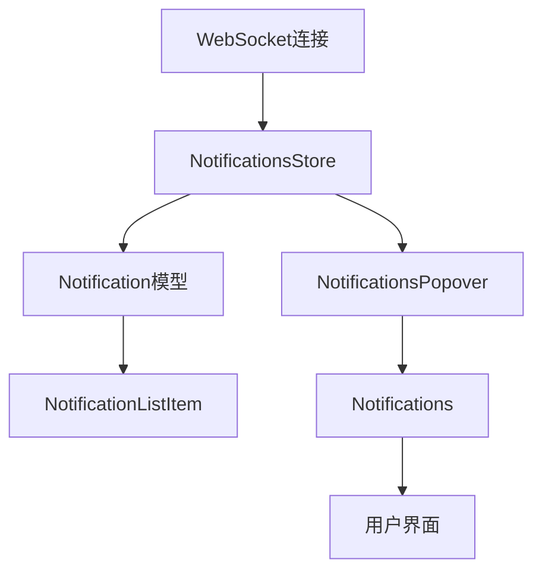
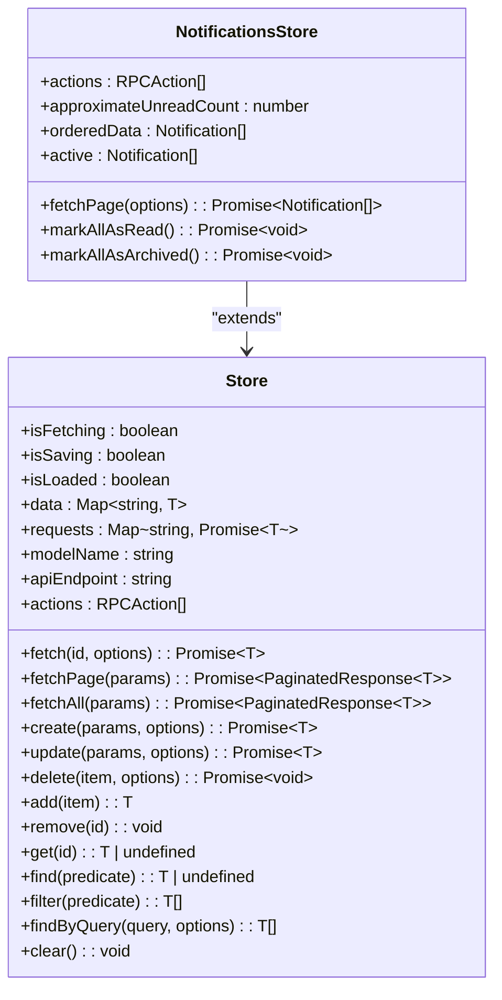
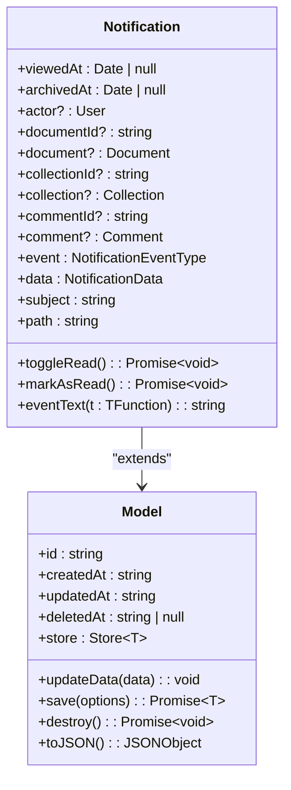
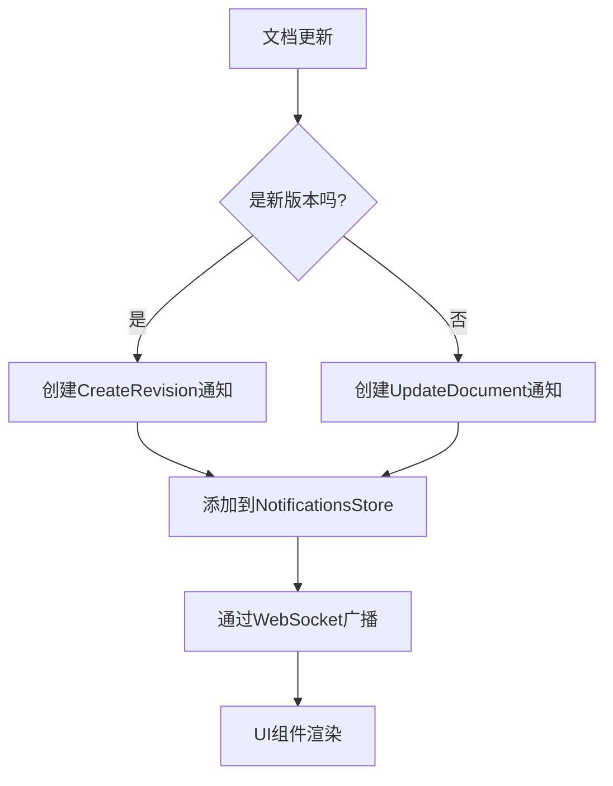
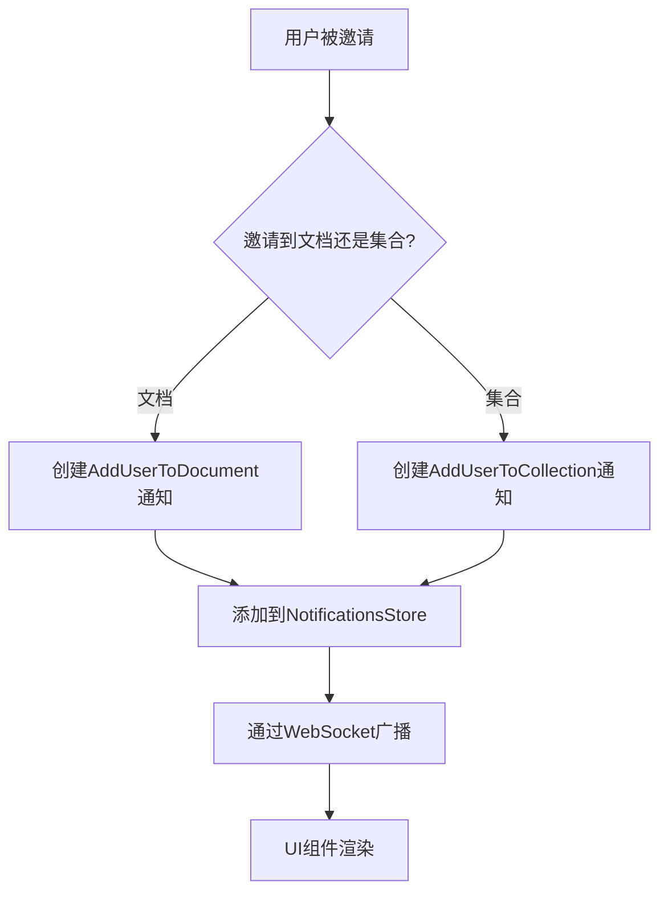
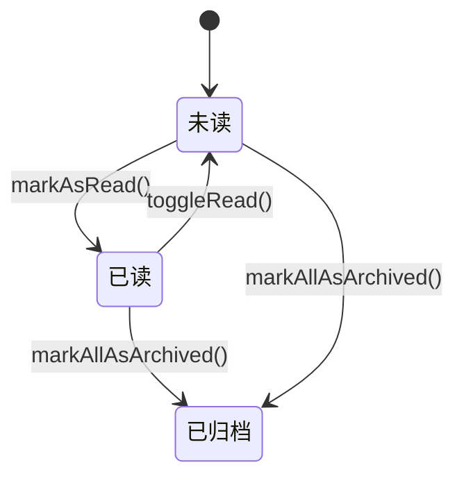
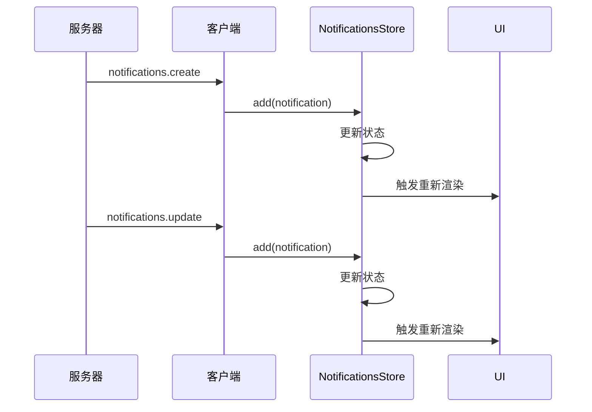
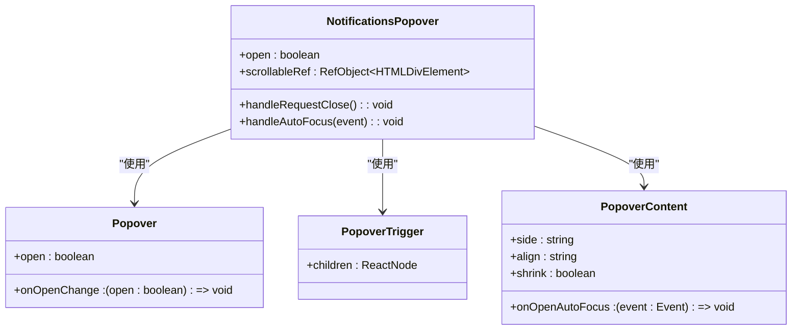
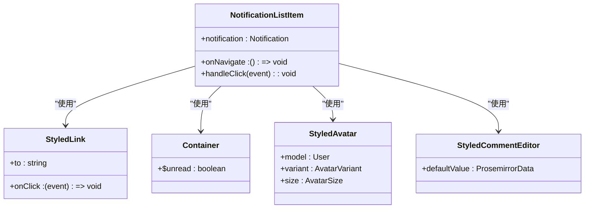

# 通知系统

<cite>
**本文档引用的文件**   
- [Notification.ts](file://app/models/Notification.ts)
- [NotificationsStore.ts](file://app/stores/NotificationsStore.ts)
- [Notifications.tsx](file://app/components/Notifications/Notifications.tsx)
- [NotificationListItem.tsx](file://app/components/Notifications/NotificationListItem.tsx)
- [NotificationsPopover.tsx](file://app/components/Notifications/NotificationsPopover.tsx)
- [WebsocketProvider.tsx](file://app/components/WebsocketProvider.tsx)
</cite>

## 目录
1. [简介](#简介)
2. [架构设计](#架构设计)
3. [核心组件分析](#核心组件分析)
4. [通知类型处理](#通知类型处理)
5. [状态管理](#状态管理)
6. [用户界面](#用户界面)
7. [使用指南](#使用指南)
8. [最佳实践](#最佳实践)

## 简介
baozi项目的通知系统为用户提供实时的协作更新，包括文档更新、评论提及和共享邀请等。该系统通过WebSocket实现实时通信，使用MobX进行状态管理，并提供直观的用户界面来处理各种通知类型。

**Section sources**
- [Notification.ts](file://app/models/Notification.ts#L1-L20)
- [NotificationsStore.ts](file://app/stores/NotificationsStore.ts#L1-L10)

## 架构设计
通知系统的架构基于客户端-服务器模式，通过WebSocket连接实现实时通信。核心组件包括NotificationsStore用于管理通知状态，Notification模型定义通知数据结构，以及一系列UI组件用于展示和交互。



**Diagram sources **
- [NotificationsStore.ts](file://app/stores/NotificationsStore.ts#L10-L96)
- [Notification.ts](file://app/models/Notification.ts#L17-L210)
- [Notifications.tsx](file://app/components/Notifications/Notifications.tsx#L1-L137)

## 核心组件分析

### NotificationsStore
NotificationsStore是通知系统的核心，负责管理所有通知的状态。它继承自基础Store类，提供了获取、更新和删除通知的方法。



**Diagram sources **
- [NotificationsStore.ts](file://app/stores/NotificationsStore.ts#L10-L96)
- [base/Store.ts](file://app/stores/base/Store.ts#L48-L486)

**Section sources**
- [NotificationsStore.ts](file://app/stores/NotificationsStore.ts#L10-L96)

### Notification模型
Notification模型定义了通知的数据结构和行为，包括通知类型、关联实体和用户交互方法。



**Diagram sources **
- [Notification.ts](file://app/models/Notification.ts#L17-L210)
- [base/Model.ts](file://app/models/base/Model.ts#L10-L253)

**Section sources**
- [Notification.ts](file://app/models/Notification.ts#L17-L210)

## 通知类型处理
系统支持多种通知类型，每种类型都有特定的处理逻辑和显示方式。

### 文档更新通知
当文档被发布或编辑时，系统会创建相应的通知。这些通知会显示文档标题和操作类型。



**Diagram sources **
- [Notification.ts](file://app/models/Notification.ts#L102-L158)
- [WebsocketProvider.tsx](file://app/components/WebsocketProvider.tsx#L548-L597)

### 评论提及通知
当用户在文档或评论中被提及，系统会创建MentionedInDocument或MentionedInComment通知。

```mermaid
flowchart TD
A[检测到@提及] --> B[解析提及内容]
B --> C{提及的是用户还是群组?}
C --> |用户| D[创建MentionedInDocument通知]
C --> |群组| E[创建GroupMentionedInDocument通知]
D --> F[添加到NotificationsStore]
E --> F
F --> G[通过WebSocket广播]
G --> H[UI组件渲染]
```

**Diagram sources **
- [Notification.ts](file://app/models/Notification.ts#L102-L158)
- [WebsocketProvider.tsx](file://app/components/WebsocketProvider.tsx#L548-L597)

### 共享邀请通知
当用户被邀请到文档或集合时，系统会创建AddUserToDocument或AddUserToCollection通知。



**Diagram sources **
- [Notification.ts](file://app/models/Notification.ts#L102-L158)
- [WebsocketProvider.tsx](file://app/components/WebsocketProvider.tsx#L548-L597)

## 状态管理
通知系统的状态管理基于MobX，实现了响应式的数据更新和视图同步。

### 已读/未读状态
通知的已读状态通过viewedAt字段管理，null表示未读，有值表示已读。



**Diagram sources **
- [Notification.ts](file://app/models/Notification.ts#L130-L150)
- [NotificationsStore.ts](file://app/stores/NotificationsStore.ts#L40-L50)

### 实时同步
通过WebSocket实现客户端与服务器的实时同步，确保通知状态的一致性。



**Diagram sources **
- [WebsocketProvider.tsx](file://app/components/WebsocketProvider.tsx#L548-L597)
- [NotificationsStore.ts](file://app/stores/NotificationsStore.ts#L17-L37)

## 用户界面
通知系统提供了一套完整的用户界面组件，用于展示和管理通知。

### NotificationsPopover
NotificationsPopover是通知系统的入口组件，提供了一个弹出式界面来显示通知列表。



**Diagram sources **
- [NotificationsPopover.tsx](file://app/components/Notifications/NotificationsPopover.tsx#L1-L64)
- [primitives/Popover.tsx](file://app/components/primitives/Popover.tsx)

**Section sources**
- [NotificationsPopover.tsx](file://app/components/Notifications/NotificationsPopover.tsx#L1-L64)

### NotificationListItem
NotificationListItem组件负责渲染单个通知项，显示通知的详细信息和操作选项。



**Diagram sources **
- [NotificationListItem.tsx](file://app/components/Notifications/NotificationListItem.tsx#L1-L105)
- [Avatar.tsx](file://app/components/Avatar/Avatar.tsx)
- [CommentEditor.tsx](file://app/scenes/Document/components/CommentEditor.tsx)

**Section sources**
- [NotificationListItem.tsx](file://app/components/Notifications/NotificationListItem.tsx#L1-L105)

## 使用指南

### 初学者指南
对于初学者，通知系统提供了简单易用的API来处理常见任务。

#### 获取通知列表
```typescript
// 从NotificationsStore获取活动通知
const { notifications } = useStores();
const activeNotifications = notifications.active;
```

#### 标记所有通知为已读
```typescript
// 使用markAllAsRead方法
await notifications.markAllAsRead();
```

#### 处理通知点击
```typescript
// 在NotificationListItem中处理点击事件
const handleClick = (event) => {
    if (event.altKey) {
        // 切换已读状态
        void notification.toggleRead();
        return;
    }
    
    // 标记为已读并导航
    void notification.markAsRead();
    onNavigate();
};
```

**Section sources**
- [Notifications.tsx](file://app/components/Notifications/Notifications.tsx#L29-L107)
- [NotificationListItem.tsx](file://app/components/Notifications/NotificationListItem.tsx#L30-L50)

## 最佳实践

### 自定义通知类型
开发者可以通过扩展NotificationEventType枚举来添加自定义通知类型。

```typescript
// 在shared/types.ts中添加新的通知类型
export enum NotificationEventType {
    // ... existing types
    CustomEvent = "custom.event",
}

// 在Notification模型中添加相应的事件文本处理
eventText(t: TFunction): string {
    switch (this.event) {
        case NotificationEventType.CustomEvent:
            return t("custom event occurred");
        // ... other cases
    }
}
```

### 集成第三方通知服务
可以集成Slack、Email等第三方通知服务，扩展通知渠道。

#### Slack集成
```typescript
// 创建Slack通知处理器
class SlackNotificationHandler {
    private webhookUrl: string;
    
    constructor(webhookUrl: string) {
        this.webhookUrl = webhookUrl;
    }
    
    async sendNotification(notification: Notification) {
        const message = {
            text: this.formatMessage(notification),
            attachments: this.createAttachments(notification)
        };
        
        await fetch(this.webhookUrl, {
            method: 'POST',
            headers: { 'Content-Type': 'application/json' },
            body: JSON.stringify(message)
        });
    }
    
    private formatMessage(notification: Notification) {
        // 格式化消息内容
        return `${notification.actor?.name} ${notification.eventText(t)} ${notification.subject}`;
    }
    
    private createAttachments(notification: Notification) {
        // 创建消息附件
        return [{
            color: '#36a64f',
            fields: [{
                title: '查看详情',
                value: notification.path,
                short: false
            }]
        }];
    }
}
```

#### Email集成
```typescript
// 创建Email通知处理器
class EmailNotificationHandler {
    private transporter: Transporter;
    
    constructor(transporter: Transporter) {
        this.transporter = transporter;
    }
    
    async sendNotification(notification: Notification, recipient: string) {
        const mailOptions = {
            from: 'notifications@baozi.com',
            to: recipient,
            subject: this.createSubject(notification),
            html: this.createHtmlContent(notification)
        };
        
        await this.transporter.sendMail(mailOptions);
    }
    
    private createSubject(notification: Notification) {
        return `[baozi] ${notification.actor?.name} ${notification.eventText(t)} ${notification.subject}`;
    }
    
    private createHtmlContent(notification: Notification) {
        return `
            <h2>${notification.actor?.name} ${notification.eventText(t)} ${notification.subject}</h2>
            <p><a href="${notification.path}">点击查看</a></p>
            ${notification.comment ? `<blockquote>${notification.comment.text}</blockquote>` : ''}
        `;
    }
}
```

**Section sources**
- [Notification.ts](file://app/models/Notification.ts#L102-L158)
- [shared/types.ts](file://shared/types.ts#L348-L350)