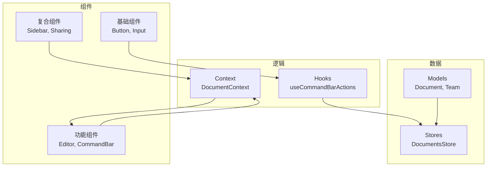
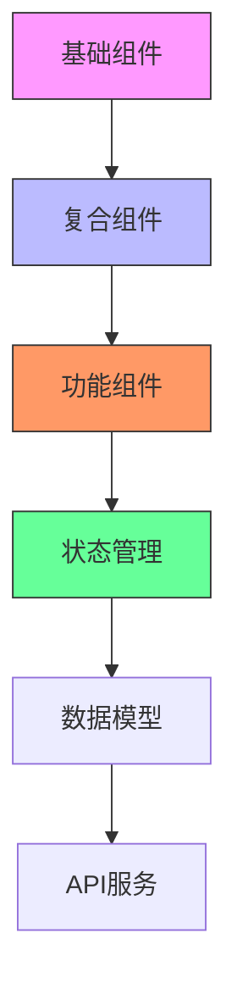
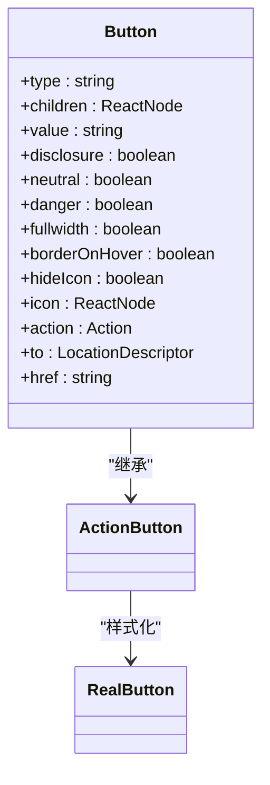
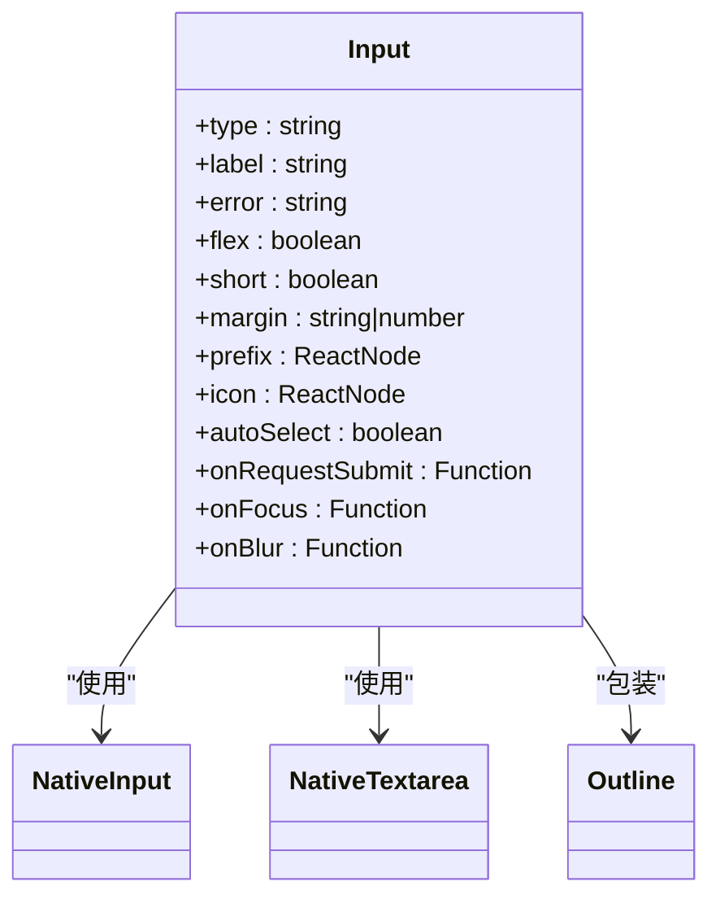
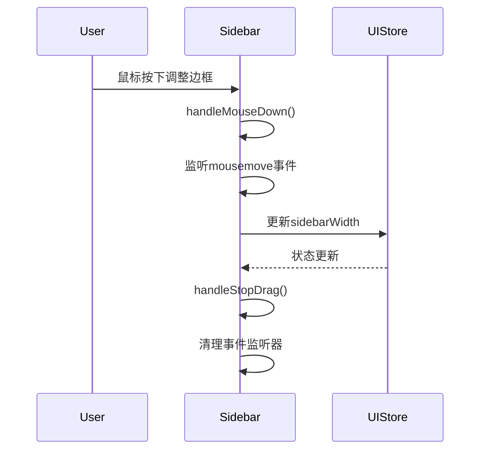
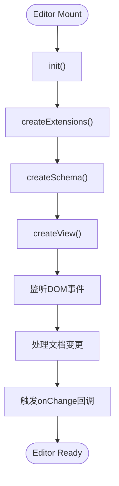
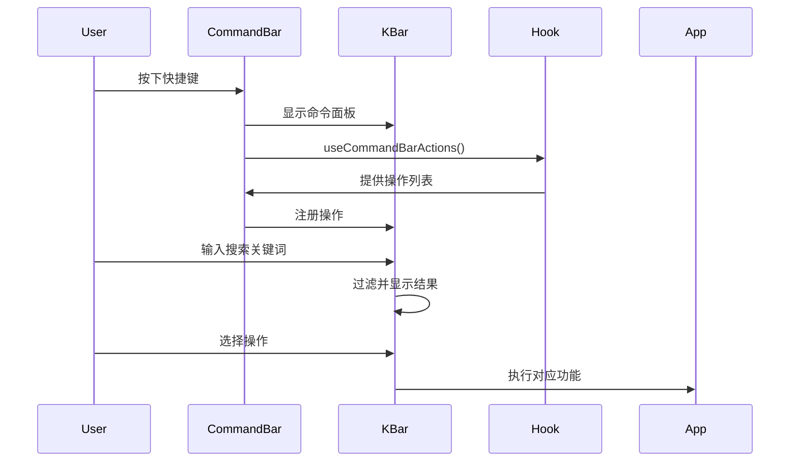
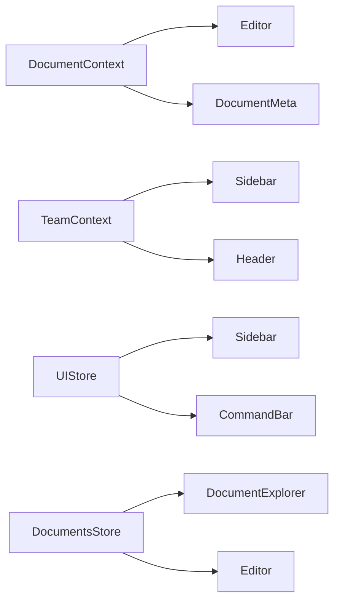

# 组件体系

<cite>
**本文档中引用的文件**  
- [Button.tsx](file://app/components/Button.tsx)
- [Input.tsx](file://app/components/Input.tsx)
- [Sidebar/Sidebar.tsx](file://app/components/Sidebar/Sidebar.tsx)
- [CommandBar/CommandBar.tsx](file://app/components/CommandBar/CommandBar.tsx)
- [Editor/index.tsx](file://app/editor/index.tsx)
- [DocumentContext.tsx](file://app/components/DocumentContext.tsx)
- [TeamContext.ts](file://app/components/TeamContext.ts)
</cite>

## 目录
1. [简介](#简介)
2. [项目结构](#项目结构)
3. [核心组件](#核心组件)
4. [架构概述](#架构概述)
5. [详细组件分析](#详细组件分析)
6. [依赖分析](#依赖分析)
7. [性能考虑](#性能考虑)
8. [故障排除指南](#故障排除指南)
9. [结论](#结论)

## 简介
baozi项目采用基于React的组件化设计，构建了一个模块化、可复用的前端组件体系。该体系通过清晰的分类和分层结构，实现了基础UI元素、复合布局组件和功能型交互组件的分离。系统利用React Context机制（如DocumentContext、TeamContext）实现跨组件的数据传递与状态共享，同时结合MobX进行状态管理，确保了应用在复杂交互场景下的响应性和一致性。组件设计注重可访问性、响应式布局和主题定制能力，为开发者提供了灵活的扩展接口和良好的用户体验。

## 项目结构
项目采用功能驱动的文件组织方式，核心组件集中存放于`app/components`目录下。该目录不仅包含Button、Input等基础UI组件，还包含Sidebar、Sharing等复合布局组件，以及Editor、CommandBar等复杂功能组件。系统通过`app/hooks`目录提供自定义Hook以实现逻辑复用，通过`app/models`和`app/stores`实现数据模型与状态管理。整体结构清晰，职责分明，便于维护和扩展。

**图源**  
- [app/components/Button.tsx](file://app/components/Button.tsx#L1-L207)
- [app/components/Input.tsx](file://app/components/Input.tsx#L1-L282)
- [app/components/Sidebar/Sidebar.tsx](file://app/components/Sidebar/Sidebar.tsx#L1-L374)

**本节来源**  
- [app/components](file://app/components)
- [app/hooks](file://app/hooks)
- [app/models](file://app/models)

## 核心组件
baozi项目的前端组件体系围绕三大核心类别构建：基础组件、复合组件和功能组件。基础组件如Button和Input提供了标准化的UI元素，确保了视觉和交互的一致性。复合组件如Sidebar和Sharing通过组合基础组件，实现了复杂的布局和导航功能。功能组件如Editor和CommandBar则封装了特定的业务逻辑和交互模式，为用户提供高级功能。所有组件均通过TypeScript定义精确的props类型，并利用styled-components实现样式隔离和主题支持。

**本节来源**  
- [app/components/Button.tsx](file://app/components/Button.tsx#L1-L207)
- [app/components/Input.tsx](file://app/components/Input.tsx#L1-L282)
- [app/components/Sidebar/Sidebar.tsx](file://app/components/Sidebar/Sidebar.tsx#L1-L374)
- [app/editor/index.tsx](file://app/editor/index.tsx#L1-L944)

## 架构概述
系统采用分层架构，自底向上分别为基础UI层、复合布局层、功能逻辑层和状态管理层。基础UI组件提供原子化的视觉元素；复合组件通过组合这些元素构建页面结构；功能组件集成业务逻辑，处理复杂交互；状态管理通过MobX stores和React Context实现全局状态的集中管理和高效分发。这种架构确保了组件的高度内聚和低耦合，支持灵活的组合和复用。

**图源**  
- [app/components/Button.tsx](file://app/components/Button.tsx#L1-L207)
- [app/components/Sidebar/Sidebar.tsx](file://app/components/Sidebar/Sidebar.tsx#L1-L374)
- [app/editor/index.tsx](file://app/editor/index.tsx#L1-L944)

## 详细组件分析
本节深入分析关键组件的实现细节，包括其props定义、状态管理、样式处理和可访问性特性。

### 基础组件分析
基础组件是构建用户界面的基石，提供可复用的UI元素。

#### Button组件
Button组件是一个典型的原子化UI组件，通过props控制其外观和行为。它支持多种状态（如禁用、危险、中性）和变体（如全宽、带图标），并通过styled-components实现主题化样式。

**图源**  
- [app/components/Button.tsx](file://app/components/Button.tsx#L1-L207)

**本节来源**  
- [app/components/Button.tsx](file://app/components/Button.tsx#L1-L207)

#### Input组件
Input组件封装了原生input和textarea元素，提供统一的样式、错误处理和辅助功能。它通过forwardRef暴露底层DOM引用，并利用useRef管理内部状态。

**图源**  
- [app/components/Input.tsx](file://app/components/Input.tsx#L1-L282)

**本节来源**  
- [app/components/Input.tsx](file://app/components/Input.tsx#L1-L282)

### 复合组件分析
复合组件通过组合基础组件实现更复杂的UI结构和交互模式。

#### Sidebar组件
Sidebar组件是一个复杂的布局容器，支持可调整宽度、折叠/展开状态和响应式设计。它利用React的useCallback和useMemo优化性能，并通过事件监听器处理鼠标拖拽调整大小。

**图源**  
- [app/components/Sidebar/Sidebar.tsx](file://app/components/Sidebar/Sidebar.tsx#L1-L374)

**本节来源**  
- [app/components/Sidebar/Sidebar.tsx](file://app/components/Sidebar/Sidebar.tsx#L1-L374)

### 功能组件分析
功能组件封装了特定的业务逻辑和高级交互。

#### Editor组件
Editor组件基于ProseMirror构建，提供富文本编辑功能。它通过ExtensionManager集成各种编辑扩展，并利用ProseMirror的插件系统实现复杂的文档操作。

**图源**  
- [app/editor/index.tsx](file://app/editor/index.tsx#L1-L944)

**本节来源**  
- [app/editor/index.tsx](file://app/editor/index.tsx#L1-L944)

#### CommandBar组件
CommandBar组件实现了一个全局命令搜索界面，允许用户通过快捷键快速访问应用功能。它利用kbar库提供核心功能，并通过自定义Hook集成应用特定的操作。

**图源**  
- [app/components/CommandBar/CommandBar.tsx](file://app/components/CommandBar/CommandBar.tsx#L1-L113)

**本节来源**  
- [app/components/CommandBar/CommandBar.tsx](file://app/components/CommandBar/CommandBar.tsx#L1-L113)

## 依赖分析
组件体系通过多种机制实现数据传递和状态共享。Context API（如DocumentContext、TeamContext）用于在组件树中传递全局或局部状态，避免了props逐层传递的繁琐。Props直接传递用于父子组件间的简单数据流。状态管理主要依赖MobX stores，通过useStores Hook在组件中访问。这种混合模式既保证了灵活性，又确保了状态的一致性和可预测性。

**图源**  
- [app/components/DocumentContext.tsx](file://app/components/DocumentContext.tsx#L1-L96)
- [app/components/TeamContext.ts](file://app/components/TeamContext.ts#L1-L12)

**本节来源**  
- [app/components/DocumentContext.tsx](file://app/components/DocumentContext.tsx#L1-L96)
- [app/components/TeamContext.ts](file://app/components/TeamContext.ts#L1-L12)
- [app/stores](file://app/stores)

## 性能考虑
为优化性能，系统采用了多种策略。对于功能组件如Editor和CommandBar，利用React.memo和useCallback防止不必要的重渲染。对于列表渲染，采用虚拟滚动技术（如PaginatedList）以减少DOM节点数量。图片等资源采用懒加载（LazyLoad）策略。此外，通过usePrevious等自定义Hook减少状态比较的开销，并利用ProseMirror的事务系统批量处理文档变更，最小化视图更新频率。

## 故障排除指南
常见问题包括组件状态不一致、Context值为undefined和样式冲突。对于状态问题，应检查MobX store的更新逻辑和observer装饰器的使用。对于Context问题，需确保组件位于正确的Provider之下。样式冲突通常源于全局样式污染，应检查styled-components的隔离机制是否正确应用。调试时可利用React DevTools检查组件树和props，使用MobX DevTools监控状态变化。

**本节来源**  
- [app/components/DocumentContext.tsx](file://app/components/DocumentContext.tsx#L1-L96)
- [app/components/TeamContext.ts](file://app/components/TeamContext.ts#L1-L12)
- [app/hooks/useStores.ts](file://app/hooks/useStores.ts)

## 结论
baozi项目的组件体系展现了现代React应用的最佳实践。通过清晰的分层、合理的状态管理和高效的性能优化，构建了一个既强大又灵活的前端架构。该体系不仅支持当前功能的稳定运行，也为未来的功能扩展和维护提供了坚实的基础。对于新开发者，建议从基础组件入手，逐步理解Context和Store的使用模式；对于资深开发者，可重点关注性能优化和复杂交互的实现细节。