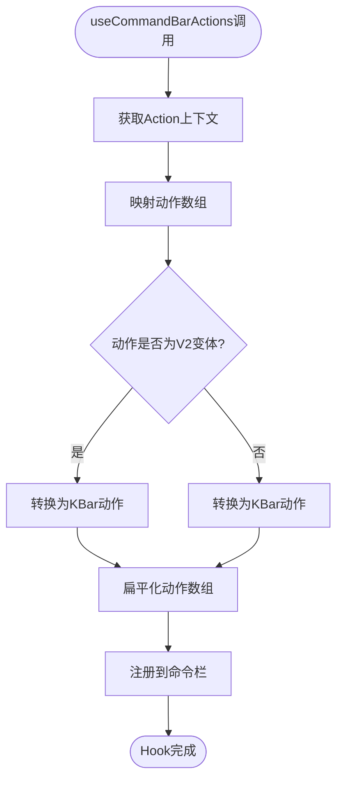
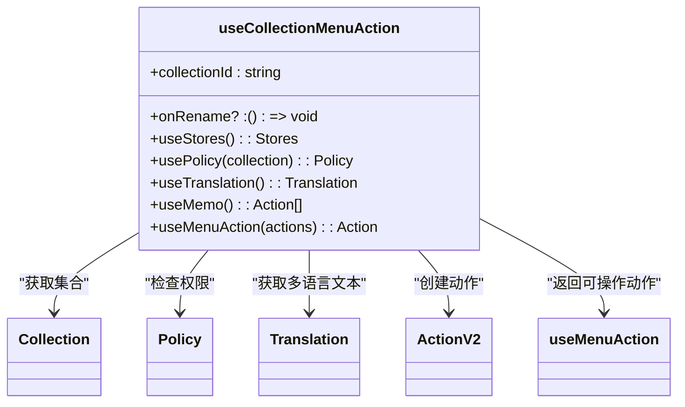
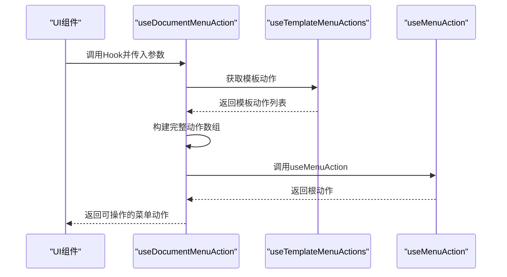
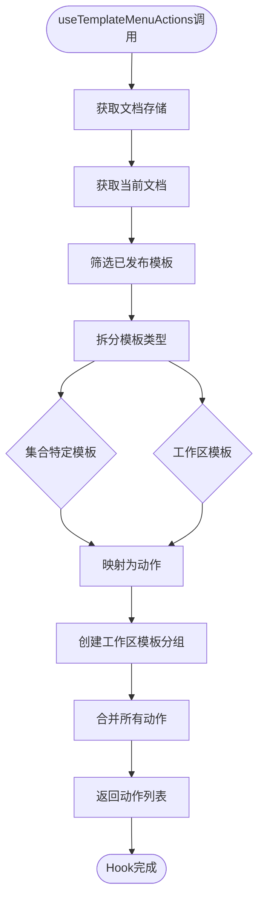
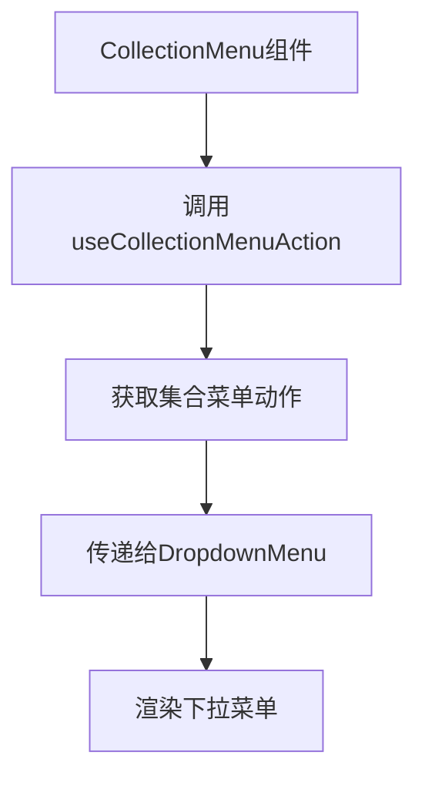
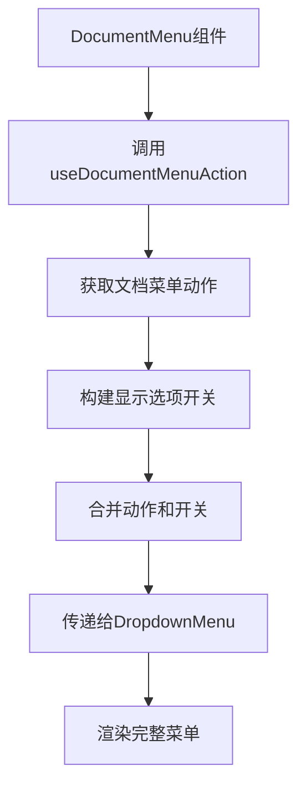
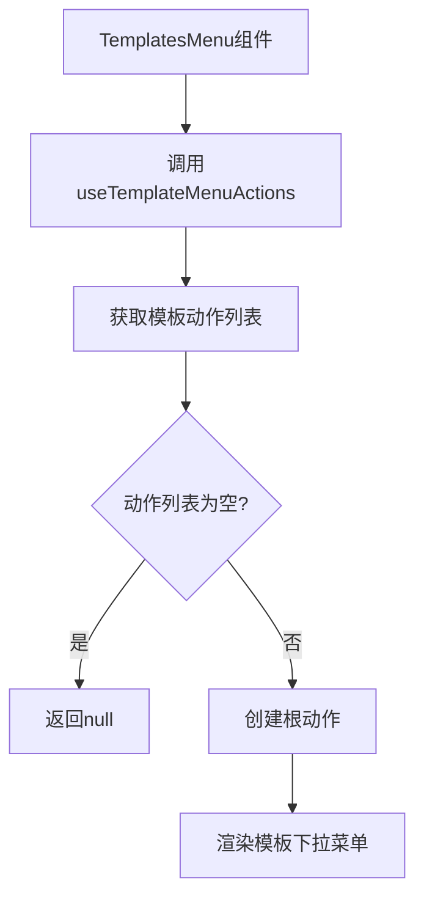
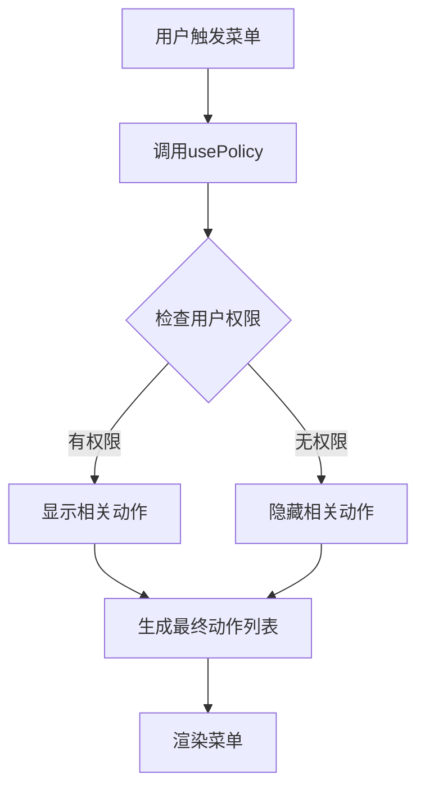

# UI交互Hook

<cite>
**本文档中引用的文件**  
- [useCommandBarActions.ts](file://app/hooks/useCommandBarActions.ts)
- [useCollectionMenuAction.tsx](file://app/hooks/useCollectionMenuAction.tsx)
- [useDocumentMenuAction.tsx](file://app/hooks/useDocumentMenuAction.tsx)
- [useTemplateMenuActions.tsx](file://app/hooks/useTemplateMenuActions.tsx)
- [CollectionMenu.tsx](file://app/menus/CollectionMenu.tsx)
- [DocumentMenu.tsx](file://app/menus/DocumentMenu.tsx)
- [TemplatesMenu.tsx](file://app/menus/TemplatesMenu.tsx)
</cite>

## 目录
1. [简介](#简介)
2. [核心Hook概览](#核心hook概览)
3. [useCommandBarActions详解](#usecommandbaractions详解)
4. [useCollectionMenuAction详解](#usecollectionmenuaction详解)
5. [useDocumentMenuAction详解](#usedocumentmenuaction详解)
6. [useTemplateMenuActions详解](#usetemplatemenuactions详解)
7. [UI组件集成示例](#ui组件集成示例)
8. [权限控制与动态菜单](#权限控制与动态菜单)
9. [开发指南与最佳实践](#开发指南与最佳实践)
10. [扩展与自定义](#扩展与自定义)

## 简介
本文档详细介绍了baozi项目中用于UI交互的核心Hook，包括`useCommandBarActions`、`useCollectionMenuAction`、`useDocumentMenuAction`和`useTemplateMenuActions`。这些Hook封装了复杂的UI交互逻辑，提供了统一的菜单状态管理和用户操作处理机制。通过这些Hook，开发者可以轻松地在命令栏、上下文菜单等UI组件中集成丰富的交互功能，同时确保权限控制和动态菜单生成的一致性。

## 核心Hook概览
baozi项目中的UI交互Hook主要分为四类，分别服务于不同的交互场景：

- `useCommandBarActions`：用于向全局命令栏注册可执行动作
- `useCollectionMenuAction`：为集合（Collection）上下文菜单生成动作列表
- `useDocumentMenuAction`：为文档（Document）上下文菜单生成动作列表
- `useTemplateMenuActions`：为模板应用菜单生成动态动作列表

这些Hook都遵循相似的设计模式：接收上下文参数，结合权限策略，生成可执行的动作列表，并通过`useMenuAction`或`useRegisterActions`等底层Hook完成注册。

**Section sources**
- [useCommandBarActions.ts](file://app/hooks/useCommandBarActions.ts#L1-L37)
- [useCollectionMenuAction.tsx](file://app/hooks/useCollectionMenuAction.tsx#L1-L73)
- [useDocumentMenuAction.tsx](file://app/hooks/useDocumentMenuAction.tsx#L1-L135)
- [useTemplateMenuActions.tsx](file://app/hooks/useTemplateMenuActions.tsx#L1-L95)

## useCommandBarActions详解
`useCommandBarActions` Hook用于将指定的动作注册到全局命令栏（Command Bar）中。当包含该Hook的组件挂载时，指定的动作将对用户可见；当组件卸载时，动作将自动注销。

该Hook接收两个参数：动作数组和额外的依赖项。它通过`useActionContext`获取当前的上下文环境，并使用`flattenDeep`处理可能存在的嵌套动作结构。最终，通过`useRegisterActions`将转换后的动作注册到kbar命令栏系统中。



**Diagram sources**
- [useCommandBarActions.ts](file://app/hooks/useCommandBarActions.ts#L13-L35)

**Section sources**
- [useCommandBarActions.ts](file://app/hooks/useCommandBarActions.ts#L13-L35)

## useCollectionMenuAction详解
`useCollectionMenuAction` Hook为集合上下文菜单生成一组预定义的动作。它接收集合ID和重命名回调函数作为参数，通过`useStores`获取集合数据，使用`usePolicy`检查用户权限，并根据权限动态显示或隐藏某些动作。

该Hook返回的动作列表包括：收藏/取消收藏集合、订阅/取消订阅、创建文档、导入文档、编辑集合、设置权限、创建模板、排序、导出、归档和删除等。其中"重命名"动作的可见性取决于用户是否具有更新权限以及是否提供了重命名回调。



**Diagram sources**
- [useCollectionMenuAction.tsx](file://app/hooks/useCollectionMenuAction.tsx#L33-L71)

**Section sources**
- [useCollectionMenuAction.tsx](file://app/hooks/useCollectionMenuAction.tsx#L33-L71)

## useDocumentMenuAction详解
`useDocumentMenuAction` Hook为文档上下文菜单生成全面的动作集合。它不仅包含基本的文档操作，还集成了模板应用、内容导入等高级功能。

该Hook的关键特性包括：
- 通过`useTemplateMenuActions`集成模板选择功能
- 根据设备类型（移动端/桌面端）调整动作可见性
- 结合用户偏好设置（如分离编辑模式）控制动作显示
- 支持查找替换、重命名等编辑操作的回调

动作列表按功能分组，包括恢复、收藏、订阅、编辑、分享、创建子文档、应用模板、查看历史、下载、删除等操作，形成了完整的文档管理功能集。



**Diagram sources**
- [useDocumentMenuAction.tsx](file://app/hooks/useDocumentMenuAction.tsx#L55-L133)

**Section sources**
- [useDocumentMenuAction.tsx](file://app/hooks/useDocumentMenuAction.tsx#L55-L133)

## useTemplateMenuActions详解
`useTemplateMenuActions` Hook专门用于生成模板选择菜单的动作列表。它从文档存储中筛选已发布的模板，并将其分为集合特定模板和工作区通用模板两类。

该Hook的核心功能包括：
- 过滤已发布的模板
- 区分集合特定模板和工作区模板
- 为每个模板创建可执行的动作
- 使用`createActionV2Group`将工作区模板组织为分组

当用户选择模板时，通过`onSelectTemplate`回调通知调用方，实现了模板应用的完整交互流程。



**Diagram sources**
- [useTemplateMenuActions.tsx](file://app/hooks/useTemplateMenuActions.tsx#L35-L93)

**Section sources**
- [useTemplateMenuActions.tsx](file://app/hooks/useTemplateMenuActions.tsx#L35-L93)

## UI组件集成示例
这些Hook在实际UI组件中的集成方式如下：

### 集合菜单集成
在`CollectionMenu.tsx`中，通过`useCollectionMenuAction`获取动作列表，并将其传递给`DropdownMenu`组件：



### 文档菜单集成
在`DocumentMenu.tsx`中，除了基本的文档动作外，还集成了显示选项切换开关：



### 模板菜单集成
在`TemplatesMenu.tsx`中，专门用于模板选择场景：



**Section sources**
- [CollectionMenu.tsx](file://app/menus/CollectionMenu.tsx#L49-L52)
- [DocumentMenu.tsx](file://app/menus/DocumentMenu.tsx#L127-L132)
- [TemplatesMenu.tsx](file://app/menus/TemplatesMenu.tsx#L20-L23)

## 权限控制与动态菜单
所有UI交互Hook都集成了基于策略的权限控制机制。通过`usePolicy` Hook，根据当前用户的角色和权限动态决定哪些动作应该显示。

### 权限检查流程


### 动态菜单生成
菜单的动态性体现在多个方面：
- **上下文感知**：动作的可见性取决于当前选中的集合或文档
- **设备适配**：移动端和桌面端显示不同的动作集合
- **用户偏好**：根据用户设置调整动作显示
- **权限控制**：只有具有相应权限的用户才能看到特定动作

这种设计确保了UI的一致性和安全性，同时提供了灵活的用户体验。

**Section sources**
- [useCollectionMenuAction.tsx](file://app/hooks/useCollectionMenuAction.tsx#L33-L71)
- [useDocumentMenuAction.tsx](file://app/hooks/useDocumentMenuAction.tsx#L55-L133)

## 开发指南与最佳实践
### 初学者指南
1. **基本使用**：直接调用相应的Hook，传入必要的参数
2. **参数理解**：了解每个Hook的输入参数及其作用
3. **回调处理**：正确实现重命名、模板选择等回调函数
4. **权限意识**：理解权限控制如何影响UI显示

### 最佳实践
1. **依赖管理**：确保在`useMemo`的依赖数组中包含所有相关状态
2. **性能优化**：利用`useComputed`和`useMemo`避免不必要的重新计算
3. **错误处理**：在动作执行前检查相关对象是否存在
4. **国际化**：使用`useTranslation`确保文本的多语言支持

### 常见模式
- **动作分组**：使用`ActionV2Separator`和`createActionV2Group`组织动作
- **条件显示**：通过`visible`属性控制动作的可见性
- **异步加载**：在菜单显示前预加载必要的数据

**Section sources**
- [useCommandBarActions.ts](file://app/hooks/useCommandBarActions.ts#L13-L35)
- [useCollectionMenuAction.tsx](file://app/hooks/useCollectionMenuAction.tsx#L33-L71)
- [useDocumentMenuAction.tsx](file://app/hooks/useDocumentMenuAction.tsx#L55-L133)

## 扩展与自定义
### 自定义交互模式
开发者可以通过以下方式扩展这些Hook的功能：

1. **创建新的动作定义**：在`actions/definitions`目录中添加新的动作
2. **组合现有Hook**：将多个Hook组合使用以实现复杂交互
3. **创建专用Hook**：基于现有Hook创建针对特定场景的专用Hook

### 扩展示例
```typescript
// 创建一个专用的文档操作Hook
function useCustomDocumentActions({ documentId, onCustomAction }: Props) {
  const baseActions = useDocumentMenuAction({ documentId });
  
  const customAction = createActionV2({
    name: "自定义操作",
    perform: onCustomAction,
    visible: true,
  });
  
  return useMenuAction([...baseActions.children, customAction]);
}
```

这种扩展方式保持了与现有系统的兼容性，同时提供了定制化的能力。

**Section sources**
- [useCommandBarActions.ts](file://app/hooks/useCommandBarActions.ts#L13-L35)
- [useTemplateMenuActions.tsx](file://app/hooks/useTemplateMenuActions.tsx#L35-L93)