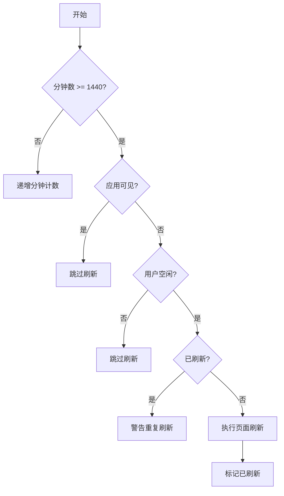
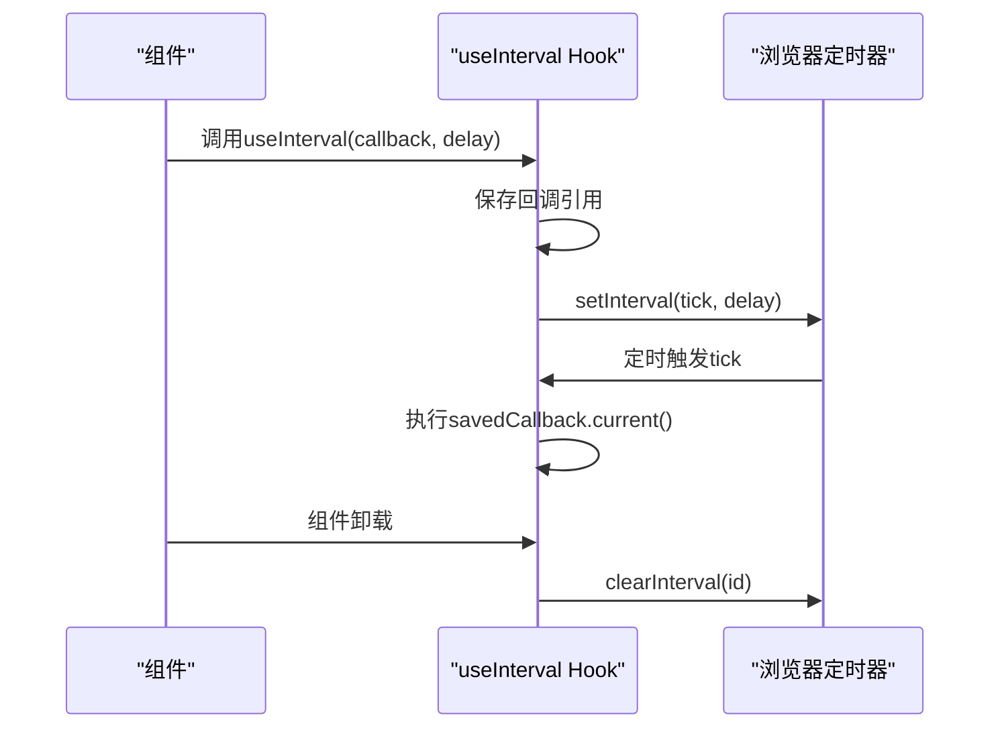
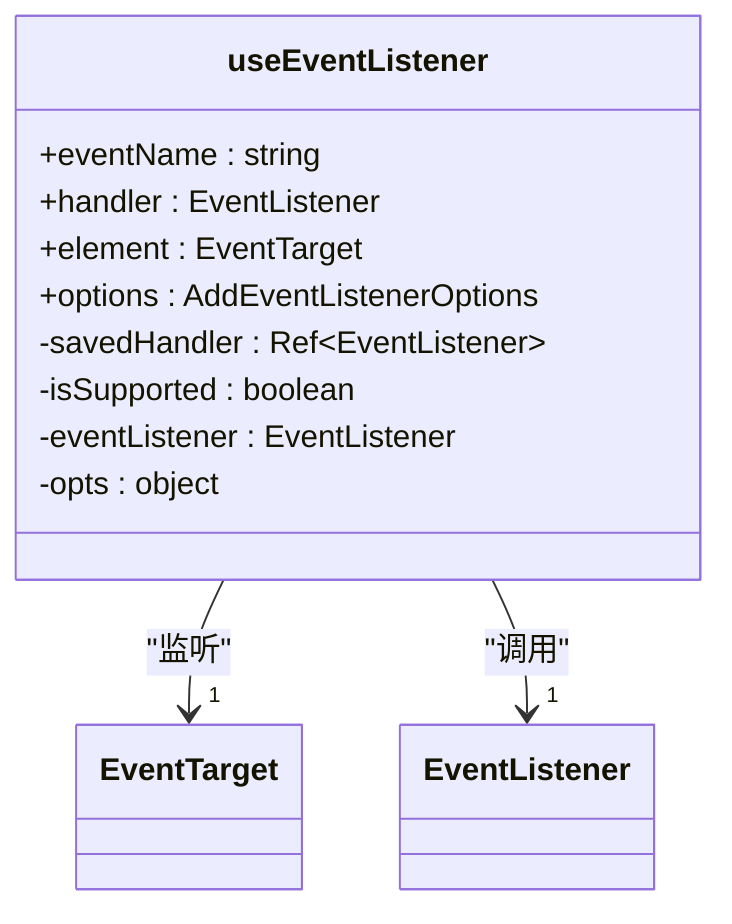
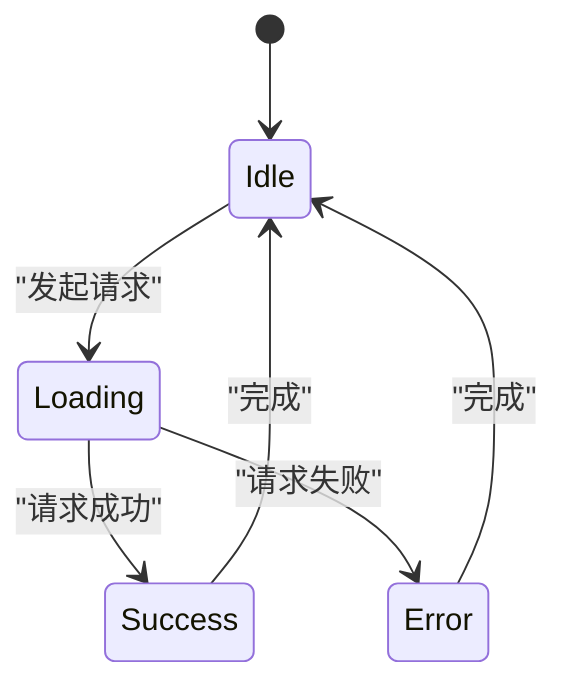

# 副作用管理Hook

<cite>
**Referenced Files in This Document**  
- [useAutoRefresh.ts](file://app/hooks/useAutoRefresh.ts)
- [useInterval.ts](file://app/hooks/useInterval.ts)
- [useEventListener.ts](file://app/hooks/useEventListener.ts)
- [useRequest.ts](file://app/hooks/useRequest.ts)
</cite>

## 目录
1. [简介](#简介)
2. [核心Hook分析](#核心Hook分析)
3. [副作用管理最佳实践](#副作用管理最佳实践)
4. [复杂异步场景处理](#复杂异步场景处理)
5. [结论](#结论)

## 简介
在现代前端开发中，副作用管理是构建可靠React应用的关键。副作用指的是那些发生在组件渲染之外的操作，如定时任务、事件监听和异步数据获取。这些操作如果管理不当，容易导致内存泄漏、性能问题和不可预测的行为。本文档深入分析baozi项目中的四个核心副作用管理Hook：`useAutoRefresh`、`useInterval`、`useEventListener`和`useRequest`，详细说明它们如何安全地处理各种副作用，为开发者提供从初学者到高级的最佳实践指导。

## 核心Hook分析

### useAutoRefresh Hook
`useAutoRefresh` Hook用于定期自动刷新应用，防止旧代码长时间运行。它通过组合其他Hook来实现复杂的副作用管理逻辑。

该Hook使用`useInterval`每分钟递增计数器，并在达到24小时后检查是否应该刷新应用。刷新决策基于两个关键条件：应用是否可见（通过`usePageVisibility`检测）和用户是否处于空闲状态（通过`useIdle`检测）。这种设计确保了刷新操作不会干扰用户的正常工作流程。

**Diagram sources**
- [useAutoRefresh.ts](file://app/hooks/useAutoRefresh.ts#L15-L42)

**Section sources**
- [useAutoRefresh.ts](file://app/hooks/useAutoRefresh.ts#L1-L44)

### useInterval Hook
`useInterval`是一个封装了`setInterval`和`clearInterval`的自定义Hook，用于安全地管理定时器副作用。

该Hook的关键实现包括两个`useEffect`：第一个用于保存最新的回调函数引用，确保定时器执行的是最新版本的回调；第二个用于设置和清理定时器。通过返回清理函数`clearInterval(id)`，确保组件卸载时定时器被正确清除，避免内存泄漏。

**Diagram sources**
- [useInterval.ts](file://app/hooks/useInterval.ts#L10-L31)

**Section sources**
- [useInterval.ts](file://app/hooks/useInterval.ts#L1-L33)

### useEventListener Hook
`useEventListener` Hook简化了事件监听器的添加和移除过程，确保事件监听器在组件卸载时被正确清理。

该Hook接受事件名称、处理函数、目标元素和选项作为参数。它使用`useRef`保存最新的处理函数引用，并在`useEffect`中设置事件监听器。清理函数会移除事件监听器，防止内存泄漏。Hook还检查目标元素是否支持`addEventListener`，增加了健壮性。

**Diagram sources**
- [useEventListener.ts](file://app/hooks/useEventListener.ts#L11-L37)

**Section sources**
- [useEventListener.ts](file://app/hooks/useEventListener.ts#L1-L39)

### useRequest Hook
`useRequest` Hook用于管理异步请求的状态，包括加载、错误和数据状态。

该Hook封装了常见的异步请求模式，提供了一个包含数据、加载状态、错误信息和请求函数的对象。它使用`useIsMounted`检查组件是否仍然挂载，确保在组件卸载后不会更新状态，避免了"Can't perform a React state update on an unmounted component"错误。`useCallback`确保请求函数的引用稳定性。

**Diagram sources**
- [useRequest.ts](file://app/hooks/useRequest.ts#L23-L64)

**Section sources**
- [useRequest.ts](file://app/hooks/useRequest.ts#L1-L66)

## 副作用管理最佳实践

### 清理机制
所有副作用都必须有相应的清理机制。`useInterval`和`useEventListener`通过在`useEffect`中返回清理函数来实现这一点。这是React Hooks的核心原则：每个副作用都应该有明确的创建和销毁路径。

### 依赖数组优化
正确使用依赖数组是避免不必要的副作用执行的关键。`useInterval`中的第一个`useEffect`只在`callback`变化时重新运行，第二个只在`delay`变化时重新运行。这确保了性能优化和预期行为。

### 状态检查
在异步操作完成前组件可能已经卸载，因此`useRequest`使用`useIsMounted`来检查组件状态，避免在卸载的组件上设置状态。

## 复杂异步场景处理
对于更复杂的异步场景，可以组合使用这些Hook。例如，可以使用`useInterval`定期轮询API（通过`useRequest`），同时使用`useEventListener`监听网络状态变化来调整轮询频率。

## 结论
baozi项目中的这些副作用管理Hook展示了如何通过组合和封装来创建可复用、安全的React Hook。它们遵循了最佳实践，包括适当的清理、依赖数组优化和状态检查，为开发者提供了处理定时任务、事件监听和异步操作的可靠工具。