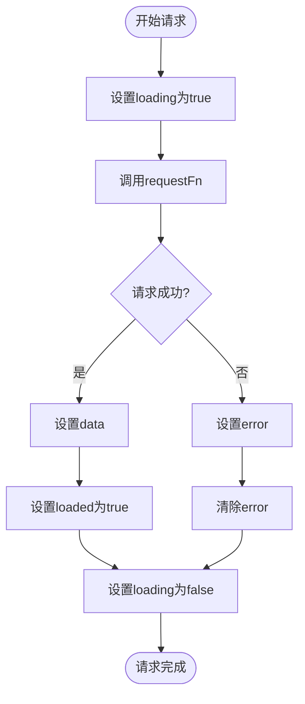
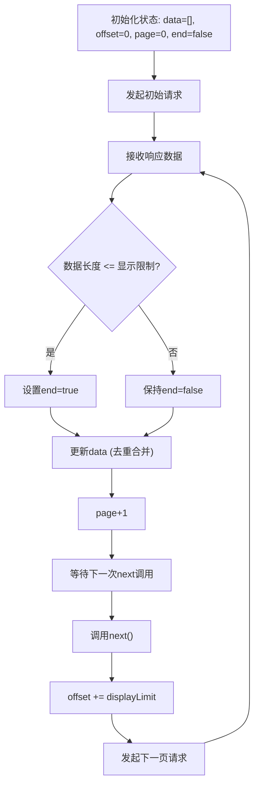
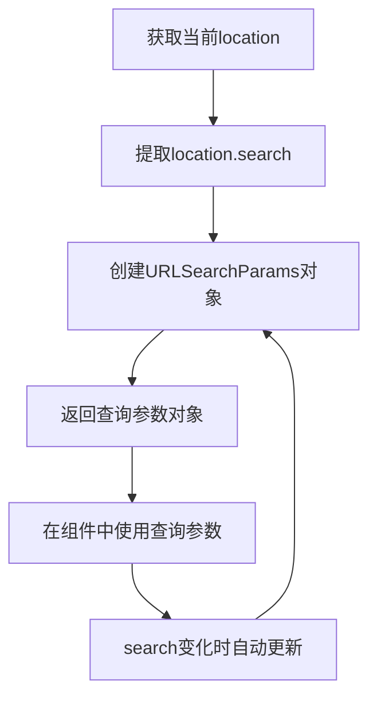
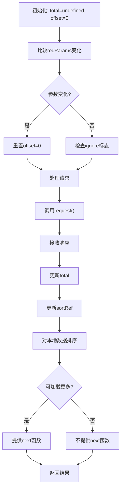
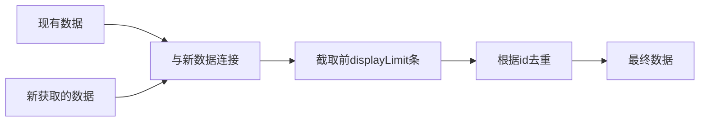
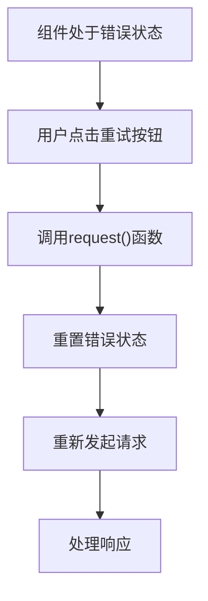

# 数据获取Hook

<cite>
**本文档中引用的文件**  
- [useRequest.ts](file://app/hooks/useRequest.ts)
- [usePaginatedRequest.ts](file://app/hooks/usePaginatedRequest.ts)
- [useQuery.ts](file://app/hooks/useQuery.ts)
- [useTableRequest.ts](file://app/hooks/useTableRequest.ts)
- [useIsMounted.ts](file://shared/hooks/useIsMounted.ts)
</cite>

## 目录
1. [简介](#简介)
2. [核心Hook概览](#核心Hook概览)
3. [useRequest详解](#userequest详解)
4. [usePaginatedRequest详解](#usepaginatedrequest详解)
5. [useQuery详解](#usequery详解)
6. [useTableRequest详解](#usetablerequest详解)
7. [高级功能实现原理](#高级功能实现原理)
8. [使用指南](#使用指南)
9. [性能优化建议](#性能优化建议)
10. [总结](#总结)

## 简介
baozi项目提供了一套完整的数据获取Hook，用于封装API请求逻辑、处理加载状态、错误管理和缓存机制。这些Hook简化了组件中的数据获取流程，提供了统一的状态管理接口。本文档详细介绍了useRequest、usePaginatedRequest、useQuery和useTableRequest的实现与使用方法。

## 核心Hook概览
baozi项目的数据获取Hook体系包含四个核心Hook：

- **useRequest**: 基础的API请求Hook，用于处理单次请求的状态管理
- **usePaginatedRequest**: 用于处理分页数据请求的Hook
- **useQuery**: 用于获取URL查询参数的Hook
- **useTableRequest**: 专门用于表格数据请求的Hook

这些Hook共同构成了项目的数据获取基础设施，为组件提供了统一的数据访问接口。

## useRequest详解

useRequest是基础的数据获取Hook，封装了API请求的完整生命周期管理。它处理加载状态、错误状态和数据状态，并提供重新请求的功能。



**主要特性**：
- 自动管理loading、loaded和error状态
- 提供request函数用于手动触发请求
- 支持在组件挂载时自动发起请求
- 使用useIsMounted确保组件卸载后不会更新状态

**状态说明**：
- **data**: 请求返回的数据
- **loading**: 请求是否正在进行
- **loaded**: 请求是否已完成至少一次
- **error**: 请求错误信息
- **request**: 触发请求的函数

**Section sources**
- [useRequest.ts](file://app/hooks/useRequest.ts#L23-L64)
- [useIsMounted.ts](file://shared/hooks/useIsMounted.ts#L0-L18)

## usePaginatedRequest详解

usePaginatedRequest是专门用于处理分页数据请求的Hook，基于useRequest构建，增加了分页相关的状态管理。



**核心功能**：
- 自动处理分页参数（offset、limit）
- 维护已加载数据的合并与去重
- 提供next函数用于加载下一页
- 跟踪当前页码和是否到达末尾

**关键实现**：
- 使用fetchLimit = displayLimit + 1来判断是否还有更多数据
- 使用uniqBy根据id去重合并数据
- 当requestFn变化时重置分页状态

**Section sources**
- [usePaginatedRequest.ts](file://app/hooks/usePaginatedRequest.ts#L32-L97)

## useQuery详解

useQuery是一个简单的Hook，用于从当前URL中提取查询参数。



**使用场景**：
- 从URL中读取分页参数
- 获取排序参数
- 读取过滤条件
- 处理搜索查询

该Hook利用useMemo和useLocation，确保在search参数变化时返回新的URLSearchParams实例。

**Section sources**
- [useQuery.ts](file://app/hooks/useQuery.ts#L8-L17)

## useTableRequest详解

useTableRequest是专门为表格组件设计的数据获取Hook，结合了排序和分页功能。



**主要特点**：
- 自动处理表格排序状态
- 管理分页偏移量
- 跟踪数据总数
- 智能判断是否显示"加载更多"按钮

**状态管理**：
- 使用ref存储上一次的参数和排序状态
- 使用ignore标志防止卸载后状态更新
- 在参数变化时重置分页状态

**Section sources**
- [useTableRequest.ts](file://app/hooks/useTableRequest.ts#L27-L94)

## 高级功能实现原理

### 请求去重机制
usePaginatedRequest通过uniqBy函数实现数据去重，确保在分页加载时不会出现重复数据：



### 依赖管理
所有Hook都正确使用了useCallback和useEffect的依赖数组，确保只在必要时重新执行：

- useRequest依赖requestFn和isMounted
- usePaginatedRequest依赖offset、fetchLimit和requestFn
- useTableRequest依赖sort、reqParams、offset和request

### 错误重试机制
虽然基础Hook不直接提供重试功能，但可以通过request函数实现手动重试：



### 缓存机制
Hook本身不实现数据缓存，但通过保持data状态实现了简单的内存缓存。组件卸载后缓存失效，符合预期行为。

**Section sources**
- [useRequest.ts](file://app/hooks/useRequest.ts#L23-L64)
- [usePaginatedRequest.ts](file://app/hooks/usePaginatedRequest.ts#L32-L97)
- [useTableRequest.ts](file://app/hooks/useTableRequest.ts#L27-L94)

## 使用指南

### 基础使用
```typescript
// 使用useRequest获取单个资源
const { data, loading, error, request } = useRequest(getUserData, true);

// 使用usePaginatedRequest获取分页数据
const { data, next, loading, error } = usePaginatedRequest(fetchDocuments, { 
  limit: 20 
});
```

### 组合使用
```typescript
// 结合useQuery实现基于URL参数的请求
const query = useQuery();
const sort = query.get('sort') || 'createdAt';
const direction = query.get('direction') || 'desc';

const { data, loading } = useRequest(() => 
  fetchSortedData(sort, direction)
);
```

### 错误处理
```typescript
// 在组件中处理错误状态
if (error) {
  return <ErrorMessage error={error} onRetry={request} />;
}
```

### 加载状态显示
```typescript
// 显示加载指示器
if (loading && !data) {
  return <LoadingIndicator />;
}
```

**Section sources**
- [useRequest.ts](file://app/hooks/useRequest.ts#L23-L64)
- [usePaginatedRequest.ts](file://app/hooks/usePaginatedRequest.ts#L32-L97)
- [useQuery.ts](file://app/hooks/useQuery.ts#L8-L17)

## 性能优化建议

### 避免不必要的重渲染
- 确保requestFn的稳定性，避免在每次渲染时创建新函数
- 使用useCallback包装requestFn

### 合理设置分页大小
- usePaginatedRequest默认limit为10，可根据实际需求调整
- useTableRequest固定PAGE_SIZE为25，适合表格场景

### 及时清理资源
- 所有Hook都正确处理了组件卸载后的状态更新
- 使用useIsMounted确保不会在卸载组件上设置状态

### 减少请求频率
- 对于频繁触发的请求，考虑添加防抖或节流
- 利用已有的数据缓存，避免重复请求

## 总结
baozi项目的数据获取Hook体系设计合理，职责分明。useRequest作为基础Hook提供了完整的请求生命周期管理，其他Hook在此基础上扩展了特定场景的功能。这些Hook共同为项目提供了稳定、高效的数据获取解决方案，大大简化了组件开发的复杂度。