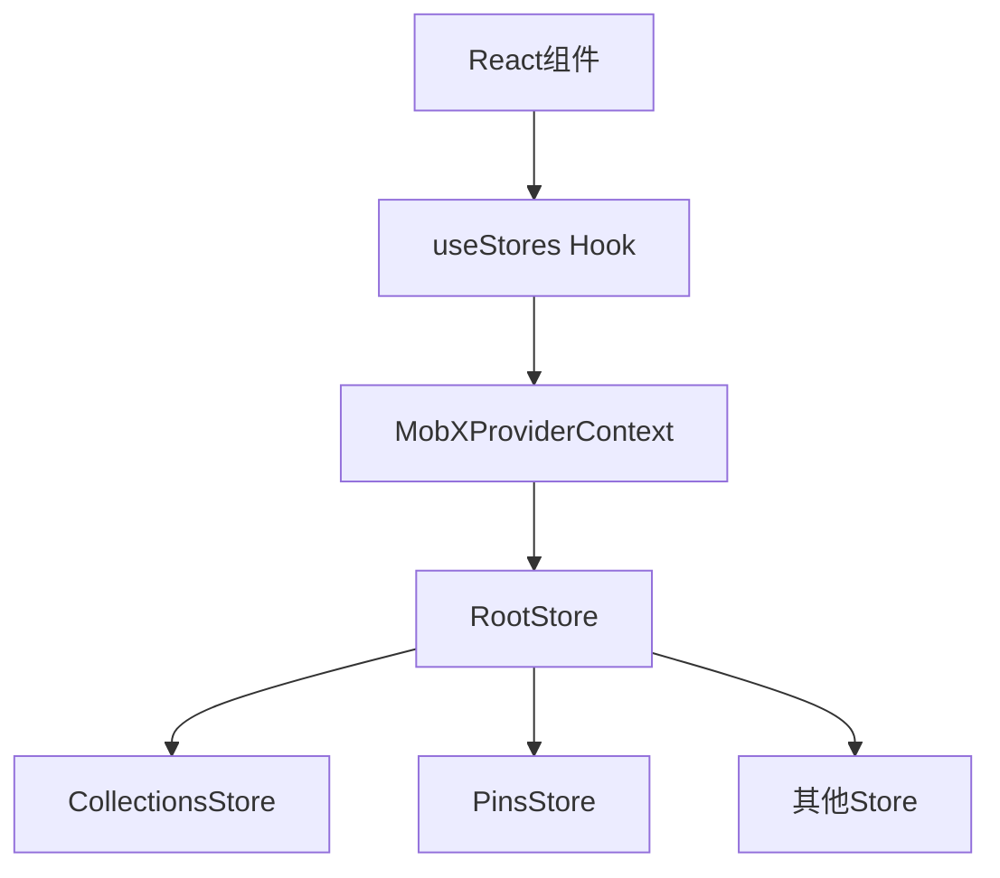
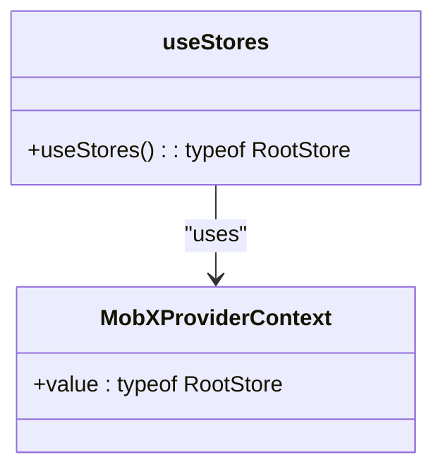
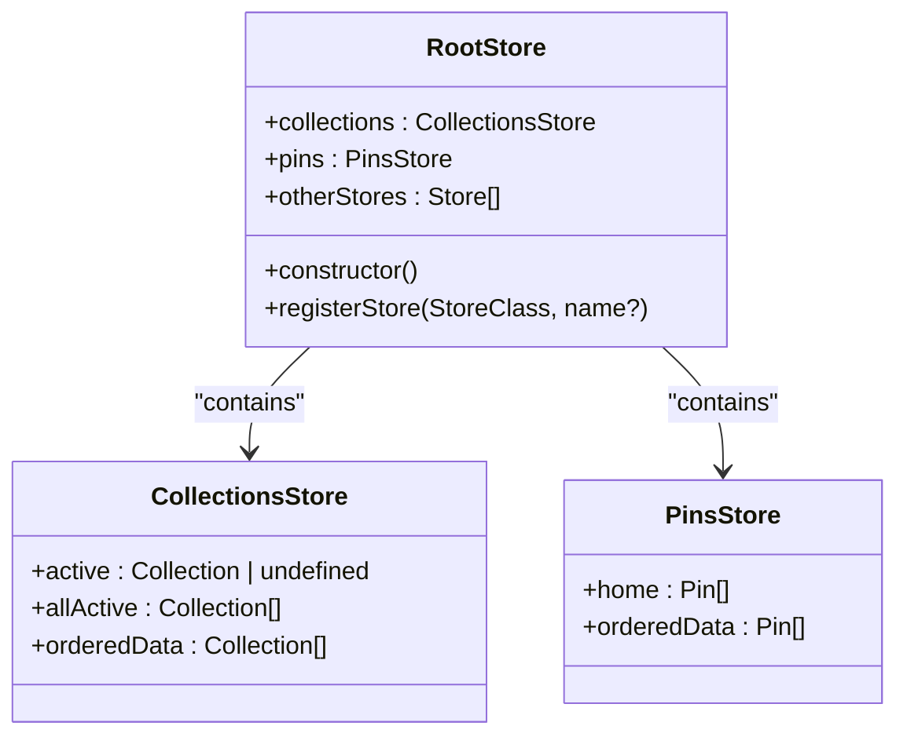
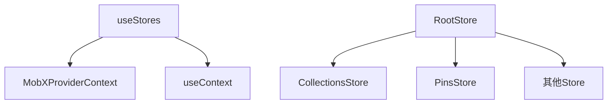

# 全局状态管理Hook

<cite>
**Referenced Files in This Document**   
- [useStores.ts](file://app/hooks/useStores.ts)
- [RootStore.ts](file://app/stores/RootStore.ts)
- [index.ts](file://app/stores/index.ts)
- [CollectionsStore.ts](file://app/stores/CollectionsStore.ts)
- [PinsStore.ts](file://app/stores/PinsStore.ts)
- [withStores.tsx](file://app/components/withStores.tsx)
</cite>

## 目录
1. [简介](#简介)
2. [项目结构](#项目结构)
3. [核心组件](#核心组件)
4. [架构概述](#架构概述)
5. [详细组件分析](#详细组件分析)
6. [依赖分析](#依赖分析)
7. [性能考虑](#性能考虑)
8. [故障排除指南](#故障排除指南)
9. [结论](#结论)

## 简介
本文档深入探讨了baozi项目中全局状态管理的核心机制——`useStores` Hook。该Hook通过React Context与MobX RootStore的集成，实现了跨组件的状态访问。文档将详细说明`useStores`的实现原理、使用方法以及在大型应用中的性能影响和边界情况处理，为初学者和经验丰富的开发者提供全面的指导。

## 项目结构
baozi项目的全局状态管理主要集中在`app/hooks`和`app/stores`目录下。`useStores` Hook位于`app/hooks/useStores.ts`，而所有状态存储的定义和管理则在`app/stores`目录下的各个Store文件中实现。

**Section sources**
- [useStores.ts](file://app/hooks/useStores.ts)
- [RootStore.ts](file://app/stores/RootStore.ts)

## 核心组件
`useStores` Hook是全局状态管理的核心，它通过React Context提供对MobX RootStore的访问。RootStore作为所有应用Store的容器，管理着`collections`、`pins`等各个Store实例。

**Section sources**
- [useStores.ts](file://app/hooks/useStores.ts#L9-L11)
- [RootStore.ts](file://app/stores/RootStore.ts#L37-L170)

## 架构概述
`useStores` Hook的架构基于React Context和MobX的结合。React Context用于在组件树中传递RootStore实例，而MobX则负责状态的响应式管理和更新。

**Diagram sources **
- [useStores.ts](file://app/hooks/useStores.ts#L9-L11)
- [RootStore.ts](file://app/stores/RootStore.ts#L37-L170)

## 详细组件分析

### useStores Hook分析
`useStores` Hook通过`useContext`从`MobXProviderContext`中获取RootStore实例，并使用TypeScript的类型断言确保返回类型为`typeof RootStore`。

**Diagram sources **
- [useStores.ts](file://app/hooks/useStores.ts#L9-L11)

#### RootStore分析
RootStore是所有Store的容器，它通过`registerStore`方法注册各个Store实例，并在构造函数中初始化它们。

**Diagram sources **
- [RootStore.ts](file://app/stores/RootStore.ts#L37-L170)
- [CollectionsStore.ts](file://app/stores/CollectionsStore.ts#L17-L254)
- [PinsStore.ts](file://app/stores/PinsStore.ts#L11-L98)

### CollectionsStore分析
CollectionsStore管理所有集合的状态，提供`active`、`allActive`、`orderedData`等计算属性来访问集合数据。

**Section sources**
- [CollectionsStore.ts](file://app/stores/CollectionsStore.ts#L17-L254)

### PinsStore分析
PinsStore管理所有固定文档的状态，提供`home`、`orderedData`等计算属性来访问固定文档数据。

**Section sources**
- [PinsStore.ts](file://app/stores/PinsStore.ts#L11-L98)

## 依赖分析
`useStores` Hook依赖于`mobx-react`的`MobXProviderContext`和`react`的`useContext`。RootStore依赖于各个具体的Store类，如`CollectionsStore`、`PinsStore`等。

**Diagram sources **
- [useStores.ts](file://app/hooks/useStores.ts#L9-L11)
- [RootStore.ts](file://app/stores/RootStore.ts#L37-L170)

## 性能考虑
`useStores` Hook通过React Context提供状态访问，避免了通过props层层传递状态的繁琐。MobX的响应式系统确保只有依赖状态变化的组件才会重新渲染，提高了应用性能。

## 故障排除指南
在使用`useStores` Hook时，确保RootStore已正确初始化并提供给`MobXProviderContext`。如果遇到类型错误，检查TypeScript的类型定义是否正确。

**Section sources**
- [useStores.ts](file://app/hooks/useStores.ts#L9-L11)
- [index.ts](file://app/stores/index.ts#L1-L12)

## 结论
`useStores` Hook通过React Context与MobX RootStore的集成，实现了高效、类型安全的全局状态管理。它为开发者提供了简洁的API来访问应用状态，同时保证了良好的性能和可维护性。