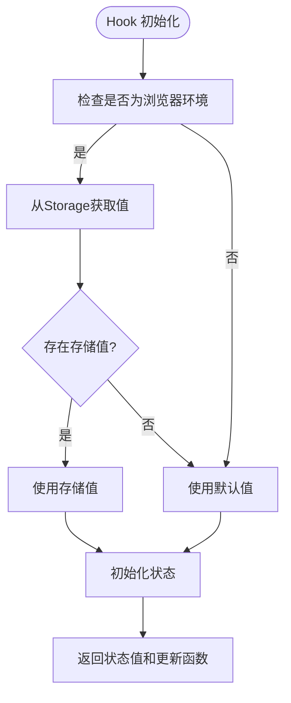
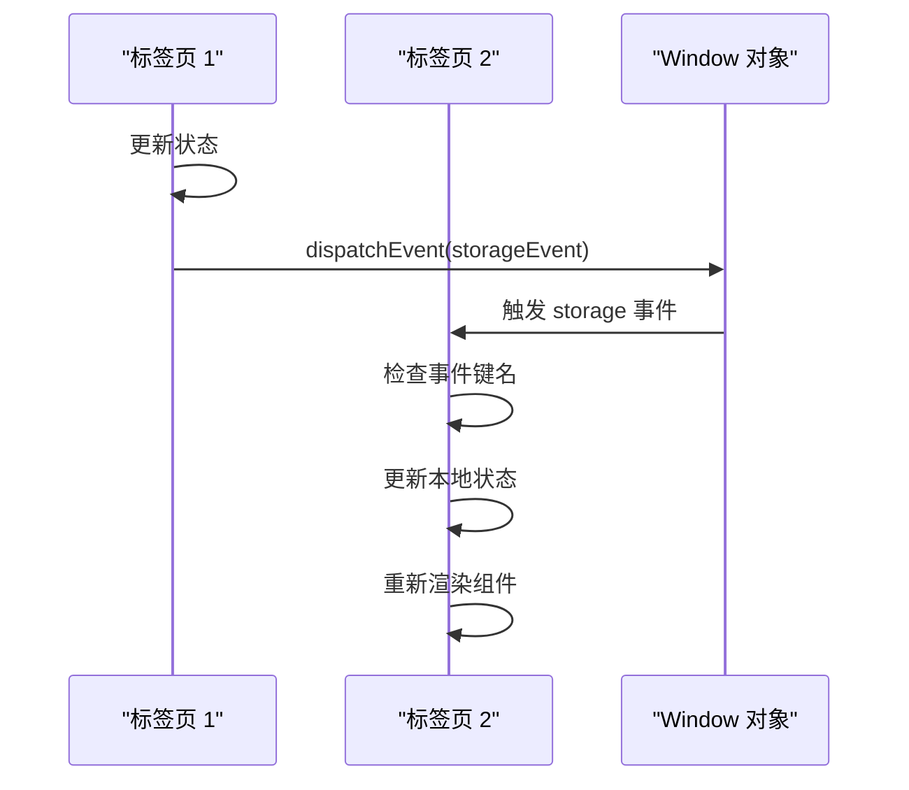
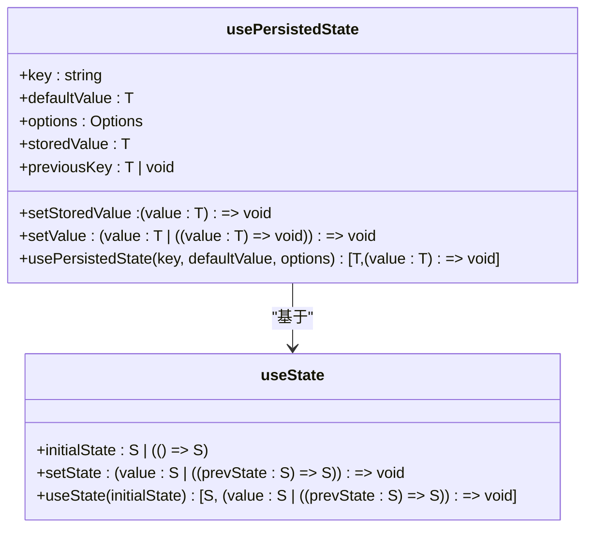
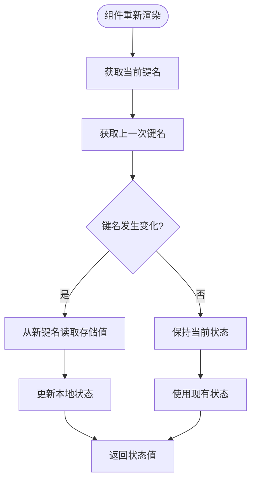

# 本地状态持久化Hook

<cite>
**Referenced Files in This Document**  
- [usePersistedState.ts](file://app/hooks/usePersistedState.ts)
- [useEventListener.ts](file://app/hooks/useEventListener.ts)
- [usePrevious.ts](file://app/hooks/usePrevious.ts)
- [Storage.ts](file://shared/utils/Storage.ts)
- [Logger.ts](file://app/utils/Logger.ts)
- [browser.ts](file://shared/utils/browser.ts)
</cite>

## 目录
1. [简介](#简介)
2. [核心实现机制](#核心实现机制)
3. [跨标签页同步原理](#跨标签页同步原理)
4. [API兼容性设计](#api兼容性设计)
5. [边界情况处理](#边界情况处理)
6. [最佳实践与性能优化](#最佳实践与性能优化)

## 简介

`usePersistedState` 是 baozi 项目中的一个自定义 React Hook，它提供了与标准 `useState` 相同的 API 接口，但增加了本地存储持久化功能。该 Hook 不仅能在页面刷新后保持状态，还能在不同浏览器标签页之间同步状态变化。通过封装 localStorage 操作、监听存储事件和处理边界情况，`usePersistedState` 为开发者提供了一个强大而可靠的状态管理解决方案。

**Section sources**
- [usePersistedState.ts](file://app/hooks/usePersistedState.ts#L39-L84)

## 核心实现机制

`usePersistedState` 的核心实现基于 React 的 `useState`、`useCallback` 和 `useEffect` 等基础 Hook，通过组合这些基础功能来构建更高级的状态管理能力。该 Hook 接收三个参数：存储键名（key）、默认值（defaultValue）和可选配置（options），返回一个包含当前值和更新函数的数组。

在初始化阶段，Hook 会检查当前环境是否为浏览器环境（通过 `isBrowser` 工具函数判断），以避免在服务器端渲染时出现错误。如果在浏览器环境中，它会尝试从 `Storage` 实例中获取指定键的值，如果不存在则使用提供的默认值。`Storage` 类是一个对 localStorage 的安全封装，当 localStorage 不可用时会自动降级到内存存储。

**Diagram sources**
- [usePersistedState.ts](file://app/hooks/usePersistedState.ts#L39-L84)
- [Storage.ts](file://shared/utils/Storage.ts#L6-L81)
- [browser.ts](file://shared/utils/browser.ts#L3-L3)

**Section sources**
- [usePersistedState.ts](file://app/hooks/usePersistedState.ts#L39-L84)
- [Storage.ts](file://shared/utils/Storage.ts#L6-L81)
- [browser.ts](file://shared/utils/browser.ts#L3-L3)

## 跨标签页同步原理

`usePersistedState` 实现跨标签页状态同步的关键在于对 `storage` 事件的监听。当一个标签页中的状态发生变化时，不仅会更新本地状态，还会触发一个自定义的 `storage` 事件，通知其他打开的标签页进行同步。

这一功能通过 `useEventListener` Hook 实现，它是一个通用的事件监听器工具，可以安全地添加和移除事件监听。`usePersistedState` 监听全局 `window` 对象的 `storage` 事件，当检测到与当前 Hook 相关的键发生变化时，就会更新本地状态。通过 `options.listen` 参数，开发者可以控制是否启用这一功能，默认情况下是启用的。

**Diagram sources**
- [usePersistedState.ts](file://app/hooks/usePersistedState.ts#L75-L84)
- [useEventListener.ts](file://app/hooks/useEventListener.ts#L1-L38)

**Section sources**
- [usePersistedState.ts](file://app/hooks/usePersistedState.ts#L75-L84)
- [useEventListener.ts](file://app/hooks/useEventListener.ts#L1-L38)

## API兼容性设计

`usePersistedState` 在设计上完全兼容标准 `useState` 的 API，这使得开发者可以无缝替换现有的状态管理代码。它支持函数式更新模式，即更新函数可以接收一个函数作为参数，该函数接收当前状态值并返回新的状态值。这种设计模式在处理复杂状态更新逻辑时非常有用。

此外，该 Hook 还处理了可能发生的异常情况。在尝试存储数据时，如果发生错误（如存储空间不足），它会通过 `Logger` 实例记录调试信息，但不会中断应用程序的正常运行。这种容错设计确保了即使在异常情况下，应用程序也能保持稳定。

**Diagram sources**
- [usePersistedState.ts](file://app/hooks/usePersistedState.ts#L39-L84)
- [Logger.ts](file://app/utils/Logger.ts#L17-L92)

**Section sources**
- [usePersistedState.ts](file://app/hooks/usePersistedState.ts#L39-L84)
- [Logger.ts](file://app/utils/Logger.ts#L17-L92)

## 边界情况处理

`usePersistedState` 通过 `usePrevious` Hook 处理键名变更的边界情况。当传入的键名发生变化时，Hook 需要能够正确地从新键名对应的存储位置读取数据，并更新本地状态。`usePrevious` Hook 用于保存上一次渲染时的键名值，通过比较当前键名和上一次的键名，可以准确地检测到键名的变化。

这种设计确保了在动态键名场景下的正确行为。例如，在用户切换不同配置文件时，每个配置文件可能对应不同的存储键名，`usePersistedState` 能够自动适应这种变化，从正确的存储位置读取和写入数据。

**Diagram sources**
- [usePersistedState.ts](file://app/hooks/usePersistedState.ts#L55-L63)
- [usePrevious.ts](file://app/hooks/usePrevious.ts#L1-L21)

**Section sources**
- [usePersistedState.ts](file://app/hooks/usePersistedState.ts#L55-L63)
- [usePrevious.ts](file://app/hooks/usePrevious.ts#L1-L21)

## 最佳实践与性能优化

对于初学者而言，使用 `usePersistedState` 的最佳实践是将其作为 `useState` 的直接替代品，特别是在需要持久化用户界面状态的场景中，如主题偏好、布局设置或表单数据。通过简单的 API 调用，即可实现状态的持久化和跨标签页同步。

对于经验丰富的开发者，在高频率状态更新场景下，需要注意性能优化。频繁的状态更新会导致大量的 localStorage 操作和事件触发，可能影响性能。建议在必要时对状态更新进行节流或防抖处理，或者将频繁变化的状态与持久化状态分离管理。此外，应避免存储过大的对象，因为序列化和反序列化大型对象会消耗较多计算资源。

错误处理方面，`usePersistedState` 已经内置了基本的容错机制，但在生产环境中，建议监控存储操作的失败情况，并根据需要提供用户友好的错误提示或降级方案。

**Section sources**
- [usePersistedState.ts](file://app/hooks/usePersistedState.ts#L39-L84)
- [Storage.ts](file://shared/utils/Storage.ts#L6-L81)
- [Logger.ts](file://app/utils/Logger.ts#L17-L92)