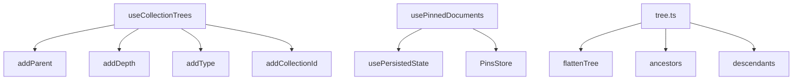
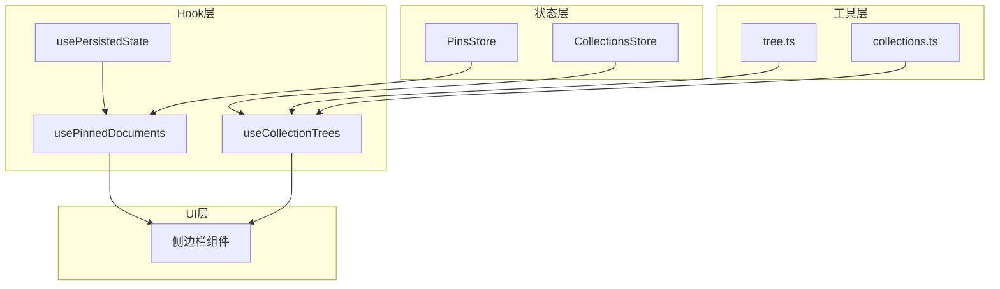
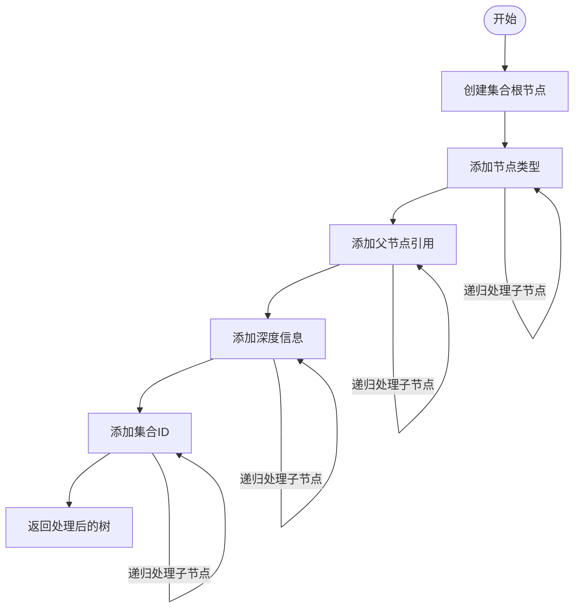
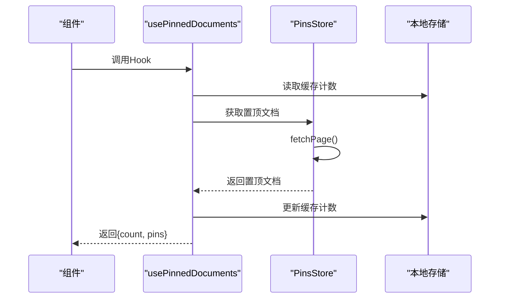
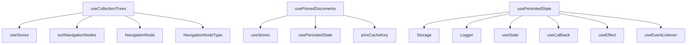

# 树结构管理Hook

<cite>
**本文档中引用的文件**  
- [useCollectionTrees.ts](file://app/hooks/useCollectionTrees.ts)
- [usePinnedDocuments.ts](file://app/hooks/usePinnedDocuments.ts)
- [tree.ts](file://app/utils/tree.ts)
- [usePersistedState.ts](file://app/hooks/usePersistedState.ts)
- [PinsStore.ts](file://app/stores/PinsStore.ts)
</cite>

## 目录
1. [简介](#简介)
2. [项目结构](#项目结构)
3. [核心组件](#核心组件)
4. [架构概述](#架构概述)
5. [详细组件分析](#详细组件分析)
6. [依赖分析](#依赖分析)
7. [性能考虑](#性能考虑)
8. [故障排除指南](#故障排除指南)
9. [结论](#结论)

## 简介
本文档详细介绍了baozi项目中的两个核心React Hook：`useCollectionTrees`和`usePinnedDocuments`。这些Hook负责管理侧边栏导航中的树形结构数据和置顶文档的缓存计数功能。文档将深入分析`useCollectionTrees`如何将扁平化的集合数据转换为具有层级关系的导航树，以及`usePinnedDocuments`如何结合持久化状态实现缓存功能。

## 项目结构
baozi项目的树结构管理功能主要分布在`app/hooks`和`app/utils`目录中。核心功能由`useCollectionTrees`和`usePinnedDocuments`两个Hook实现，它们依赖于`usePersistedState`进行状态持久化，并利用`tree.ts`中的工具函数进行树形数据操作。



**Diagram sources**
- [useCollectionTrees.ts](file://app/hooks/useCollectionTrees.ts#L14-L86)
- [usePinnedDocuments.ts](file://app/hooks/usePinnedDocuments.ts#L8-L35)
- [tree.ts](file://app/utils/tree.ts#L2-L35)

**Section sources**
- [useCollectionTrees.ts](file://app/hooks/useCollectionTrees.ts#L1-L87)
- [usePinnedDocuments.ts](file://app/hooks/usePinnedDocuments.ts#L1-L36)
- [tree.ts](file://app/utils/tree.ts#L1-L36)

## 核心组件
本文档的核心组件是`useCollectionTrees`和`usePinnedDocuments`两个自定义Hook。`useCollectionTrees`负责将扁平化的集合数据转换为具有完整层级信息的导航树，而`usePinnedDocuments`则管理置顶文档的状态和缓存计数。

**Section sources**
- [useCollectionTrees.ts](file://app/hooks/useCollectionTrees.ts#L14-L86)
- [usePinnedDocuments.ts](file://app/hooks/usePinnedDocuments.ts#L8-L35)

## 架构概述
树结构管理系统的架构基于React Hooks和MobX状态管理的组合。`useCollectionTrees`从全局状态中获取集合数据，通过一系列递归函数处理后返回具有完整层级信息的导航树。`usePinnedDocuments`则通过`usePersistedState`实现跨会话的状态持久化，并与`PinsStore`交互获取置顶文档数据。



**Diagram sources**
- [useCollectionTrees.ts](file://app/hooks/useCollectionTrees.ts#L14-L86)
- [usePinnedDocuments.ts](file://app/hooks/usePinnedDocuments.ts#L8-L35)
- [PinsStore.ts](file://app/stores/PinsStore.ts#L1-L99)

## 详细组件分析

### useCollectionTrees分析
`useCollectionTrees`是一个自定义Hook，负责将扁平化的集合数据转换为具有层级关系的导航树。它通过一系列递归辅助函数为每个节点添加必要的属性。

#### 递归处理逻辑


**Diagram sources**
- [useCollectionTrees.ts](file://app/hooks/useCollectionTrees.ts#L14-L86)

#### 辅助函数分析
`useCollectionTrees`使用了四个关键的递归辅助函数来处理树形结构：

1. **addType**: 为节点及其所有子节点设置类型属性
2. **addParent**: 为节点及其所有子节点添加父节点引用
3. **addDepth**: 为节点及其所有子节点添加深度信息
4. **addCollectionId**: 为节点及其所有子节点添加所属集合ID

这些函数都采用深度优先的递归方式遍历树形结构，确保每个节点都获得正确的属性值。

**Section sources**
- [useCollectionTrees.ts](file://app/hooks/useCollectionTrees.ts#L14-L86)

### usePinnedDocuments分析
`usePinnedDocuments`Hook负责管理置顶文档的状态和缓存计数功能。它结合了`usePersistedState`来实现跨会话的状态持久化。

#### 缓存计数实现


**Diagram sources**
- [usePinnedDocuments.ts](file://app/hooks/usePinnedDocuments.ts#L8-L35)
- [usePersistedState.ts](file://app/hooks/usePersistedState.ts#L39-L84)

#### 状态持久化机制
`usePinnedDocuments`使用`usePersistedState`来缓存置顶文档的数量。当组件挂载时，它会：
1. 从本地存储中读取缓存的计数
2. 从`PinsStore`中获取最新的置顶文档
3. 更新本地存储中的缓存计数
4. 返回当前的计数和置顶文档列表

这种机制确保了即使在页面刷新后，也能快速显示置顶文档的数量，同时保证数据的最终一致性。

**Section sources**
- [usePinnedDocuments.ts](file://app/hooks/usePinnedDocuments.ts#L8-L35)
- [usePersistedState.ts](file://app/hooks/usePersistedState.ts#L39-L84)

## 依赖分析
树结构管理Hook依赖于多个其他组件和工具函数，形成了一个完整的功能体系。



**Diagram sources**
- [useCollectionTrees.ts](file://app/hooks/useCollectionTrees.ts#L14-L86)
- [usePinnedDocuments.ts](file://app/hooks/usePinnedDocuments.ts#L8-L35)
- [usePersistedState.ts](file://app/hooks/usePersistedState.ts#L39-L84)

**Section sources**
- [useCollectionTrees.ts](file://app/hooks/useCollectionTrees.ts#L1-L87)
- [usePinnedDocuments.ts](file://app/hooks/usePinnedDocuments.ts#L1-L36)
- [usePersistedState.ts](file://app/hooks/usePersistedState.ts#L1-L84)

## 性能考虑
`useCollectionTrees`和`usePinnedDocuments`都采用了优化策略来提高性能和用户体验。

### Memoization策略
`useCollectionTrees`使用`useMemo`来缓存处理后的树形结构，避免不必要的重新计算：

```typescript
const collectionTrees = useMemo(
  () => collections.orderedData.map(getCollectionTree),
  [collections.orderedData, key]
);
```

这里的`key`是基于集合文档数量生成的字符串，确保只有当集合数据或文档数量发生变化时才会重新计算树形结构。

### 异步数据获取
`usePinnedDocuments`在`useEffect`中异步获取置顶文档数据，避免阻塞UI渲染：

```typescript
useEffect(() => {
  void pins
    .fetchPage(urlId === "home" ? undefined : { collectionId })
    .then(() => {
      setPinsCacheCount(getPins().length);
    });
}, [collectionId, pins]);
```

这种异步模式确保了组件能够快速渲染，同时在后台获取最新数据。

**Section sources**
- [useCollectionTrees.ts](file://app/hooks/useCollectionTrees.ts#L77-L86)
- [usePinnedDocuments.ts](file://app/hooks/usePinnedDocuments.ts#L20-L30)

## 故障排除指南
在使用树结构管理Hook时可能会遇到一些常见问题，以下是相应的解决方案。

### 树形结构未更新
如果树形结构没有正确更新，检查以下几点：
1. 确保`collections.orderedData`的状态已正确更新
2. 验证`key`的生成逻辑是否正确反映了数据变化
3. 检查`useMemo`的依赖数组是否完整

### 缓存计数不准确
如果置顶文档的缓存计数不准确，检查：
1. `useEffect`的依赖数组是否包含所有相关状态
2. `fetchPage`是否成功返回了最新数据
3. `setPinsCacheCount`是否在正确的时间点被调用

**Section sources**
- [useCollectionTrees.ts](file://app/hooks/useCollectionTrees.ts#L77-L86)
- [usePinnedDocuments.ts](file://app/hooks/usePinnedDocuments.ts#L20-L30)

## 结论
`useCollectionTrees`和`usePinnedDocuments`是baozi项目中管理树形结构和置顶文档的核心Hook。它们通过递归处理、memoization和状态持久化等技术，实现了高效且用户友好的导航体验。对于初学者，这些Hook展示了树形数据处理的基本模式；对于经验丰富的开发者，它们提供了在大规模文档集合下优化性能的策略。