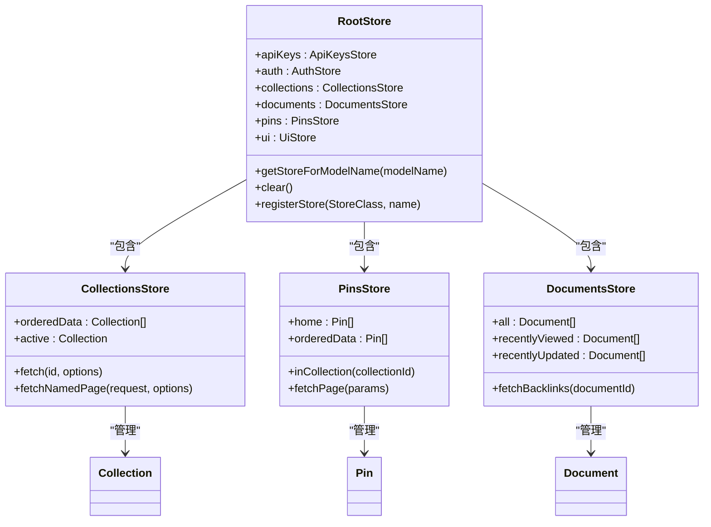
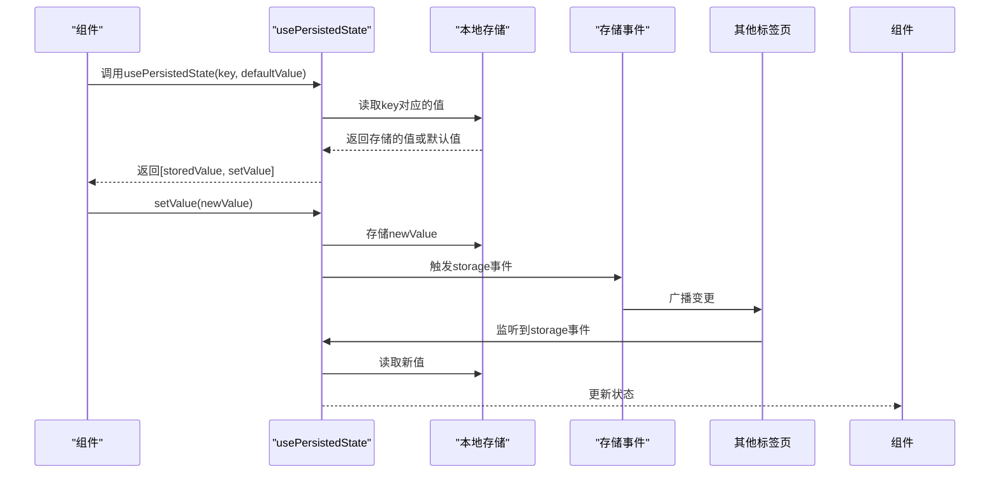
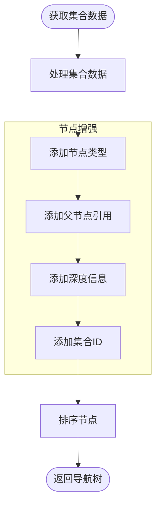
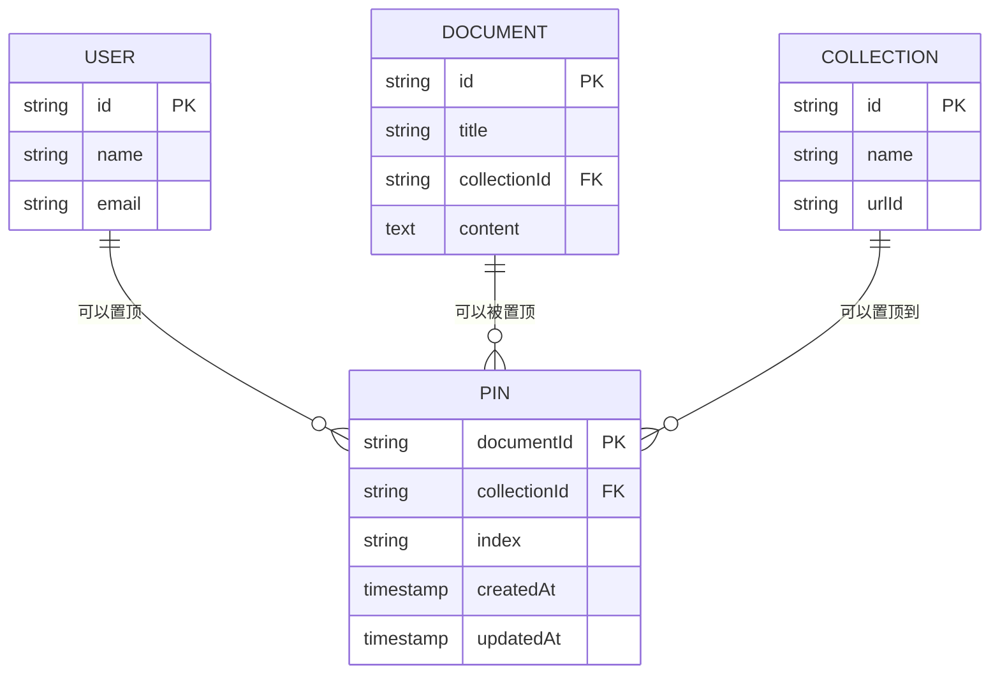

# 状态管理Hook

<cite>
**本文档中引用的文件**  
- [useStores.ts](file://app/hooks/useStores.ts)
- [usePersistedState.ts](file://app/hooks/usePersistedState.ts)
- [useCollectionTrees.ts](file://app/hooks/useCollectionTrees.ts)
- [usePinnedDocuments.ts](file://app/hooks/usePinnedDocuments.ts)
- [RootStore.ts](file://app/stores/RootStore.ts)
- [PinsStore.ts](file://app/stores/PinsStore.ts)
- [Collection.ts](file://app/models/Collection.ts)
</cite>

## 目录
1. [简介](#简介)
2. [核心状态管理Hook](#核心状态管理hook)
3. [useStores详解](#usestores详解)
4. [usePersistedState详解](#usepersistedstate详解)
5. [useCollectionTrees详解](#usecollectiontrees详解)
6. [usePinnedDocuments详解](#usepinneddocuments详解)
7. [状态同步与持久化机制](#状态同步与持久化机制)
8. [最佳实践](#最佳实践)

## 简介
baozi项目采用MobX作为状态管理库，通过自定义React Hook实现跨组件状态共享和持久化存储。本文档详细介绍了`useStores`、`usePersistedState`、`useCollectionTrees`和`usePinnedDocuments`四个核心状态管理Hook的实现原理和使用方法。这些Hook为应用提供了高效的状态管理解决方案，支持树结构管理、数据持久化和跨标签页状态同步等核心功能。

## 核心状态管理Hook
baozi项目的状态管理基于MobX和React Context构建，通过一系列自定义Hook提供简洁的API接口。这些Hook主要分为两类：基础状态管理Hook和业务逻辑Hook。基础Hook如`useStores`和`usePersistedState`提供通用的状态管理能力，而业务Hook如`useCollectionTrees`和`usePinnedDocuments`则针对特定业务场景进行封装。

**核心Hook功能概览：**
- `useStores`: 访问MobX根存储，获取所有应用状态
- `usePersistedState`: 带持久化功能的状态管理，支持跨标签页同步
- `useCollectionTrees`: 管理集合树结构，提供导航节点
- `usePinnedDocuments`: 管理置顶文档，支持本地缓存

这些Hook共同构成了baozi项目的状态管理基础设施，确保了状态的一致性和可维护性。

**Section sources**
- [useStores.ts](file://app/hooks/useStores.ts#L9-L11)
- [usePersistedState.ts](file://app/hooks/usePersistedState.ts#L39-L84)
- [useCollectionTrees.ts](file://app/hooks/useCollectionTrees.ts#L14-L86)
- [usePinnedDocuments.ts](file://app/hooks/usePinnedDocuments.ts#L8-L35)

## useStores详解
`useStores`是baozi项目中最基础的状态管理Hook，它通过React的`useContext`钩子访问MobX的根存储（RootStore）。这个Hook为所有组件提供了访问全局状态的统一入口。



**Diagram sources**
- [RootStore.ts](file://app/stores/RootStore.ts#L37-L170)
- [CollectionsStore.ts](file://app/stores/CollectionsStore.ts#L17-L254)
- [PinsStore.ts](file://app/stores/PinsStore.ts#L11-L98)

`useStores`的实现非常简洁，它直接返回从MobX Provider Context中获取的根存储实例。这种设计模式使得所有组件都能以相同的方式访问全局状态，提高了代码的一致性和可维护性。根存储（RootStore）作为所有状态存储的容器，通过构造函数注册了各个子存储，如`collections`、`documents`、`pins`等。

**关键特性：**
- **单一入口**: 所有状态访问都通过`useStores`获取
- **类型安全**: 使用TypeScript确保类型正确性
- **依赖注入**: 通过构造函数注入依赖，便于测试和扩展

**Section sources**
- [useStores.ts](file://app/hooks/useStores.ts#L9-L11)
- [RootStore.ts](file://app/stores/RootStore.ts#L37-L170)

## usePersistedState详解
`usePersistedState`是一个功能强大的状态管理Hook，它扩展了React的`useState`，增加了本地存储持久化和跨标签页同步功能。这个Hook特别适用于需要在页面刷新后保持状态或在多个浏览器标签页间同步状态的场景。



**Diagram sources**
- [usePersistedState.ts](file://app/hooks/usePersistedState.ts#L39-L84)
- [Pin.ts](file://app/models/Pin.ts#L11-L58)

`usePersistedState`的核心功能包括：
1. **初始化**: 从本地存储读取值，如果不存在则使用默认值
2. **状态更新**: 更新状态的同时同步到本地存储
3. **跨标签页同步**: 监听`storage`事件，实现多标签页状态同步
4. **键变化处理**: 当存储键变化时，自动同步新键的值

该Hook还提供了`setPersistedState`辅助函数，可以直接设置持久化状态并触发存储事件。这种设计确保了状态变更的原子性和一致性，避免了状态不同步的问题。

**使用示例：**
```typescript
// 在组件中使用
const [theme, setTheme] = usePersistedState<string>('theme', 'light');
// 状态变更会自动持久化并同步到其他标签页
setTheme('dark');
```

**Section sources**
- [usePersistedState.ts](file://app/hooks/usePersistedState.ts#L39-L84)

## useCollectionTrees详解
`useCollectionTrees`是一个专门用于管理集合树结构的Hook，它将扁平的集合数据转换为具有层级关系的导航树。这个Hook在处理复杂的树形数据结构时特别有用，如文档目录、文件系统等。



**Diagram sources**
- [useCollectionTrees.ts](file://app/hooks/useCollectionTrees.ts#L14-L86)
- [Collection.ts](file://app/models/Collection.ts#L19-L455)

`useCollectionTrees`的主要功能是将`CollectionsStore`中的集合数据转换为`NavigationNode`数组。每个节点都包含了丰富的元数据，如：
- `type`: 节点类型（集合或文档）
- `parent`: 父节点引用
- `depth`: 节点深度
- `collectionId`: 所属集合ID

这个Hook利用`useMemo`进行性能优化，只有当集合数据或文档数量变化时才会重新计算树结构。通过一系列函数式编程方法（如`map`、`filter`），它递归地构建了完整的树形结构。

**关键特性：**
- **自动排序**: 根据集合的排序规则对节点进行排序
- **层级管理**: 维护完整的父子关系链
- **性能优化**: 使用`useMemo`避免不必要的重新计算
- **响应式更新**: 当集合数据变化时自动更新树结构

**Section sources**
- [useCollectionTrees.ts](file://app/hooks/useCollectionTrees.ts#L14-L86)

## usePinnedDocuments详解
`usePinnedDocuments`是一个专门用于管理置顶文档的Hook，它结合了远程状态和本地持久化缓存，提供了高效的状态管理方案。这个Hook特别适用于需要频繁访问但不经常变更的状态。



**Diagram sources**
- [usePinnedDocuments.ts](file://app/hooks/usePinnedDocuments.ts#L8-L35)
- [PinsStore.ts](file://app/stores/PinsStore.ts#L11-L98)

`usePinnedDocuments`的核心实现包括：
1. **本地缓存**: 使用`usePersistedState`缓存置顶文档数量
2. **远程同步**: 通过`PinsStore`从服务器获取最新数据
3. **智能更新**: 只在必要时触发数据获取
4. **条件查询**: 支持按集合ID过滤置顶文档

该Hook通过`pinsCacheKey`函数生成唯一的缓存键，确保不同页面的置顶文档状态隔离。当组件挂载或集合ID变化时，它会自动从服务器获取最新数据并更新本地缓存。

**关键特性：**
- **混合存储**: 结合本地存储和远程存储
- **性能优化**: 减少不必要的网络请求
- **状态同步**: 确保本地缓存与服务器数据一致
- **灵活查询**: 支持多种查询条件

**Section sources**
- [usePinnedDocuments.ts](file://app/hooks/usePinnedDocuments.ts#L8-L35)

## 状态同步与持久化机制
baozi项目的状态管理机制建立在MobX和浏览器存储技术之上，实现了高效的状态同步和持久化。这套机制确保了应用状态在不同场景下的一致性和可靠性。

**状态同步流程：**
1. **组件层**: 组件通过Hook访问状态
2. **存储层**: MobX Store管理应用状态
3. **持久化层**: 本地存储保持状态
4. **同步层**: 事件系统实现跨标签页同步

这种分层架构使得状态管理既灵活又可靠。MobX的响应式系统确保了状态变更能自动触发UI更新，而本地存储和事件系统则保证了状态的持久性和跨标签页一致性。

**持久化策略：**
- **关键状态**: 使用`usePersistedState`进行持久化
- **临时状态**: 保留在内存中，页面刷新后重置
- **大规模数据**: 仅在需要时从服务器获取

这种策略平衡了性能和用户体验，避免了不必要的存储操作和网络请求。

**Section sources**
- [usePersistedState.ts](file://app/hooks/usePersistedState.ts#L39-L84)
- [usePinnedDocuments.ts](file://app/hooks/usePinnedDocuments.ts#L8-L35)

## 最佳实践
在使用baozi项目的状态管理Hook时，遵循以下最佳实践可以提高代码质量和应用性能：

1. **合理选择Hook**: 根据场景选择合适的Hook，避免过度使用复杂Hook
2. **性能优化**: 利用`useMemo`和`useCallback`避免不必要的重新渲染
3. **错误处理**: 为异步操作添加适当的错误处理机制
4. **类型安全**: 充分利用TypeScript的类型系统
5. **测试覆盖**: 为关键状态管理逻辑编写单元测试

对于初学者，建议从`useStores`开始，逐步理解状态管理的基本概念。对于经验丰富的开发者，可以深入研究`useCollectionTrees`和`usePinnedDocuments`的实现细节，探索更复杂的状态管理模式。

**常见问题解决方案：**
- **状态不同步**: 检查存储事件监听器是否正常工作
- **性能问题**: 使用`useMemo`优化计算密集型操作
- **类型错误**: 确保TypeScript类型定义准确
- **内存泄漏**: 注意清理事件监听器和定时器

通过遵循这些最佳实践，可以构建出高效、可靠的状态管理系统。

**Section sources**
- [useStores.ts](file://app/hooks/useStores.ts#L9-L11)
- [usePersistedState.ts](file://app/hooks/usePersistedState.ts#L39-L84)
- [useCollectionTrees.ts](file://app/hooks/useCollectionTrees.ts#L14-L86)
- [usePinnedDocuments.ts](file://app/hooks/usePinnedDocuments.ts#L8-L35)