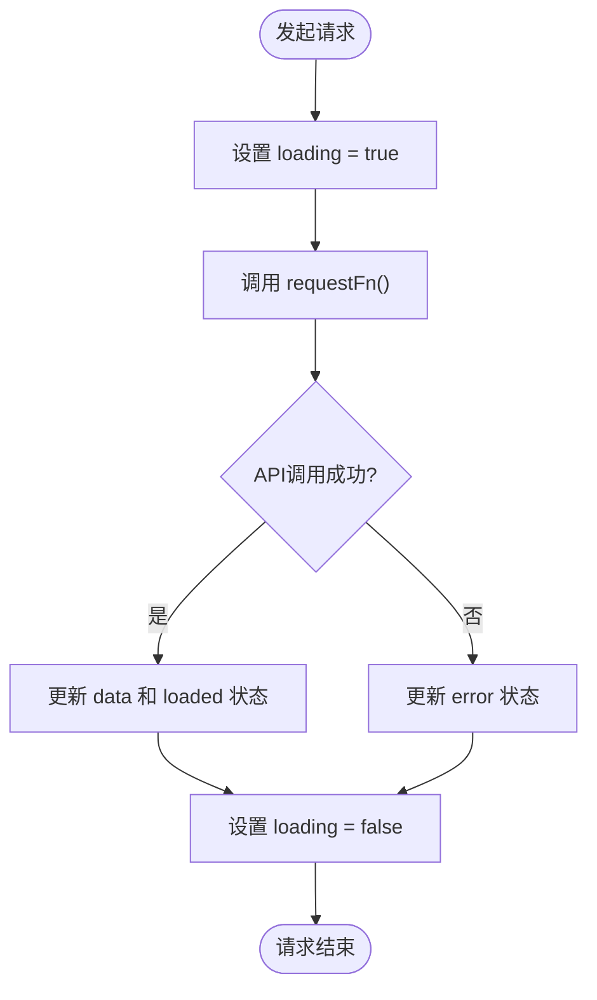
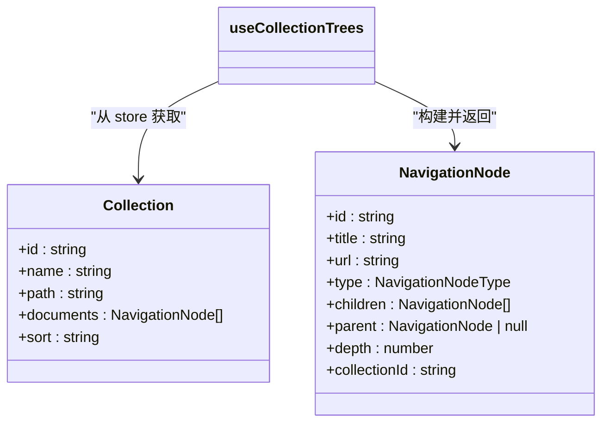
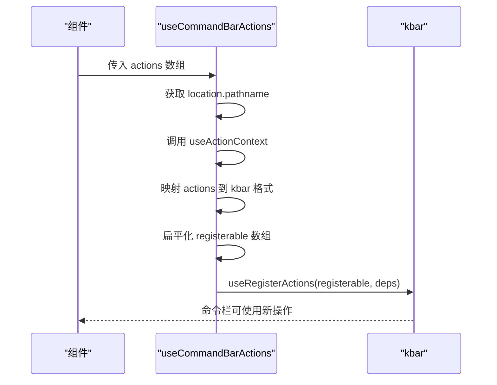

# 自定义Hook

<cite>
**本文档中引用的文件**  
- [useRequest.ts](file://app/hooks/useRequest.ts)
- [useCollectionTrees.ts](file://app/hooks/useCollectionTrees.ts)
- [useCommandBarActions.ts](file://app/hooks/useCommandBarActions.ts)
- [Collection.ts](file://app/models/Collection.ts)
- [types.ts](file://app/types.ts)
</cite>

## 目录
1. [简介](#简介)
2. [核心Hook概览](#核心Hook概览)
3. [useRequest详解](#userequest详解)
4. [useCollectionTrees详解](#usecollectiontrees详解)
5. [useCommandBarActions详解](#usecommandbaractions详解)
6. [最佳实践与使用指南](#最佳实践与使用指南)
7. [总结](#总结)

## 简介

自定义Hook是baozi项目前端架构的核心组成部分，它们通过封装可复用的逻辑和状态管理，显著提升了代码的可维护性和开发效率。这些Hook遵循React Hooks的设计原则，将复杂的业务逻辑从组件中抽离，实现了关注点分离。本文档将深入分析三个关键的自定义Hook：`useRequest`、`useCollectionTrees`和`useCommandBarActions`，阐述它们在处理API请求、管理集合树结构和集成命令栏功能方面的具体实现和应用模式。

**Section sources**
- [useRequest.ts](file://app/hooks/useRequest.ts#L1-L65)
- [useCollectionTrees.ts](file://app/hooks/useCollectionTrees.ts#L1-L87)
- [useCommandBarActions.ts](file://app/hooks/useCommandBarActions.ts#L1-L36)

## 核心Hook概览

baozi项目中的自定义Hook主要分为三大类：状态管理、数据获取和副作用处理。`useRequest`属于数据获取类Hook，专注于简化API请求的生命周期管理；`useCollectionTrees`是状态管理类Hook，负责将原始的集合数据转换为具有丰富元信息的树形结构；`useCommandBarActions`则属于副作用处理类Hook，用于动态注册和管理命令栏中的可执行操作。这些Hook共同构成了前端应用的逻辑基石，使得UI组件能够保持简洁和专注。

## useRequest详解

`useRequest`是一个通用的API请求Hook，它封装了请求过程中的加载、成功、失败等状态，为开发者提供了一个简洁的接口来处理异步操作。该Hook接收一个返回Promise的请求函数和一个布尔值参数，决定是否在组件挂载时自动发起请求。其核心实现利用了`useState`来管理数据、错误、加载和完成状态，并通过`useCallback`创建了一个可复用的`request`函数。该函数在执行时会更新加载状态，捕获可能的异常，并在组件仍然挂载的前提下更新数据和错误状态，有效避免了内存泄漏。

**Diagram sources**
- [useRequest.ts](file://app/hooks/useRequest.ts#L23-L64)

**Section sources**
- [useRequest.ts](file://app/hooks/useRequest.ts#L1-L65)

## useCollectionTrees详解

`useCollectionTrees` Hook负责将存储在`CollectionsStore`中的扁平化集合数据转换为层次化的树形结构，以便在侧边栏等UI组件中展示。它依赖于`useStores` Hook来访问全局状态，并利用`useMemo`进行性能优化，确保只有在集合数据发生变化时才重新计算树结构。该Hook的核心是一个`getCollectionTree`函数，它通过一系列递归的辅助函数（`addType`、`addParent`、`addDepth`、`addCollectionId`）为每个节点添加类型、父节点、深度和所属集合ID等元信息。最终返回一个包含所有集合根节点的数组，每个节点都包含了完整的子树信息。

**Diagram sources**
- [useCollectionTrees.ts](file://app/hooks/useCollectionTrees.ts#L14-L86)
- [Collection.ts](file://app/models/Collection.ts#L19-L455)

**Section sources**
- [useCollectionTrees.ts](file://app/hooks/useCollectionTrees.ts#L1-L87)
- [Collection.ts](file://app/models/Collection.ts#L19-L455)

## useCommandBarActions详解

`useCommandBarActions` Hook是连接应用功能与命令栏（Command Bar）的桥梁。它利用`kbar`库提供的`useRegisterActions` Hook，将传入的`Action`或`ActionV2Variant`数组转换为命令栏可识别的格式并进行注册。该Hook通过`useLocation`获取当前路由，确保命令栏的可用操作能根据页面上下文动态变化。它还接受一个额外的依赖项数组，用于控制注册的时机。内部使用`flattenDeep`对转换后的操作进行扁平化处理，然后将其ID拼接成一个字符串，作为`useRegisterActions`的依赖项，确保当操作列表发生变化时能及时更新。

**Diagram sources**
- [useCommandBarActions.ts](file://app/hooks/useCommandBarActions.ts#L13-L35)
- [types.ts](file://app/types.ts#L93-L106)

**Section sources**
- [useCommandBarActions.ts](file://app/hooks/useCommandBarActions.ts#L1-L36)
- [types.ts](file://app/types.ts#L93-L106)

## 最佳实践与使用指南

对于初学者，建议从`useRequest`开始学习，理解如何将异步逻辑封装到Hook中。使用时，只需提供一个返回Promise的函数，即可获得一个包含数据、状态和请求方法的对象。对于`useCollectionTrees`，应理解其依赖于全局状态，因此它非常适合在需要展示完整文档结构的顶级组件中使用。`useCommandBarActions`的使用则需要了解`Action`的定义，确保传入的操作具有清晰的ID、名称和执行逻辑。对于经验丰富的开发者，在创建新的自定义Hook时，应注意性能优化，如合理使用`useMemo`和`useCallback`，并确保Hook的依赖项列表完整，以避免不必要的重新渲染。

## 总结

本文档详细介绍了baozi项目中三个关键的自定义Hook：`useRequest`、`useCollectionTrees`和`useCommandBarActions`。这些Hook通过封装复杂逻辑、管理副作用和提供响应式数据，极大地简化了前端组件的开发。`useRequest`统一了API请求的处理流程，`useCollectionTrees`将数据转换为可用的树形结构，而`useCommandBarActions`则实现了功能的动态注册。遵循本文档中的最佳实践，开发者可以更高效地构建健壮且可维护的前端应用。