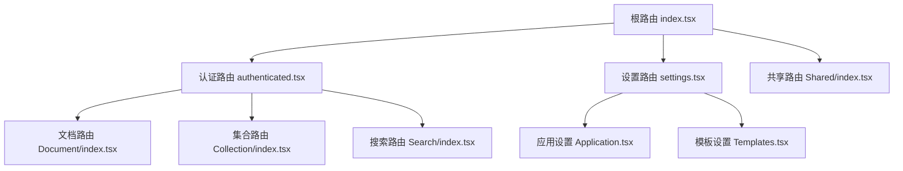
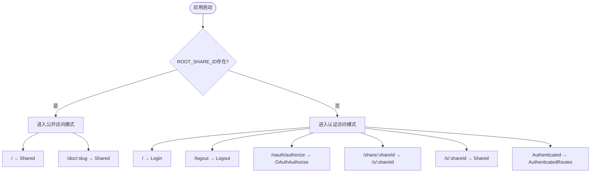
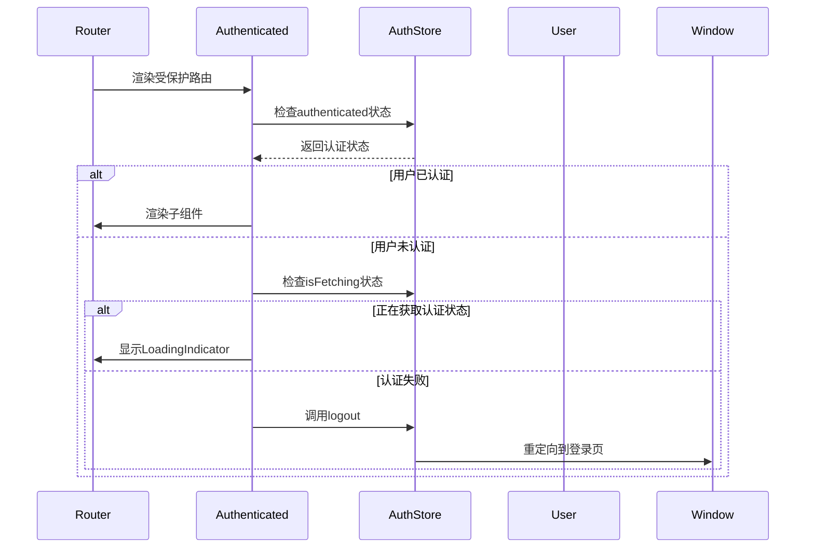
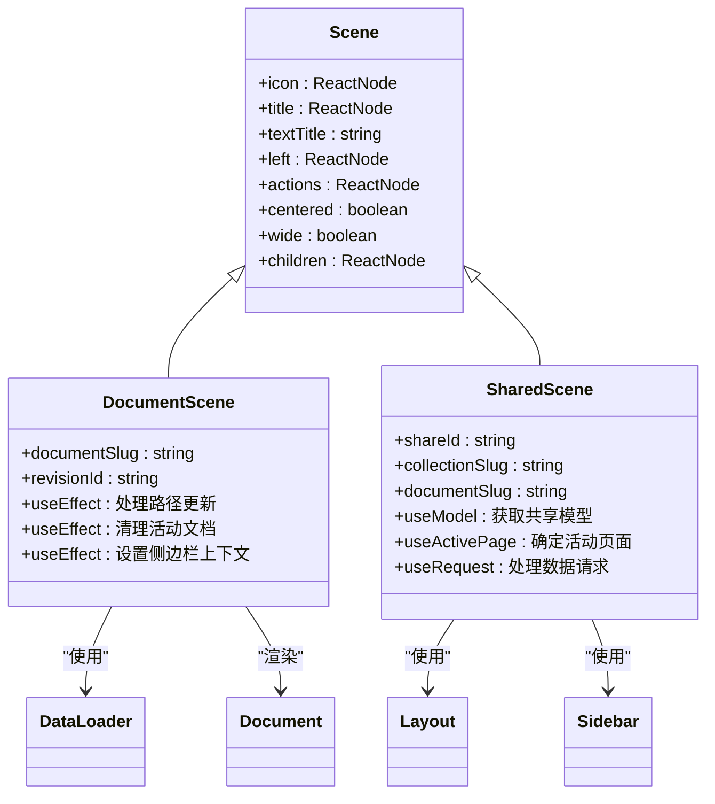
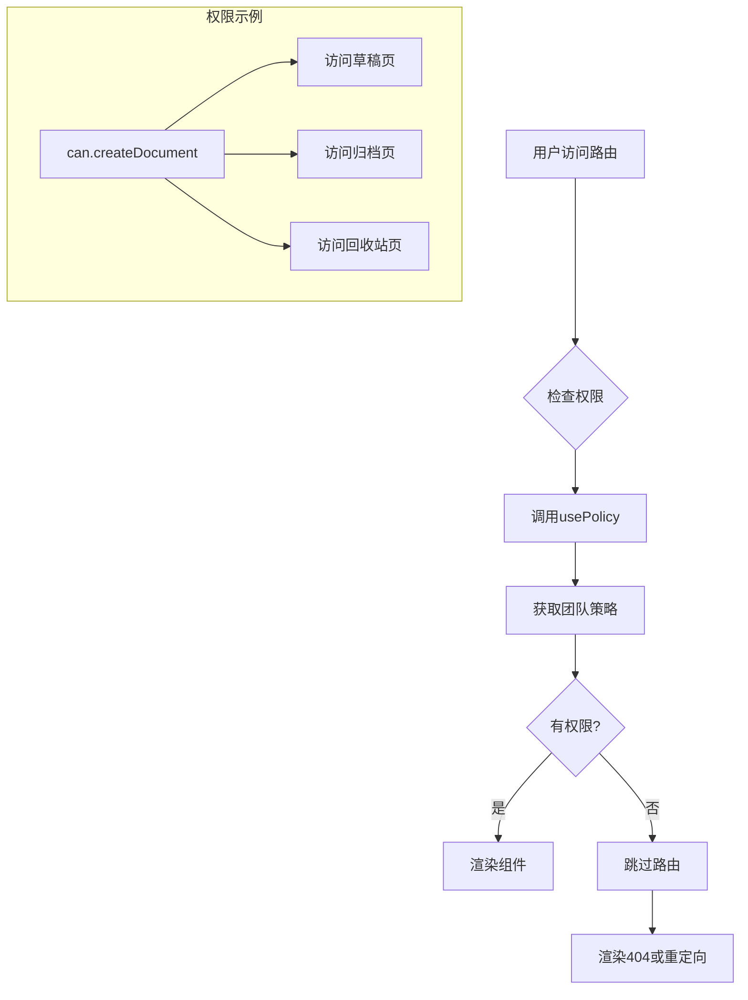
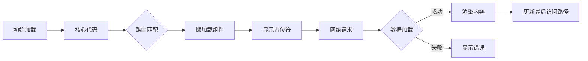

# 路由系统

<cite>
**本文档中引用的文件**  
- [index.tsx](file://app/routes/index.tsx)
- [authenticated.tsx](file://app/routes/authenticated.tsx)
- [settings.tsx](file://app/routes/settings.tsx)
- [Authenticated.tsx](file://app/components/Authenticated.tsx)
- [Scene.tsx](file://app/components/Scene.tsx)
- [Document/index.tsx](file://app/scenes/Document/index.tsx)
- [Shared/index.tsx](file://app/scenes/Shared/index.tsx)
</cite>

## 目录
1. [简介](#简介)
2. [路由架构](#路由架构)
3. [路由配置](#路由配置)
4. [路由守卫与权限控制](#路由守卫与权限控制)
5. [场景组件组织](#场景组件组织)
6. [动态路由与参数处理](#动态路由与参数处理)
7. [路由级别的权限控制](#路由级别的权限控制)
8. [代码分割与性能优化](#代码分割与性能优化)
9. [初学者使用指南](#初学者使用指南)
10. [高级优化策略](#高级优化策略)

## 简介
baozi项目的前端路由系统基于React Router构建，实现了完整的客户端路由管理。系统通过模块化设计将路由配置、权限控制和场景组件分离，支持动态加载、代码分割和细粒度的权限控制。路由系统不仅处理常规的页面导航，还实现了共享文档、设置页面和认证流程的复杂路由逻辑。

## 路由架构
baozi的路由系统采用分层架构设计，核心由三个主要路由文件组成：根路由`index.tsx`、认证路由`authenticated.tsx`和设置路由`settings.tsx`。系统使用React Router的`Switch`和`Route`组件进行路由匹配，结合`Suspense`实现组件的懒加载。路由架构支持两种主要模式：公开访问模式（通过共享链接）和认证访问模式（登录用户）。



**Diagram sources**
- [index.tsx](file://app/routes/index.tsx)
- [authenticated.tsx](file://app/routes/authenticated.tsx)
- [settings.tsx](file://app/routes/settings.tsx)

**Section sources**
- [index.tsx](file://app/routes/index.tsx#L1-L70)
- [authenticated.tsx](file://app/routes/authenticated.tsx#L1-L115)

## 路由配置
路由配置在`app/routes/index.tsx`中定义，使用React Router的声明式语法。根路由根据应用是否配置了根共享ID（ROOT_SHARE_ID）来决定路由模式。在认证模式下，未认证用户被重定向到登录页面，认证用户则进入主应用路由。路由配置使用`lazy`函数实现代码分割，确保按需加载组件。



**Diagram sources**
- [index.tsx](file://app/routes/index.tsx#L1-L70)

**Section sources**
- [index.tsx](file://app/routes/index.tsx#L1-L70)

## 路由守卫与权限控制
路由守卫通过`Authenticated`组件实现，该组件作为高阶组件包裹需要认证的路由。`Authenticated`组件使用MobX状态管理，检查用户的认证状态。如果用户未认证，组件会重定向到登录页面；如果正在获取认证状态，则显示加载指示器。守卫还处理语言切换逻辑，在用户认证后立即应用用户的首选语言。



**Diagram sources**
- [Authenticated.tsx](file://app/components/Authenticated.tsx#L13-L40)

**Section sources**
- [Authenticated.tsx](file://app/components/Authenticated.tsx#L1-L44)

## 场景组件组织
场景组件位于`app/scenes`目录下，每个主要功能都有对应的场景组件。场景组件使用`Scene`组件作为布局容器，提供统一的头部、标题和内容区域。`Scene`组件支持自定义图标、标题、左右操作按钮和居中布局。文档场景`Document/index.tsx`是典型的场景组件，它处理文档加载、历史记录和最后访问路径的更新。



**Diagram sources**
- [Scene.tsx](file://app/components/Scene.tsx#L1-L66)
- [Document/index.tsx](file://app/scenes/Document/index.tsx#L1-L76)
- [Shared/index.tsx](file://app/scenes/Shared/index.tsx#L1-L275)

**Section sources**
- [Scene.tsx](file://app/components/Scene.tsx#L1-L66)
- [Document/index.tsx](file://app/scenes/Document/index.tsx#L1-L76)

## 动态路由与参数处理
系统使用动态路由参数处理文档和集合的访问。在`authenticated.tsx`中，`matchDocumentSlug`帮助函数定义了文档slug的匹配模式。文档场景组件通过`useParams`钩子提取URL参数，并使用`useEffect`监听路径变化。为了优化性能，组件使用文档ID作为key，确保只有在文档真正改变时才重新渲染，而不是在标题改变时。

```mermaid
flowchart TD
A[URL: /doc/my-document-123] --> B{解析参数}
B --> C[documentSlug = "my-document-123"]
C --> D[分割slug获取ID]
D --> E[urlParts = ["my", "document", "123"]]
E --> F[urlId = "123"]
F --> G[使用urlId作为组件key]
G --> H[渲染Document组件]
H --> I{URL变化?}
I --> |是| J[比较新旧urlId]
J --> |不同| K[重新渲染]
J --> |相同| L[保持现有状态]
```

**Diagram sources**
- [authenticated.tsx](file://app/routes/authenticated.tsx#L1-L115)
- [Document/index.tsx](file://app/scenes/Document/index.tsx#L1-L76)

**Section sources**
- [authenticated.tsx](file://app/routes/authenticated.tsx#L1-L115)
- [Document/index.tsx](file://app/scenes/Document/index.tsx#L1-L76)

## 路由级别的权限控制
权限控制在路由级别通过`usePolicy`钩子实现。在`authenticated.tsx`中，`can`对象根据当前团队的策略决定用户是否有权限访问特定路由。例如，只有具有创建文档权限的用户才能访问草稿、归档和回收站页面。这种基于策略的权限控制确保了路由级别的安全性，防止未经授权的访问。



**Diagram sources**
- [authenticated.tsx](file://app/routes/authenticated.tsx#L1-L115)

**Section sources**
- [authenticated.tsx](file://app/routes/authenticated.tsx#L1-L115)

## 代码分割与性能优化
路由系统通过多种技术实现性能优化。首先，使用`lazy`和`Suspense`实现代码分割，将不同功能的代码打包到独立的chunk中。其次，使用`DelayedMount`组件延迟非关键内容的加载，避免阻塞主线程。最后，通过`useLastVisitedPath`钩子记忆用户最后访问的路径，提升用户体验。加载状态使用`FullscreenLoading`和`PlaceholderDocument`组件提供流畅的过渡效果。



**Diagram sources**
- [index.tsx](file://app/routes/index.tsx#L1-L70)
- [authenticated.tsx](file://app/routes/authenticated.tsx#L1-L115)

**Section sources**
- [index.tsx](file://app/routes/index.tsx#L1-L70)
- [authenticated.tsx](file://app/routes/authenticated.tsx#L1-L115)

## 初学者使用指南
对于初学者，理解baozi路由系统的关键是掌握三个核心概念：路由配置、场景组件和路由守卫。首先，所有路由配置都位于`app/routes`目录下，根路由`index.tsx`是入口点。其次，每个页面对应一个场景组件，位于`app/scenes`目录下，这些组件负责页面的具体渲染。最后，`Authenticated`组件作为路由守卫，确保只有登录用户才能访问受保护的页面。建议从阅读`index.tsx`和`authenticated.tsx`开始，理解路由的组织结构。

## 高级优化策略
对于经验丰富的开发者，可以进一步优化路由性能。首先，分析路由的加载顺序，确保关键路径的组件优先加载。其次，监控网络请求，优化数据预取策略。可以考虑实现路由预加载，在用户悬停导航链接时提前加载对应组件。此外，可以优化`useEffect`的依赖数组，避免不必要的重新渲染。对于复杂的设置页面，可以进一步拆分`settings.tsx`中的路由配置，实现更细粒度的代码分割。