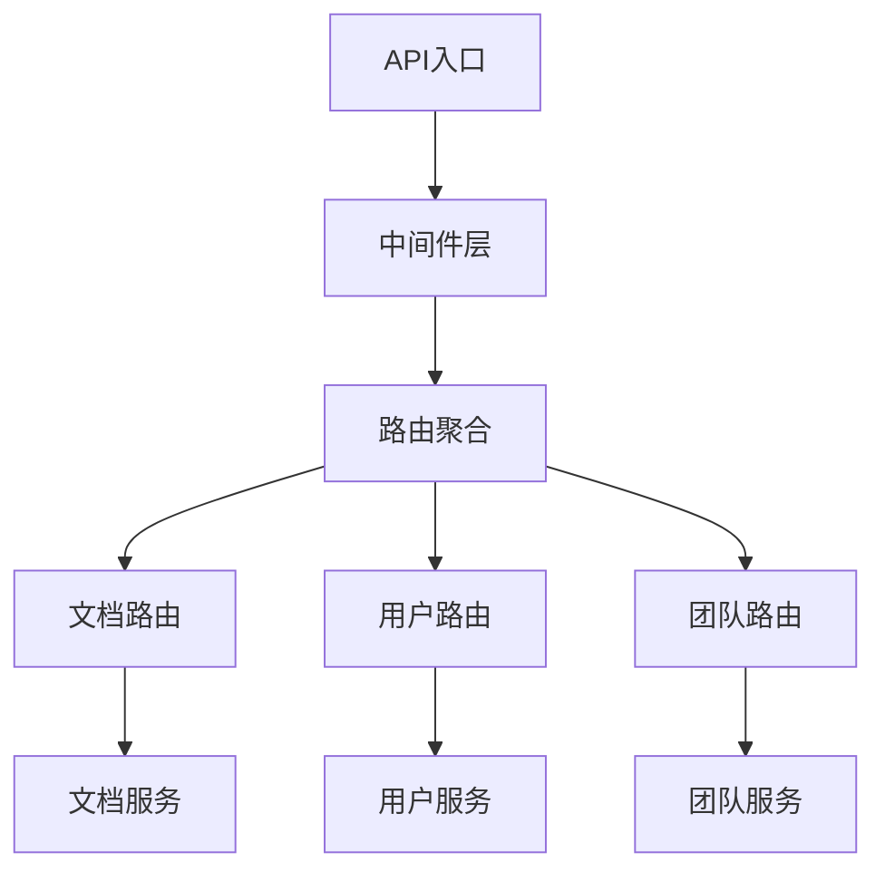
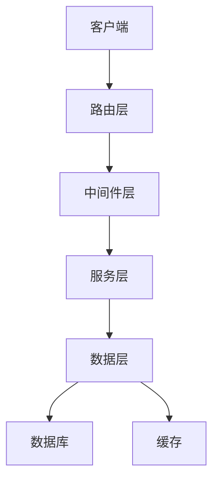
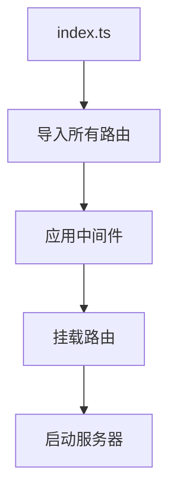
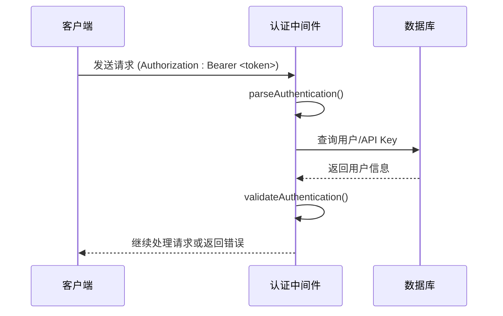
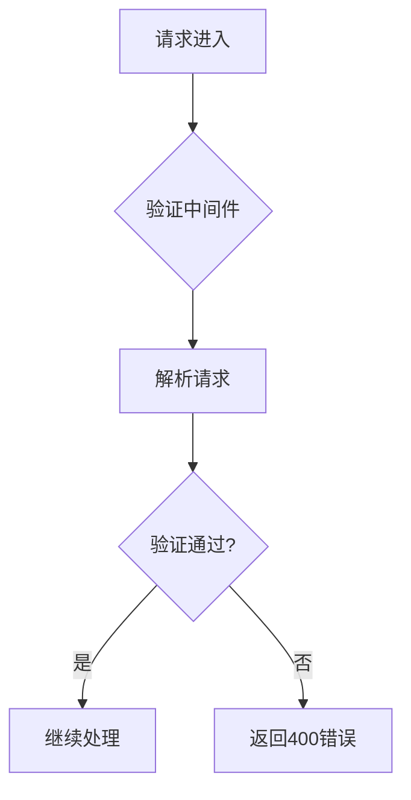
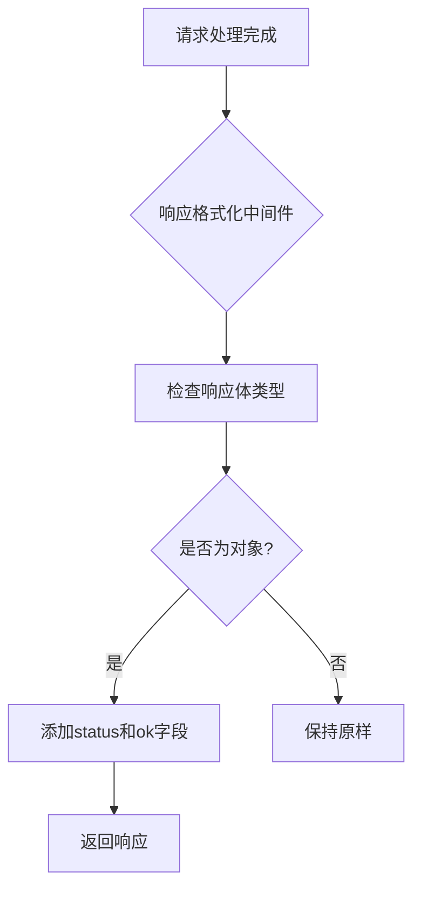
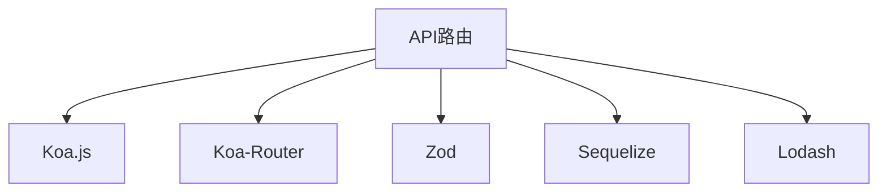

# API路由

<cite>
**本文档中引用的文件**  
- [index.ts](file://server/routes/api/index.ts)
- [authentication.ts](file://server/middlewares/authentication.ts)
- [apiResponse.ts](file://server/routes/api/middlewares/apiResponse.ts)
- [validate.ts](file://server/middlewares/validate.ts)
- [documents.ts](file://server/routes/api/documents/documents.ts)
- [users.ts](file://server/routes/api/users/users.ts)
- [schema.ts](file://server/routes/api/schema.ts)
- [documents/schema.ts](file://server/routes/api/documents/schema.ts)
- [users/schema.ts](file://server/routes/api/users/schema.ts)
</cite>

## 目录
1. [简介](#简介)
2. [项目结构](#项目结构)
3. [核心组件](#核心组件)
4. [架构概述](#架构概述)
5. [详细组件分析](#详细组件分析)
6. [依赖分析](#依赖分析)
7. [性能考虑](#性能考虑)
8. [故障排除指南](#故障排除指南)
9. [结论](#结论)

## 简介
本文档详细介绍了基于Koa.js的baozi项目RESTful API设计。重点阐述了路由组织结构、请求处理流程和中间件集成。解释了`/api`路径下的各个资源端点（如文档、用户、团队等）如何通过`index.ts`文件聚合，并使用统一的中间件进行请求验证、错误处理和响应格式化。结合实际代码示例，展示了请求从进入路由到调用服务层的完整生命周期。为初学者提供路由匹配和请求分发的概念性解释，同时为经验丰富的开发者提供性能优化建议和安全最佳实践。

## 项目结构
baozi项目的API路由位于`server/routes/api/`目录下，采用模块化设计，每个资源（如文档、用户、团队）都有独立的路由文件。这些路由通过`index.ts`文件聚合，并应用统一的中间件。API路由使用Koa.js框架，结合Koa-Router进行路由管理。

**图示来源**
- [index.ts](file://server/routes/api/index.ts#L1-L135)

**本节来源**
- [index.ts](file://server/routes/api/index.ts#L1-L135)

## 核心组件
API路由的核心组件包括路由聚合器、认证中间件、请求验证中间件和响应格式化中间件。这些组件共同构成了API的基础设施，确保了请求的安全性、一致性和可维护性。

**本节来源**
- [index.ts](file://server/routes/api/index.ts#L1-L135)
- [authentication.ts](file://server/middlewares/authentication.ts#L1-L279)
- [apiResponse.ts](file://server/routes/api/middlewares/apiResponse.ts#L1-L26)

## 架构概述
baozi项目的API架构采用分层设计，从上到下依次为：路由层、中间件层、服务层和数据层。路由层负责请求分发，中间件层处理通用逻辑（如认证、验证），服务层实现业务逻辑，数据层负责数据持久化。

**图示来源**
- [index.ts](file://server/routes/api/index.ts#L1-L135)
- [authentication.ts](file://server/middlewares/authentication.ts#L1-L279)

## 详细组件分析

### 路由聚合分析
路由聚合是通过`server/routes/api/index.ts`文件实现的。该文件导入所有资源路由，并通过Koa-Router的`use`方法将它们挂载到主路由上。这种方式使得路由管理更加模块化和可维护。

**图示来源**
- [index.ts](file://server/routes/api/index.ts#L1-L135)

**本节来源**
- [index.ts](file://server/routes/api/index.ts#L1-L135)

### 认证中间件分析
认证中间件`authentication.ts`负责处理所有请求的认证逻辑。它支持多种认证方式，包括Bearer Token、API Key和Cookie。中间件通过`parseAuthentication`函数解析认证信息，并通过`validateAuthentication`函数验证其有效性。

**图示来源**
- [authentication.ts](file://server/middlewares/authentication.ts#L1-L279)

**本节来源**
- [authentication.ts](file://server/middlewares/authentication.ts#L1-L279)

### 请求验证分析
请求验证通过Zod库实现，定义在各个资源的`schema.ts`文件中。验证中间件`validate.ts`在请求进入具体处理函数前，对请求体、查询参数等进行验证，确保数据的完整性和正确性。

**图示来源**
- [validate.ts](file://server/middlewares/validate.ts#L1-L23)
- [schema.ts](file://server/routes/api/schema.ts#L1-L30)

**本节来源**
- [validate.ts](file://server/middlewares/validate.ts#L1-L23)
- [schema.ts](file://server/routes/api/schema.ts#L1-L30)

### 响应格式化分析
响应格式化中间件`apiResponse.ts`确保所有API响应都遵循统一的格式。它在请求处理完成后，自动将响应体包装成包含`status`和`ok`字段的JSON对象，提高了API的一致性和可预测性。

**图示来源**
- [apiResponse.ts](file://server/routes/api/middlewares/apiResponse.ts#L1-L26)

**本节来源**
- [apiResponse.ts](file://server/routes/api/middlewares/apiResponse.ts#L1-L26)

## 依赖分析
API路由依赖于多个核心模块，包括Koa.js框架、Koa-Router、Zod验证库和Sequelize ORM。这些依赖通过`package.json`文件管理，并在代码中通过ES6模块语法导入。

**图示来源**
- [index.ts](file://server/routes/api/index.ts#L1-L135)
- [package.json](file://package.json#L1-L100)

**本节来源**
- [index.ts](file://server/routes/api/index.ts#L1-L135)
- [package.json](file://package.json#L1-L100)

## 性能考虑
为了提高API性能，项目采用了多种优化策略。包括使用Redis作为缓存层、对数据库查询进行索引优化、以及使用流式响应处理大文件下载。此外，通过`rateLimiter`中间件防止API滥用，确保服务的稳定性。

**本节来源**
- [index.ts](file://server/routes/api/index.ts#L1-L135)
- [authentication.ts](file://server/middlewares/authentication.ts#L1-L279)

## 故障排除指南
当API出现问题时，可以按照以下步骤进行排查：
1. 检查请求的认证信息是否正确
2. 验证请求体是否符合API文档的定义
3. 查看服务器日志中的错误信息
4. 检查数据库连接是否正常
5. 确认Redis服务是否运行

**本节来源**
- [errors.ts](file://server/errors.ts#L1-L50)
- [onerror.ts](file://server/onerror.ts#L1-L30)

## 结论
baozi项目的API路由设计体现了现代Web应用的最佳实践。通过模块化路由、统一的中间件和严格的请求验证，构建了一个安全、可靠且易于维护的API系统。对于初学者，理解路由匹配和请求分发的概念是掌握API设计的关键；对于经验丰富的开发者，关注性能优化和安全最佳实践将有助于构建更高质量的应用。