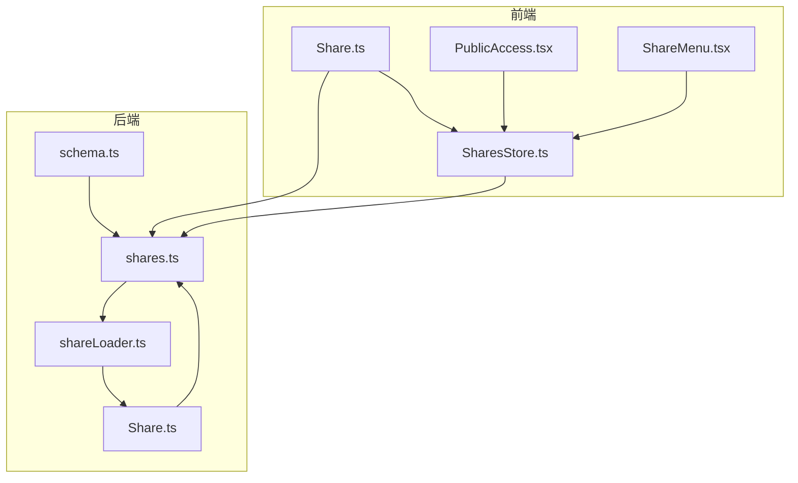
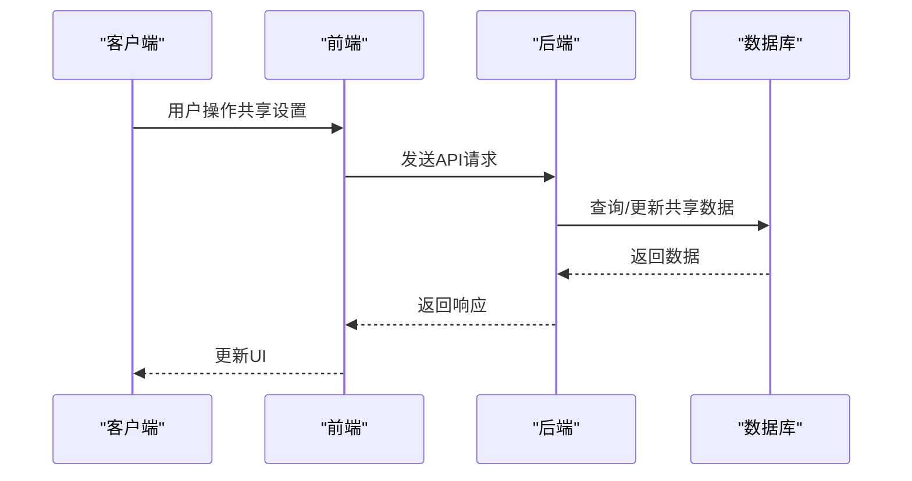
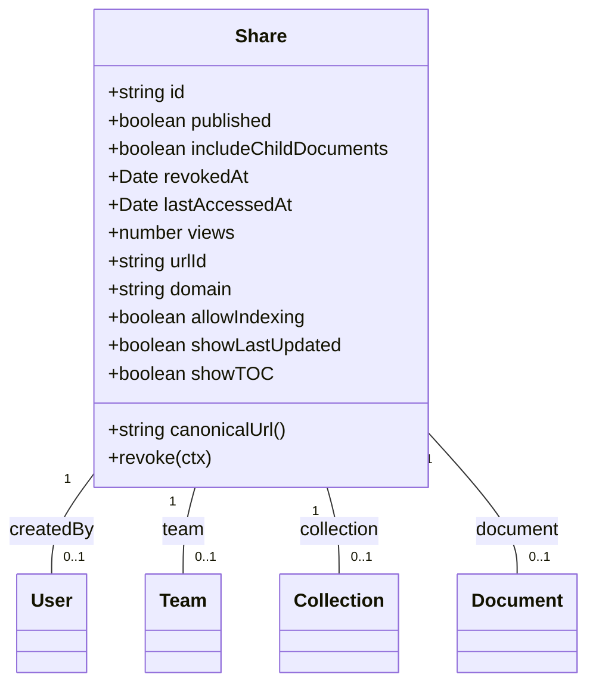
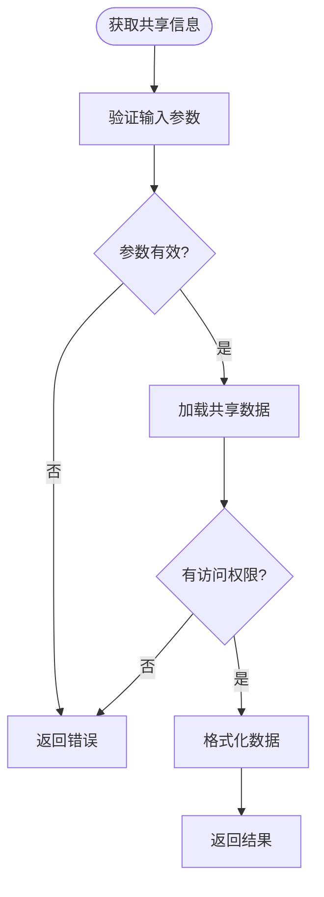
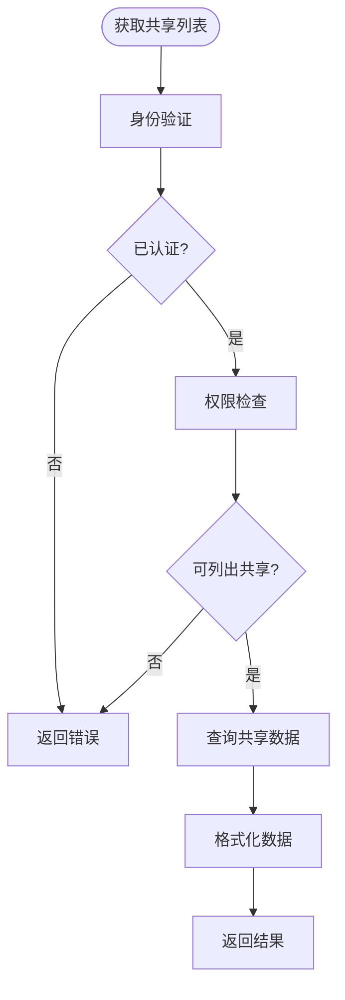
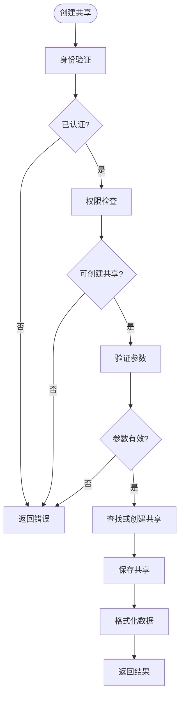
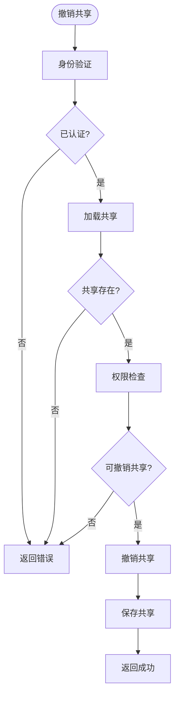
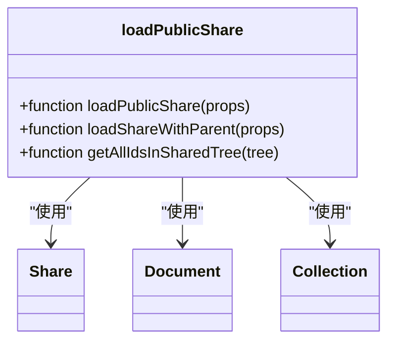
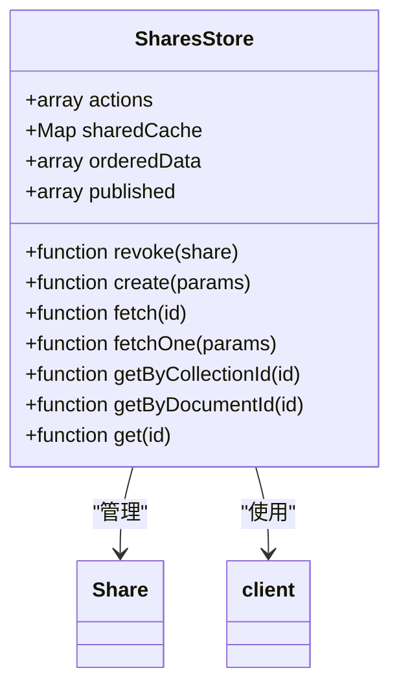
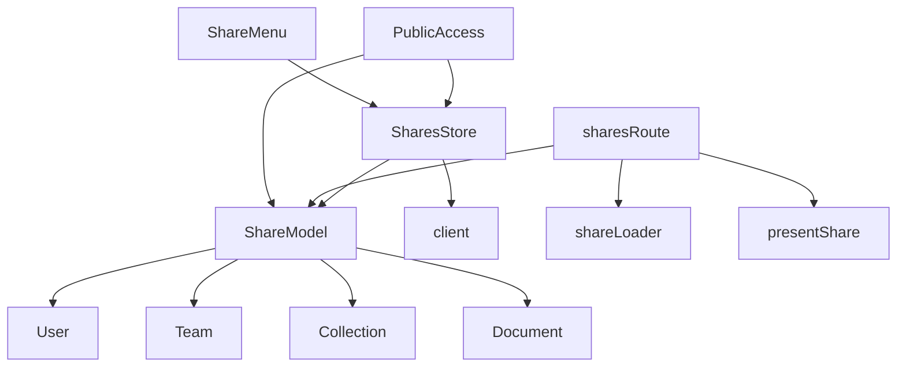

# 共享API

<cite>
**本文档中引用的文件**  
- [Share.ts](file://app/models/Share.ts)
- [shares.ts](file://server/routes/api/shares/shares.ts)
- [Share.ts](file://server/models/Share.ts)
- [SharesStore.ts](file://app/stores/SharesStore.ts)
- [shareLoader.ts](file://server/commands/shareLoader.ts)
- [PublicAccess.tsx](file://app/components/Sharing/Document/PublicAccess.tsx)
- [PublicAccess.tsx](file://app/components/Sharing/Collection/PublicAccess.tsx)
- [schema.ts](file://server/routes/api/shares/schema.ts)
</cite>

## 目录
1. [简介](#简介)
2. [项目结构](#项目结构)
3. [核心组件](#核心组件)
4. [架构概述](#架构概述)
5. [详细组件分析](#详细组件分析)
6. [依赖分析](#依赖分析)
7. [性能考虑](#性能考虑)
8. [故障排除指南](#故障排除指南)
9. [结论](#结论)

## 简介
本文档详细介绍了baozi项目中与文档和集合共享相关的RESTful端点。重点阐述了共享链接创建、权限设置、访问控制等操作的实现细节，包括请求参数、响应格式和安全验证机制。通过实际代码示例，展示了共享管理的完整流程。为初学者提供内容共享的基本概念，同时为经验丰富的开发者提供安全令牌管理、访问日志和性能优化的最佳实践。

## 项目结构
baozi项目的共享功能主要分布在以下几个目录中：
- `app/models/`：包含前端模型定义，如Share模型
- `server/models/`：包含后端模型定义，如Share模型
- `server/routes/api/shares/`：包含共享相关的API路由和控制器
- `app/stores/`：包含共享状态管理
- `app/components/Sharing/`：包含共享相关的UI组件

**图表来源**
- [Share.ts](file://app/models/Share.ts)
- [SharesStore.ts](file://app/stores/SharesStore.ts)
- [shares.ts](file://server/routes/api/shares/shares.ts)
- [shareLoader.ts](file://server/commands/shareLoader.ts)
- [Share.ts](file://server/models/Share.ts)
- [schema.ts](file://server/routes/api/shares/schema.ts)

**章节来源**
- [app/models/Share.ts](file://app/models/Share.ts)
- [server/models/Share.ts](file://server/models/Share.ts)
- [server/routes/api/shares/shares.ts](file://server/routes/api/shares/shares.ts)

## 核心组件
共享功能的核心组件包括：
- **Share模型**：定义共享实体的数据结构和行为
- **SharesStore**：管理共享状态和业务逻辑
- **shares路由**：处理共享相关的API请求
- **shareLoader**：加载共享数据的命令
- **PublicAccess组件**：提供共享设置的UI界面

**章节来源**
- [Share.ts](file://app/models/Share.ts)
- [SharesStore.ts](file://app/stores/SharesStore.ts)
- [shares.ts](file://server/routes/api/shares/shares.ts)
- [shareLoader.ts](file://server/commands/shareLoader.ts)
- [PublicAccess.tsx](file://app/components/Sharing/Document/PublicAccess.tsx)

## 架构概述
共享功能的架构分为前端和后端两部分，通过RESTful API进行通信。前端使用MobX进行状态管理，后端使用Koa框架处理HTTP请求。

**图表来源**
- [shares.ts](file://server/routes/api/shares/shares.ts)
- [SharesStore.ts](file://app/stores/SharesStore.ts)

## 详细组件分析

### Share模型分析
Share模型是共享功能的核心数据结构，定义了共享实体的属性和关系。

**图表来源**
- [Share.ts](file://app/models/Share.ts)
- [Share.ts](file://server/models/Share.ts)

**章节来源**
- [Share.ts](file://app/models/Share.ts)
- [Share.ts](file://server/models/Share.ts)

### API端点分析
共享功能提供了多个RESTful端点，用于管理共享链接的创建、更新、撤销等操作。

#### 共享信息获取
获取共享链接的详细信息。

**图表来源**
- [shares.ts](file://server/routes/api/shares/shares.ts#L13-L108)

#### 共享列表获取
获取用户可访问的共享链接列表。

**图表来源**
- [shares.ts](file://server/routes/api/shares/shares.ts#L110-L158)

#### 共享创建
创建新的共享链接。

**图表来源**
- [shares.ts](file://server/routes/api/shares/shares.ts#L160-L229)

#### 共享更新
更新现有共享链接的设置。

**图表来源**
- [shares.ts](file://server/routes/api/shares/shares.ts#L237-L297)

#### 共享撤销
撤销现有的共享链接。

**图表来源**
- [shares.ts](file://server/routes/api/shares/shares.ts#L300-L322)

**章节来源**
- [shares.ts](file://server/routes/api/shares/shares.ts)

### 共享加载器分析
shareLoader模块负责加载共享数据，包括公开共享和带父级的共享。

**图表来源**
- [shareLoader.ts](file://server/commands/shareLoader.ts)

**章节来源**
- [shareLoader.ts](file://server/commands/shareLoader.ts)

### 共享存储分析
SharesStore负责管理前端的共享状态，包括数据获取、创建、更新和删除操作。

**图表来源**
- [SharesStore.ts](file://app/stores/SharesStore.ts)

**章节来源**
- [SharesStore.ts](file://app/stores/SharesStore.ts)

## 依赖分析
共享功能依赖于多个其他模块和组件，形成了复杂的依赖关系网络。

**图表来源**
- [Share.ts](file://app/models/Share.ts)
- [SharesStore.ts](file://app/stores/SharesStore.ts)
- [shares.ts](file://server/routes/api/shares/shares.ts)
- [shareLoader.ts](file://server/commands/shareLoader.ts)
- [PublicAccess.tsx](file://app/components/Sharing/Document/PublicAccess.tsx)
- [ShareMenu.tsx](file://app/menus/ShareMenu.tsx)

## 性能考虑
共享功能在设计时考虑了多个性能优化点：

1. **缓存机制**：SharesStore使用sharedCache来缓存共享数据，减少重复请求。
2. **批量操作**：API端点支持批量获取和更新共享数据。
3. **索引优化**：数据库表设计了适当的索引以提高查询性能。
4. **懒加载**：相关数据按需加载，避免一次性加载过多数据。
5. **分页支持**：共享列表支持分页，避免返回大量数据。

## 故障排除指南
在使用共享功能时可能遇到以下常见问题：

1. **无法创建共享链接**：检查用户是否有创建共享的权限。
2. **共享链接无法访问**：检查共享是否已发布且未被撤销。
3. **权限错误**：确保用户对要共享的文档或集合有读取权限。
4. **URL ID冲突**：确保自定义URL ID是唯一的。
5. **性能问题**：检查数据库索引是否正确设置，考虑使用缓存。

**章节来源**
- [shares.ts](file://server/routes/api/shares/shares.ts)
- [Share.ts](file://server/models/Share.ts)
- [SharesStore.ts](file://app/stores/SharesStore.ts)

## 结论
baozi项目的共享API提供了一套完整的文档和集合共享功能，支持创建、管理、撤销共享链接，并提供了丰富的权限控制选项。通过RESTful API和前端组件的配合，实现了灵活的共享管理界面。系统设计考虑了性能优化和安全性，为用户提供了一个可靠的内容共享解决方案。