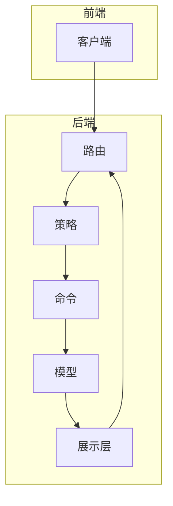
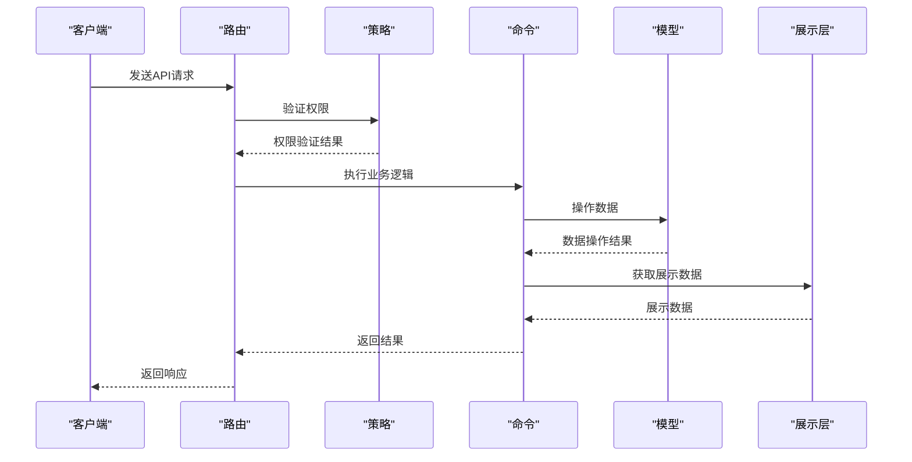
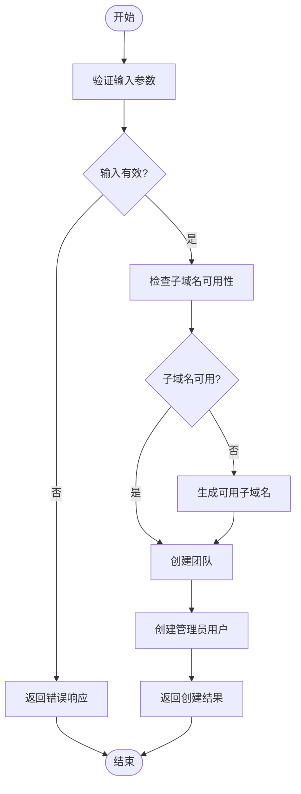
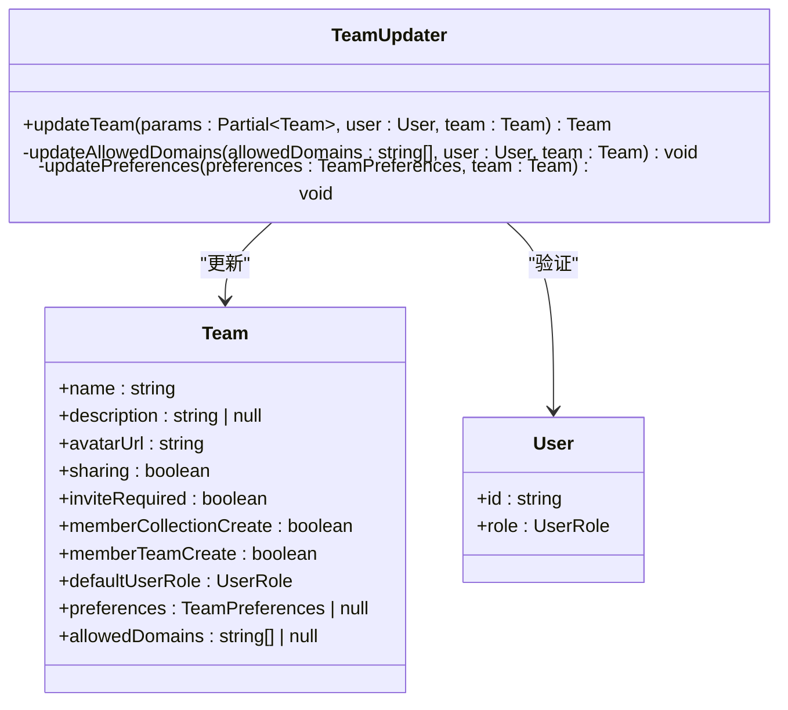
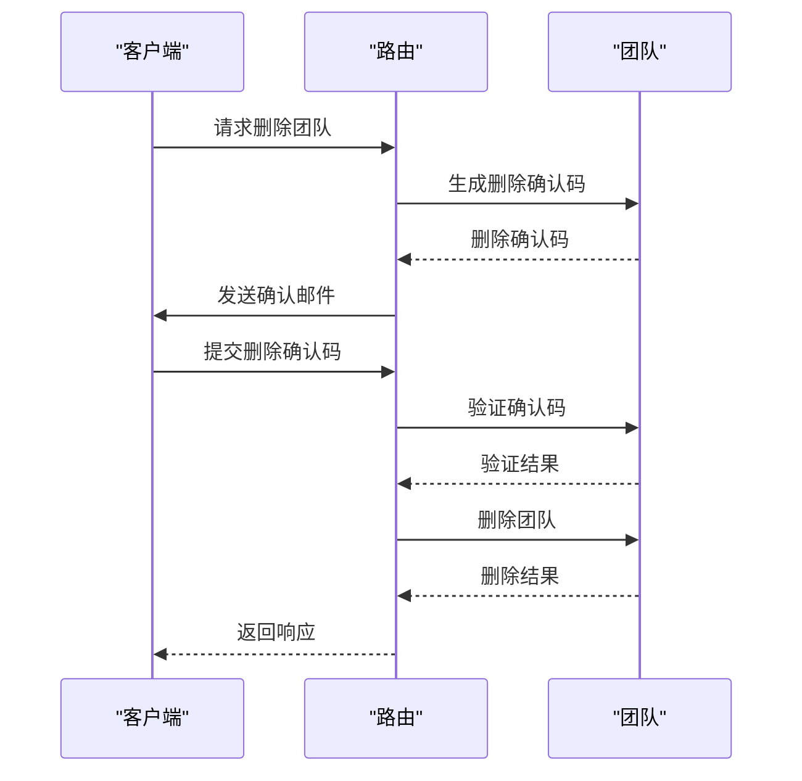
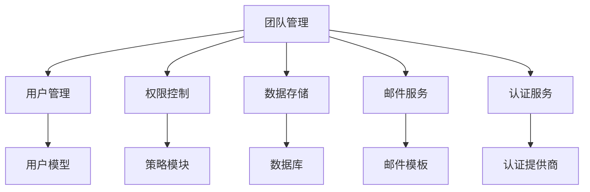

# 团队API

<cite>
**本文档中引用的文件**  
- [teams.ts](file://server/routes/api/teams/teams.ts)
- [schema.ts](file://server/routes/api/teams/schema.ts)
- [team.ts](file://server/models/Team.ts)
- [teamCreator.ts](file://server/commands/teamCreator.ts)
- [teamUpdater.ts](file://server/commands/teamUpdater.ts)
- [teamPermanentDeleter.ts](file://server/commands/teamPermanentDeleter.ts)
- [team.ts](file://server/policies/team.ts)
- [team.ts](file://server/presenters/team.ts)
</cite>

## 目录
1. [简介](#简介)
2. [项目结构](#项目结构)
3. [核心组件](#核心组件)
4. [架构概述](#架构概述)
5. [详细组件分析](#详细组件分析)
6. [依赖分析](#依赖分析)
7. [性能考虑](#性能考虑)
8. [故障排除指南](#故障排除指南)
9. [结论](#结论)
10. [附录](#附录)（如有必要）

## 简介
本文档详细介绍了baozi项目中的团队管理API，重点涵盖团队创建、成员管理、权限分配等RESTful端点。文档深入解析了团队生命周期管理的实现细节，包括请求参数、响应格式和业务规则验证。通过实际代码示例，展示了团队从创建到删除的完整流程。为初学者提供团队协作的基本概念，同时为经验丰富的开发者提供团队层级结构、权限继承和性能优化的最佳实践。

## 项目结构
团队管理功能分布在服务器端的多个模块中，主要包括路由、模型、命令、策略和展示层。前端通过API客户端与这些端点交互，实现团队管理功能。

**Diagram sources**
- [teams.ts](file://server/routes/api/teams/teams.ts#L1-L168)
- [team.ts](file://server/policies/team.ts#L1-L61)
- [teamCreator.ts](file://server/commands/teamCreator.ts#L1-L89)
- [team.ts](file://server/models/Team.ts#L1-L477)
- [team.ts](file://server/presenters/team.ts#L1-L24)

**Section sources**
- [teams.ts](file://server/routes/api/teams/teams.ts#L1-L168)
- [team.ts](file://server/models/Team.ts#L1-L477)

## 核心组件
团队管理API的核心组件包括团队模型、创建/更新/删除命令、权限策略和数据展示层。这些组件协同工作，确保团队管理操作的安全性和一致性。

**Section sources**
- [team.ts](file://server/models/Team.ts#L1-L477)
- [teamCreator.ts](file://server/commands/teamCreator.ts#L1-L89)
- [teamUpdater.ts](file://server/commands/teamUpdater.ts#L1-L69)
- [teamPermanentDeleter.ts](file://server/commands/teamPermanentDeleter.ts#L1-L212)

## 架构概述
团队管理API采用分层架构，从路由层接收请求，经过策略层验证权限，由命令层执行业务逻辑，最终通过模型层操作数据。展示层负责将数据转换为适合前端消费的格式。

**Diagram sources**
- [teams.ts](file://server/routes/api/teams/teams.ts#L1-L168)
- [team.ts](file://server/policies/team.ts#L1-L61)
- [teamCreator.ts](file://server/commands/teamCreator.ts#L1-L89)
- [teamUpdater.ts](file://server/commands/teamUpdater.ts#L1-L69)
- [team.ts](file://server/models/Team.ts#L1-L477)
- [team.ts](file://server/presenters/team.ts#L1-L24)

## 详细组件分析
### 团队创建分析
团队创建功能允许用户创建新的团队，包括设置团队名称、子域名、头像等基本信息。该功能还支持从现有团队继承认证提供商。

#### 团队创建流程

**Diagram sources**
- [teamCreator.ts](file://server/commands/teamCreator.ts#L1-L89)
- [teams.ts](file://server/routes/api/teams/teams.ts#L130-L167)

**Section sources**
- [teamCreator.ts](file://server/commands/teamCreator.ts#L1-L89)
- [teams.ts](file://server/routes/api/teams/teams.ts#L130-L167)

### 团队更新分析
团队更新功能允许管理员修改团队的各种属性，包括名称、描述、权限设置等。该功能还支持管理允许登录的域名列表。

#### 团队更新流程

**Diagram sources**
- [teamUpdater.ts](file://server/commands/teamUpdater.ts#L1-L69)
- [team.ts](file://server/models/Team.ts#L1-L477)

**Section sources**
- [teamUpdater.ts](file://server/commands/teamUpdater.ts#L1-L69)
- [team.ts](file://server/models/Team.ts#L1-L477)

### 团队删除分析
团队删除功能提供安全的团队删除机制，包括请求删除和确认删除两个步骤，确保不会意外删除团队。

#### 团队删除流程

**Diagram sources**
- [teams.ts](file://server/routes/api/teams/teams.ts#L50-L128)
- [team.ts](file://server/models/Team.ts#L1-L477)

**Section sources**
- [teams.ts](file://server/routes/api/teams/teams.ts#L50-L128)
- [team.ts](file://server/models/Team.ts#L1-L477)

## 依赖分析
团队管理功能依赖于多个核心模块，包括用户管理、权限控制、数据存储和邮件服务。这些依赖确保了团队管理操作的安全性和可靠性。

**Diagram sources**
- [team.ts](file://server/models/Team.ts#L1-L477)
- [teamCreator.ts](file://server/commands/teamCreator.ts#L1-L89)
- [teamUpdater.ts](file://server/commands/teamUpdater.ts#L1-L69)
- [teamPermanentDeleter.ts](file://server/commands/teamPermanentDeleter.ts#L1-L212)

**Section sources**
- [team.ts](file://server/models/Team.ts#L1-L477)
- [teamCreator.ts](file://server/commands/teamCreator.ts#L1-L89)
- [teamUpdater.ts](file://server/commands/teamUpdater.ts#L1-L69)
- [teamPermanentDeleter.ts](file://server/commands/teamPermanentDeleter.ts#L1-L212)

## 性能考虑
团队管理API在设计时考虑了性能优化，包括使用事务确保数据一致性、批量处理大量数据、缓存常用数据等。这些优化确保了在高并发场景下的稳定性能。

## 故障排除指南
### 常见问题
- **团队创建失败**：检查子域名是否已被使用或包含无效字符
- **权限不足**：确保当前用户具有管理员权限
- **域名冲突**：检查自定义域名是否已被其他团队使用
- **邮件发送失败**：检查邮件服务配置是否正确

**Section sources**
- [teams.ts](file://server/routes/api/teams/teams.ts#L1-L168)
- [team.ts](file://server/models/Team.ts#L1-L477)

## 结论
团队管理API提供了完整的团队生命周期管理功能，从创建、更新到删除，每个操作都经过精心设计，确保安全性和可靠性。通过分层架构和模块化设计，API易于维护和扩展。为开发者提供了清晰的接口和详细的文档，便于集成和使用。

## 附录
### API端点列表
| 端点 | 方法 | 描述 |
|------|------|------|
| `/api/team.update` | POST | 更新团队信息 |
| `/api/teams.requestDelete` | POST | 请求删除团队 |
| `/api/teams.delete` | POST | 确认删除团队 |
| `/api/teams.create` | POST | 创建新团队 |

### 团队模型字段
| 字段 | 类型 | 描述 |
|------|------|------|
| name | string | 团队名称 |
| description | string | 团队描述 |
| avatarUrl | string | 团队头像URL |
| sharing | boolean | 是否启用公共分享 |
| inviteRequired | boolean | 新用户是否需要邀请 |
| memberCollectionCreate | boolean | 成员是否可创建集合 |
| memberTeamCreate | boolean | 成员是否可创建团队 |
| defaultUserRole | UserRole | 默认用户角色 |
| preferences | TeamPreferences | 团队偏好设置 |
| allowedDomains | string[] | 允许登录的域名列表 |