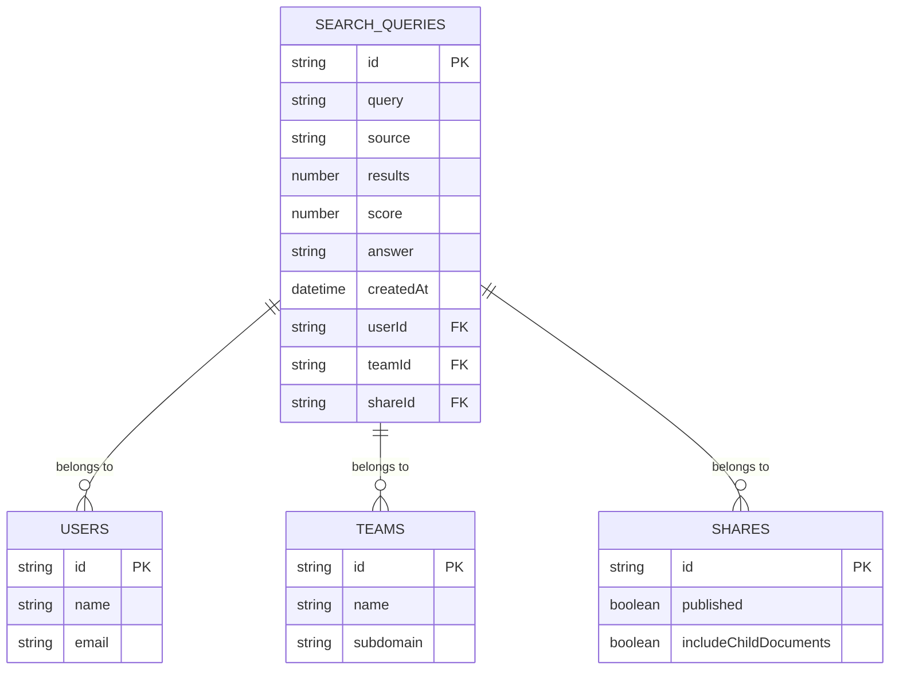
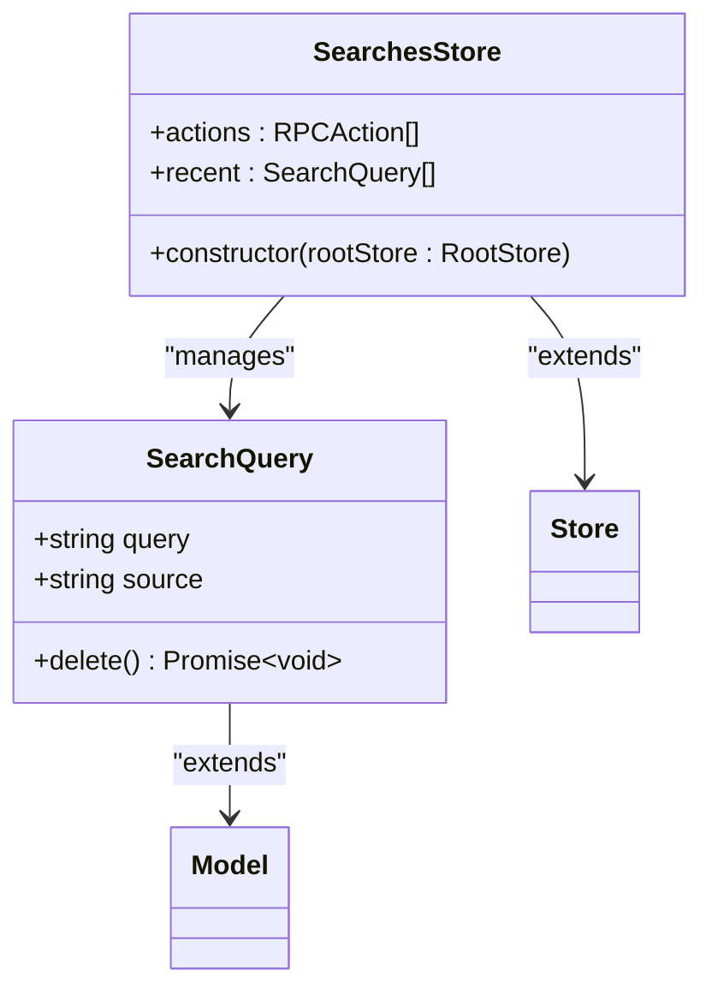

# 搜索API

<cite>
**本文档中引用的文件**  
- [searches.ts](file://server/routes/api/searches/searches.ts)
- [schema.ts](file://server/routes/api/searches/schema.ts)
- [SearchQuery.ts](file://server/models/SearchQuery.ts)
- [presentSearchQuery.ts](file://server/presenters/searchQuery.ts)
- [SearchQuery.ts](file://app/models/SearchQuery.ts)
- [SearchesStore.ts](file://app/stores/SearchesStore.ts)
</cite>

## 目录
1. [简介](#简介)
2. [核心组件](#核心组件)
3. [RESTful端点](#restful端点)
4. [请求参数与响应格式](#请求参数与响应格式)
5. [索引与数据模型](#索引与数据模型)
6. [客户端实现](#客户端实现)
7. [性能与最佳实践](#性能与最佳实践)

## 简介
baozi项目的搜索API提供了一套完整的全文搜索功能，支持从不同来源（如应用、API、Slack等）发起的搜索查询。该API不仅记录用户的搜索历史，还允许用户对搜索结果进行评分反馈，从而优化未来的搜索体验。系统通过RESTful端点暴露功能，并采用Elasticsearch集成实现高效的全文检索。

## 核心组件
搜索API的核心由多个组件构成，包括后端路由处理、数据模型定义、结果展示逻辑以及前端状态管理。这些组件协同工作，确保搜索请求能够被正确处理并返回相关结果。

**Section sources**
- [searches.ts](file://server/routes/api/searches/searches.ts)
- [SearchQuery.ts](file://server/models/SearchQuery.ts)
- [presentSearchQuery.ts](file://server/presenters/searchQuery.ts)

## RESTful端点
搜索API提供了三个主要的RESTful端点，分别用于列出搜索记录、更新搜索评分和删除搜索记录。

### 列出搜索记录
- **端点**: `POST /searches.list`
- **功能**: 获取用户的搜索历史记录。
- **认证**: 需要用户身份验证。
- **参数**: 可选的`source`参数用于过滤特定来源的搜索记录。

### 更新搜索评分
- **端点**: `POST /searches.update`
- **功能**: 允许用户为特定搜索查询的结果打分，以提供反馈。
- **认证**: 需要用户身份验证。
- **参数**: `id`（搜索记录ID）和`score`（评分，范围-1到1）。

### 删除搜索记录
- **端点**: `POST /searches.delete`
- **功能**: 删除指定的搜索记录。
- **认证**: 需要用户身份验证。
- **参数**: `id`或`query`，用于标识要删除的记录。

**Section sources**
- [searches.ts](file://server/routes/api/searches/searches.ts)

## 请求参数与响应格式
### 请求参数
每个端点都接受JSON格式的请求体，其中包含必要的参数。例如，`searches.update`需要`id`和`score`字段，而`searches.delete`则可以通过`id`或`query`来指定目标记录。

### 响应格式
所有成功的响应都会返回一个JSON对象，包含以下字段：
- `data`: 包含实际数据的对象或数组。
- `pagination`: 分页信息（仅在列表操作中出现）。
- `success`: 布尔值，表示操作是否成功（仅在删除操作中出现）。

对于`searches.list`，响应中的`data`字段是一个搜索记录数组，每条记录包括`id`、`query`、`source`、`createdAt`、`answer`和`score`。

**Section sources**
- [searches.ts](file://server/routes/api/searches/searches.ts)
- [schema.ts](file://server/routes/api/searches/schema.ts)

## 索引与数据模型
### 数据模型
`SearchQuery`模型定义了搜索记录的数据结构，关键属性包括：
- `id`: 唯一标识符。
- `query`: 搜索查询字符串，自动截断至255个字符。
- `source`: 查询来源，可以是"api"、"app"、"slack"或"oauth"。
- `results`: 返回结果的数量。
- `score`: 用户对结果的评分，-1表示负面，1表示正面，null表示中立。
- `answer`: 自动生成的答案（如果有）。
- `createdAt`: 记录创建时间。

### 索引机制
数据库表`search_queries`针对`teamId`、`userId`和`createdAt`建立了索引，以优化查询性能。此外，`query`字段也被索引，以便快速查找特定查询。

**Diagram sources**
- [SearchQuery.ts](file://server/models/SearchQuery.ts)

**Section sources**
- [SearchQuery.ts](file://server/models/SearchQuery.ts)

## 客户端实现
### 模型层
前端使用`SearchQuery`类来表示搜索记录，继承自基类`Model`。该类提供了`delete`方法，用于向服务器发送删除请求，并从本地存储中移除相应记录。

### 状态管理层
`SearchesStore`负责管理搜索记录的状态，支持`List`和`Delete`两种RPC操作。它还提供了一个计算属性`recent`，用于获取最近的8条应用程序来源的搜索记录。

**Diagram sources**
- [SearchQuery.ts](file://app/models/SearchQuery.ts)
- [SearchesStore.ts](file://app/stores/SearchesStore.ts)

**Section sources**
- [SearchQuery.ts](file://app/models/SearchQuery.ts)
- [SearchesStore.ts](file://app/stores/SearchesStore.ts)

## 性能与最佳实践
### 查询优化
为了提高查询效率，建议在执行搜索时充分利用分页功能，避免一次性加载过多数据。同时，合理利用`source`参数过滤不必要的记录，减少网络传输量。

### 错误处理
在客户端实现中，应妥善处理各种可能的错误情况，如网络超时、身份验证失败等。特别是在调用`delete`方法时，需确保即使请求失败也能保持本地状态的一致性。

### 安全性考虑
所有敏感操作（如删除记录）都必须经过身份验证，并且只能影响当前用户的数据。服务器端应严格校验输入参数，防止SQL注入等安全威胁。

**Section sources**
- [searches.ts](file://server/routes/api/searches/searches.ts)
- [SearchQuery.ts](file://app/models/SearchQuery.ts)