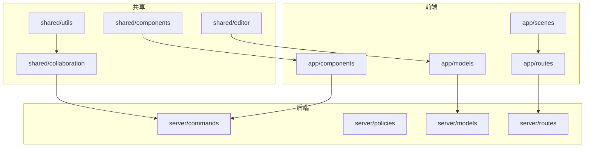
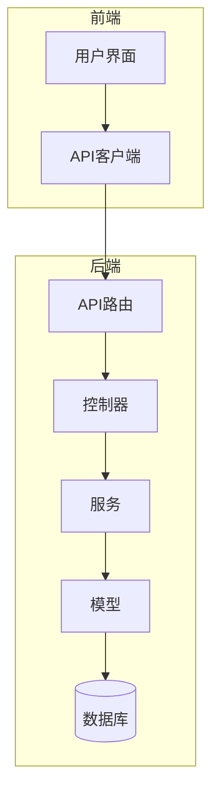
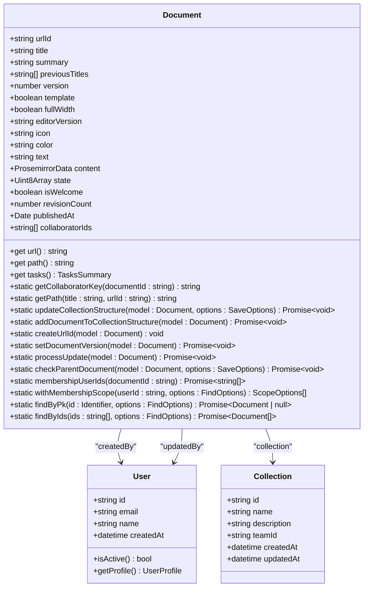
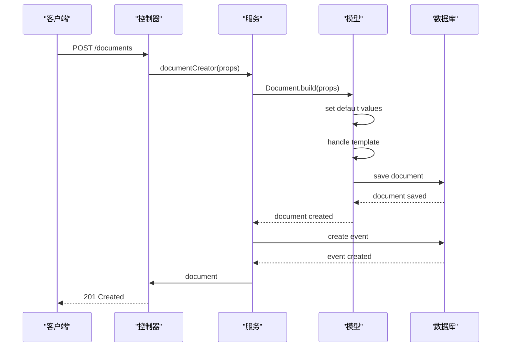
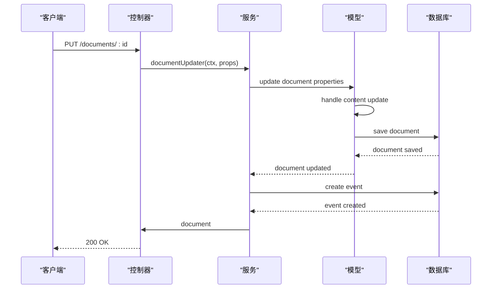
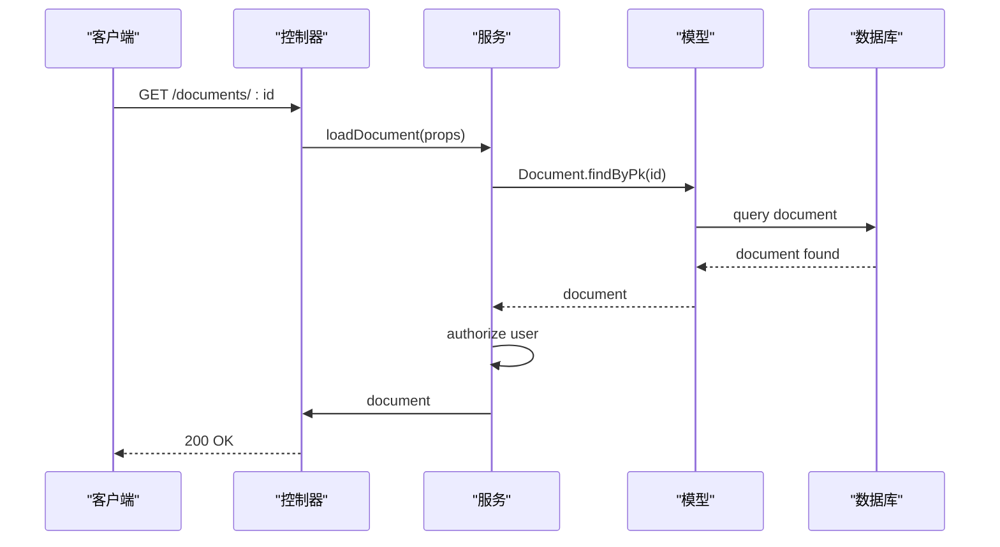
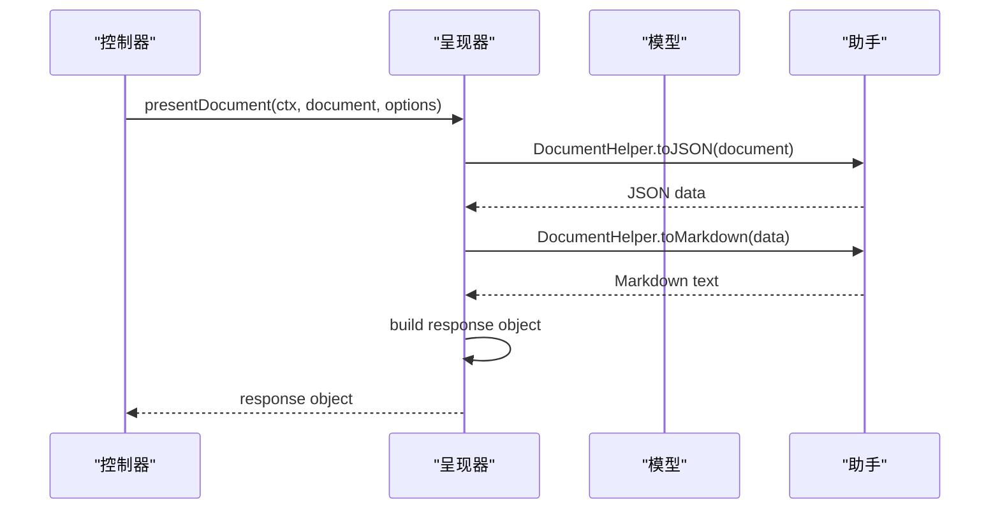
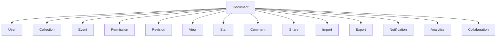

# 文档API

<cite>
**本文档中引用的文件**  
- [document.ts](file://server/models/Document.ts)
- [documentCreator.ts](file://server/commands/documentCreator.ts)
- [documentUpdater.ts](file://server/commands/documentUpdater.ts)
- [documentLoader.ts](file://server/commands/documentLoader.ts)
- [document.ts](file://server/presenters/document.ts)
- [document.ts](file://app/models/Document.ts)
- [documentCollaborativeUpdater.ts](file://server/commands/documentCollaborativeUpdater.ts)
</cite>

## 目录
1. [简介](#简介)
2. [项目结构](#项目结构)
3. [核心组件](#核心组件)
4. [架构概述](#架构概述)
5. [详细组件分析](#详细组件分析)
6. [依赖分析](#依赖分析)
7. [性能考虑](#性能考虑)
8. [故障排除指南](#故障排除指南)
9. [结论](#结论)
10. [附录](#附录)（如有必要）

## 简介
本文档详细介绍了baozi项目中与文档管理相关的RESTful API端点。重点阐述了文档创建、编辑、版本控制、搜索等操作的实现细节，包括请求参数、响应格式和业务逻辑验证。通过实际代码示例，展示了文档生命周期管理的完整流程。为初学者提供文档协作的基本概念，同时为经验丰富的开发者提供版本管理、冲突解决和性能优化的最佳实践。

## 项目结构
项目结构清晰地分为前端（app）、后端（server）和共享（shared）三个主要部分。前端部分包含组件、模型、路由和场景等，后端部分包含命令、策略、模型和路由等，共享部分包含协作、组件、编辑器和工具等。这种分层结构有助于维护和扩展。

**Diagram sources**
- [app/models/Document.ts](file://app/models/Document.ts#L39-L703)
- [server/models/Document.ts](file://server/models/Document.ts#L94-L714)

**Section sources**
- [app/models/Document.ts](file://app/models/Document.ts#L39-L703)
- [server/models/Document.ts](file://server/models/Document.ts#L94-L714)

## 核心组件
文档管理的核心组件包括文档模型、文档创建器、文档更新器、文档加载器和文档呈现器。这些组件共同实现了文档的全生命周期管理，从创建到删除，包括版本控制和协作编辑。

**Section sources**
- [server/models/Document.ts](file://server/models/Document.ts#L94-L714)
- [server/commands/documentCreator.ts](file://server/commands/documentCreator.ts#L38-L195)
- [server/commands/documentUpdater.ts](file://server/commands/documentUpdater.ts#L43-L153)
- [server/commands/documentLoader.ts](file://server/commands/documentLoader.ts#L10-L41)
- [server/presenters/document.ts](file://server/presenters/document.ts#L20-L107)

## 架构概述
系统架构采用前后端分离的设计，前端负责用户界面和交互，后端负责业务逻辑和数据处理。文档管理功能通过RESTful API进行通信，确保了系统的可扩展性和灵活性。

**Diagram sources**
- [server/routes/app.ts](file://server/routes/app.ts#L0-L254)
- [server/commands/documentCreator.ts](file://server/commands/documentCreator.ts#L38-L195)

## 详细组件分析

### 文档模型分析
文档模型是文档管理的核心，定义了文档的所有属性和行为。包括标题、内容、创建者、更新者、版本号、协作编辑状态等。

#### 文档模型类图

**Diagram sources**
- [server/models/Document.ts](file://server/models/Document.ts#L94-L714)

**Section sources**
- [server/models/Document.ts](file://server/models/Document.ts#L94-L714)

### 文档创建分析
文档创建器负责处理文档的创建逻辑，包括设置默认值、处理模板、发布文档等。

#### 文档创建序列图

**Diagram sources**
- [server/commands/documentCreator.ts](file://server/commands/documentCreator.ts#L38-L195)

**Section sources**
- [server/commands/documentCreator.ts](file://server/commands/documentCreator.ts#L38-L195)

### 文档更新分析
文档更新器负责处理文档的更新逻辑，包括标题、图标、颜色、内容等属性的更新。

#### 文档更新序列图

**Diagram sources**
- [server/commands/documentUpdater.ts](file://server/commands/documentUpdater.ts#L43-L153)

**Section sources**
- [server/commands/documentUpdater.ts](file://server/commands/documentUpdater.ts#L43-L153)

### 文档加载分析
文档加载器负责根据ID加载文档，并进行权限验证。

#### 文档加载序列图

**Diagram sources**
- [server/commands/documentLoader.ts](file://server/commands/documentLoader.ts#L10-L41)

**Section sources**
- [server/commands/documentLoader.ts](file://server/commands/documentLoader.ts#L10-L41)

### 文档呈现分析
文档呈现器负责将文档模型转换为API响应格式，包括公共和私有字段的处理。

#### 文档呈现序列图

**Diagram sources**
- [server/presenters/document.ts](file://server/presenters/document.ts#L20-L107)

**Section sources**
- [server/presenters/document.ts](file://server/presenters/document.ts#L20-L107)

## 依赖分析
文档管理功能依赖于多个其他组件，包括用户、集合、事件、权限等。这些依赖关系确保了系统的完整性和一致性。

**Diagram sources**
- [server/models/Document.ts](file://server/models/Document.ts#L94-L714)

**Section sources**
- [server/models/Document.ts](file://server/models/Document.ts#L94-L714)

## 性能考虑
在文档管理中，性能是一个重要的考虑因素。为了提高性能，系统采用了多种优化策略，如缓存、异步处理、批量操作等。此外，还通过数据库索引、查询优化等方式来提升查询效率。

## 故障排除指南
在使用文档API时，可能会遇到各种问题。以下是一些常见的问题及其解决方案：

- **文档创建失败**：检查请求参数是否正确，特别是`collectionId`和`publish`参数。
- **文档更新失败**：确保用户具有更新文档的权限，检查文档是否已被删除或归档。
- **文档加载失败**：确认文档ID是否正确，检查用户是否有读取文档的权限。
- **版本控制问题**：确保每次更新文档时都正确地增加了版本号，避免数据丢失。

**Section sources**
- [server/commands/documentCreator.ts](file://server/commands/documentCreator.ts#L38-L195)
- [server/commands/documentUpdater.ts](file://server/commands/documentUpdater.ts#L43-L153)
- [server/commands/documentLoader.ts](file://server/commands/documentLoader.ts#L10-L41)

## 结论
本文档详细介绍了baozi项目中与文档管理相关的RESTful API端点。通过分析核心组件、架构设计、依赖关系和性能优化，为开发者提供了全面的指导。无论是初学者还是经验丰富的开发者，都可以从中获得有价值的信息，更好地理解和使用文档管理功能。

## 附录
如有必要，可以在此添加额外的信息，如API参考、错误代码表、配置选项等。