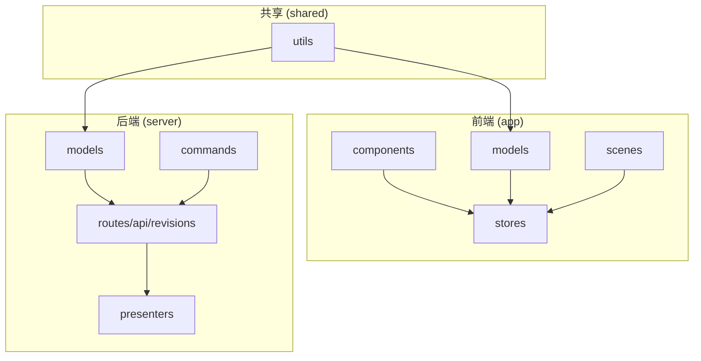
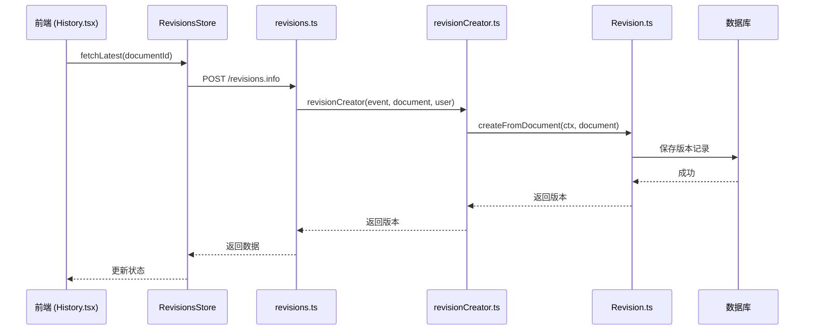
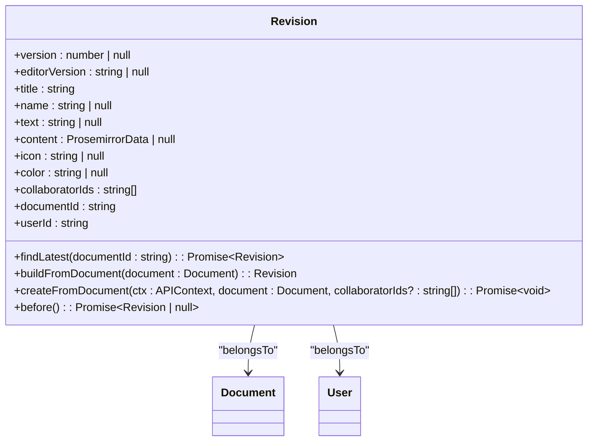
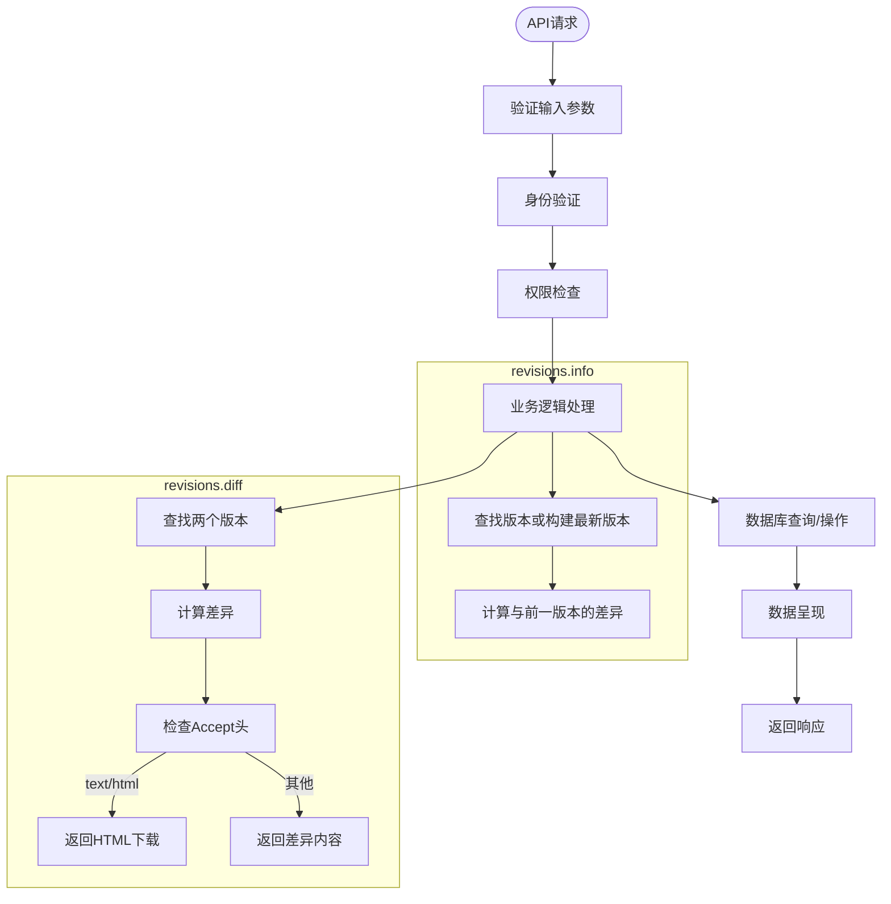
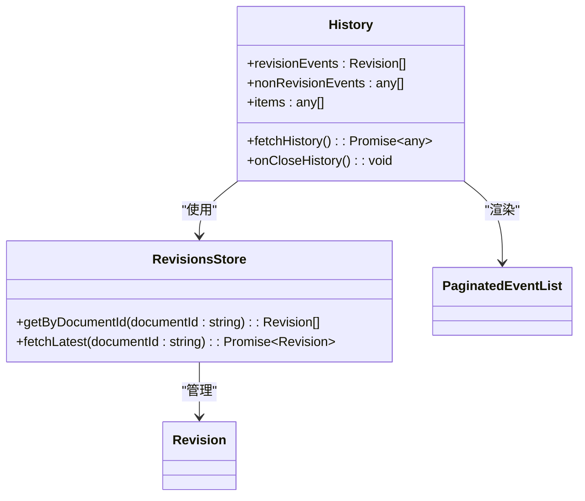
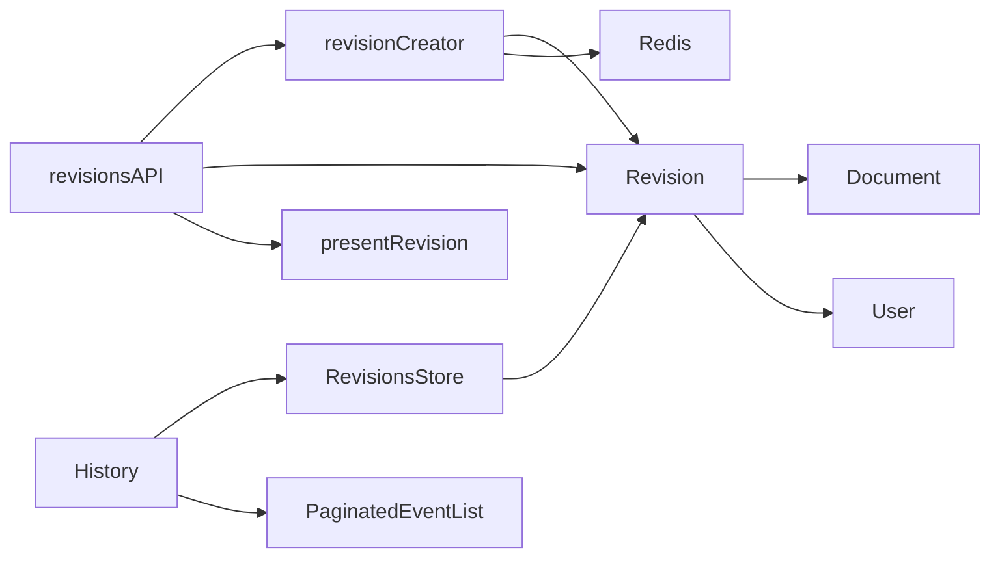

# 版本API

<cite>
**本文档中引用的文件**  
- [Revision.ts](file://server/models/Revision.ts)
- [revisionCreator.ts](file://server/commands/revisionCreator.ts)
- [revisions.ts](file://server/routes/api/revisions/revisions.ts)
- [schema.ts](file://server/routes/api/revisions/schema.ts)
- [RevisionsStore.ts](file://app/stores/RevisionsStore.ts)
- [History.tsx](file://app/scenes/Document/components/History.tsx)
- [revision.ts](file://server/presenters/revision.ts)
</cite>

## 目录
1. [简介](#简介)
2. [项目结构](#项目结构)
3. [核心组件](#核心组件)
4. [架构概述](#架构概述)
5. [详细组件分析](#详细组件分析)
6. [依赖分析](#依赖分析)
7. [性能考虑](#性能考虑)
8. [故障排除指南](#故障排除指南)
9. [结论](#结论)

## 简介
本文档详细介绍了baozi项目中版本管理API的实现，重点阐述了版本创建、历史查看、版本比较、恢复等操作的RESTful端点。文档涵盖了请求参数、响应格式、业务逻辑验证等关键细节，并结合实际代码示例展示了版本管理的完整流程。为初学者提供版本控制的基本概念，同时为经验丰富的开发者提供差异算法、存储优化和性能最佳实践。

## 项目结构
项目结构清晰地分为前端（app）、后端（server）、共享代码（shared）和插件（plugins）等主要目录。版本管理功能主要涉及后端API路由、模型定义、命令处理以及前端组件和存储。

**Diagram sources**
- [server/models/Revision.ts](file://server/models/Revision.ts)
- [app/stores/RevisionsStore.ts](file://app/stores/RevisionsStore.ts)
- [app/scenes/Document/components/History.tsx](file://app/scenes/Document/components/History.tsx)

**Section sources**
- [server/models/Revision.ts](file://server/models/Revision.ts#L1-L235)
- [server/commands/revisionCreator.ts](file://server/commands/revisionCreator.ts#L1-L33)
- [server/routes/api/revisions/revisions.ts](file://server/routes/api/revisions/revisions.ts#L1-L223)

## 核心组件
版本管理的核心组件包括`Revision`模型、`revisionCreator`命令、API路由处理程序以及前端的`RevisionsStore`和`History`组件。这些组件协同工作，实现了文档的版本控制功能。

**Section sources**
- [server/models/Revision.ts](file://server/models/Revision.ts#L1-L235)
- [server/commands/revisionCreator.ts](file://server/commands/revisionCreator.ts#L1-L33)
- [app/stores/RevisionsStore.ts](file://app/stores/RevisionsStore.ts#L1-L29)

## 架构概述
版本API的架构遵循典型的MVC模式，前端通过API与后端交互，后端处理业务逻辑并操作数据库。版本创建由命令模式触发，通过事务确保数据一致性。

**Diagram sources**
- [app/scenes/Document/components/History.tsx](file://app/scenes/Document/components/History.tsx#L1-L165)
- [app/stores/RevisionsStore.ts](file://app/stores/RevisionsStore.ts#L1-L29)
- [server/routes/api/revisions/revisions.ts](file://server/routes/api/revisions/revisions.ts#L1-L223)
- [server/commands/revisionCreator.ts](file://server/commands/revisionCreator.ts#L1-L33)
- [server/models/Revision.ts](file://server/models/Revision.ts#L1-L235)

## 详细组件分析

### 后端模型分析
`Revision`模型定义了版本记录的数据结构，包括文档ID、用户ID、内容快照、标题、图标等属性。模型通过Sequelize ORM与数据库交互，并包含版本创建和查询的静态方法。

**Diagram sources**
- [server/models/Revision.ts](file://server/models/Revision.ts#L1-L235)

**Section sources**
- [server/models/Revision.ts](file://server/models/Revision.ts#L1-L235)

### API端点分析
版本API提供了多个RESTful端点，包括获取版本信息、列出版本、比较版本、更新版本和删除版本。每个端点都有严格的输入验证和权限检查。

**Diagram sources**
- [server/routes/api/revisions/revisions.ts](file://server/routes/api/revisions/revisions.ts#L1-L223)
- [server/routes/api/revisions/schema.ts](file://server/routes/api/revisions/schema.ts#L1-L69)

**Section sources**
- [server/routes/api/revisions/revisions.ts](file://server/routes/api/revisions/revisions.ts#L1-L223)
- [server/routes/api/revisions/schema.ts](file://server/routes/api/revisions/schema.ts#L1-L69)

### 前端组件分析
前端通过`RevisionsStore`管理版本数据状态，并通过`History`组件展示版本历史。组件使用MobX进行状态管理，实现了高效的数据更新和视图渲染。

**Diagram sources**
- [app/stores/RevisionsStore.ts](file://app/stores/RevisionsStore.ts#L1-L29)
- [app/scenes/Document/components/History.tsx](file://app/scenes/Document/components/History.tsx#L1-L165)

**Section sources**
- [app/stores/RevisionsStore.ts](file://app/stores/RevisionsStore.ts#L1-L29)
- [app/scenes/Document/components/History.tsx](file://app/scenes/Document/components/History.tsx#L1-L165)

## 依赖分析
版本管理功能依赖于多个核心模块，包括文档模型、用户模型、数据库操作、API路由框架和数据呈现器。这些依赖关系确保了版本功能的完整性和一致性。

**Diagram sources**
- [server/models/Revision.ts](file://server/models/Revision.ts#L1-L235)
- [server/commands/revisionCreator.ts](file://server/commands/revisionCreator.ts#L1-L33)
- [server/routes/api/revisions/revisions.ts](file://server/routes/api/revisions/revisions.ts#L1-L223)
- [server/presenters/revision.ts](file://server/presenters/revision.ts#L1-L32)
- [app/stores/RevisionsStore.ts](file://app/stores/RevisionsStore.ts#L1-L29)
- [app/scenes/Document/components/History.tsx](file://app/scenes/Document/components/History.tsx#L1-L165)

**Section sources**
- [server/models/Revision.ts](file://server/models/Revision.ts#L1-L235)
- [server/commands/revisionCreator.ts](file://server/commands/revisionCreator.ts#L1-L33)
- [server/routes/api/revisions/revisions.ts](file://server/routes/api/revisions/revisions.ts#L1-L223)
- [server/presenters/revision.ts](file://server/presenters/revision.ts#L1-L32)
- [app/stores/RevisionsStore.ts](file://app/stores/RevisionsStore.ts#L1-L29)

## 性能考虑
版本管理在性能方面进行了多项优化，包括使用Redis缓存协作者ID、数据库事务处理、分页查询以及差异计算的按需执行。这些优化确保了在处理大量版本数据时仍能保持良好的响应速度。

## 故障排除指南
常见问题包括版本创建失败、差异计算错误和权限不足。排查时应检查数据库连接、Redis状态、用户权限配置以及输入参数的有效性。

**Section sources**
- [server/models/Revision.ts](file://server/models/Revision.ts#L1-L235)
- [server/commands/revisionCreator.ts](file://server/commands/revisionCreator.ts#L1-L33)
- [server/routes/api/revisions/revisions.ts](file://server/routes/api/revisions/revisions.ts#L1-L223)

## 结论
baozi项目的版本API设计合理，实现了完整的文档版本控制功能。通过清晰的分层架构和模块化设计，系统具有良好的可维护性和扩展性。建议在高并发场景下进一步优化数据库索引和缓存策略。