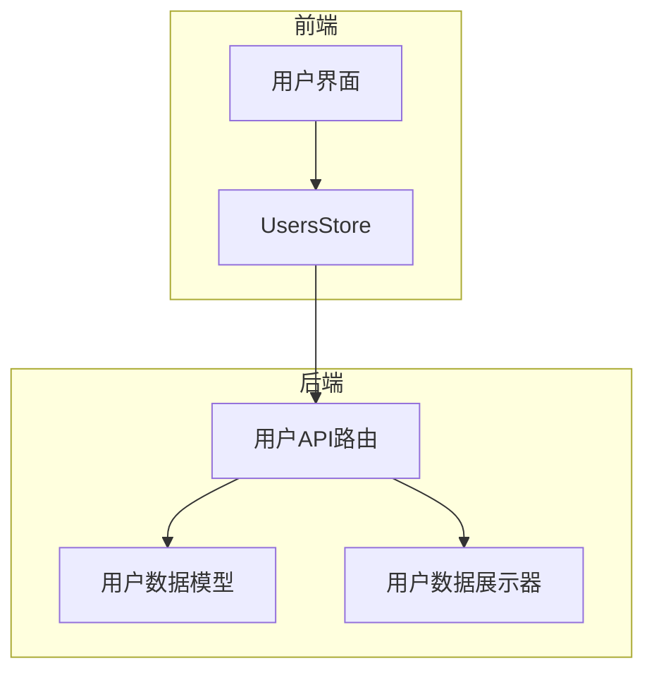
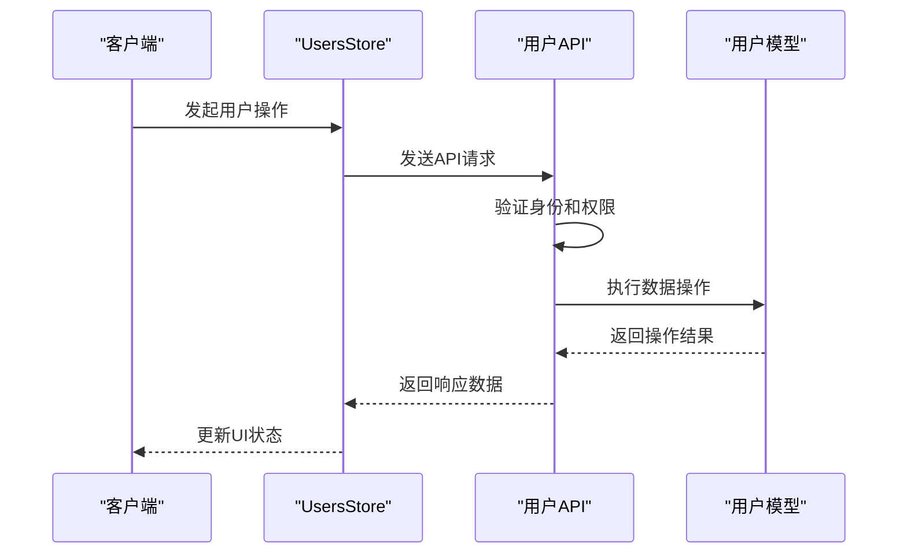
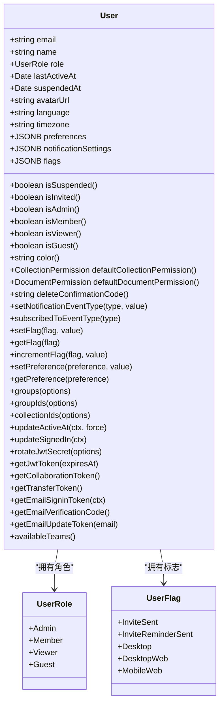
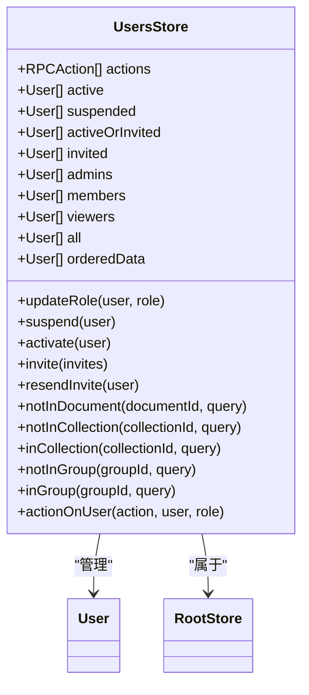
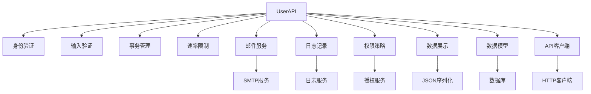

# 用户API

<cite>
**本文档中引用的文件**  
- [users.ts](file://server/routes/api/users/users.ts)
- [User.ts](file://server/models/User.ts)
- [UsersStore.ts](file://app/stores/UsersStore.ts)
- [schema.ts](file://server/routes/api/users/schema.ts)
- [user.ts](file://server/presenters/user.ts)
</cite>

## 目录
1. [简介](#简介)
2. [项目结构](#项目结构)
3. [核心组件](#核心组件)
4. [架构概述](#架构概述)
5. [详细组件分析](#详细组件分析)
6. [依赖分析](#依赖分析)
7. [性能考虑](#性能考虑)
8. [故障排除指南](#故障排除指南)
9. [结论](#结论)
10. [附录](#附录)（如有必要）

## 简介
本文档详细介绍了baozi项目中用户管理相关的RESTful端点。文档重点阐述了用户创建、更新、删除和查询等操作的实现细节，包括请求参数、响应格式和权限验证机制。通过实际代码示例，展示了用户数据的CRUD操作流程。为初学者提供用户管理的基本概念，同时为经验丰富的开发者提供批量操作、分页查询和性能优化的最佳实践。

## 项目结构
baozi项目的用户管理功能主要分布在服务器端的API路由、数据模型和前端的状态管理模块中。用户API的实现遵循典型的分层架构，包括路由层、业务逻辑层、数据访问层和状态管理层。

**图表来源**
- [users.ts](file://server/routes/api/users/users.ts)
- [User.ts](file://server/models/User.ts)
- [UsersStore.ts](file://app/stores/UsersStore.ts)

**章节来源**
- [users.ts](file://server/routes/api/users/users.ts)
- [User.ts](file://server/models/User.ts)

## 核心组件
用户管理功能的核心组件包括用户数据模型、API路由处理器和前端状态管理器。这些组件协同工作，实现了完整的用户生命周期管理功能。

**章节来源**
- [User.ts](file://server/models/User.ts)
- [users.ts](file://server/routes/api/users/users.ts)
- [UsersStore.ts](file://app/stores/UsersStore.ts)

## 架构概述
用户API采用RESTful设计风格，通过HTTP方法映射到相应的用户操作。系统实现了完整的权限控制机制，确保只有授权用户才能执行特定操作。

**图表来源**
- [users.ts](file://server/routes/api/users/users.ts)
- [UsersStore.ts](file://app/stores/UsersStore.ts)

## 详细组件分析
本节详细分析用户管理功能的各个关键组件，包括数据模型、API端点和状态管理。

### 用户数据模型分析
用户数据模型定义了用户实体的属性和行为，包括基本属性、角色权限和状态管理。

**图表来源**
- [User.ts](file://server/models/User.ts)

**章节来源**
- [User.ts](file://server/models/User.ts)

### 用户API端点分析
用户API提供了丰富的RESTful端点，支持用户管理的各种操作，包括列表查询、信息获取、更新、角色变更、激活/停用、邀请和删除等。

```mermaid
flowchart TD
Start([用户API入口]) --> List["users.list<br>获取用户列表"]
Start --> Info["users.info<br>获取用户信息"]
Start --> Update["users.update<br>更新用户信息"]
Start --> UpdateEmail["users.updateEmail<br>更新用户邮箱"]
Start --> UpdateRole["users.update_role<br>更新用户角色"]
Start --> Suspend["users.suspend<br>停用用户"]
Start --> Activate["users.activate<br>激活用户"]
Start --> Invite["users.invite<br>邀请用户"]
Start --> ResendInvite["users.resendInvite<br>重发邀请"]
Start --> RequestDelete["users.requestDelete<br>请求删除用户"]
Start --> Delete["users.delete<br>删除用户"]
Start --> NotificationsSubscribe["users.notificationsSubscribe<br>订阅通知"]
Start --> NotificationsUnsubscribe["users.notificationsUnsubscribe<br>取消订阅通知"]
List --> Filter["支持多种过滤条件<br>角色、状态、查询等"]
List --> Pagination["支持分页<br>limit和offset"]
Update --> Validation["验证输入参数"]
Update --> Authorization["检查权限"]
Update --> Save["保存更新"]
UpdateRole --> Check["检查角色变更规则"]
Suspend --> CheckAdmin["检查是否为最后管理员"]
Delete --> Confirm["删除确认"]
Delete --> CheckLast["检查是否为最后用户"]
```

**图表来源**
- [users.ts](file://server/routes/api/users/users.ts)
- [schema.ts](file://server/routes/api/users/schema.ts)

**章节来源**
- [users.ts](file://server/routes/api/users/users.ts)
- [schema.ts](file://server/routes/api/users/schema.ts)

### 用户状态管理分析
前端通过UsersStore管理用户状态，提供了便捷的API来操作用户数据和更新UI。

**图表来源**
- [UsersStore.ts](file://app/stores/UsersStore.ts)

**章节来源**
- [UsersStore.ts](file://app/stores/UsersStore.ts)

## 依赖分析
用户管理功能依赖于多个核心模块和外部服务，形成了复杂的依赖关系网络。

**图表来源**
- [users.ts](file://server/routes/api/users/users.ts)
- [User.ts](file://server/models/User.ts)

**章节来源**
- [users.ts](file://server/routes/api/users/users.ts)
- [User.ts](file://server/models/User.ts)

## 性能考虑
用户API在设计时考虑了多项性能优化措施，以确保系统在高并发场景下的稳定性和响应速度。

- **分页查询**：通过limit和offset参数支持分页，避免一次性返回大量数据
- **缓存机制**：利用数据库索引和查询优化提高数据检索效率
- **批量操作**：支持批量邀请用户，减少网络往返次数
- **权限预加载**：一次性加载用户权限信息，避免多次查询
- **连接池**：使用数据库连接池管理数据库连接，提高资源利用率
- **异步处理**：将邮件发送等耗时操作放入队列异步处理

**章节来源**
- [users.ts](file://server/routes/api/users/users.ts)
- [pagination.test.ts](file://server/routes/api/middlewares/pagination.test.ts)

## 故障排除指南
本节提供常见问题的解决方案和调试建议。

### 常见问题
- **用户无法登录**：检查用户是否被停用或邮箱验证状态
- **权限不足**：确认当前用户角色是否有执行操作的权限
- **邮件发送失败**：检查邮件服务配置和网络连接
- **API调用失败**：验证请求参数格式和认证令牌
- **性能问题**：检查数据库索引和查询优化

### 调试建议
- 查看服务器日志获取详细错误信息
- 使用开发工具检查API请求和响应
- 验证数据库连接和查询性能
- 检查缓存状态和失效策略
- 监控系统资源使用情况

**章节来源**
- [users.ts](file://server/routes/api/users/users.ts)
- [errors.ts](file://server/errors.ts)

## 结论
baozi项目的用户API提供了完整且安全的用户管理功能。通过RESTful设计、严格的权限控制和高效的性能优化，系统能够满足各种规模团队的用户管理需求。API设计遵循最佳实践，具有良好的可扩展性和维护性，为开发者提供了清晰的接口文档和使用示例。

## 附录
### 用户角色定义
- **管理员(Admin)**：拥有最高权限，可以管理所有用户和系统设置
- **成员(Member)**：可以创建和编辑内容，管理文档权限
- **查看者(Viewer)**：只能查看内容，不能进行编辑
- **访客(Guest)**：有限的访问权限，通常用于外部协作

### 用户状态标志
- **InviteSent**：邀请已发送
- **InviteReminderSent**：邀请提醒已发送
- **Desktop**：使用桌面客户端
- **DesktopWeb**：使用桌面浏览器
- **MobileWeb**：使用移动浏览器

### API最佳实践
- 使用分页查询大量用户数据
- 合理设置速率限制避免滥用
- 及时处理异步任务结果
- 定期清理无效用户数据
- 监控API调用频率和性能指标