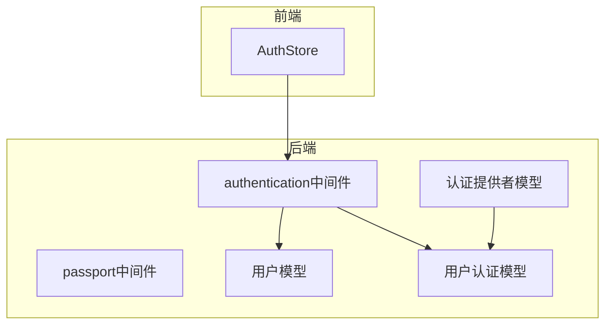
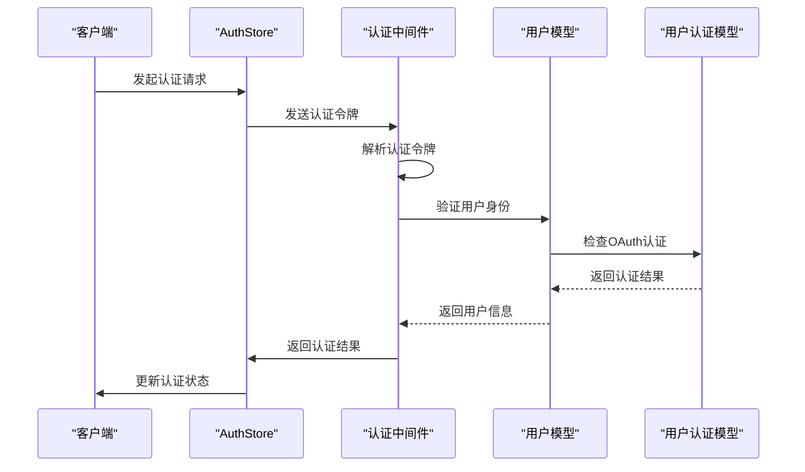
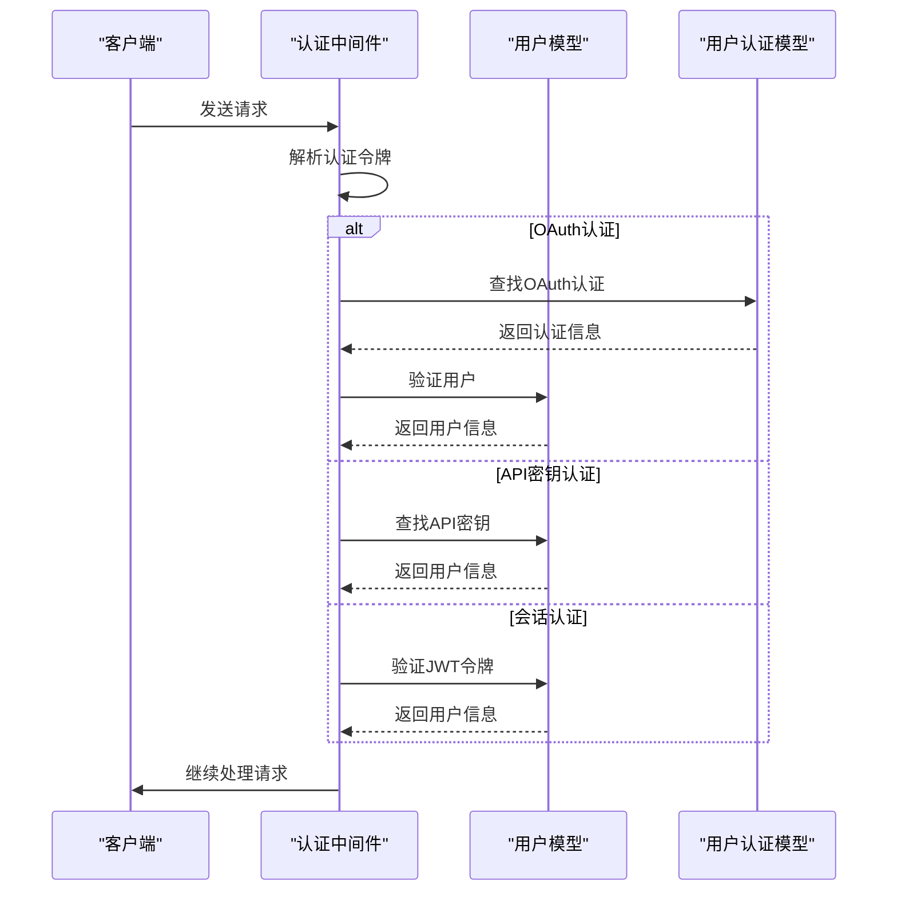
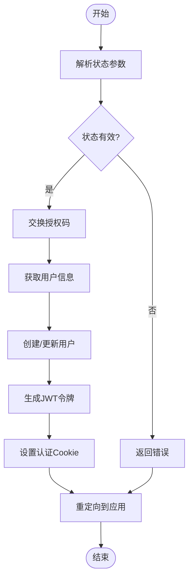
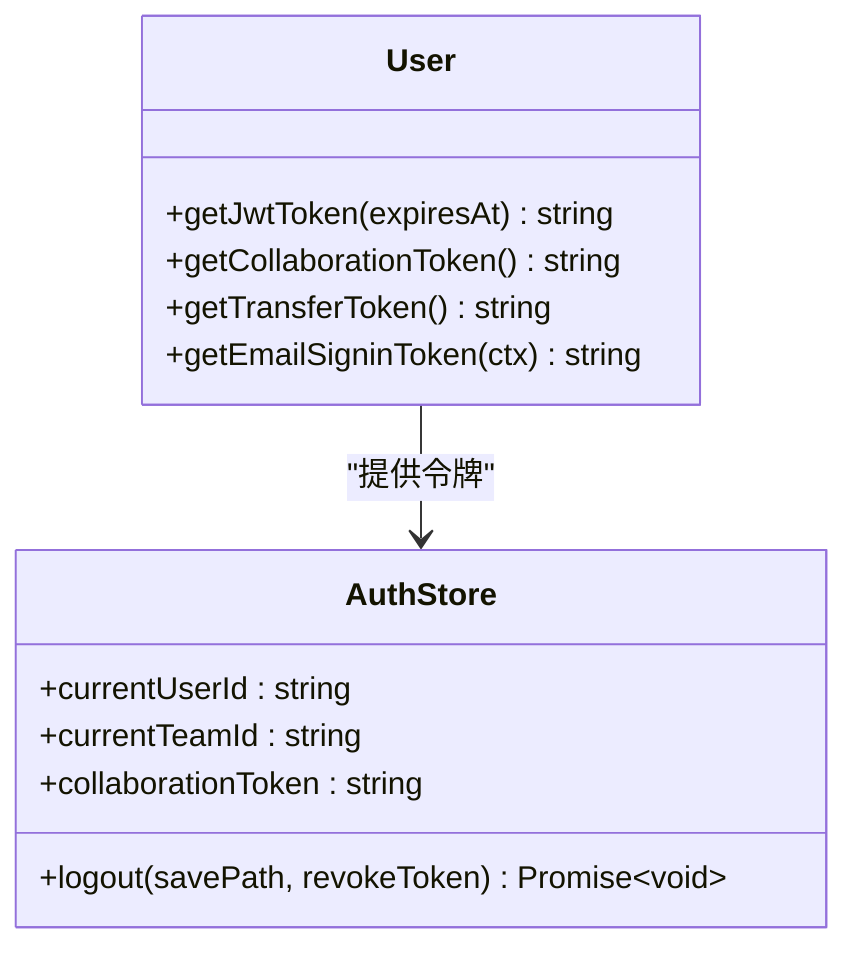
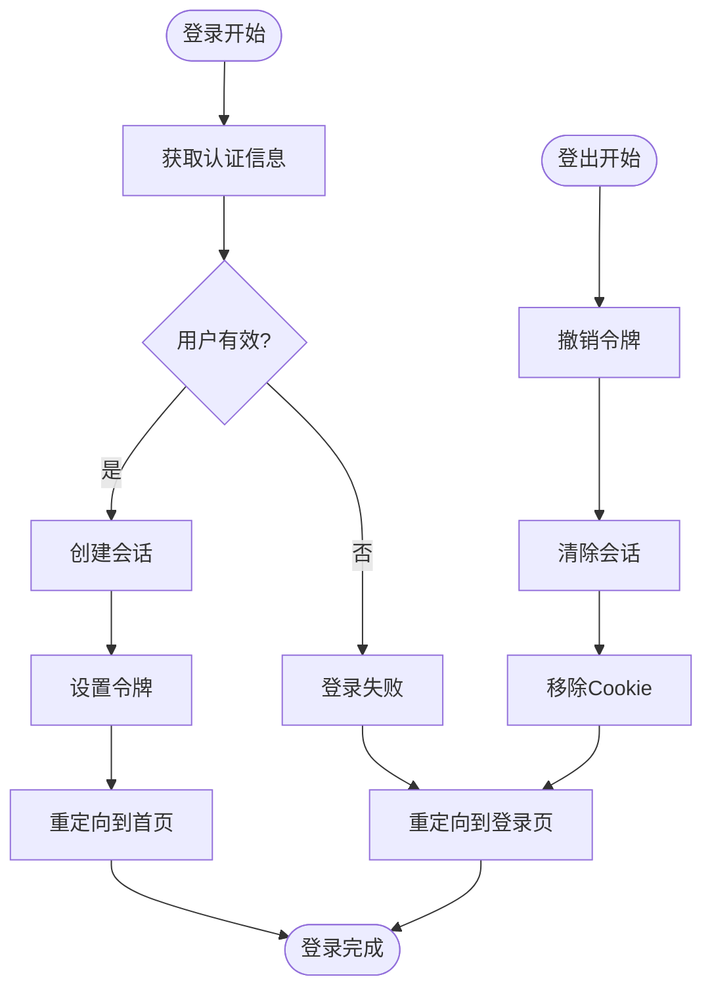
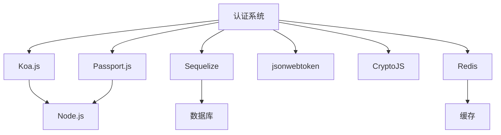

# 认证API

<cite>
**本文档中引用的文件**  
- [authentication.ts](file://server/middlewares/authentication.ts)
- [passport.ts](file://server/middlewares/passport.ts)
- [AuthStore.ts](file://app/stores/AuthStore.ts)
- [User.ts](file://server/models/User.ts)
- [UserAuthentication.ts](file://server/models/UserAuthentication.ts)
- [AuthenticationProvider.ts](file://server/models/AuthenticationProvider.ts)
- [oauth.ts](file://server/utils/oauth.ts)
- [index.ts](file://server/routes/oauth/index.ts)
</cite>

## 目录
1. [简介](#简介)
2. [项目结构](#项目结构)
3. [核心组件](#核心组件)
4. [架构概述](#架构概述)
5. [详细组件分析](#详细组件分析)
6. [依赖分析](#依赖分析)
7. [性能考虑](#性能考虑)
8. [故障排除指南](#故障排除指南)
9. [结论](#结论)

## 简介
baozi项目提供了一套基于Koa.js的全面用户认证机制，支持多种认证方式，包括OAuth集成、API密钥验证和会话令牌处理。该系统设计用于确保安全的用户访问控制，同时为开发者提供灵活的扩展能力。认证流程涵盖了从用户登录、登出到会话管理的各个方面，并通过中间件和模型层实现了高度模块化的设计。

## 项目结构
认证相关的代码主要分布在`server/middlewares`、`server/models`和`app/stores`目录下。`server/middlewares`包含认证和授权的中间件，如`authentication.ts`和`passport.ts`。`server/models`定义了用户、认证提供者和OAuth认证等数据模型。`app/stores`中的`AuthStore.ts`负责管理前端的认证状态。



**Diagram sources**
- [authentication.ts](file://server/middlewares/authentication.ts#L1-L280)
- [passport.ts](file://server/middlewares/passport.ts#L1-L101)
- [AuthStore.ts](file://app/stores/AuthStore.ts#L1-L364)

**Section sources**
- [authentication.ts](file://server/middlewares/authentication.ts#L1-L280)
- [passport.ts](file://server/middlewares/passport.ts#L1-L101)
- [AuthStore.ts](file://app/stores/AuthStore.ts#L1-L364)

## 核心组件
认证系统的核心组件包括认证中间件、用户模型、用户认证模型和认证提供者模型。这些组件协同工作，实现了安全的用户认证和授权机制。

**Section sources**
- [authentication.ts](file://server/middlewares/authentication.ts#L1-L280)
- [User.ts](file://server/models/User.ts#L1-L860)
- [UserAuthentication.ts](file://server/models/UserAuthentication.ts#L1-L207)
- [AuthenticationProvider.ts](file://server/models/AuthenticationProvider.ts#L1-L144)

## 架构概述
baozi项目的认证架构采用分层设计，前端通过`AuthStore`管理认证状态，后端通过Koa中间件处理认证逻辑。认证流程包括解析认证令牌、验证用户身份、检查权限和更新用户活动状态。



**Diagram sources**
- [authentication.ts](file://server/middlewares/authentication.ts#L1-L280)
- [AuthStore.ts](file://app/stores/AuthStore.ts#L1-L364)

## 详细组件分析

### 认证中间件分析
认证中间件负责解析和验证认证令牌，支持多种认证方式，包括Bearer令牌、API密钥和会话令牌。

#### 认证中间件类图
```mermaid
classDiagram
class AuthenticationMiddleware {
+parseAuthentication(ctx) AuthInput
+validateAuthentication(ctx, options) Promise~{user, token, type}~
}
class AuthInput {
+token : string
+transport : AuthTransport
}
AuthenticationMiddleware --> AuthInput : "使用"
```

**Diagram sources**
- [authentication.ts](file://server/middlewares/authentication.ts#L1-L280)

#### 认证流程序列图


**Diagram sources**
- [authentication.ts](file://server/middlewares/authentication.ts#L1-L280)

**Section sources**
- [authentication.ts](file://server/middlewares/authentication.ts#L1-L280)

### OAuth集成分析
OAuth集成通过`passport.ts`中间件实现，支持Google、Azure和OIDC等多种OAuth提供者。

#### OAuth客户端类图
```mermaid
classDiagram
class OAuthClient {
-clientId : string
-clientSecret : string
+userInfo(accessToken) Promise~any~
+rotateToken(accessToken, refreshToken) Promise~{accessToken, refreshToken?, expiresAt}~
}
class GoogleClient {
+endpoints : {authorize, token, userinfo}
}
class AzureClient {
+endpoints : {authorize, token, userinfo}
}
class OIDCClient {
+endpoints : {authorize, token, userinfo}
}
OAuthClient <|-- GoogleClient
OAuthClient <|-- AzureClient
OAuthClient <|-- OIDCClient
```

**Diagram sources**
- [oauth.ts](file://server/utils/oauth.ts#L1-L96)

#### OAuth认证流程


**Diagram sources**
- [passport.ts](file://server/middlewares/passport.ts#L1-L101)

**Section sources**
- [passport.ts](file://server/middlewares/passport.ts#L1-L101)
- [oauth.ts](file://server/utils/oauth.ts#L1-L96)

### 会话管理分析
会话管理通过JWT令牌实现，包括会话令牌、协作令牌和转移令牌等多种令牌类型。

#### 会话管理类图


**Diagram sources**
- [User.ts](file://server/models/User.ts#L1-L860)
- [AuthStore.ts](file://app/stores/AuthStore.ts#L1-L364)

#### 登录登出流程


**Diagram sources**
- [User.ts](file://server/models/User.ts#L1-L860)
- [AuthStore.ts](file://app/stores/AuthStore.ts#L1-L364)

**Section sources**
- [User.ts](file://server/models/User.ts#L1-L860)
- [AuthStore.ts](file://app/stores/AuthStore.ts#L1-L364)

## 依赖分析
认证系统依赖于多个外部库和内部模块，包括Koa.js、Passport.js、Sequelize和JWT等。



**Diagram sources**
- [package.json](file://package.json#L1-L100)

**Section sources**
- [package.json](file://package.json#L1-L100)

## 性能考虑
认证系统的性能优化主要集中在减少数据库查询、缓存用户信息和优化令牌验证等方面。通过使用Redis缓存用户会话和认证信息，可以显著提高系统响应速度。此外，令牌验证的频率也经过优化，避免了不必要的重复验证。

## 故障排除指南
常见问题包括认证失败、令牌过期和OAuth集成问题。对于认证失败，应检查认证令牌的格式和有效性。对于令牌过期，需要重新生成令牌。对于OAuth集成问题，应检查OAuth提供者的配置和回调URL。

**Section sources**
- [errors.ts](file://server/errors.ts#L1-L20)
- [authentication.ts](file://server/middlewares/authentication.ts#L1-L280)

## 结论
baozi项目的认证API提供了一套完整、安全且可扩展的用户认证解决方案。通过合理的架构设计和模块化实现，系统能够支持多种认证方式，并为开发者提供了清晰的扩展接口。建议在实际使用中遵循安全最佳实践，定期审查和更新认证策略，以确保系统的长期安全性和稳定性。