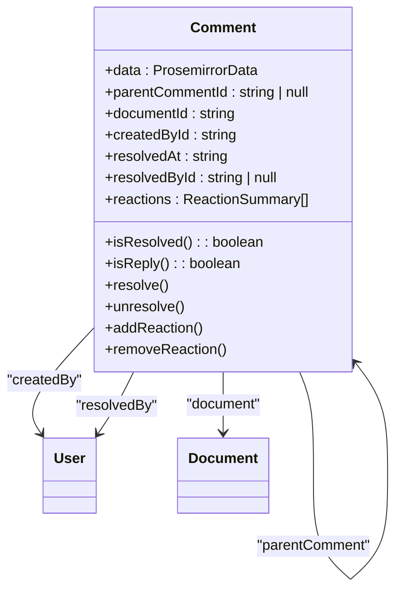
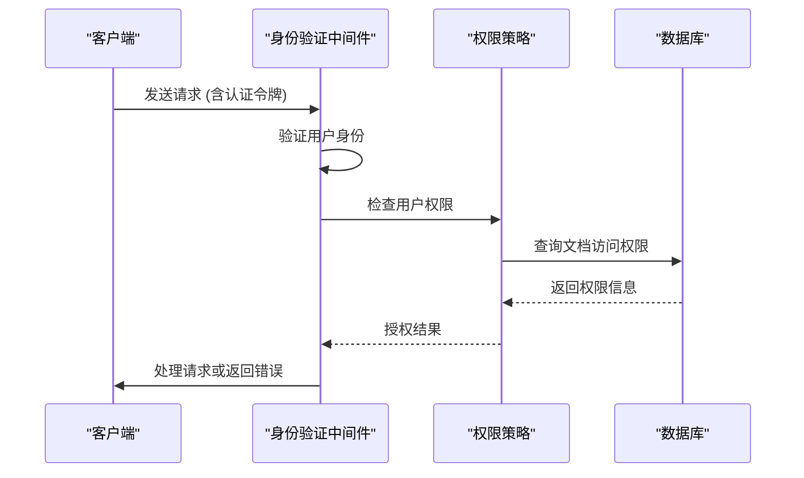
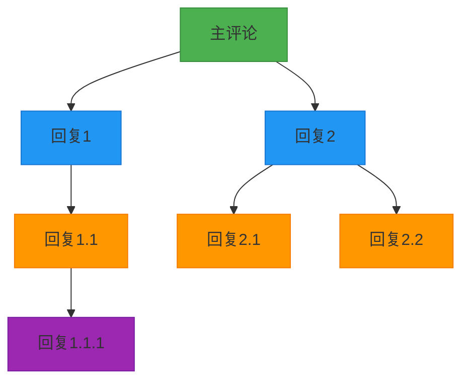
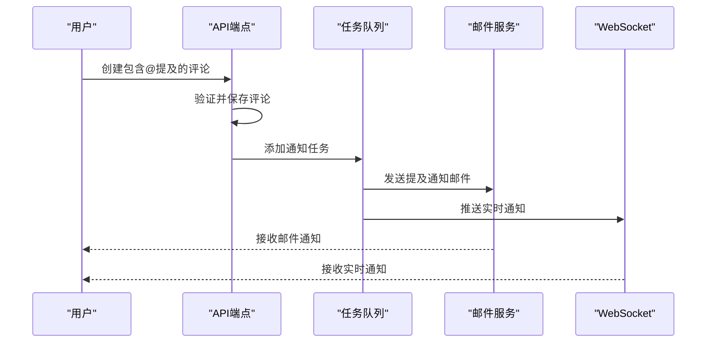

# 评论API

<cite>
**本文档引用的文件**   
- [Comment.ts](file://app/models/Comment.ts)
- [comments.ts](file://server/routes/api/comments/comments.ts)
- [schema.ts](file://server/routes/api/comments/schema.ts)
- [CommentsStore.ts](file://app/stores/CommentsStore.ts)
- [Comment.ts](file://server/models/Comment.ts)
- [CommentCreatedNotificationsTask.ts](file://server/queues/tasks/CommentCreatedNotificationsTask.ts)
- [CommentUpdatedNotificationsTask.ts](file://server/queues/tasks/CommentUpdatedNotificationsTask.ts)
</cite>

## 目录
1. [简介](#简介)
2. [核心数据结构](#核心数据结构)
3. [RESTful端点](#restful端点)
4. [权限验证机制](#权限验证机制)
5. [评论线程管理](#评论线程管理)
6. [通知集成](#通知集成)
7. [最佳实践](#最佳实践)

## 简介
评论API为baozi项目提供了完整的评论功能，支持创建、回复、编辑、删除和解决评论等操作。该API基于RESTful架构设计，通过JSON格式进行数据交换，为用户提供了一个协作式文档编辑环境中的评论系统。API不仅支持基本的CRUD操作，还集成了@提及、表情反应和通知系统等高级功能。

**Section sources**
- [Comment.ts](file://app/models/Comment.ts#L12-L275)
- [comments.ts](file://server/routes/api/comments/comments.ts#L1-L468)

## 核心数据结构
评论系统的核心是`Comment`模型，它定义了评论的所有属性和行为。每个评论都包含Prosemirror格式的数据、创建者信息、关联文档以及父子评论关系。



**Diagram sources**
- [Comment.ts](file://app/models/Comment.ts#L12-L275)
- [Comment.ts](file://server/models/Comment.ts#L24-L164)

## RESTful端点
评论API提供了一系列RESTful端点来管理评论操作，所有端点都遵循统一的请求和响应格式。

### 评论创建
创建新的评论或回复。

**请求**
```
POST /api/comments.create
```

**请求参数**
```json
{
  "id": "string (optional)",
  "documentId": "string",
  "parentCommentId": "string (optional)",
  "data": "ProsemirrorData (optional)",
  "text": "string (optional)"
}
```

**响应格式**
```json
{
  "data": {
    "id": "string",
    "data": "ProsemirrorData",
    "documentId": "string",
    "createdById": "string",
    "createdAt": "string",
    "updatedAt": "string",
    "resolvedAt": "string | null",
    "resolvedById": "string | null",
    "parentCommentId": "string | null",
    "reactions": "ReactionSummary[]"
  },
  "policies": "Policy[]"
}
```

**Section sources**
- [comments.ts](file://server/routes/api/comments/comments.ts#L13-L59)
- [schema.ts](file://server/routes/api/comments/schema.ts#L20-L36)

### 评论更新
编辑现有评论的内容。

**请求**
```
POST /api/comments.update
```

**请求参数**
```json
{
  "id": "string",
  "data": "ProsemirrorData"
}
```

**响应格式**
与创建评论的响应格式相同。

**Section sources**
- [comments.ts](file://server/routes/api/comments/comments.ts#L181-L211)
- [schema.ts](file://server/routes/api/comments/schema.ts#L38-L43)

### 评论删除
删除指定的评论。

**请求**
```
POST /api/comments.delete
```

**请求参数**
```json
{
  "id": "string"
}
```

**响应格式**
```json
{
  "success": true
}
```

**Section sources**
- [comments.ts](file://server/routes/api/comments/comments.ts#L213-L232)
- [schema.ts](file://server/routes/api/comments/schema.ts#L45-L50)

### 评论列表
获取评论列表，支持按文档、集合或父评论过滤。

**请求**
```
POST /api/comments.list
```

**请求参数**
```json
{
  "sort": "string",
  "direction": "string",
  "documentId": "string (optional)",
  "collectionId": "string (optional)",
  "parentCommentId": "string (optional)",
  "statusFilter": "CommentStatusFilter[] (optional)",
  "includeAnchorText": "boolean (optional)"
}
```

**响应格式**
```json
{
  "pagination": {
    "offset": "number",
    "limit": "number",
    "total": "number"
  },
  "data": "Comment[]",
  "policies": "Policy[]"
}
```

**Section sources**
- [comments.ts](file://server/routes/api/comments/comments.ts#L61-L125)
- [schema.ts](file://server/routes/api/comments/schema.ts#L52-L70)

### 评论解决与未解决
标记评论为已解决或未解决状态。

**请求**
```
POST /api/comments.resolve
POST /api/comments.unresolve
```

**请求参数**
```json
{
  "id": "string"
}
```

**响应格式**
与创建评论的响应格式相同。

**Section sources**
- [comments.ts](file://server/routes/api/comments/comments.ts#L234-L329)
- [schema.ts](file://server/routes/api/comments/schema.ts#L72-L81)

### 表情反应
为评论添加或移除表情反应。

**请求**
```
POST /api/comments.add_reaction
POST /api/comments.remove_reaction
```

**请求参数**
```json
{
  "id": "string",
  "emoji": "string"
}
```

**响应格式**
```json
{
  "success": true
}
```

**Section sources**
- [comments.ts](file://server/routes/api/comments/comments.ts#L331-L443)
- [schema.ts](file://server/routes/api/comments/schema.ts#L83-L92)

## 权限验证机制
评论API通过多层次的权限验证确保数据安全。每个操作都需要用户身份验证，并根据用户权限和文档访问权限进行授权。



**Diagram sources**
- [comments.ts](file://server/routes/api/comments/comments.ts#L13-L468)
- [Comment.ts](file://server/models/Comment.ts#L24-L164)

## 评论线程管理
评论系统支持嵌套的评论线程，允许用户对评论进行回复，形成对话式的讨论。



**Diagram sources**
- [CommentsStore.ts](file://app/stores/CommentsStore.ts#L13-L156)
- [Comment.ts](file://app/models/Comment.ts#L12-L275)

## 通知集成
当用户被@提及或评论状态改变时，系统会自动发送通知。通知系统通过后台任务队列异步处理，确保主请求的高性能。



**Diagram sources**
- [CommentCreatedNotificationsTask.ts](file://server/queues/tasks/CommentCreatedNotificationsTask.ts#L22-L175)
- [CommentUpdatedNotificationsTask.ts](file://server/queues/tasks/CommentUpdatedNotificationsTask.ts#L27-L134)

## 最佳实践

### @提及处理
在评论中使用@提及可以通知特定用户。系统会自动解析评论内容中的提及，并向被提及的用户发送通知。

**实现要点：**
- 使用ProsemirrorHelper.parseMentions解析评论内容
- 比较新旧提及列表，仅通知新增的提及
- 支持用户和用户组的提及

**Section sources**
- [CommentCreatedNotificationsTask.ts](file://server/queues/tasks/CommentCreatedNotificationsTask.ts#L23-L168)
- [CommentUpdatedNotificationsTask.ts](file://server/queues/tasks/CommentUpdatedNotificationsTask.ts#L27-L134)

### 性能优化
为了提高评论系统的性能，建议采用以下优化策略：

1. **分页加载**：使用offset和limit参数分页加载评论
2. **选择性加载**：通过includeAnchorText等参数控制响应数据量
3. **缓存策略**：客户端缓存评论数据，减少重复请求
4. **批量操作**：合并多个小的更新操作为批量更新

**Section sources**
- [comments.ts](file://server/routes/api/comments/comments.ts#L61-L125)
- [CommentsStore.ts](file://app/stores/CommentsStore.ts#L13-L156)

### 错误处理
API提供统一的错误处理机制，所有错误响应都包含清晰的错误信息和状态码。

**常见错误码：**
- 400 Bad Request：请求参数无效
- 401 Unauthorized：用户未认证
- 403 Forbidden：用户无权限执行操作
- 404 Not Found：资源不存在
- 429 Too Many Requests：请求频率过高

**Section sources**
- [comments.ts](file://server/routes/api/comments/comments.ts#L13-L468)
- [errors.ts](file://server/errors.ts#L113-L117)