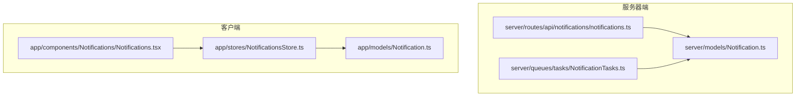
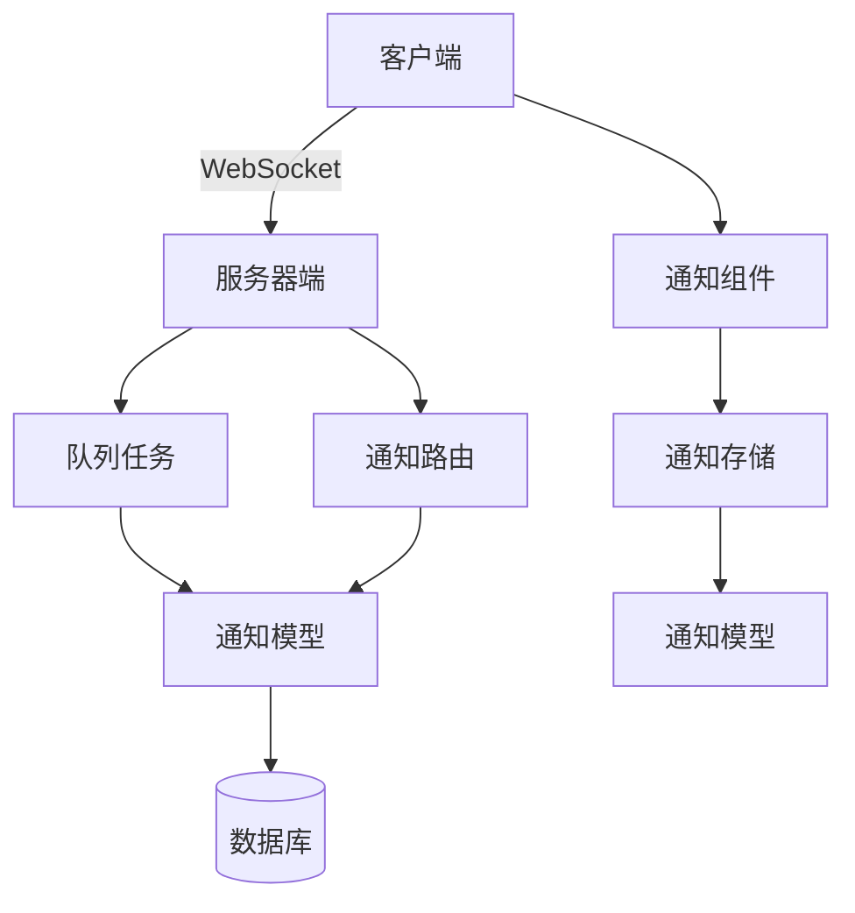
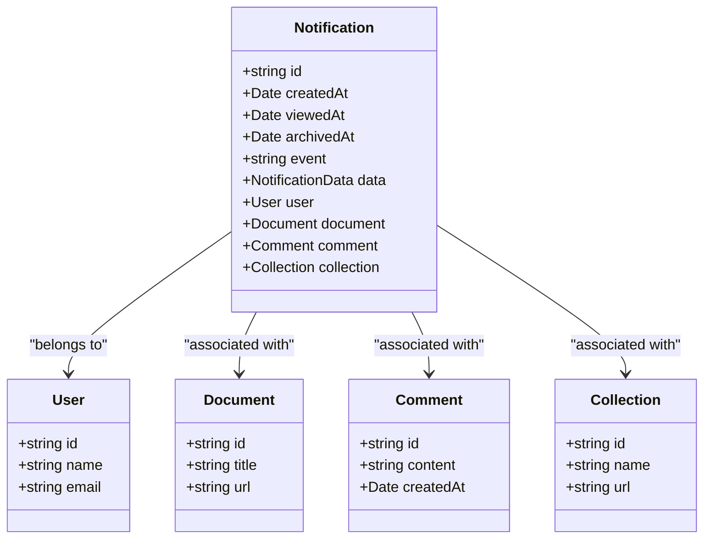
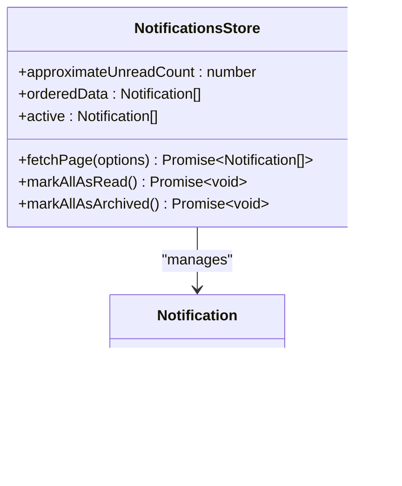
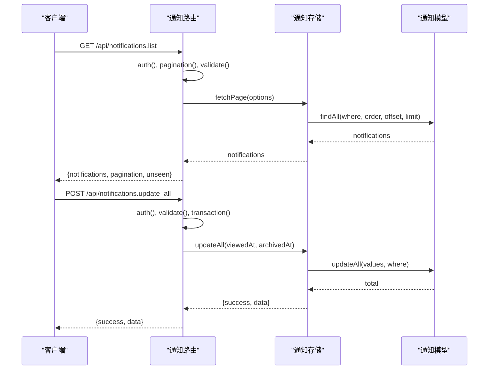
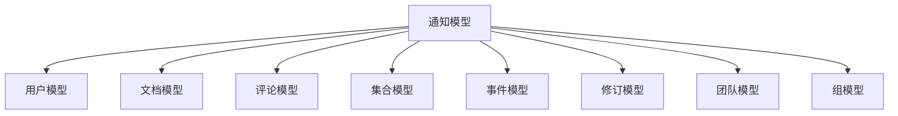

# 通知API

<cite>
**本文档中引用的文件**  
- [Notification.ts](file://server/models/Notification.ts)
- [NotificationsStore.ts](file://app/stores/NotificationsStore.ts)
- [notifications.ts](file://server/routes/api/notifications/notifications.ts)
- [Notifications.tsx](file://app/components/Notifications/Notifications.tsx)
- [Notification.ts](file://app/models/Notification.ts)
</cite>

## 目录
1. [简介](#简介)
2. [项目结构](#项目结构)
3. [核心组件](#核心组件)
4. [架构概述](#架构概述)
5. [详细组件分析](#详细组件分析)
6. [依赖分析](#依赖分析)
7. [性能考虑](#性能考虑)
8. [故障排除指南](#故障排除指南)
9. [结论](#结论)

## 简介
通知API是baozi项目中用于管理实时通知的核心模块。该系统支持通知的创建、读取状态管理和订阅设置，通过RESTful端点实现。通知系统集成了WebSocket，支持实时通信，并通过批量推送和性能优化确保高效运行。本文档详细介绍了通知系统的实现细节，包括请求参数、响应格式和推送机制，为初学者提供实时通信的基本概念，同时为经验丰富的开发者提供最佳实践。

## 项目结构
通知API的文件分布在多个目录中，主要包括服务器端模型、路由、队列任务和客户端组件。服务器端模型定义了通知的数据结构和行为，路由处理API请求，队列任务负责异步处理通知。客户端组件则负责展示通知和用户交互。

**Diagram sources**
- [Notification.ts](file://server/models/Notification.ts)
- [notifications.ts](file://server/routes/api/notifications/notifications.ts)
- [Notifications.tsx](file://app/components/Notifications/Notifications.tsx)
- [NotificationsStore.ts](file://app/stores/NotificationsStore.ts)
- [Notification.ts](file://app/models/Notification.ts)

**Section sources**
- [Notification.ts](file://server/models/Notification.ts)
- [notifications.ts](file://server/routes/api/notifications/notifications.ts)
- [Notifications.tsx](file://app/components/Notifications/Notifications.tsx)
- [NotificationsStore.ts](file://app/stores/NotificationsStore.ts)
- [Notification.ts](file://app/models/Notification.ts)

## 核心组件
通知API的核心组件包括通知模型、通知存储和通知路由。通知模型定义了通知的数据结构和行为，通知存储管理通知的状态和操作，通知路由处理API请求。

**Section sources**
- [Notification.ts](file://server/models/Notification.ts)
- [NotificationsStore.ts](file://app/stores/NotificationsStore.ts)
- [notifications.ts](file://server/routes/api/notifications/notifications.ts)

## 架构概述
通知API的架构分为客户端和服务器端。客户端通过WebSocket与服务器端通信，服务器端通过队列任务异步处理通知。通知模型定义了通知的数据结构，通知存储管理通知的状态，通知路由处理API请求。

**Diagram sources**
- [Notification.ts](file://server/models/Notification.ts)
- [notifications.ts](file://server/routes/api/notifications/notifications.ts)
- [Notifications.tsx](file://app/components/Notifications/Notifications.tsx)
- [NotificationsStore.ts](file://app/stores/NotificationsStore.ts)

## 详细组件分析
### 通知模型分析
通知模型定义了通知的数据结构和行为。它包括通知的ID、创建时间、查看时间、归档时间、事件类型和相关数据。通知模型还定义了通知的关联关系，如用户、文档、评论和集合。

**Diagram sources**
- [Notification.ts](file://server/models/Notification.ts)

**Section sources**
- [Notification.ts](file://server/models/Notification.ts)

### 通知存储分析
通知存储管理通知的状态和操作。它提供了获取通知列表、标记所有通知为已读和归档所有通知的方法。通知存储还维护了通知的读取状态和归档状态。

**Diagram sources**
- [NotificationsStore.ts](file://app/stores/NotificationsStore.ts)

**Section sources**
- [NotificationsStore.ts](file://app/stores/NotificationsStore.ts)

### 通知路由分析
通知路由处理API请求，包括获取通知列表、更新通知状态和取消订阅。通知路由使用Koa框架，通过中间件进行身份验证和事务管理。

**Diagram sources**
- [notifications.ts](file://server/routes/api/notifications/notifications.ts)

**Section sources**
- [notifications.ts](file://server/routes/api/notifications/notifications.ts)

## 依赖分析
通知API依赖于多个模块，包括用户模型、文档模型、评论模型和集合模型。这些模块通过关联关系与通知模型连接，确保数据的一致性和完整性。

**Diagram sources**
- [Notification.ts](file://server/models/Notification.ts)

**Section sources**
- [Notification.ts](file://server/models/Notification.ts)

## 性能考虑
通知API通过批量操作和异步处理优化性能。批量更新通知状态减少了数据库查询次数，异步处理通知任务避免了阻塞主线程。此外，通知API使用Redis缓存频繁访问的数据，提高响应速度。

**Section sources**
- [Notification.ts](file://server/models/Notification.ts)
- [notifications.ts](file://server/routes/api/notifications/notifications.ts)

## 故障排除指南
### 通知未显示
检查通知存储的`fetchPage`方法是否正确调用，确保API请求的参数正确。检查服务器端日志，确认通知路由是否正确处理请求。

### 通知状态未更新
检查通知存储的`markAllAsRead`和`markAllAsArchived`方法是否正确调用，确保API请求的参数正确。检查服务器端日志，确认通知路由是否正确处理更新请求。

### WebSocket连接失败
检查客户端WebSocket连接配置，确保服务器地址和端口正确。检查服务器端WebSocket服务是否正常运行，确保防火墙未阻止连接。

**Section sources**
- [NotificationsStore.ts](file://app/stores/NotificationsStore.ts)
- [notifications.ts](file://server/routes/api/notifications/notifications.ts)
- [WebsocketProvider.tsx](file://app/components/WebsocketProvider.tsx)

## 结论
通知API是baozi项目中实现实时通知的核心模块。通过RESTful端点和WebSocket集成，通知API提供了高效的通知管理和实时通信功能。本文档详细介绍了通知系统的实现细节，包括请求参数、响应格式和推送机制，为开发者提供了全面的参考。通过批量推送和性能优化，通知API确保了系统的高效运行。