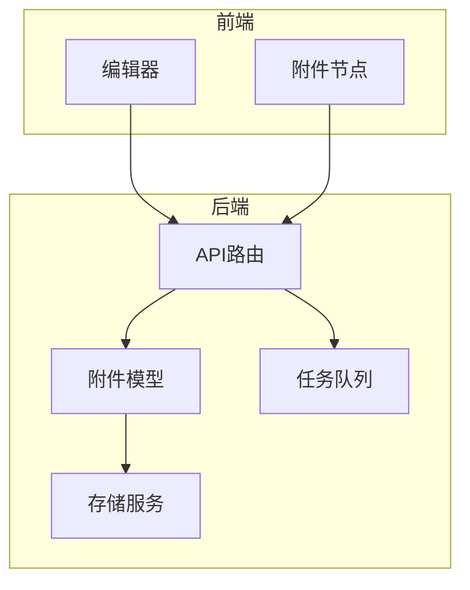
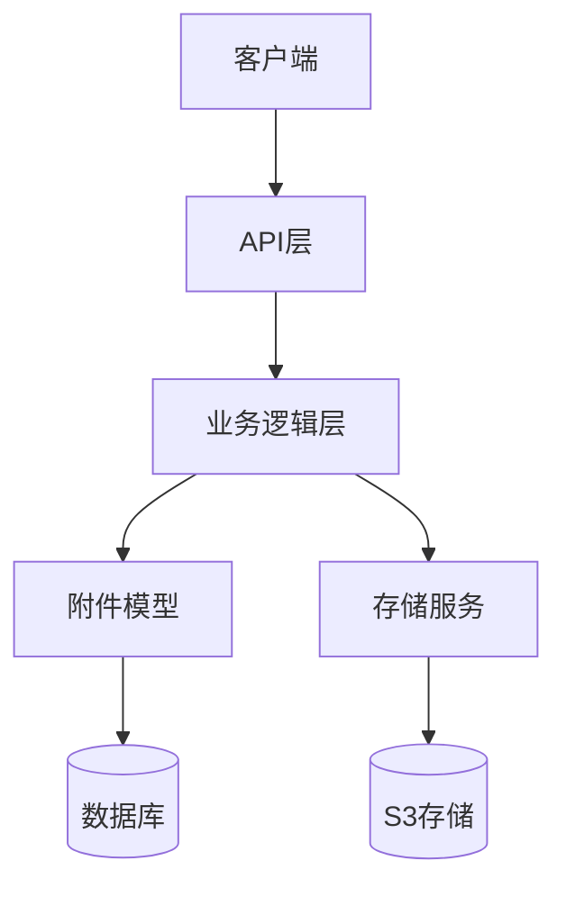
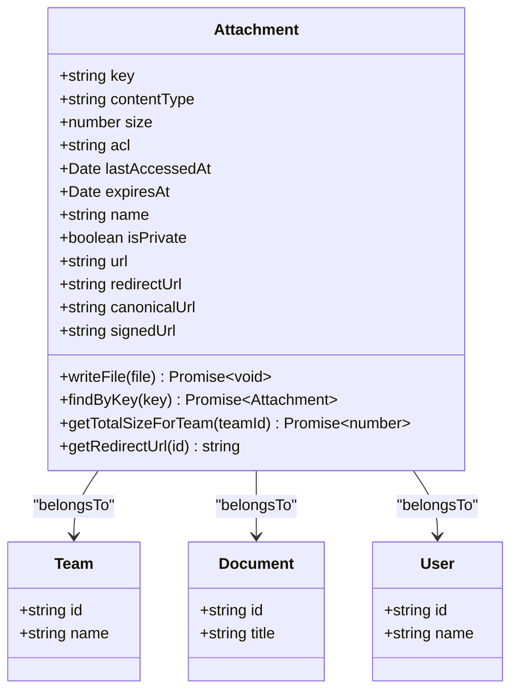
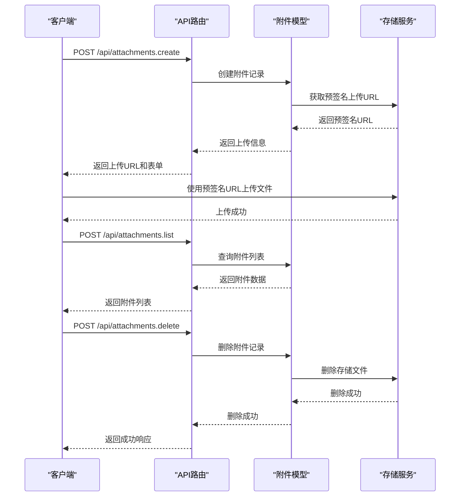
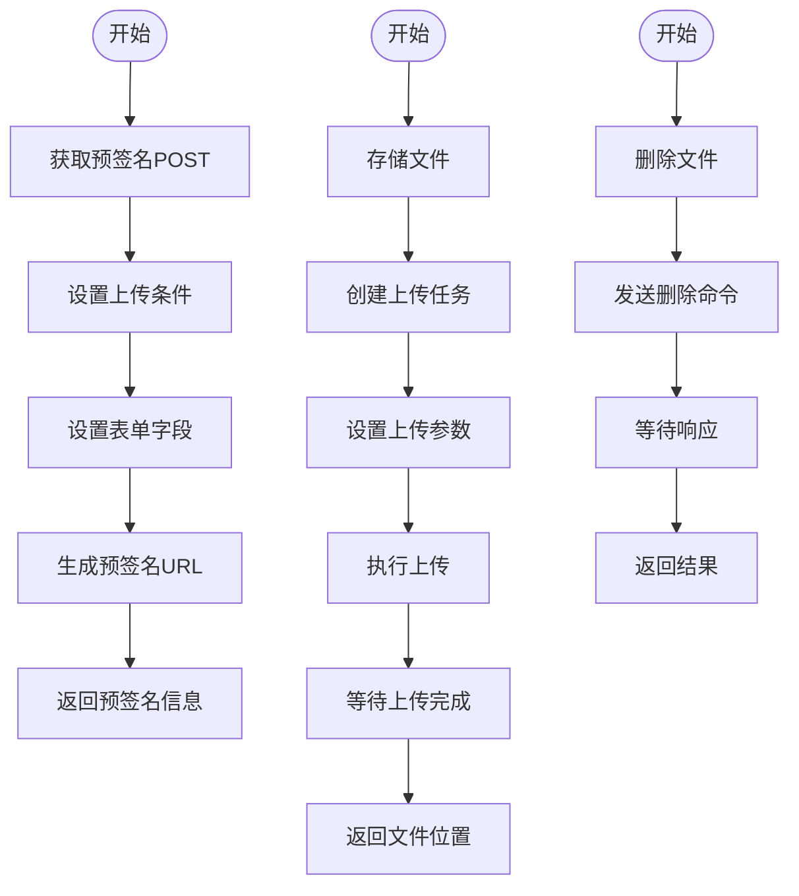
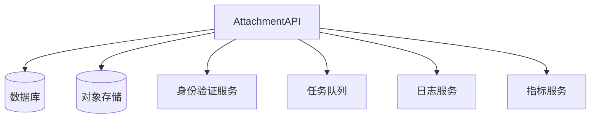

# 附件API

<cite>
**本文档中引用的文件**  
- [attachments.ts](file://server/routes/api/attachments/attachments.ts)
- [Attachment.ts](file://server/models/Attachment.ts)
- [AttachmentHelper.ts](file://server/models/helpers/AttachmentHelper.ts)
- [S3Storage.ts](file://server/storage/files/S3Storage.ts)
- [attachment.ts](file://server/presenters/attachment.ts)
- [UploadAttachmentFromUrlTask.ts](file://server/queues/tasks/UploadAttachmentFromUrlTask.ts)
- [attachmentCreator.ts](file://server/commands/attachmentCreator.ts)
</cite>

## 目录
1. [简介](#简介)
2. [项目结构](#项目结构)
3. [核心组件](#核心组件)
4. [架构概述](#架构概述)
5. [详细组件分析](#详细组件分析)
6. [依赖分析](#依赖分析)
7. [性能考虑](#性能考虑)
8. [故障排除指南](#故障排除指南)
9. [结论](#结论)

## 简介
本文档详细介绍了baozi项目中附件API的实现，重点阐述了文件上传、下载、预览和删除等操作的RESTful端点。文档结合实际代码示例，展示了文件管理的完整流程，并为初学者提供文件处理的基本概念，同时为经验丰富的开发者提供分块上传、CDN集成和性能优化的最佳实践。

## 项目结构
附件管理功能主要分布在服务器端的API路由、模型、存储和任务队列等模块中。前端编辑器也集成了附件节点，用于在文档中插入和管理附件。

**Diagram sources**
- [attachments.ts](file://server/routes/api/attachments/attachments.ts)
- [Attachment.ts](file://server/models/Attachment.ts)
- [S3Storage.ts](file://server/storage/files/S3Storage.ts)
- [UploadAttachmentFromUrlTask.ts](file://server/queues/tasks/UploadAttachmentFromUrlTask.ts)

**Section sources**
- [attachments.ts](file://server/routes/api/attachments/attachments.ts)
- [Attachment.ts](file://server/models/Attachment.ts)
- [S3Storage.ts](file://server/storage/files/S3Storage.ts)

## 核心组件
附件API的核心组件包括附件模型、API路由、存储服务和任务队列。附件模型定义了附件的数据库结构和业务逻辑，API路由提供了RESTful接口，存储服务负责与底层存储系统交互，任务队列用于异步处理耗时操作。

**Section sources**
- [Attachment.ts](file://server/models/Attachment.ts)
- [attachments.ts](file://server/routes/api/attachments/attachments.ts)
- [S3Storage.ts](file://server/storage/files/S3Storage.ts)
- [UploadAttachmentFromUrlTask.ts](file://server/queues/tasks/UploadAttachmentFromUrlTask.ts)

## 架构概述
附件管理系统的架构分为前端、API层、业务逻辑层和存储层。前端通过API与后端交互，API层处理请求并调用业务逻辑，业务逻辑层协调模型和存储服务，存储层负责实际的文件存储。

**Diagram sources**
- [attachments.ts](file://server/routes/api/attachments/attachments.ts)
- [Attachment.ts](file://server/models/Attachment.ts)
- [S3Storage.ts](file://server/storage/files/S3Storage.ts)

## 详细组件分析
### 附件模型分析
附件模型定义了附件的核心数据结构和行为，包括文件元数据、访问控制和存储位置。

#### 对象导向组件

**Diagram sources**
- [Attachment.ts](file://server/models/Attachment.ts)

**Section sources**
- [Attachment.ts](file://server/models/Attachment.ts)

### API路由分析
API路由提供了附件管理的RESTful接口，包括创建、列出、删除和重定向等操作。

#### API/服务组件

**Diagram sources**
- [attachments.ts](file://server/routes/api/attachments/attachments.ts)
- [Attachment.ts](file://server/models/Attachment.ts)
- [S3Storage.ts](file://server/storage/files/S3Storage.ts)

**Section sources**
- [attachments.ts](file://server/routes/api/attachments/attachments.ts)

### 存储服务分析
存储服务负责与底层存储系统（如S3）交互，提供文件的上传、下载、删除和流式访问功能。

#### 复杂逻辑组件

**Diagram sources**
- [S3Storage.ts](file://server/storage/files/S3Storage.ts)

**Section sources**
- [S3Storage.ts](file://server/storage/files/S3Storage.ts)

## 依赖分析
附件管理系统依赖于多个外部服务和内部组件，包括数据库、对象存储、身份验证和任务队列。

**Diagram sources**
- [attachments.ts](file://server/routes/api/attachments/attachments.ts)
- [Attachment.ts](file://server/models/Attachment.ts)
- [S3Storage.ts](file://server/storage/files/S3Storage.ts)

**Section sources**
- [attachments.ts](file://server/routes/api/attachments/attachments.ts)
- [Attachment.ts](file://server/models/Attachment.ts)
- [S3Storage.ts](file://server/storage/files/S3Storage.ts)

## 性能考虑
附件管理系统在设计时考虑了性能优化，包括使用预签名URL直接上传文件到存储系统，避免了服务器中转的带宽消耗；使用任务队列异步处理耗时操作，提高了API响应速度；以及合理的缓存策略，减少了重复的数据库查询。

## 故障排除指南
### 常见问题
- **上传失败**：检查存储系统的权限配置和网络连接。
- **下载缓慢**：确认是否启用了CDN加速和适当的缓存策略。
- **权限错误**：验证用户身份和附件访问控制列表（ACL）设置。
- **文件丢失**：检查存储系统的备份和恢复机制。

**Section sources**
- [attachments.ts](file://server/routes/api/attachments/attachments.ts)
- [Attachment.ts](file://server/models/Attachment.ts)
- [S3Storage.ts](file://server/storage/files/S3Storage.ts)

## 结论
baozi项目的附件API提供了一套完整的文件管理解决方案，支持文件上传、下载、预览和删除等操作。通过合理的架构设计和性能优化，系统能够高效地处理大量文件，同时保证了安全性和可靠性。对于初学者，文档提供了基本概念和使用示例；对于经验丰富的开发者，文档介绍了分块上传、CDN集成和性能优化的最佳实践。