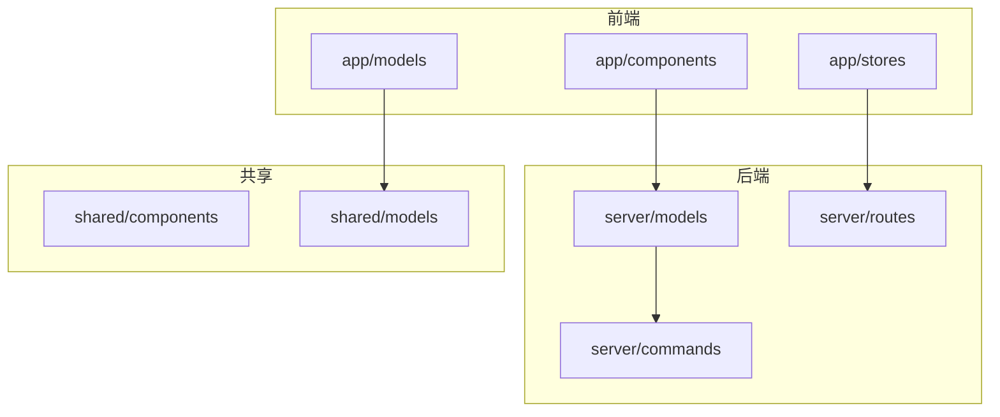
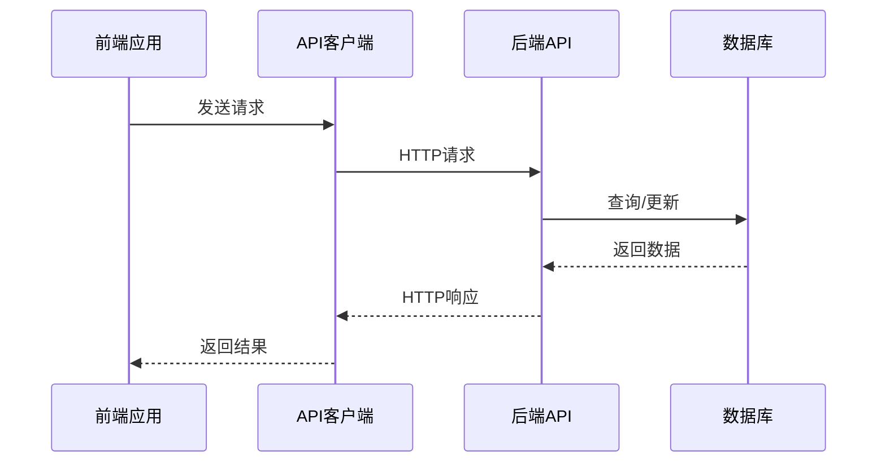
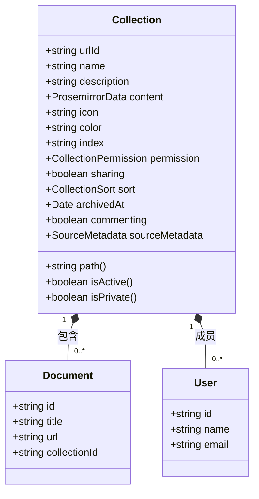
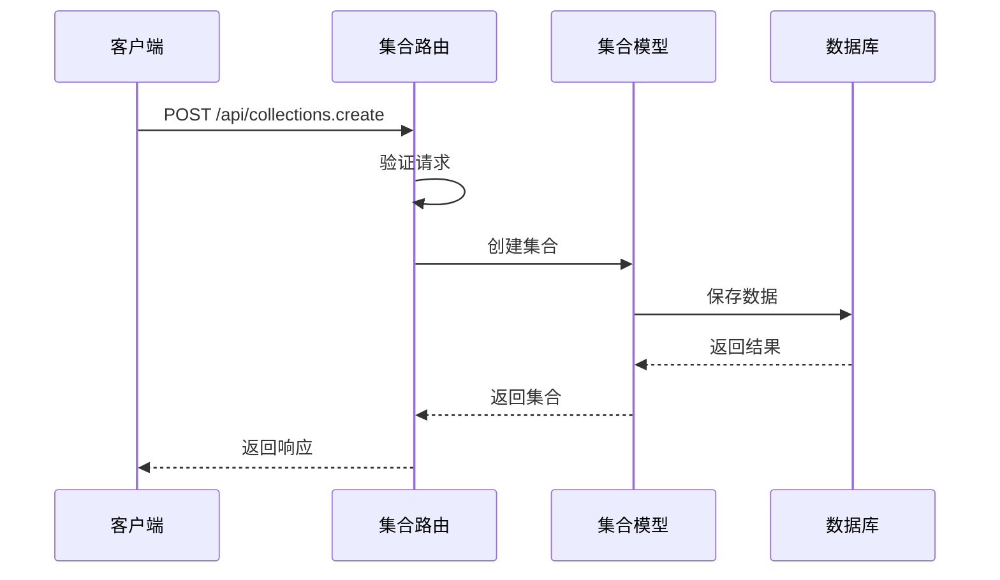
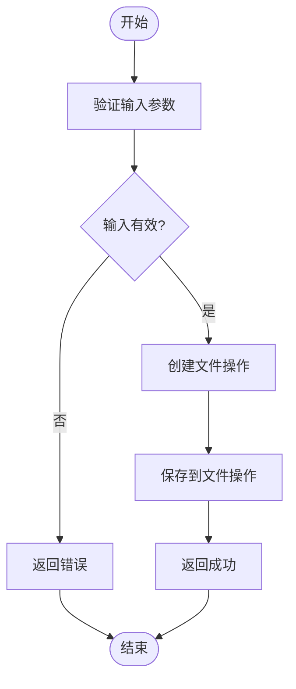
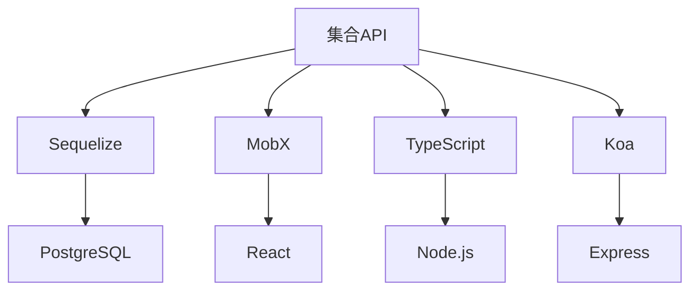

# 集合API

<cite>
**本文档中引用的文件**  
- [Collection.ts](file://server/models/Collection.ts)
- [collections.ts](file://server/routes/api/collections/collections.ts)
- [collectionExporter.ts](file://server/commands/collectionExporter.ts)
- [Collection.ts](file://app/models/Collection.ts)
</cite>

## 目录
1. [简介](#简介)
2. [项目结构](#项目结构)
3. [核心组件](#核心组件)
4. [架构概述](#架构概述)
5. [详细组件分析](#详细组件分析)
6. [依赖分析](#依赖分析)
7. [性能考虑](#性能考虑)
8. [故障排除指南](#故障排除指南)
9. [结论](#结论)
10. [附录](#附录)（如有必要）

## 简介
本文档详细介绍了baozi项目中集合管理相关的RESTful端点。重点阐述了集合创建、组织结构管理、权限控制等操作的实现细节，包括请求参数、响应格式和业务规则验证。通过实际代码示例，展示了集合层级结构管理的完整流程。为初学者提供知识库组织的基本概念，同时为经验丰富的开发者提供树形结构管理、权限继承和性能优化的最佳实践。

## 项目结构
项目结构清晰地分为前端和后端两大部分。前端代码位于`app/`目录下，包含组件、模型、存储等。后端代码位于`server/`目录下，包含模型、路由、命令等。`shared/`目录包含前后端共享的代码。

**Diagram sources**
- [app/models/Collection.ts](file://app/models/Collection.ts)
- [server/models/Collection.ts](file://server/models/Collection.ts)

**Section sources**
- [app/models/Collection.ts](file://app/models/Collection.ts)
- [server/models/Collection.ts](file://server/models/Collection.ts)

## 核心组件
集合管理的核心组件包括集合模型、集合路由和集合命令。集合模型定义了集合的数据结构和业务逻辑，集合路由处理HTTP请求，集合命令执行具体的业务操作。

**Section sources**
- [server/models/Collection.ts](file://server/models/Collection.ts)
- [server/routes/api/collections/collections.ts](file://server/routes/api/collections/collections.ts)
- [server/commands/collectionExporter.ts](file://server/commands/collectionExporter.ts)

## 架构概述
集合API的架构基于RESTful设计原则，使用Koa框架处理HTTP请求。前端通过API客户端与后端通信，后端通过Sequelize ORM与数据库交互。集合管理功能包括创建、读取、更新、删除（CRUD）操作，以及导入、导出、权限管理等高级功能。

**Diagram sources**
- [server/routes/api/collections/collections.ts](file://server/routes/api/collections/collections.ts)
- [app/models/Collection.ts](file://app/models/Collection.ts)

## 详细组件分析
### 集合模型分析
集合模型定义了集合的数据结构和业务逻辑。包括集合名称、描述、图标、颜色、权限、排序等属性。通过Sequelize ORM与数据库交互，支持数据验证、钩子函数、关联关系等特性。

#### 类图

**Diagram sources**
- [server/models/Collection.ts](file://server/models/Collection.ts)
- [app/models/Collection.ts](file://app/models/Collection.ts)

### 集合路由分析
集合路由处理HTTP请求，包括创建、读取、更新、删除等操作。每个路由都经过身份验证和权限检查，确保只有授权用户才能执行相应操作。

#### 序列图

**Diagram sources**
- [server/routes/api/collections/collections.ts](file://server/routes/api/collections/collections.ts)
- [server/models/Collection.ts](file://server/models/Collection.ts)

### 集合命令分析
集合命令执行具体的业务操作，如导出集合。命令通过事务处理，确保数据一致性。支持异步操作，提高系统响应速度。

#### 流程图

**Diagram sources**
- [server/commands/collectionExporter.ts](file://server/commands/collectionExporter.ts)
- [server/models/Collection.ts](file://server/models/Collection.ts)

**Section sources**
- [server/commands/collectionExporter.ts](file://server/commands/collectionExporter.ts)
- [server/models/Collection.ts](file://server/models/Collection.ts)

## 依赖分析
集合管理功能依赖于多个组件和库。前端依赖于MobX进行状态管理，后端依赖于Sequelize进行数据库操作。共享组件依赖于TypeScript类型定义，确保前后端数据一致性。

**Diagram sources**
- [package.json](file://package.json)

**Section sources**
- [package.json](file://package.json)

## 性能考虑
集合管理功能在设计时考虑了性能优化。通过缓存集合文档结构，减少数据库查询次数。使用索引优化数据库查询速度，支持分页查询，避免一次性加载大量数据。

## 故障排除指南
常见问题包括权限不足、数据验证失败、网络连接问题等。建议检查用户权限、请求参数、网络连接等。使用日志记录和调试工具，定位问题根源。

**Section sources**
- [server/errors.ts](file://server/errors.ts)
- [server/logging/tracing.ts](file://server/logging/tracing.ts)

## 结论
本文档详细介绍了baozi项目中集合管理相关的RESTful端点。通过实际代码示例，展示了集合层级结构管理的完整流程。为初学者提供知识库组织的基本概念，同时为经验丰富的开发者提供树形结构管理、权限继承和性能优化的最佳实践。