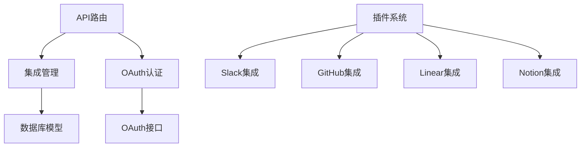
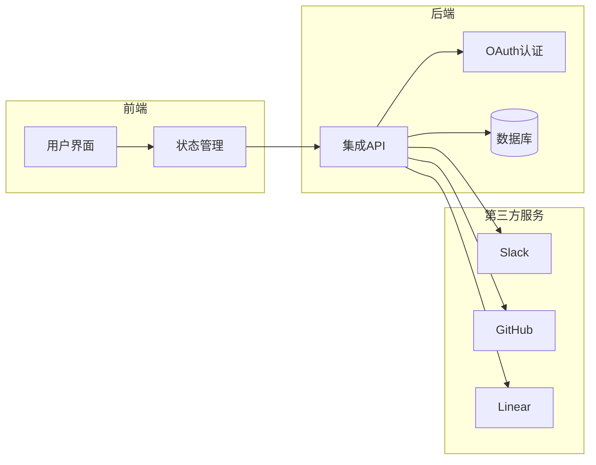
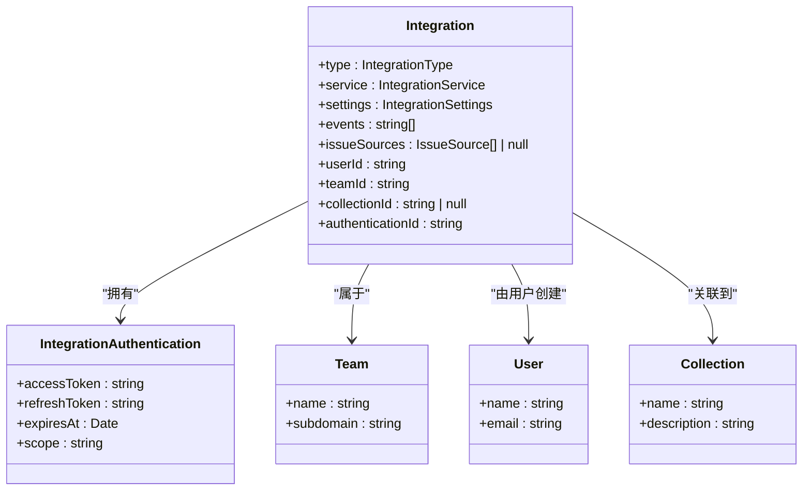
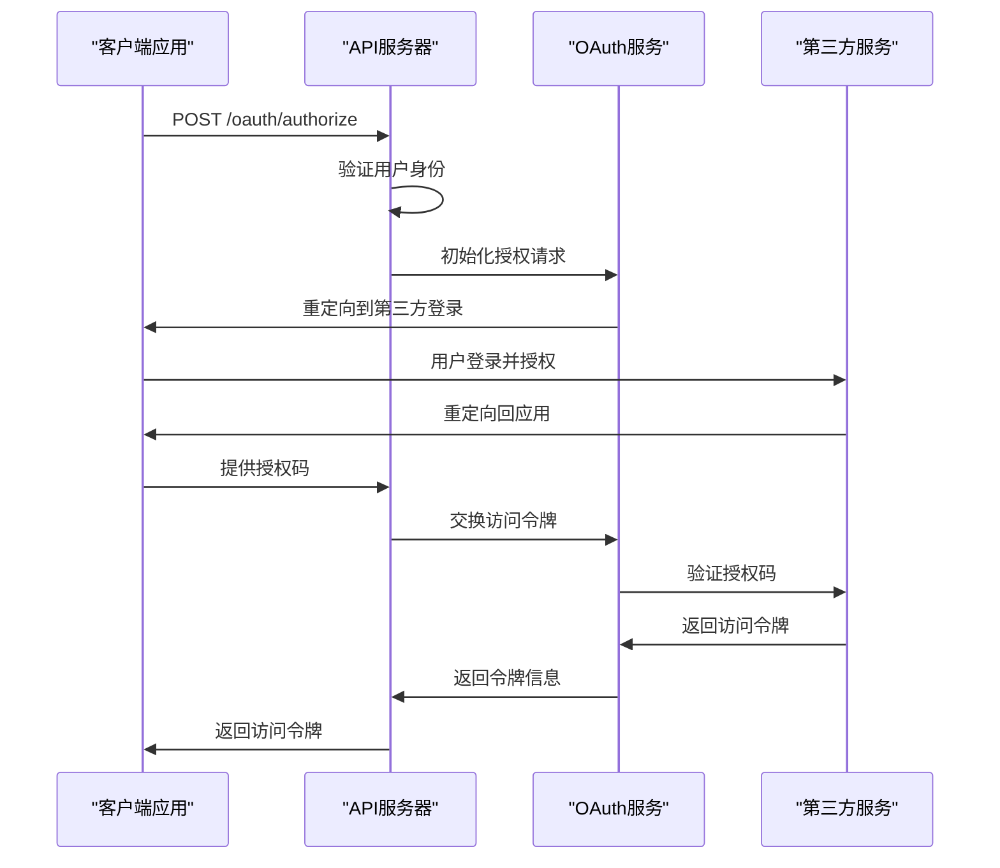
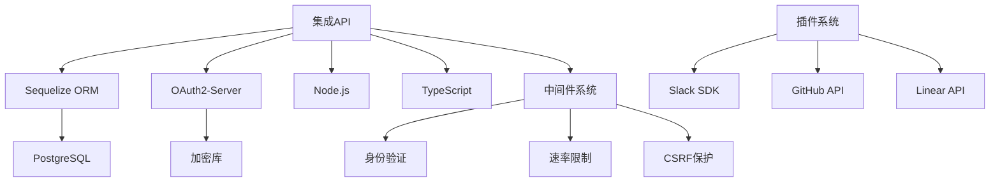

# 集成API

<cite>
**本文档中引用的文件**  
- [integrations.ts](file://server/routes/api/integrations/integrations.ts)
- [Integration.ts](file://server/models/Integration.ts)
- [Integration.ts](file://app/models/Integration.ts)
- [IntegrationsStore.ts](file://app/stores/IntegrationsStore.ts)
- [index.ts](file://server/routes/oauth/index.ts)
- [slack](file://plugins/slack)
- [github](file://plugins/github)
</cite>

## 目录
1. [简介](#简介)
2. [项目结构](#项目结构)
3. [核心组件](#核心组件)
4. [架构概述](#架构概述)
5. [详细组件分析](#详细组件分析)
6. [依赖分析](#依赖分析)
7. [性能考虑](#性能考虑)
8. [故障排除指南](#故障排除指南)
9. [结论](#结论)

## 简介
本文档详细介绍了baozi项目中的第三方服务集成API，重点涵盖与Slack、GitHub等平台的RESTful端点集成。文档内容包括集成的创建、配置、验证等操作的实现细节，涵盖请求参数、响应格式和认证机制。通过实际代码示例，展示OAuth流程、Webhook处理和性能优化的最佳实践，为初学者提供服务集成的基本概念，同时为经验丰富的开发者提供深入的技术指导。

## 项目结构
baozi项目的集成功能主要分布在`server/routes/api/integrations`和`plugins`目录中。`server/routes/api`包含核心API路由，而`plugins`目录则包含各个第三方服务的具体实现。

**Diagram sources**
- [integrations.ts](file://server/routes/api/integrations/integrations.ts)
- [index.ts](file://server/routes/oauth/index.ts)

**Section sources**
- [integrations.ts](file://server/routes/api/integrations/integrations.ts)
- [index.ts](file://server/routes/oauth/index.ts)

## 核心组件
集成API的核心组件包括集成模型、认证机制和插件系统。`Integration`模型定义了集成的基本属性和关联关系，OAuth系统处理第三方服务的认证流程，插件系统则提供了可扩展的服务集成能力。

**Section sources**
- [Integration.ts](file://server/models/Integration.ts)
- [Integration.ts](file://app/models/Integration.ts)
- [IntegrationsStore.ts](file://app/stores/IntegrationsStore.ts)

## 架构概述
baozi的集成架构采用模块化设计，通过插件系统实现第三方服务的可扩展集成。核心API提供统一的集成管理接口，OAuth系统处理安全认证，各服务插件实现具体的功能集成。

**Diagram sources**
- [integrations.ts](file://server/routes/api/integrations/integrations.ts)
- [index.ts](file://server/routes/oauth/index.ts)

## 详细组件分析

### 集成模型分析
集成模型是整个集成系统的基础，定义了集成的基本属性、关联关系和生命周期钩子。

#### 集成模型类图

**Diagram sources**
- [Integration.ts](file://server/models/Integration.ts)

**Section sources**
- [Integration.ts](file://server/models/Integration.ts)
- [Integration.ts](file://app/models/Integration.ts)

### OAuth认证流程
OAuth系统处理与第三方服务的安全认证，确保用户数据的安全访问。

#### OAuth认证序列图

**Diagram sources**
- [index.ts](file://server/routes/oauth/index.ts)

**Section sources**
- [index.ts](file://server/routes/oauth/index.ts)

## 依赖分析
集成系统依赖于多个核心模块和第三方库，形成了复杂的依赖关系网络。

**Diagram sources**
- [package.json](file://package.json)
- [integrations.ts](file://server/routes/api/integrations/integrations.ts)

**Section sources**
- [integrations.ts](file://server/routes/api/integrations/integrations.ts)
- [index.ts](file://server/routes/oauth/index.ts)

## 性能考虑
集成系统的性能优化主要集中在以下几个方面：数据库查询优化、缓存策略、异步处理和速率限制。

- **数据库查询**：使用适当的索引和关联预加载来优化查询性能
- **缓存策略**：对频繁访问的集成配置进行缓存
- **异步处理**：将耗时的操作（如Webhook发送）放入队列异步处理
- **速率限制**：实施合理的速率限制策略，防止滥用
- **连接池**：使用数据库连接池提高数据库操作效率

## 故障排除指南
在集成开发和使用过程中，可能会遇到各种问题。以下是一些常见问题及其解决方案：

**Section sources**
- [errors.ts](file://server/errors.ts)
- [oauthErrorHandler.ts](file://server/routes/oauth/middlewares/oauthErrorHandler.ts)

## 结论
baozi项目的集成API提供了一套完整、安全且可扩展的第三方服务集成解决方案。通过模块化的架构设计和清晰的API接口，开发者可以轻松地集成各种第三方服务。文档详细介绍了核心组件、架构设计和最佳实践，为开发者提供了全面的技术指导。