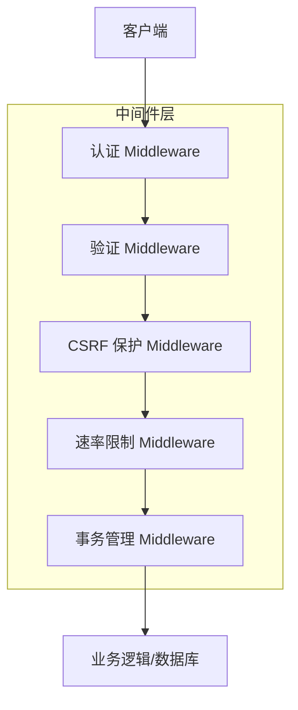
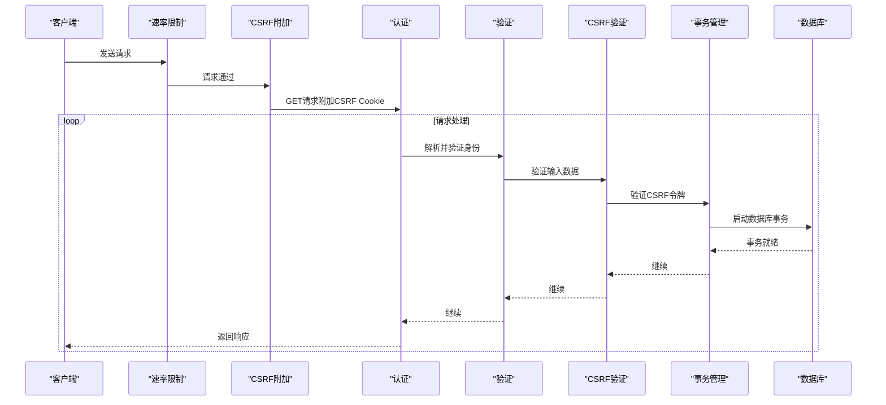
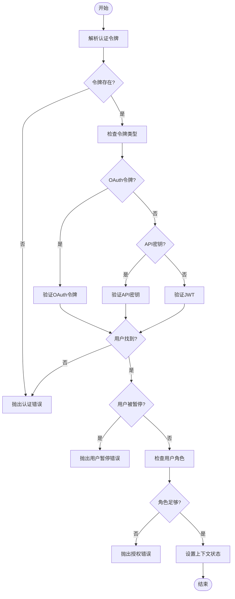
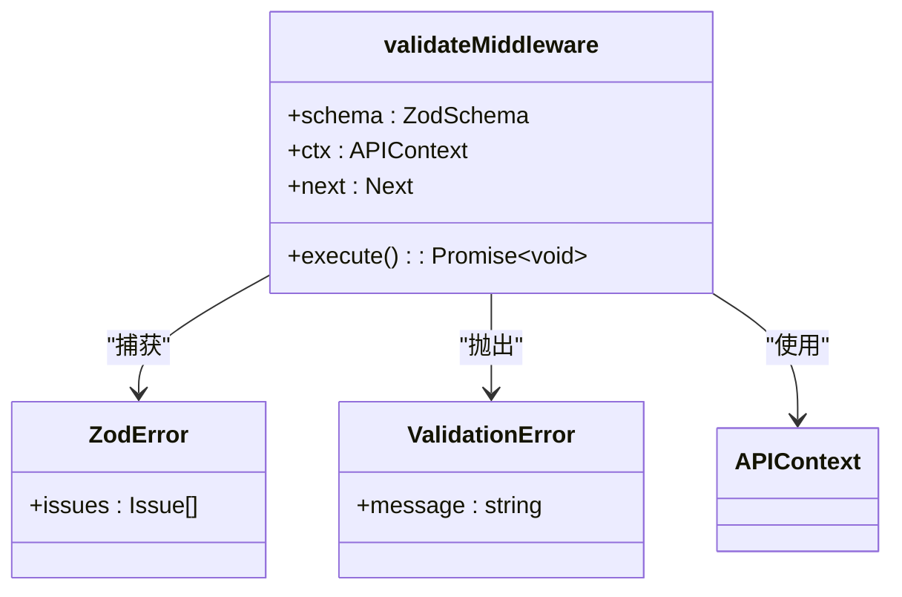
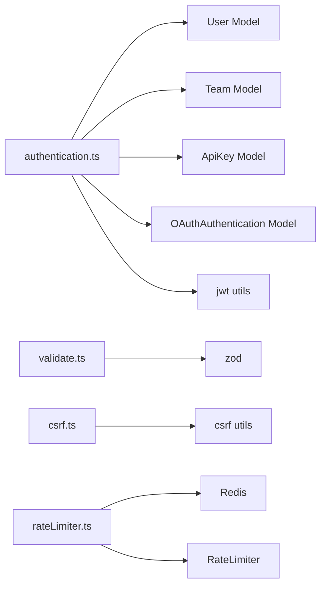

# 中间件系统

<cite>
**本文档中引用的文件**  
- [authentication.ts](file://server/middlewares/authentication.ts)
- [validate.ts](file://server/middlewares/validate.ts)
- [csrf.ts](file://server/middlewares/csrf.ts)
- [rateLimiter.ts](file://server/middlewares/rateLimiter.ts)
- [transaction.ts](file://server/middlewares/transaction.ts)
- [context.ts](file://server/context.ts)
</cite>

## 目录
1. [简介](#简介)
2. [项目结构](#项目结构)
3. [核心组件](#核心组件)
4. [架构概述](#架构概述)
5. [详细组件分析](#详细组件分析)
6. [依赖分析](#依赖分析)
7. [性能考虑](#性能考虑)
8. [故障排除指南](#故障排除指南)
9. [结论](#结论)

## 简介
本文档全面介绍了baozi项目中的中间件系统，重点阐述了请求处理管道的设计与实现。文档详细说明了认证、验证、CSRF保护、速率限制和事务管理等关键中间件的功能与配置方式，解释它们如何在请求生命周期中协同工作，保障应用的安全性与稳定性。通过分析`authentication.ts`和`validate.ts`中的实际代码，展示了中间件的编写模式和错误处理机制。文档旨在为初学者提供清晰的中间件概念解释，同时为经验丰富的开发者提供自定义中间件开发的最佳实践。

## 项目结构
中间件系统主要位于`server/middlewares/`目录下，该目录包含了处理HTTP请求各个阶段的核心逻辑。这些中间件被设计为可复用的函数，通过Koa框架的洋葱模型（onion model）依次执行，形成一个完整的请求处理管道。每个中间件负责特定的职责，如身份验证、数据校验或安全防护，共同构建了一个健壮且可扩展的后端架构。

**Diagram sources**
- [authentication.ts](file://server/middlewares/authentication.ts)
- [validate.ts](file://server/middlewares/validate.ts)
- [csrf.ts](file://server/middlewares/csrf.ts)
- [rateLimiter.ts](file://server/middlewares/rateLimiter.ts)
- [transaction.ts](file://server/middlewares/transaction.ts)

**Section sources**
- [server/middlewares/](file://server/middlewares/)

## 核心组件
本系统的核心组件是一系列Koa中间件，它们共同构成了应用的安全与数据处理基础。认证中间件负责解析和验证用户身份，验证中间件确保输入数据的合法性，CSRF保护中间件防止跨站请求伪造攻击，速率限制中间件保护系统免受滥用，而事务管理中间件则保证了数据库操作的原子性和一致性。这些组件通过函数式编程的方式被组合在一起，形成了一个清晰、解耦且易于维护的请求处理流程。

**Section sources**
- [authentication.ts](file://server/middlewares/authentication.ts#L1-L280)
- [validate.ts](file://server/middlewares/validate.ts#L1-L25)

## 架构概述
baozi项目的中间件系统采用分层架构，请求从客户端进入后，依次通过多个中间件的处理。首先，`defaultRateLimiter`对所有请求进行全局速率限制。随后，`attachCSRFToken`为安全的GET请求附加CSRF令牌。当请求到达具体路由时，开发者可以根据需要组合使用`auth`、`validate`、`verifyCSRFToken`和`transaction`等中间件。这种设计确保了安全性、数据完整性和业务逻辑的正确执行。

**Diagram sources**
- [rateLimiter.ts](file://server/middlewares/rateLimiter.ts#L1-L99)
- [csrf.ts](file://server/middlewares/csrf.ts#L1-L110)
- [authentication.ts](file://server/middlewares/authentication.ts#L1-L280)
- [validate.ts](file://server/middlewares/validate.ts#L1-L25)
- [transaction.ts](file://server/middlewares/transaction.ts#L1-L21)

## 详细组件分析

### 认证中间件分析
认证中间件是整个系统安全的基石，它负责解析和验证用户的身份。该中间件支持多种认证方式，包括基于Cookie的JWT、API密钥和OAuth令牌。通过`parseAuthentication`函数，它能从请求头、请求体、查询参数或Cookie中提取令牌。`validateAuthentication`函数则根据令牌类型进行相应的验证，确保用户身份的有效性，并检查其角色权限是否满足访问要求。

**Diagram sources**
- [authentication.ts](file://server/middlewares/authentication.ts#L87-L279)

**Section sources**
- [authentication.ts](file://server/middlewares/authentication.ts#L1-L280)

### 验证中间件分析
验证中间件利用Zod库对传入的请求数据进行严格的模式校验。它接收一个Zod模式作为参数，该模式定义了请求体、查询参数等数据的预期结构和类型。在请求处理过程中，中间件会尝试解析`ctx.request`对象，如果数据不符合预定义的模式，将捕获`ZodError`并将其转换为更友好的`ValidationError`抛出，从而确保只有合法的数据才能进入业务逻辑层。

**Diagram sources**
- [validate.ts](file://server/middlewares/validate.ts#L5-L23)

**Section sources**
- [validate.ts](file://server/middlewares/validate.ts#L1-L25)

### CSRF保护中间件分析
CSRF保护中间件采用“双重提交Cookie”（Double Submit Cookie）策略来防御跨站请求伪造攻击。`attachCSRFToken`中间件在处理安全的GET请求时，生成一个随机的CSRF令牌并将其作为Cookie发送给客户端。`verifyCSRFToken`中间件则在处理可能修改状态的请求（如POST、PUT）时，要求客户端在请求头或表单字段中提供相同的令牌。服务器通过比对Cookie中的令牌和请求中的令牌来验证请求的合法性。

**Section sources**
- [csrf.ts](file://server/middlewares/csrf.ts#L1-L110)

### 速率限制中间件分析
速率限制中间件使用Redis作为后端存储，实现基于IP地址或特定路径的请求频率控制。系统提供了`defaultRateLimiter`用于全局限制，以及`rateLimiter`函数用于为特定路由配置自定义的限制策略。该中间件通过`RateLimiter`工具类与Redis交互，记录和检查请求次数，当超过阈值时，会返回429状态码并设置相应的`Retry-After`等HTTP头。

**Section sources**
- [rateLimiter.ts](file://server/middlewares/rateLimiter.ts#L1-L99)

### 事务管理中间件分析
事务管理中间件为数据库操作提供了ACID保证。它使用Sequelize ORM的事务功能，为每个请求创建一个数据库事务，并将其挂载到`ctx.state.transaction`上。在路由处理函数中，所有数据库操作都应使用这个事务对象。如果处理过程中发生任何错误，整个事务将被回滚，确保数据的一致性。

**Section sources**
- [transaction.ts](file://server/middlewares/transaction.ts#L1-L21)

## 依赖分析
中间件系统依赖于多个内部和外部模块。`authentication.ts`依赖于`@server/models`中的`User`、`Team`、`ApiKey`和`OAuthAuthentication`模型来查询数据库，以及`@server/utils/jwt`来解析JWT令牌。`validate.ts`依赖于`zod`库进行数据校验。`csrf.ts`依赖于`@server/utils/csrf`进行令牌的生成和验证。`rateLimiter.ts`依赖于`Redis`和`RateLimiter`工具类。这些依赖关系清晰地划分了职责，使得每个中间件都能专注于其核心功能。

**Diagram sources**
- [authentication.ts](file://server/middlewares/authentication.ts#L1-L280)
- [validate.ts](file://server/middlewares/validate.ts#L1-L25)
- [csrf.ts](file://server/middlewares/csrf.ts#L1-L110)
- [rateLimiter.ts](file://server/middlewares/rateLimiter.ts#L1-L99)

**Section sources**
- [server/models/](file://server/models/)
- [server/utils/](file://server/utils/)

## 性能考虑
中间件的执行顺序对性能有重要影响。全局中间件（如`defaultRateLimiter`）应在最外层，以便尽早拒绝恶意或超限的请求。认证和验证中间件应尽可能早地执行，以避免为无效请求执行后续的昂贵操作。事务管理中间件应仅在需要数据库写操作的路由中使用，以减少数据库连接的开销。此外，异步操作如`user.updateActiveAt()`被设计为非阻塞的，以避免影响主请求流程的响应时间。

## 故障排除指南
当遇到中间件相关的问题时，可以按照以下步骤进行排查：
1.  **认证失败**：检查令牌是否正确传递（Header、Cookie等），确认令牌未过期，并验证用户角色是否足够。
2.  **验证错误**：检查请求数据的结构是否符合API文档，确认所有必填字段都已提供。
3.  **CSRF错误**：对于表单提交，确保CSRF令牌已包含在请求中；对于API调用，确认使用了API密钥或Bearer Token而非Cookie，以绕过CSRF检查。
4.  **速率限制**：检查`Retry-After`响应头以了解重试时间，并确认客户端IP是否被意外限制。
5.  **事务问题**：确保在使用`transaction`中间件的路由中，所有数据库操作都传递了`ctx.state.transaction`。

**Section sources**
- [errors.ts](file://server/errors.ts)

## 结论
baozi项目的中间件系统是一个设计精良、功能完备的安全与数据处理框架。它通过模块化的设计，将复杂的请求处理逻辑分解为一系列职责单一的中间件，极大地提高了代码的可读性、可维护性和可测试性。该系统不仅有效保障了应用的安全性，还为开发者提供了清晰的开发模式和强大的工具支持，是构建健壮Web应用的典范。