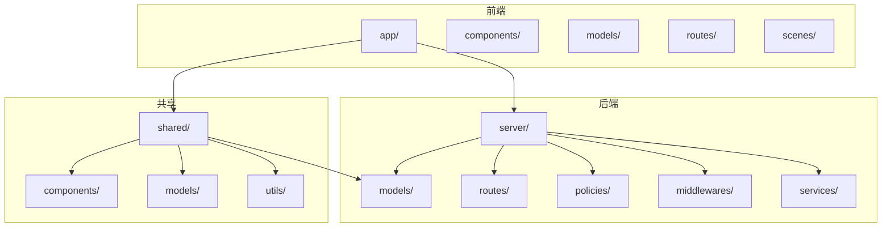
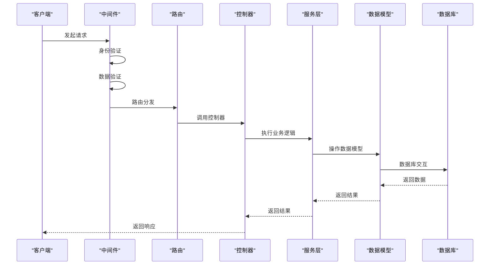
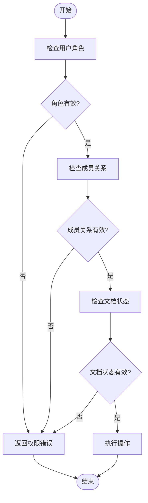
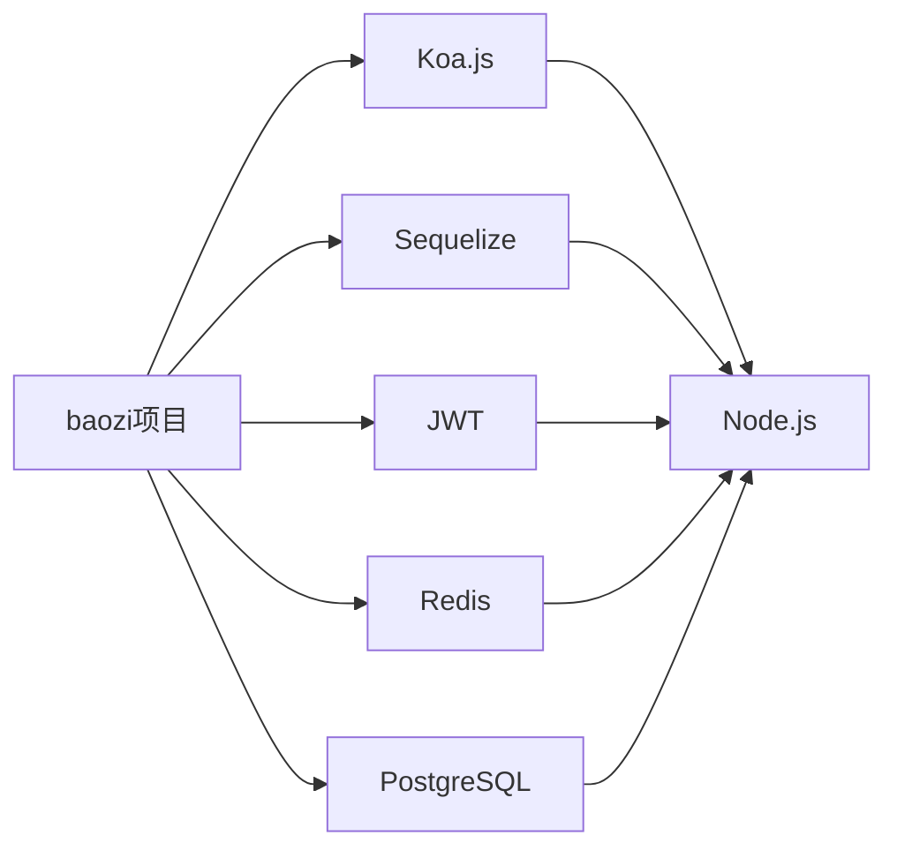

# 后端架构

<cite>
**本文档引用的文件**   
- [index.ts](file://server/index.ts)
- [app.ts](file://server/routes/app.ts)
- [Document.ts](file://server/models/Document.ts)
- [Collection.ts](file://server/models/Collection.ts)
- [User.ts](file://server/models/User.ts)
- [document.ts](file://server/policies/document.ts)
</cite>

## 目录
1. [简介](#简介)
2. [项目结构](#项目结构)
3. [核心组件](#核心组件)
4. [架构概述](#架构概述)
5. [详细组件分析](#详细组件分析)
6. [依赖分析](#依赖分析)
7. [性能考虑](#性能考虑)
8. [故障排除指南](#故障排除指南)
9. [结论](#结论)

## 简介
baozi项目后端采用基于Koa.js的MVC架构设计，实现了清晰的分层结构和模块化组织。该架构通过API路由、服务层逻辑、数据库模型（Sequelize）和中间件系统的协同工作，高效处理用户请求、执行业务逻辑、操作数据库并返回响应。系统支持文档管理、用户认证等核心功能，并通过权限控制策略（policies）、数据验证和性能优化技巧确保安全性和高效性。本文档旨在为初学者提供概念性概述，同时为经验丰富的开发者提供技术细节。

## 项目结构
baozi项目后端遵循典型的MVC模式，将代码组织为模型（models）、视图（views）和控制器（controllers）的分离。主要目录包括`app/`用于前端组件，`server/`包含后端逻辑，`shared/`存放共享代码。`server/`目录下进一步细分为`models/`、`routes/`、`policies/`、`middlewares/`和`services/`等子目录，分别负责数据模型定义、API路由处理、权限策略、中间件实现和服务逻辑。



**Diagram sources**
- [server/index.ts](file://server/index.ts#L1-L258)
- [server/routes/app.ts](file://server/routes/app.ts#L1-L255)

**Section sources**
- [server/index.ts](file://server/index.ts#L1-L258)
- [server/routes/app.ts](file://server/routes/app.ts#L1-L255)

## 核心组件
后端核心组件包括基于Koa.js的Web服务器、Sequelize ORM管理的数据库模型、以及实现业务逻辑的服务层。API路由组织清晰，通过中间件处理身份验证、请求验证和错误处理。服务层封装了复杂的业务逻辑，如文档创建、更新和删除，确保代码的可维护性和可测试性。权限控制策略（policies）定义了用户对资源的访问权限，数据验证确保了输入数据的完整性和安全性。

**Section sources**
- [server/index.ts](file://server/index.ts#L1-L258)
- [server/models/Document.ts](file://server/models/Document.ts#L1-L1318)

## 架构概述
baozi项目后端采用基于Koa.js的MVC架构，实现了请求处理、业务逻辑执行和数据持久化的分离。当用户发起请求时，Koa中间件首先进行身份验证和数据验证，然后路由到相应的控制器。控制器调用服务层执行业务逻辑，服务层通过模型与数据库交互。权限控制策略在关键操作前进行检查，确保只有授权用户才能执行特定操作。整个流程通过异步编程模型实现高效处理。



**Diagram sources**
- [server/index.ts](file://server/index.ts#L1-L258)
- [server/routes/app.ts](file://server/routes/app.ts#L1-L255)

## 详细组件分析
### 文档模型分析
文档模型是baozi项目的核心数据结构之一，定义了文档的各种属性和行为。它包含标题、内容、创建者、更新者等基本信息，并通过关联关系连接到集合、用户和团队。模型使用Sequelize的装饰器定义字段类型、约束和关系，确保数据的一致性和完整性。

#### 对象关系图
```mermaid
classDiagram
class Document {
+string urlId
+string title
+string summary
+string[] previousTitles
+number version
+boolean template
+boolean fullWidth
+string editorVersion
+string icon
+string color
+string text
+ProsemirrorData content
+Uint8Array state
+boolean isWelcome
+number revisionCount
+Date publishedAt
+string[] collaboratorIds
+string path()
+string tasks()
+string getPath()
+void updateCollectionStructure()
+void addDocumentToCollectionStructure()
+void createUrlId()
+void setDocumentVersion()
+void processUpdate()
+void checkParentDocument()
}
class Collection {
+string urlId
+string name
+string description
+ProsemirrorData content
+string icon
+string color
+string index
+CollectionPermission permission
+boolean maintainerApprovalRequired
+NavigationNode[] documentStructure
+boolean sharing
+CollectionSort sort
+Date archivedAt
+boolean commenting
+SourceMetadata sourceMetadata
+string path()
+boolean isActive()
+void onBeforeValidate()
+void onBeforeSave()
+void cacheDocumentStructure()
+void checkLastCollection()
+void deleteDocuments()
+void setIndex()
+void onAfterCreate()
+void checkIndex()
+void publishPermissionChangedEvent()
}
class User {
+string email
+string name
+UserRole role
+string jwtSecret
+Date lastActiveAt
+string lastActiveIp
+Date lastSignedInAt
+string lastSignedInIp
+Date lastSigninEmailSentAt
+Date suspendedAt
+{[key in UserFlag]? : number} flags
+UserPreferences preferences
+NotificationSettings notificationSettings
+keyof typeof locales language
+string timezone
+string avatarUrl
+string suspendedById
+string invitedById
+string teamId
+boolean isSuspended()
+boolean isInvited()
+boolean isAdmin()
+boolean isMember()
+boolean isViewer()
+boolean isGuest()
+string color()
+CollectionPermission defaultCollectionPermission()
+DocumentPermission defaultDocumentPermission()
+string deleteConfirmationCode()
+void setNotificationEventType()
+boolean subscribedToEventType()
+{[key in UserFlag]? : number} setFlag()
+number getFlag()
+{[key in UserFlag]? : number} incrementFlag()
+UserPreferences setPreference()
+boolean getPreference()
+Promise<Group[]> groups()
+Promise<string[]> groupIds()
+Promise<string[]> collectionIds()
+Promise<void> updateActiveAt()
+Promise<void> updateSignedIn()
+Promise<void> rotateJwtSecret()
+string getJwtToken()
+string getCollaborationToken()
+string getTransferToken()
+string getEmailSigninToken()
+Promise<string> getEmailVerificationCode()
+string getEmailUpdateToken()
+Promise<Team[]> availableTeams()
+void checkLastUser()
+void checkLastAdmin()
+void removeIdentifyingInfo()
+void setRandomJwtSecret()
+void checkRoleChange()
+void updateMembershipPermissions()
+void deletePreviousAvatar()
+Promise<User> findByEmail()
+Promise<{active : number, admins : number, viewers : number, all : number, invited : number, suspended : number}> getCounts()
}
Document --> Collection : "belongsTo"
Document --> User : "createdBy"
Document --> User : "updatedBy"
Document --> User : "lastModifiedById"
Document --> Team : "team"
Document --> UserMembership : "memberships"
Document --> GroupMembership : "groupMemberships"
Document --> Revision : "revisions"
Document --> Relationship : "relationships"
Document --> Star : "starred"
Document --> View : "views"
Collection --> User : "user"
Collection --> Team : "team"
Collection --> UserMembership : "memberships"
Collection --> GroupMembership : "groupMemberships"
Collection --> Document : "documents"
User --> Team : "team"
User --> UserAuthentication : "authentications"
```

**Diagram sources**
- [server/models/Document.ts](file://server/models/Document.ts#L1-L1318)
- [server/models/Collection.ts](file://server/models/Collection.ts#L1-L1011)
- [server/models/User.ts](file://server/models/User.ts#L1-L860)

**Section sources**
- [server/models/Document.ts](file://server/models/Document.ts#L1-L1318)
- [server/models/Collection.ts](file://server/models/Collection.ts#L1-L1011)
- [server/models/User.ts](file://server/models/User.ts#L1-L860)

### 权限控制策略分析
权限控制策略是baozi项目安全性的关键组成部分，定义了用户对各种资源的操作权限。策略基于角色和成员关系，通过`cancan`库实现灵活的权限检查。例如，只有文档的创建者或具有管理员权限的用户才能删除文档。

#### 权限检查流程图


**Diagram sources**
- [server/policies/document.ts](file://server/policies/document.ts#L1-L332)

**Section sources**
- [server/policies/document.ts](file://server/policies/document.ts#L1-L332)

## 依赖分析
baozi项目后端依赖于多个第三方库和框架，包括Koa.js用于Web服务器、Sequelize用于ORM、JWT用于身份验证等。这些依赖通过`package.json`文件管理，并通过`yarn`工具安装。项目还使用了Redis进行缓存和会话管理，PostgreSQL作为主要数据库。



**Diagram sources**
- [package.json](file://package.json#L1-L100)

**Section sources**
- [package.json](file://package.json#L1-L100)

## 性能考虑
为了确保系统的高性能，baozi项目采用了多种优化技巧。包括使用Redis缓存频繁访问的数据、对数据库查询进行索引优化、使用异步编程模型避免阻塞操作等。此外，通过Koa中间件的合理配置，实现了请求的高效处理和错误的快速响应。

## 故障排除指南
当遇到问题时，首先检查日志文件以获取错误信息。常见的问题包括数据库连接失败、身份验证错误和权限不足。对于数据库问题，确保PostgreSQL服务正在运行并且配置正确。对于身份验证问题，检查JWT令牌的有效性和过期时间。对于权限问题，确认用户角色和成员关系设置正确。

**Section sources**
- [server/onerror.ts](file://server/onerror.ts#L1-L50)
- [server/logging/Logger.ts](file://server/logging/Logger.ts#L1-L100)

## 结论
baozi项目后端架构设计合理，采用了现代Web开发的最佳实践。通过基于Koa.js的MVC架构，实现了代码的清晰分离和高可维护性。Sequelize ORM提供了强大的数据访问能力，而权限控制策略确保了系统的安全性。未来可以进一步优化性能，例如引入更高级的缓存策略和数据库分片技术。