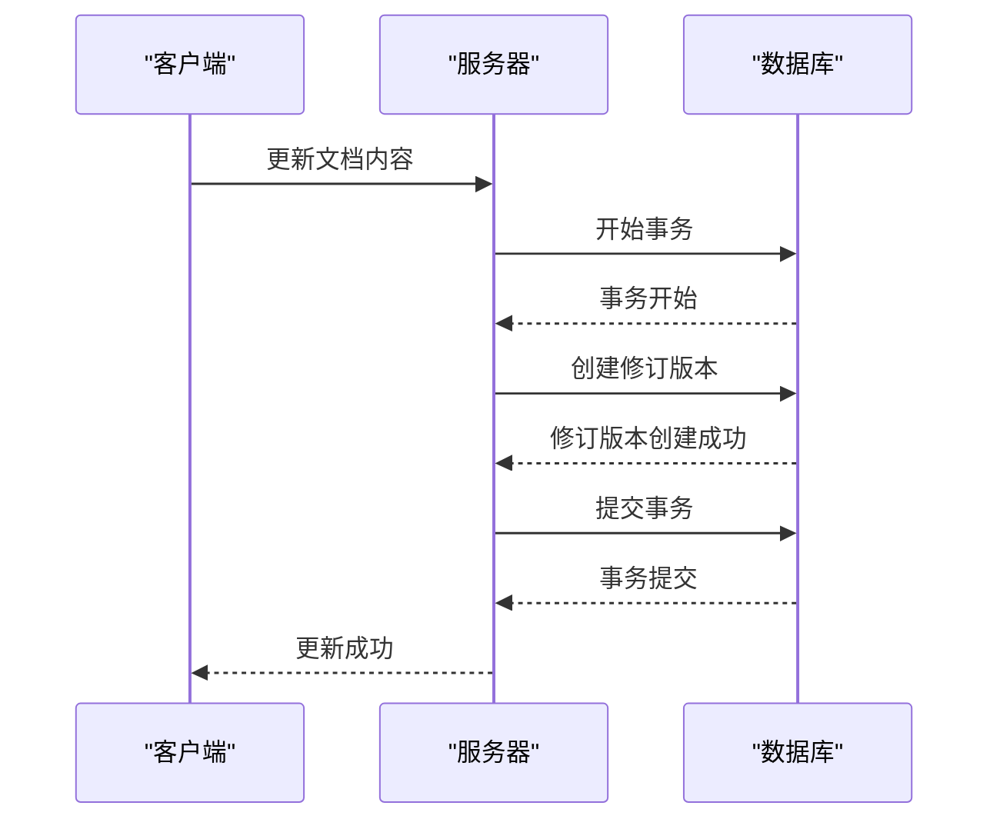

# 修订版本模型

<cite>
**本文档中引用的文件**   
- [Revision.ts](file://app/models/Revision.ts)
- [Revision.ts](file://server/models/Revision.ts)
- [revisionCreator.ts](file://server/commands/revisionCreator.ts)
- [revisions.ts](file://server/routes/api/revisions/revisions.ts)
- [DocumentHelper.tsx](file://server/models/helpers/DocumentHelper.tsx)
- [revision.ts](file://server/presenters/revision.ts)
- [RevisionsStore.ts](file://app/stores/RevisionsStore.ts)
</cite>

## 目录
1. [简介](#简介)
2. [修订版本实体字段定义](#修订版本实体字段定义)
3. [版本存储机制](#版本存储机制)
4. [与文档的关联关系](#与文档的关联关系)
5. [自动创建策略](#自动创建策略)
6. [差异比较算法](#差异比较算法)
7. [版本恢复流程](#版本恢复流程)
8. [版本快照生成与存储优化](#版本快照生成与存储优化)
9. [查询性能提升](#查询性能提升)
10. [与协作编辑的集成](#与协作编辑的集成)
11. [数据归档策略](#数据归档策略)
12. [结论](#结论)

## 简介
本文档详细介绍了修订版本模型的设计与实现，重点涵盖Revision实体的字段定义、版本存储机制、与文档的关联关系、自动创建策略、差异比较算法、版本恢复流程、版本快照生成与存储优化、查询性能提升、与协作编辑的集成以及长期运行系统中的数据归档策略。

**Section sources**
- [Revision.ts](file://app/models/Revision.ts#L9-L67)
- [Revision.ts](file://server/models/Revision.ts#L23-L232)

## 修订版本实体字段定义
修订版本实体（Revision）包含以下字段：

- **documentId**: 关联文档的ID。
- **title**: 创建修订版本时的文档标题。
- **name**: 修订版本的可选名称。
- **data**: 创建修订版本时的内容（Prosemirror数据）。
- **icon**: 创建修订版本时的文档图标（或表情符号）。
- **color**: 创建修订版本时的文档图标颜色。
- **html**: 表示从上一个版本到当前版本的HTML差异。
- **createdById**: 创建修订版本的用户ID（已弃用）。
- **createdBy**: 创建修订版本的用户（已弃用，使用collaborators代替）。
- **collaboratorIds**: 协作创建此修订版本的用户ID数组。
- **collaborators**: 协作创建此修订版本的用户数组。
- **dir**: 返回修订版本文本的方向，"rtl"或"ltr"。
- **rtl**: 返回true如果修订版本文本是右到左的。

**Section sources**
- [Revision.ts](file://app/models/Revision.ts#L9-L67)
- [Revision.ts](file://server/models/Revision.ts#L23-L232)

## 版本存储机制
修订版本存储机制通过以下方式实现：

- **版本号**: 每个修订版本都有一个版本号，用于标识其在文档历史中的位置。
- **内容存储**: 修订版本的内容以Prosemirror数据格式存储，确保内容的完整性和可编辑性。
- **HTML差异**: 修订版本的HTML差异用于快速展示版本之间的变化。
- **协作信息**: 记录协作创建此修订版本的用户信息，支持多用户协作编辑。

**Section sources**
- [Revision.ts](file://server/models/Revision.ts#L23-L232)
- [DocumentHelper.tsx](file://server/models/helpers/DocumentHelper.tsx#L47-L246)

## 与文档的关联关系
修订版本与文档之间存在以下关联关系：

- **一对一关系**: 每个修订版本关联一个文档。
- **级联删除**: 当文档被删除时，其所有修订版本也会被删除。
- **版本历史**: 通过文档ID可以查询到所有相关的修订版本，形成版本历史。

**Section sources**
- [Revision.ts](file://app/models/Revision.ts#L9-L67)
- [Revision.ts](file://server/models/Revision.ts#L23-L232)

## 自动创建策略
修订版本的自动创建策略如下：

- **触发条件**: 当文档内容发生变化时，自动创建新的修订版本。
- **事务处理**: 创建修订版本的操作在一个数据库事务中完成，确保数据的一致性。
- **协作信息**: 记录协作创建此修订版本的用户ID，支持多用户协作编辑。

**Diagram sources**
- [revisionCreator.ts](file://server/commands/revisionCreator.ts#L6-L32)
- [Revision.ts](file://server/models/Revision.ts#L170-L214)

## 差异比较算法
差异比较算法通过以下步骤实现：

- **HTML生成**: 将修订版本的内容转换为HTML格式。
- **HTML差异**: 使用HTML差异库（如htmldiff.js）生成两个版本之间的HTML差异。
- **上下文保留**: 保留差异周围的上下文，确保差异的可读性。

**Section sources**
- [DocumentHelper.tsx](file://server/models/helpers/DocumentHelper.tsx#L237-L436)
- [revisions.ts](file://server/routes/api/revisions/revisions.ts#L24-L64)

## 版本恢复流程
版本恢复流程如下：

- **选择版本**: 用户选择要恢复的修订版本。
- **内容替换**: 将选定修订版本的内容替换当前文档内容。
- **创建新修订版本**: 创建一个新的修订版本，记录恢复操作。

**Section sources**
- [Document.ts](file://app/models/Document.ts#L39-L703)
- [Document.ts](file://server/models/Document.ts#L94-L1314)

## 版本快照生成与存储优化
版本快照生成与存储优化通过以下方式实现：

- **快照生成**: 在创建修订版本时生成内容快照，确保内容的完整性和可追溯性。
- **存储优化**: 使用Prosemirror数据格式存储内容，减少存储空间占用。
- **缓存机制**: 使用Redis缓存频繁访问的修订版本，提高查询性能。

**Section sources**
- [Revision.ts](file://server/models/Revision.ts#L170-L214)
- [DocumentHelper.tsx](file://server/models/helpers/DocumentHelper.tsx#L47-L246)

## 查询性能提升
查询性能提升通过以下方式实现：

- **索引优化**: 为修订版本的常用查询字段（如documentId、createdAt）创建索引，提高查询速度。
- **分页查询**: 支持分页查询，减少单次查询的数据量。
- **缓存机制**: 使用Redis缓存频繁访问的修订版本，减少数据库查询次数。

**Section sources**
- [revisions.ts](file://server/routes/api/revisions/revisions.ts#L131-L183)
- [RevisionsStore.ts](file://app/stores/RevisionsStore.ts#L5-L28)

## 与协作编辑的集成
修订版本与协作编辑的集成通过以下方式实现：

- **实时同步**: 使用Yjs库实现实时同步，确保多用户协作编辑的实时性。
- **冲突解决**: 通过Yjs的冲突解决机制，确保多用户编辑时的数据一致性。
- **协作信息**: 记录协作创建此修订版本的用户信息，支持多用户协作编辑。

**Section sources**
- [DocumentHelper.tsx](file://server/models/helpers/DocumentHelper.tsx#L47-L246)
- [revisionCreator.ts](file://server/commands/revisionCreator.ts#L6-L32)

## 数据归档策略
数据归档策略通过以下方式实现：

- **定期归档**: 定期将旧的修订版本归档到冷存储，减少主数据库的存储压力。
- **归档策略**: 根据修订版本的创建时间和访问频率，制定归档策略。
- **恢复机制**: 提供恢复归档数据的机制，确保数据的可恢复性。

**Section sources**
- [DocumentHelper.tsx](file://server/models/helpers/DocumentHelper.tsx#L379-L578)
- [revisions.ts](file://server/routes/api/revisions/revisions.ts#L131-L183)

## 结论
本文档详细介绍了修订版本模型的设计与实现，涵盖了从字段定义到数据归档的各个方面。通过合理的存储机制、自动创建策略、差异比较算法、版本恢复流程、版本快照生成与存储优化、查询性能提升、与协作编辑的集成以及数据归档策略，确保了修订版本系统的高效性和可靠性。