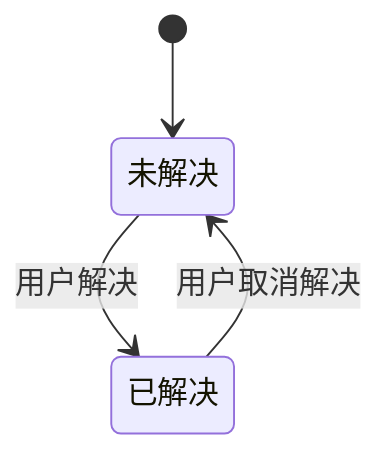
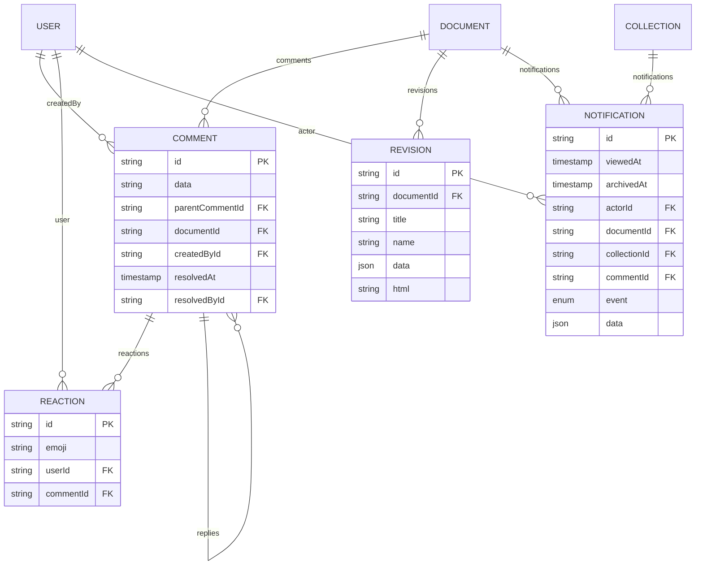
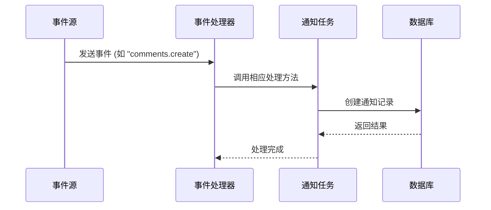

# 协作功能模型

<cite>
**Referenced Files in This Document**   
- [Comment.ts](file://app/models/Comment.ts)
- [Reaction.ts](file://server/models/Reaction.ts)
- [Revision.ts](file://app/models/Revision.ts)
- [Notification.ts](file://app/models/Notification.ts)
- [CommentsStore.ts](file://app/stores/CommentsStore.ts)
- [RevisionsStore.ts](file://app/stores/RevisionsStore.ts)
- [NotificationsStore.ts](file://app/stores/NotificationsStore.ts)
- [NotificationHelper.ts](file://server/models/helpers/NotificationHelper.ts)
- [NotificationsProcessor.ts](file://server/queues/processors/NotificationsProcessor.ts)
</cite>

## 目录
1. [引言](#引言)
2. [核心数据模型](#核心数据模型)
3. [状态流转与关联关系](#状态流转与关联关系)
4. [事件驱动机制与通知触发](#事件驱动机制与通知触发)
5. [高并发场景下的数据一致性与性能优化](#高并发场景下的数据一致性与性能优化)
6. [结论](#结论)

## 引言
本文档详细阐述了协作功能的核心数据模型，包括评论（Comment）、反应（Reaction）、修订版本（Revision）和通知（Notification）。文档深入分析了各模型的字段定义、状态流转、相互关联以及在实时协作中的事件驱动机制和通知触发逻辑。通过具体实现方式的说明，展示了评论线程管理、反应计数更新和修订历史追踪的技术细节，并提供了处理高并发协作场景下数据一致性和性能优化的策略。

## 核心数据模型

### 评论模型 (Comment)
评论模型用于存储用户在文档中的评论内容，支持线程化回复和状态管理。

**字段定义**:
- `data`: ProsemirrorData类型，存储评论的富文本内容。
- `parentCommentId`: 字符串或null，指向父评论ID，用于构建回复线程。
- `documentId`: 字符串，关联的文档ID。
- `createdById`: 字符串，创建评论的用户ID。
- `resolvedAt`: 字符串，评论被解决的时间戳。
- `resolvedById`: 字符串或null，解决评论的用户ID。
- `reactions`: ReactionSummary数组，存储当前活跃的反应（如表情符号）及其关联的用户ID。

**Section sources**
- [Comment.ts](file://app/models/Comment.ts#L12-L275)

### 反应模型 (Reaction)
反应模型用于记录用户对评论的反应，如点赞或表情符号。

**字段定义**:
- `emoji`: 字符串，表示反应的emoji。
- `userId`: 字符串，执行反应的用户ID。
- `commentId`: 字符串，关联的评论ID。

**Section sources**
- [Reaction.ts](file://server/models/Reaction.ts#L27-L160)

### 修订版本模型 (Revision)
修订版本模型用于存储文档的历史版本，支持版本回溯和比较。

**字段定义**:
- `documentId`: 字符串，关联的文档ID。
- `title`: 字符串，修订时的文档标题。
- `name`: 字符串或null，修订的可选名称。
- `data`: ProsemirrorData，修订时的文档内容。
- `html`: 字符串，表示与前一版本差异的HTML。
- `collaboratorIds`: 字符串数组，参与此修订的用户ID列表。

**Section sources**
- [Revision.ts](file://app/models/Revision.ts#L9-L67)

### 通知模型 (Notification)
通知模型用于管理用户的通知，包括事件类型、关联对象和阅读状态。

**字段定义**:
- `viewedAt`: 日期或null，通知被阅读的时间。
- `archivedAt`: 日期或null，通知被归档的时间。
- `actor`: User对象，触发通知的用户。
- `documentId`, `collectionId`, `commentId`: 分别关联文档、集合和评论的ID。
- `event`: NotificationEventType，通知的事件类型。
- `data`: NotificationData，附加的通知数据。

**Section sources**
- [Notification.ts](file://app/models/Notification.ts#L17-L210)

## 状态流转与关联关系

### 评论状态流转
评论的状态主要通过`resolvedAt`字段管理，表示评论是否已被解决。当用户解决一个评论时，`resolvedAt`和`resolvedById`字段会被设置；当用户取消解决时，这些字段会被清空。此外，`isResolved`计算属性会检查当前评论或其父评论是否已解决。

**Diagram sources**
- [Comment.ts](file://app/models/Comment.ts#L12-L275)

### 模型关联关系
各模型之间通过外键和关系装饰器建立关联：
- **Comment** 与 **Document** 通过`documentId`关联，删除文档时级联删除评论。
- **Reaction** 与 **Comment** 通过`commentId`关联，删除评论时级联删除反应。
- **Revision** 与 **Document** 通过`documentId`关联，删除文档时级联删除修订。
- **Notification** 可关联 **Document**、**Collection** 或 **Comment**，通过`documentId`、`collectionId`或`commentId`字段。

**Diagram sources**
- [Comment.ts](file://app/models/Comment.ts#L12-L275)
- [Reaction.ts](file://server/models/Reaction.ts#L27-L160)
- [Revision.ts](file://app/models/Revision.ts#L9-L67)
- [Notification.ts](file://app/models/Notification.ts#L17-L210)

## 事件驱动机制与通知触发

### 事件驱动架构
系统采用事件驱动架构，通过`NotificationsProcessor`监听各种事件（如文档发布、评论创建等），并触发相应的通知任务。

**Diagram sources**
- [NotificationsProcessor.ts](file://server/queues/processors/NotificationsProcessor.ts#L23-L71)

### 通知触发逻辑
通知的触发基于用户订阅和事件类型。例如，当有新评论创建时，系统会检查所有订阅了`CreateComment`事件的用户，并为他们创建通知记录。

**Section sources**
- [NotificationHelper.ts](file://server/models/helpers/NotificationHelper.ts#L20-L243)
- [NotificationsProcessor.ts](file://server/queues/processors/NotificationsProcessor.ts#L23-L71)

## 高并发场景下的数据一致性与性能优化

### 数据一致性策略
在高并发场景下，系统通过数据库事务和锁机制确保数据一致性。例如，在添加或移除反应时，会使用行级锁来防止并发修改导致的数据不一致。

**Section sources**
- [Reaction.ts](file://server/models/Reaction.ts#L108-L159)

### 性能优化措施
- **缓存机制**: 评论的反应数据在内存中缓存，减少数据库查询次数。
- **批量操作**: 在处理大量通知时，采用批量插入操作，提高数据库写入效率。
- **异步处理**: 通知的创建和发送通过后台任务队列异步处理，避免阻塞主流程。

**Section sources**
- [CommentsStore.ts](file://app/stores/CommentsStore.ts#L13-L156)
- [NotificationsStore.ts](file://app/stores/NotificationsStore.ts#L10-L96)

## 结论
本文档全面介绍了协作功能的数据模型及其工作机制。通过合理的模型设计和事件驱动架构，系统能够高效地支持实时协作和通知功能。在高并发场景下，通过事务、锁和异步处理等技术手段，确保了数据的一致性和系统的高性能。