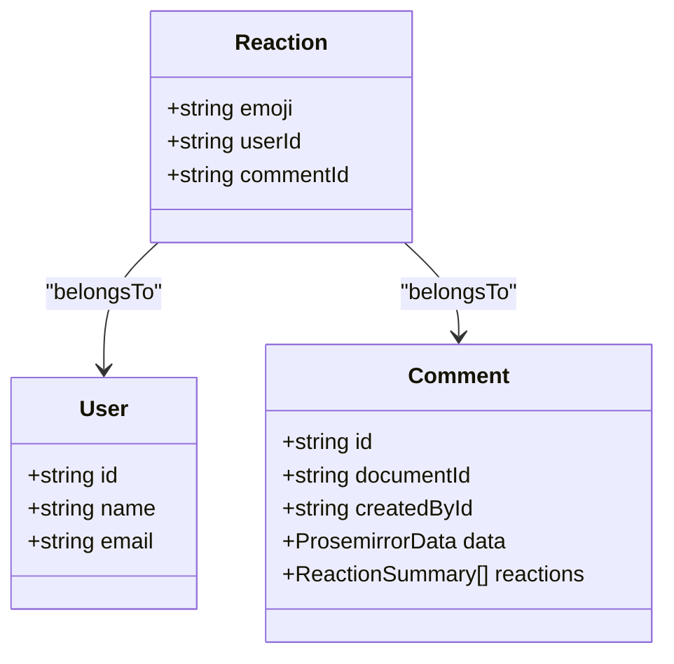
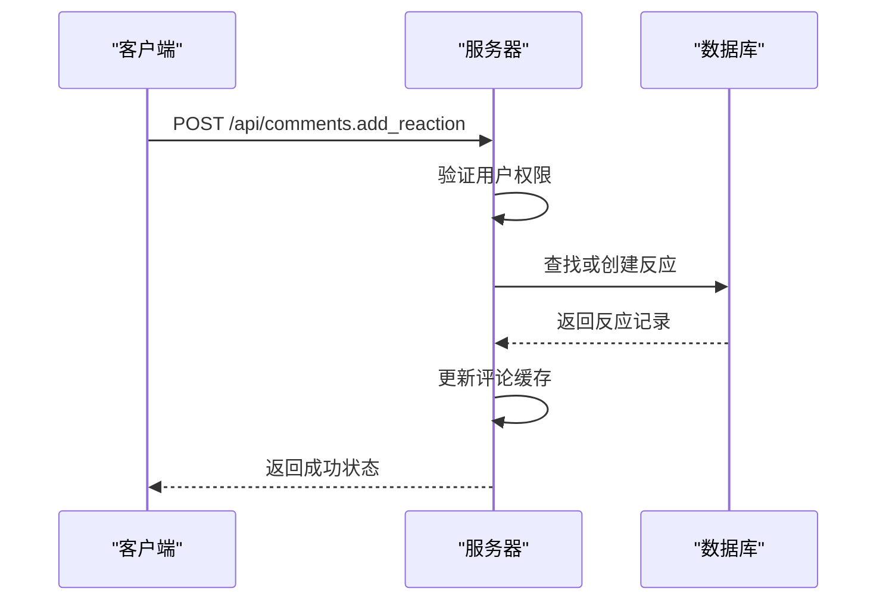
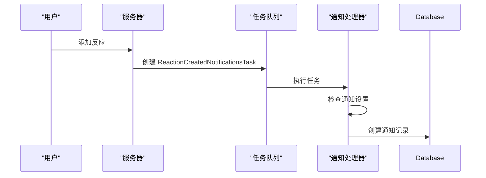

# 反应模型

<cite>
**本文档中引用的文件**   
- [Reaction.ts](file://server/models/Reaction.ts)
- [reaction.ts](file://server/presenters/reaction.ts)
- [Reaction.tsx](file://app/components/Reactions/Reaction.tsx)
- [ReactionList.tsx](file://app/components/Reactions/ReactionList.tsx)
- [reactions.ts](file://server/routes/api/reactions/reactions.ts)
- [reactions.test.ts](file://server/routes/api/reactions/reactions.test.ts)
- [ReactionCreatedNotificationsTask.ts](file://server/queues/tasks/ReactionCreatedNotificationsTask.ts)
- [ReactionRemovedNotificationsTask.ts](file://server/queues/tasks/ReactionRemovedNotificationsTask.ts)
- [Comment.ts](file://server/models/Comment.ts)
</cite>

## 目录
1. [简介](#简介)
2. [反应实体结构](#反应实体结构)
3. [关联关系](#关联关系)
4. [反应的添加与移除机制](#反应的添加与移除机制)
5. [实时计数更新策略](#实时计数更新策略)
6. [权限控制](#权限控制)
7. [通知系统集成](#通知系统集成)
8. [性能优化策略](#性能优化策略)
9. [查询优化](#查询优化)
10. [总结](#总结)

## 简介
反应模型是系统中用于支持用户对文档内容进行快速反馈的核心功能。该模型允许用户通过添加表情符号来表达对特定评论的看法，从而促进团队协作和沟通。本文档详细介绍了反应实体的字段结构、与文档和用户的关联关系、反应的添加和移除机制、实时计数更新策略、权限控制、通知系统集成以及在大规模数据场景下的查询优化策略。

**Section sources**
- [Reaction.ts](file://server/models/Reaction.ts#L27-L160)

## 反应实体结构
反应实体（Reaction）是系统中的一个核心数据模型，用于记录用户对特定评论的反应。该实体包含以下字段：

- **emoji**: 表情符号，用于表示用户的反应类型。该字段的最大长度为50个字符。
- **userId**: 用户ID，表示添加反应的用户。
- **commentId**: 评论ID，表示反应所属的评论。

反应实体通过Sequelize ORM框架定义，并使用了多种装饰器来确保数据的完整性和一致性。例如，`@Length`装饰器用于限制表情符号的长度，`@BelongsTo`和`@ForeignKey`装饰器用于建立与用户和评论的关联关系。

**Diagram sources**
- [Reaction.ts](file://server/models/Reaction.ts#L27-L160)
- [User.ts](file://server/models/User.ts#L81-L856)
- [Comment.ts](file://server/models/Comment.ts#L24-L164)

**Section sources**
- [Reaction.ts](file://server/models/Reaction.ts#L27-L160)

## 关联关系
反应实体与用户和评论实体之间存在明确的关联关系。每个反应都属于一个特定的用户和一个特定的评论。这种关联关系通过外键约束来实现，确保了数据的一致性和完整性。

- **用户关联**: 每个反应都关联到一个用户，通过`userId`字段实现。用户可以添加多个反应，但每个反应只能由一个用户创建。
- **评论关联**: 每个反应都关联到一个评论，通过`commentId`字段实现。评论可以有多个反应，但每个反应只能属于一个评论。

这些关联关系在数据库层面通过外键约束来维护，确保了数据的引用完整性。

**Section sources**
- [Reaction.ts](file://server/models/Reaction.ts#L45-L55)

## 反应的添加与移除机制
反应的添加和移除是通过API端点`/api/comments.add_reaction`和`/api/comments.remove_reaction`来实现的。当用户添加或移除反应时，系统会执行以下步骤：

1. **验证权限**: 系统首先检查用户是否有权限对指定的评论进行反应操作。
2. **查找或创建反应**: 如果用户添加反应，系统会尝试查找已存在的相同表情符号的反应。如果不存在，则创建一个新的反应记录。
3. **更新缓存**: 反应的添加或移除会触发相应的钩子函数，更新评论的缓存数据，以确保前端显示的反应计数是最新的。
4. **返回结果**: 操作成功后，API返回成功状态码。

**Diagram sources**
- [reactions.ts](file://server/routes/api/reactions/reactions.ts#L18-L61)
- [Reaction.ts](file://server/models/Reaction.ts#L56-L106)

**Section sources**
- [reactions.ts](file://server/routes/api/reactions/reactions.ts#L18-L61)
- [Reaction.ts](file://server/models/Reaction.ts#L56-L106)

## 实时计数更新策略
为了确保反应计数的实时性，系统采用了缓存更新策略。当用户添加或移除反应时，系统会立即更新评论的缓存数据，而不是直接查询数据库。这减少了数据库的读取压力，提高了系统的响应速度。

- **添加反应**: 当用户添加反应时，系统会调用`addReactionToCommentCache`静态方法，将新的反应信息添加到评论的缓存中。
- **移除反应**: 当用户移除反应时，系统会调用`removeReactionFromCommentCache`静态方法，从评论的缓存中移除相应的反应信息。

这些缓存更新操作是原子性的，确保了数据的一致性。

**Section sources**
- [Reaction.ts](file://server/models/Reaction.ts#L56-L106)

## 权限控制
系统通过权限控制机制确保只有授权用户才能对评论进行反应操作。权限检查主要在API端点中进行，具体步骤如下：

1. **身份验证**: 用户必须通过身份验证才能访问API端点。
2. **权限检查**: 系统会检查用户是否有权限对指定的评论进行反应操作。这通常涉及到检查用户是否具有读取和写入评论的权限。
3. **执行操作**: 如果用户通过了权限检查，系统将允许其执行添加或移除反应的操作。

权限控制机制确保了系统的安全性和数据的完整性。

**Section sources**
- [reactions.ts](file://server/routes/api/reactions/reactions.ts#L18-L61)

## 通知系统集成
当用户对评论添加反应时，系统会生成通知，通知评论的作者。这一过程通过后台任务`ReactionCreatedNotificationsTask`来实现。具体流程如下：

1. **触发事件**: 用户添加反应时，系统会触发`comments.add_reaction`事件。
2. **创建任务**: 事件处理器会创建一个`ReactionCreatedNotificationsTask`任务，并将其加入队列。
3. **执行任务**: 后台处理器会从队列中取出任务并执行，检查是否需要发送通知。
4. **发送通知**: 如果评论作者订阅了相关通知类型，系统会创建一条新的通知记录。

**Diagram sources**
- [ReactionCreatedNotificationsTask.ts](file://server/queues/tasks/ReactionCreatedNotificationsTask.ts#L7-L87)
- [ReactionRemovedNotificationsTask.ts](file://server/queues/tasks/ReactionRemovedNotificationsTask.ts#L9-L51)

**Section sources**
- [ReactionCreatedNotificationsTask.ts](file://server/queues/tasks/ReactionCreatedNotificationsTask.ts#L7-L87)
- [ReactionRemovedNotificationsTask.ts](file://server/queues/tasks/ReactionRemovedNotificationsTask.ts#L9-L51)

## 性能优化策略
为了提高系统的性能，特别是在高并发场景下，系统采取了多种优化策略：

- **缓存更新**: 通过缓存更新策略减少数据库的读取压力。
- **异步处理**: 将通知生成等耗时操作放入后台任务队列中异步处理，避免阻塞主线程。
- **批量操作**: 在某些情况下，系统会批量处理多个反应的添加或移除，以减少数据库的写入次数。

这些优化策略确保了系统在高负载下的稳定性和响应速度。

**Section sources**
- [Reaction.ts](file://server/models/Reaction.ts#L56-L106)
- [ReactionCreatedNotificationsTask.ts](file://server/queues/tasks/ReactionCreatedNotificationsTask.ts#L7-L87)

## 查询优化
在大规模数据场景下，查询优化是确保系统性能的关键。系统通过以下方式优化查询性能：

- **索引优化**: 在关键字段上创建索引，如`userId`和`commentId`，以加快查询速度。
- **分页查询**: 对于大量数据的查询，系统支持分页查询，避免一次性加载过多数据。
- **预加载关联数据**: 在查询评论时，系统会预加载相关的反应数据，减少后续查询的次数。

这些优化措施显著提升了系统的查询效率。

**Section sources**
- [reactions.ts](file://server/routes/api/reactions/reactions.ts#L18-L61)

## 总结
反应模型是系统中一个重要的功能模块，它不仅支持用户对评论进行快速反馈，还通过高效的缓存更新、权限控制和通知系统集成，确保了系统的性能和安全性。通过合理的数据结构设计和优化策略，系统能够在高并发场景下保持良好的响应速度和稳定性。