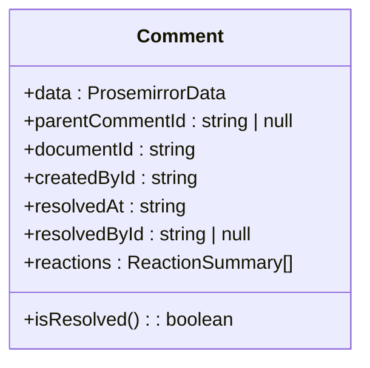
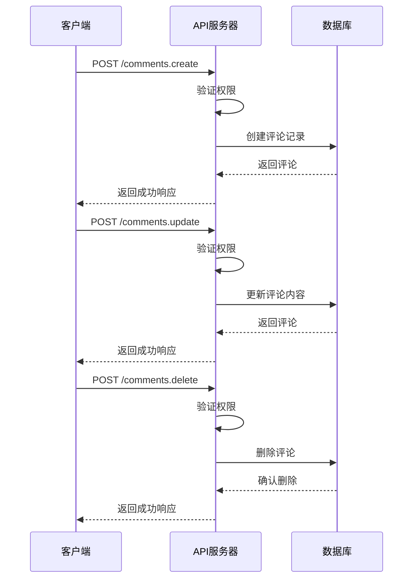
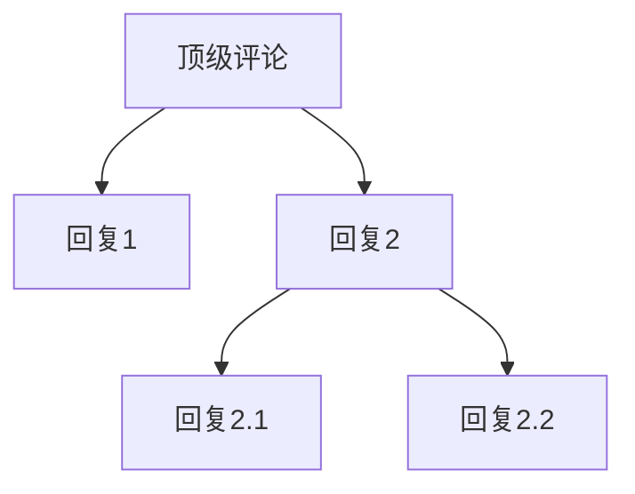
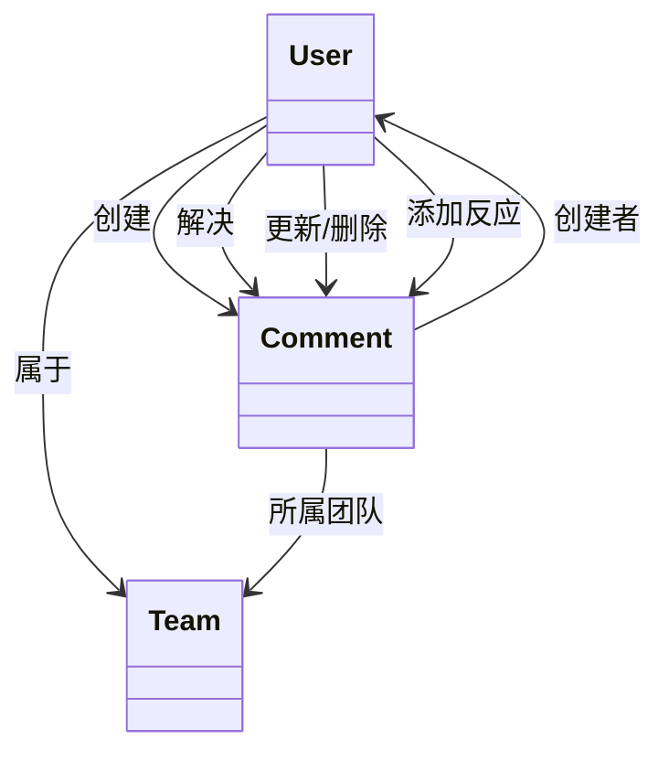
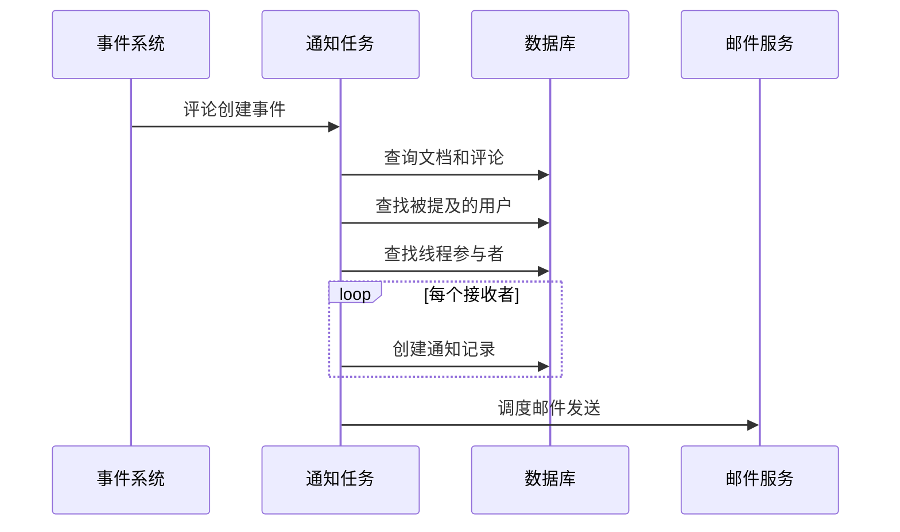

# 评论模型

<cite>
**本文档引用的文件**
- [Comment.ts](file://app/models/Comment.ts)
- [Comment.ts](file://server/models/Comment.ts)
- [CommentsStore.ts](file://app/stores/CommentsStore.ts)
- [comments.ts](file://server/routes/api/comments/comments.ts)
- [comment.ts](file://server/policies/comment.ts)
- [CommentCreatedNotificationsTask.ts](file://server/queues/tasks/CommentCreatedNotificationsTask.ts)
- [CommentUpdatedNotificationsTask.ts](file://server/queues/tasks/CommentUpdatedNotificationsTask.ts)
- [NotificationHelper.ts](file://server/models/helpers/NotificationHelper.ts)
</cite>

## 目录
1. [介绍](#介绍)
2. [实体字段与状态管理](#实体字段与状态管理)
3. [关联关系](#关联关系)
4. [生命周期](#生命周期)
5. [评论线程与嵌套结构](#评论线程与嵌套结构)
6. [权限验证](#权限验证)
7. [通知触发](#通知触发)
8. [版本快照](#版本快照)
9. [数据一致性](#数据一致性)

## 介绍
评论模型是系统中用于支持文档协作的核心功能。它允许用户在文档的特定位置创建评论，进行讨论，并通过解决评论来跟踪问题的处理状态。该模型设计为支持复杂的嵌套回复、实时通知和权限控制，确保在高并发环境下的数据一致性和用户体验。

**Section sources**
- [Comment.ts](file://app/models/Comment.ts#L12-L275)
- [Comment.ts](file://server/models/Comment.ts#L24-L164)

## 实体字段与状态管理
评论实体（Comment）包含以下核心字段：

- **data**: 使用Prosemirror格式存储的评论内容，支持富文本和提及功能。
- **parentCommentId**: 如果该评论是回复，则指向父评论的ID；否则为null，表示这是一个顶级评论线程。
- **documentId**: 该评论所属文档的ID。
- **createdById**: 创建该评论的用户ID。
- **resolvedAt**: 评论被解决的时间戳，如果未解决则为null。
- **resolvedById**: 解决该评论的用户ID。
- **reactions**: 存储评论上的表情反应，包含表情符号和对应的用户ID列表。

评论的状态主要通过`resolvedAt`字段管理。当一个评论被解决时，`resolvedAt`被设置为当前时间，`resolvedById`被设置为执行操作的用户ID。`isResolved`是一个计算属性，用于方便地检查评论的解决状态。

**Diagram sources**
- [Comment.ts](file://app/models/Comment.ts#L12-L275)
- [Comment.ts](file://server/models/Comment.ts#L24-L164)

**Section sources**
- [Comment.ts](file://app/models/Comment.ts#L12-L275)
- [Comment.ts](file://server/models/Comment.ts#L24-L164)

## 关联关系
评论模型通过以下关系与其他实体关联：

- **与文档的关联**: 每个评论都属于一个文档（Document），通过`documentId`外键关联。当文档被删除时，其所有评论也会被级联删除。
- **与用户的关联**: 评论由特定用户创建，通过`createdById`关联到User实体。解决评论的用户通过`resolvedById`关联。
- **与父评论的关联**: 评论可以回复另一个评论，形成嵌套结构。`parentCommentId`指向父评论，当父评论被删除时，所有子评论也会被级联删除。

这些关联在代码中通过Sequelize的`@BelongsTo`和`@ForeignKey`装饰器定义。

**Section sources**
- [Comment.ts](file://server/models/Comment.ts#L55-L89)

## 生命周期
评论的生命周期包括创建、更新和删除三个阶段。

### 创建
评论的创建由`comments.create` API端点处理。用户提交评论内容（文本或Prosemirror数据）和目标文档ID。服务器验证用户对文档的评论权限后，创建新的评论记录。

### 更新
评论的更新主要通过`comments.update` API端点实现。用户可以编辑评论内容。系统会检测更新前后提及的用户变化，并触发相应的通知。

### 删除
评论的删除由`comments.delete` API端点处理。只有评论的创建者或管理员才能删除评论。删除操作是软删除，评论记录会被标记为已删除。

**Diagram sources**
- [comments.ts](file://server/routes/api/comments/comments.ts#L53-L443)

**Section sources**
- [comments.ts](file://server/routes/api/comments/comments.ts#L53-L443)

## 评论线程与嵌套结构
评论系统支持嵌套的线程结构。顶级评论（没有`parentCommentId`的评论）构成一个线程的开始，其他评论可以作为回复（`parentCommentId`指向父评论ID）添加到该线程中。

`CommentsStore`提供了`inThread(threadId)`方法来获取一个线程中的所有评论（包括父评论和所有回复）。`threadsInDocument(documentId)`方法返回文档中所有顶级评论线程。

**Diagram sources**
- [CommentsStore.ts](file://app/stores/CommentsStore.ts#L100-L116)

**Section sources**
- [CommentsStore.ts](file://app/stores/CommentsStore.ts#L47-L116)

## 权限验证
系统的权限验证基于CanCan模式，定义在`comment.ts`策略文件中。

- **创建评论**: 团队成员可以创建评论。
- **读取评论**: 与评论创建者属于同一团队的用户可以读取评论。
- **解决/取消解决**: 只有顶级评论可以被解决或取消解决，且执行者必须与评论创建者属于同一团队。
- **更新/删除**: 评论的创建者或管理员可以更新或删除评论。
- **添加/移除反应**: 与评论创建者属于同一团队的用户可以添加或移除反应。

**Diagram sources**
- [comment.ts](file://server/policies/comment.ts#L1-L38)

**Section sources**
- [comment.ts](file://server/policies/comment.ts#L1-L38)

## 通知触发
当用户创建或更新评论时，系统会触发后台任务来发送通知。

- **CommentCreatedNotificationsTask**: 当创建新评论时，此任务会：
  1. 为评论创建者自动订阅该文档。
  2. 向被提及的用户发送“被提及”通知。
  3. 向被提及的群组中的用户发送通知。
  4. 向参与该评论线程的所有用户发送“新评论”通知。

- **CommentUpdatedNotificationsTask**: 当更新评论时，此任务会：
  1. 检测是否有新的提及，并向新提及的用户发送通知。
  2. 如果评论被解决，则向线程中的所有参与者发送“评论已解决”通知。

通知的接收者通过`NotificationHelper.getCommentNotificationRecipients`方法确定，该方法会考虑用户的订阅状态、文档访问权限和是否已查看文档。

**Diagram sources**
- [CommentCreatedNotificationsTask.ts](file://server/queues/tasks/CommentCreatedNotificationsTask.ts#L22-L175)
- [CommentUpdatedNotificationsTask.ts](file://server/queues/tasks/CommentUpdatedNotificationsTask.ts#L16-L206)
- [NotificationHelper.ts](file://server/models/helpers/NotificationHelper.ts#L20-L243)

**Section sources**
- [CommentCreatedNotificationsTask.ts](file://server/queues/tasks/CommentCreatedNotificationsTask.ts#L22-L175)
- [CommentUpdatedNotificationsTask.ts](file://server/queues/tasks/CommentUpdatedNotificationsTask.ts#L16-L206)
- [NotificationHelper.ts](file://server/models/helpers/NotificationHelper.ts#L20-L243)

## 版本快照
虽然评论模型本身不直接与修订版本（Revision）关联，但评论的创建和更新事件会作为文档修订历史的一部分被记录。当文档被修订时，与该文档相关的所有评论状态（已解决/未解决）都会被快照保存，以便在查看历史版本时能够看到当时的评论上下文。

## 数据一致性
在高并发场景下，系统通过以下机制保障数据一致性：

1. **数据库事务**: 所有对评论的创建、更新和删除操作都在数据库事务中执行。
2. **行级锁**: 在更新或删除评论时，使用`LOCK.UPDATE`对评论记录进行锁定，防止并发修改。
3. **级联删除**: 当父评论被删除时，`@AfterDestroy`钩子会确保所有子评论也被删除。
4. **幂等性**: API端点设计为幂等操作，确保重复请求不会产生副作用。

这些机制共同确保了在多用户同时操作时，评论数据的完整性和一致性。

**Section sources**
- [Comment.ts](file://server/models/Comment.ts#L143-L163)
- [comments.ts](file://server/routes/api/comments/comments.ts#L139-L211)