# 通知模型

<cite>
**本文档引用的文件**   
- [Notification.ts](file://app/models/Notification.ts)
- [NotificationsStore.ts](file://app/stores/NotificationsStore.ts)
- [Notification.ts](file://server/models/Notification.ts)
- [NotificationHelper.ts](file://server/models/helpers/NotificationHelper.ts)
- [notifications.ts](file://server/routes/api/notifications/notifications.ts)
- [types.ts](file://shared/types.ts)
</cite>

## 目录
1. [简介](#简介)
2. [项目结构](#项目结构)
3. [核心组件](#核心组件)
4. [架构概述](#架构概述)
5. [详细组件分析](#详细组件分析)
6. [依赖分析](#依赖分析)
7. [性能考虑](#性能考虑)
8. [故障排除指南](#故障排除指南)
9. [结论](#结论)

## 简介
本文档详细介绍了通知模型的设计与实现，重点阐述了Notification实体的字段结构、状态流转以及与用户、事件的关联关系。文档解释了通知的创建、读取、清除生命周期，以及不同类型通知的分类管理。通过代码示例展示了通知触发条件、去重策略和批量处理的实现方式，并详细说明了通知与队列系统的集成，以及在高并发场景下的性能优化和可靠性保障。

## 项目结构
项目结构中，通知相关的核心文件分布在多个目录中。前端模型和存储位于`app/models`和`app/stores`目录下，后端模型和辅助工具位于`server/models`目录下，共享类型定义位于`shared/types.ts`文件中。

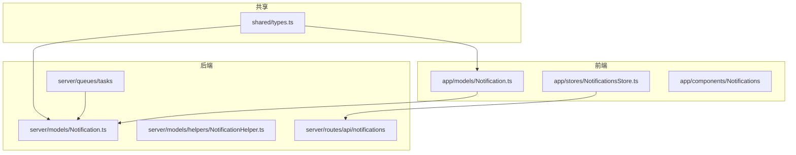

**Diagram sources**
- [app/models/Notification.ts](file://app/models/Notification.ts)
- [app/stores/NotificationsStore.ts](file://app/stores/NotificationsStore.ts)
- [server/models/Notification.ts](file://server/models/Notification.ts)
- [server/models/helpers/NotificationHelper.ts](file://server/models/helpers/NotificationHelper.ts)
- [server/queues/tasks](file://server/queues/tasks)
- [server/routes/api/notifications](file://server/routes/api/notifications)
- [shared/types.ts](file://shared/types.ts)

**Section sources**
- [app/models/Notification.ts](file://app/models/Notification.ts)
- [app/stores/NotificationsStore.ts](file://app/stores/NotificationsStore.ts)
- [server/models/Notification.ts](file://server/models/Notification.ts)
- [shared/types.ts](file://shared/types.ts)

## 核心组件
通知模型的核心组件包括Notification实体、NotificationsStore存储、通知辅助工具和通知处理器。这些组件共同实现了通知的创建、管理、分发和用户交互功能。

**Section sources**
- [app/models/Notification.ts](file://app/models/Notification.ts)
- [app/stores/NotificationsStore.ts](file://app/stores/NotificationsStore.ts)
- [server/models/Notification.ts](file://server/models/Notification.ts)
- [server/models/helpers/NotificationHelper.ts](file://server/models/helpers/NotificationHelper.ts)

## 架构概述
通知系统的架构分为前端展示层、业务逻辑层和数据持久层。前端通过NotificationsStore管理通知状态，后端通过事件驱动机制创建通知，并通过队列系统异步处理通知分发。

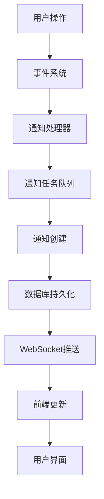

**Diagram sources**
- [server/queues/processors/NotificationsProcessor.ts](file://server/queues/processors/NotificationsProcessor.ts)
- [server/queues/tasks](file://server/queues/tasks)
- [server/models/Notification.ts](file://server/models/Notification.ts)
- [app/stores/NotificationsStore.ts](file://app/stores/NotificationsStore.ts)

## 详细组件分析

### Notification实体分析
Notification实体是通知系统的核心数据模型，定义了通知的各种属性和关联关系。

#### 字段结构
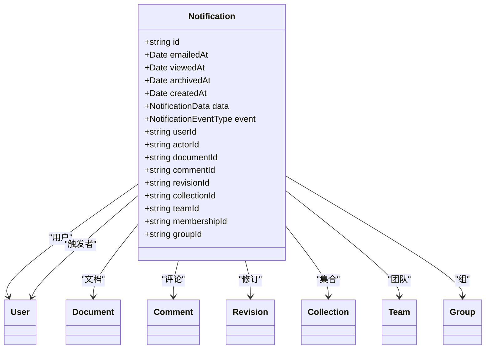

**Diagram sources**
- [server/models/Notification.ts](file://server/models/Notification.ts#L37-L288)

#### 状态流转
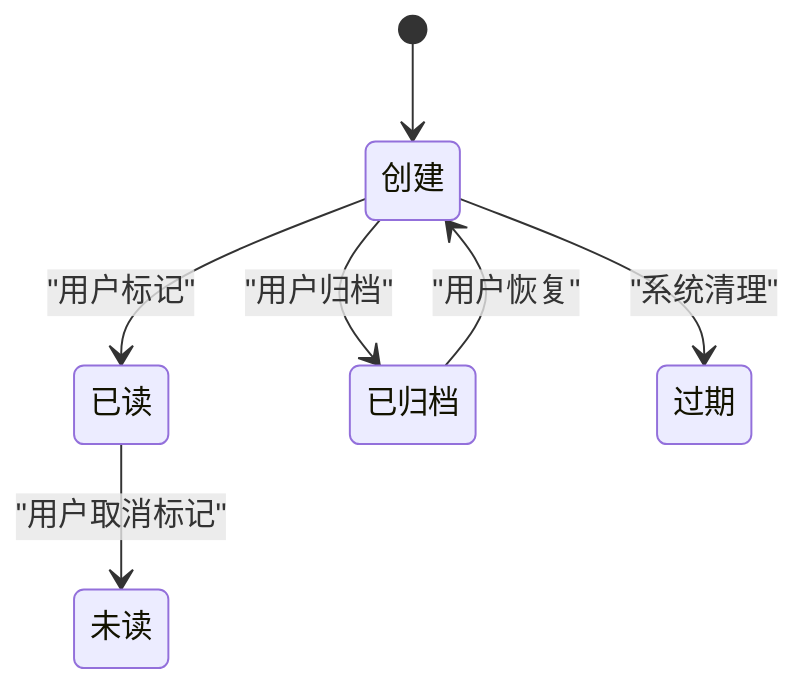

**Diagram sources**
- [app/models/Notification.ts](file://app/models/Notification.ts#L17-L210)
- [server/models/Notification.ts](file://server/models/Notification.ts#L37-L288)

### 通知生命周期管理
通知的生命周期包括创建、读取、归档和清理等阶段，每个阶段都有相应的处理逻辑。

#### 创建流程
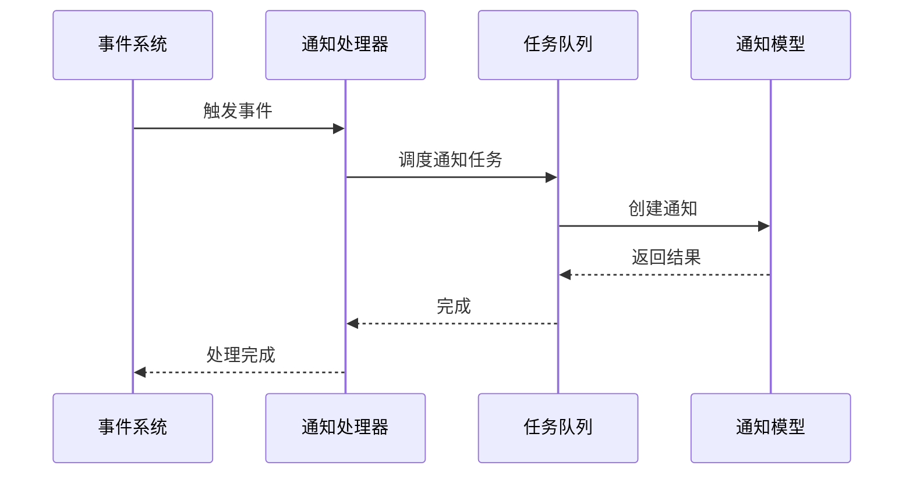

**Diagram sources**
- [server/queues/processors/NotificationsProcessor.ts](file://server/queues/processors/NotificationsProcessor.ts)
- [server/queues/tasks](file://server/queues/tasks)
- [server/models/Notification.ts](file://server/models/Notification.ts)

#### 读取与归档
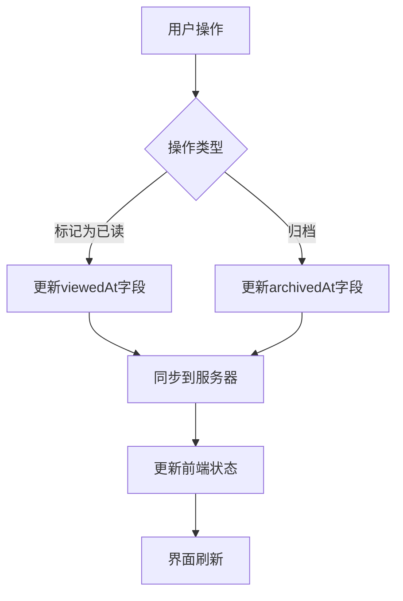

**Diagram sources**
- [app/models/Notification.ts](file://app/models/Notification.ts#L17-L210)
- [app/stores/NotificationsStore.ts](file://app/stores/NotificationsStore.ts#L10-L96)
- [server/routes/api/notifications/notifications.ts](file://server/routes/api/notifications/notifications.ts)

**Section sources**
- [app/models/Notification.ts](file://app/models/Notification.ts#L17-L210)
- [app/stores/NotificationsStore.ts](file://app/stores/NotificationsStore.ts#L10-L96)
- [server/models/Notification.ts](file://server/models/Notification.ts#L37-L288)
- [server/routes/api/notifications/notifications.ts](file://server/routes/api/notifications/notifications.ts)

### 通知类型与分类
系统支持多种类型的通知，每种类型都有特定的触发条件和处理逻辑。

#### 通知类型枚举
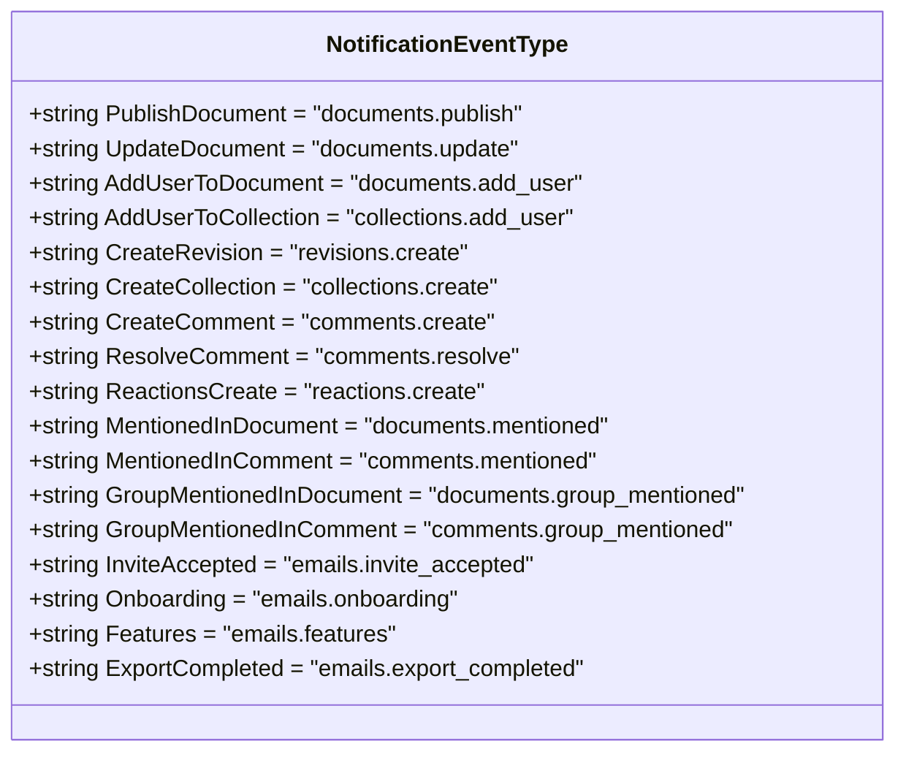

**Diagram sources**
- [shared/types.ts](file://shared/types.ts#L352-L370)

#### 通知分类管理
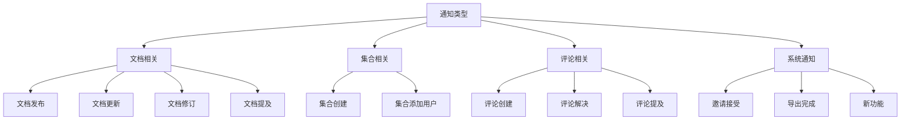

**Diagram sources**
- [shared/types.ts](file://shared/types.ts#L352-L370)
- [server/models/helpers/NotificationHelper.ts](file://server/models/helpers/NotificationHelper.ts)

**Section sources**
- [shared/types.ts](file://shared/types.ts#L352-L370)
- [server/models/helpers/NotificationHelper.ts](file://server/models/helpers/NotificationHelper.ts)

### 通知触发与去重
通知系统通过事件驱动机制触发通知，并采用多种策略避免重复通知。

#### 触发条件
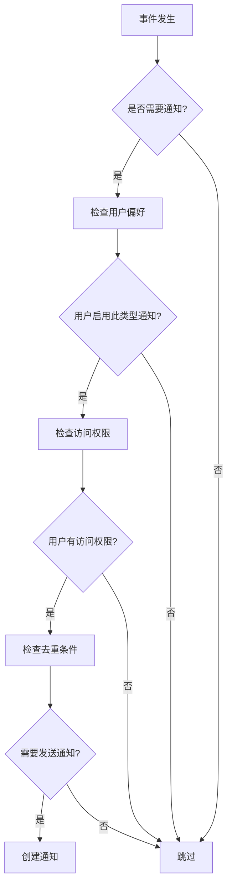

**Diagram sources**
- [server/models/helpers/NotificationHelper.ts](file://server/models/helpers/NotificationHelper.ts)
- [server/queues/tasks](file://server/queues/tasks)

#### 去重策略
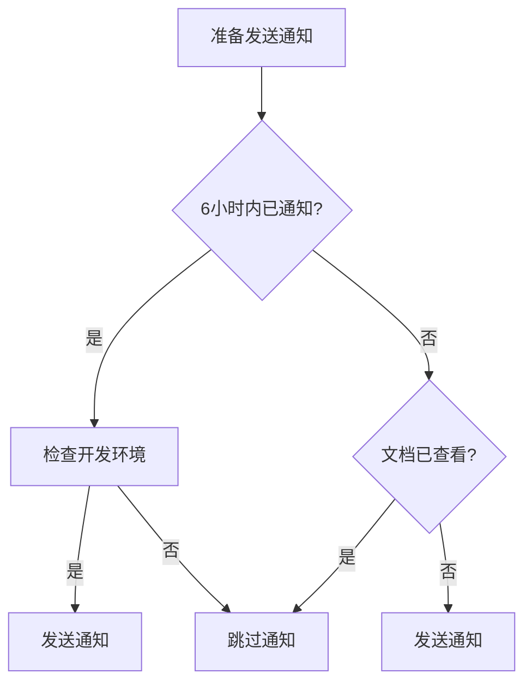

**Diagram sources**
- [server/queues/tasks/RevisionCreatedNotificationsTask.ts](file://server/queues/tasks/RevisionCreatedNotificationsTask.ts)
- [server/queues/tasks/DocumentPublishedNotificationsTask.ts](file://server/queues/tasks/DocumentPublishedNotificationsTask.ts)

**Section sources**
- [server/models/helpers/NotificationHelper.ts](file://server/models/helpers/NotificationHelper.ts)
- [server/queues/tasks/RevisionCreatedNotificationsTask.ts](file://server/queues/tasks/RevisionCreatedNotificationsTask.ts)
- [server/queues/tasks/DocumentPublishedNotificationsTask.ts](file://server/queues/tasks/DocumentPublishedNotificationsTask.ts)

### 批量处理与队列集成
通知系统与队列系统深度集成，支持批量处理和异步执行，确保高并发场景下的性能和可靠性。

#### 队列处理流程
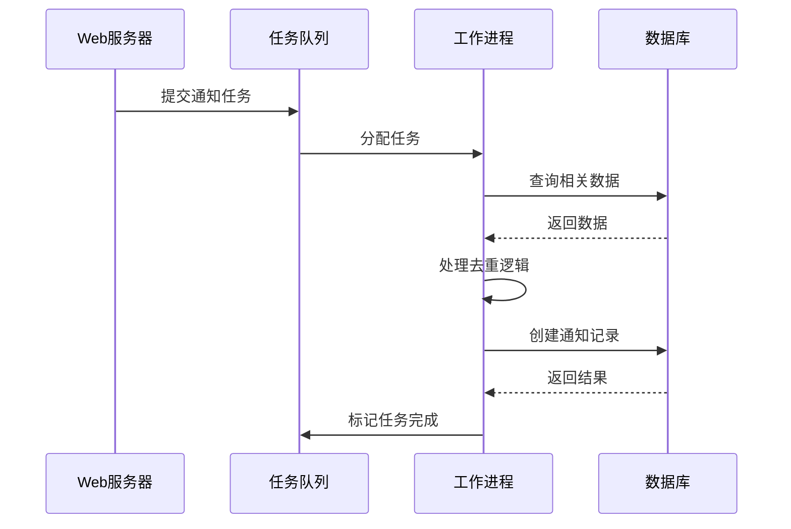

**Diagram sources**
- [server/queues/processors/NotificationsProcessor.ts](file://server/queues/processors/NotificationsProcessor.ts)
- [server/queues/tasks](file://server/queues/tasks)

#### 批量处理实现
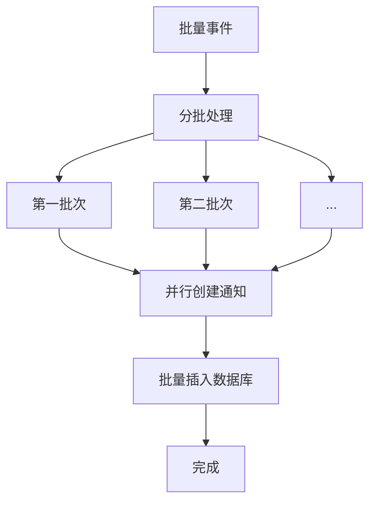

**Diagram sources**
- [server/queues/tasks/DocumentAddGroupNotificationsTask.ts](file://server/queues/tasks/DocumentAddGroupNotificationsTask.ts)
- [server/queues/tasks/CommentCreatedNotificationsTask.ts](file://server/queues/tasks/CommentCreatedNotificationsTask.ts)

**Section sources**
- [server/queues/processors/NotificationsProcessor.ts](file://server/queues/processors/NotificationsProcessor.ts)
- [server/queues/tasks](file://server/queues/tasks)

### 性能优化与可靠性保障
通知系统在高并发场景下通过多种机制确保性能和可靠性。

#### 性能优化策略
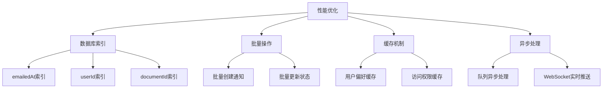

**Diagram sources**
- [server/migrations/20220828144837-add-columns-to-notifications-for-tracking.js](file://server/migrations/20220828144837-add-columns-to-notifications-for-tracking.js)
- [server/queues/tasks](file://server/queues/tasks)

#### 可靠性保障
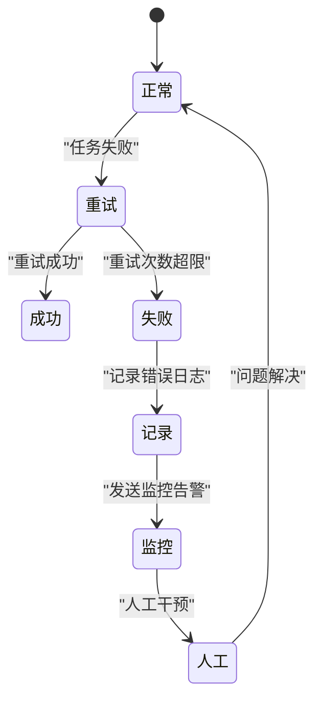

**Diagram sources**
- [server/queues/tasks/BaseTask.ts](file://server/queues/tasks/BaseTask.ts)
- [server/logging/Logger.ts](file://server/logging/Logger.ts)

**Section sources**
- [server/queues/tasks](file://server/queues/tasks)
- [server/logging/Logger.ts](file://server/logging/Logger.ts)

## 依赖分析
通知系统依赖于多个核心组件和外部服务，这些依赖关系确保了系统的完整性和功能性。

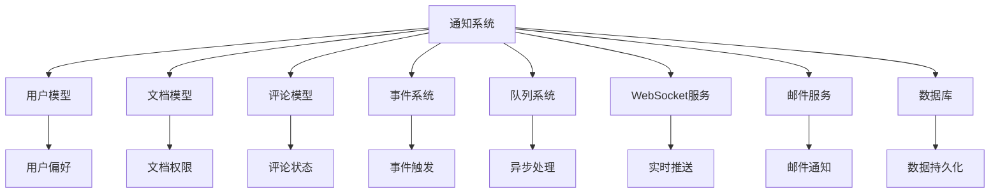

**Diagram sources**
- [app/models/User.ts](file://app/models/User.ts)
- [app/models/Document.ts](file://app/models/Document.ts)
- [app/models/Comment.ts](file://app/models/Comment.ts)
- [server/models/Notification.ts](file://server/models/Notification.ts)
- [server/queues/processors/NotificationsProcessor.ts](file://server/queues/processors/NotificationsProcessor.ts)

**Section sources**
- [app/models/User.ts](file://app/models/User.ts)
- [app/models/Document.ts](file://app/models/Document.ts)
- [app/models/Comment.ts](file://app/models/Comment.ts)
- [server/models/Notification.ts](file://server/models/Notification.ts)
- [server/queues/processors/NotificationsProcessor.ts](file://server/queues/processors/NotificationsProcessor.ts)

## 性能考虑
在高并发场景下，通知系统通过多种机制确保性能和响应速度。

### 数据库优化
系统在通知表上创建了多个索引，以优化查询性能：
- `emailedAt`索引：用于快速查找已发送邮件的通知
- `userId`索引：用于按用户查询通知
- `documentId`索引：用于按文档查询通知
- `createdAt`索引：用于按创建时间排序

### 批量处理
对于可能产生大量通知的操作（如集合添加用户），系统采用批量处理策略，将大任务分解为多个小批次并行处理，避免单次操作占用过多资源。

### 缓存机制
系统在内存中缓存用户偏好和访问权限信息，减少数据库查询次数，提高通知判断的效率。

### 异步处理
所有通知创建和发送操作都通过队列系统异步处理，确保主业务流程不受通知系统性能影响。

**Section sources**
- [server/migrations/20220828144837-add-columns-to-notifications-for-tracking.js](file://server/migrations/20220828144837-add-columns-to-notifications-for-tracking.js)
- [server/queues/tasks](file://server/queues/tasks)
- [server/models/helpers/NotificationHelper.ts](file://server/models/helpers/NotificationHelper.ts)

## 故障排除指南
### 常见问题及解决方案

#### 通知未收到
1. **检查用户偏好设置**：确认用户是否关闭了相应类型的通知
2. **检查访问权限**：确认用户是否有权访问通知关联的文档或集合
3. **检查队列状态**：查看任务队列是否有积压或错误
4. **检查日志**：查看系统日志中是否有相关错误信息

#### 重复通知
1. **检查去重逻辑**：确认6小时内的去重机制是否正常工作
2. **检查视图记录**：确认用户的文档查看记录是否正确更新
3. **检查事件触发**：确认事件是否被重复触发

#### 性能问题
1. **监控队列长度**：查看任务队列是否有积压
2. **检查数据库性能**：查看数据库查询是否变慢
3. **增加工作进程**：根据负载情况增加队列处理的工作进程数量

**Section sources**
- [server/queues/tasks](file://server/queues/tasks)
- [server/logging/Logger.ts](file://server/logging/Logger.ts)
- [server/models/helpers/NotificationHelper.ts](file://server/models/helpers/NotificationHelper.ts)

## 结论
通知模型通过精心设计的实体结构、状态管理和处理流程，实现了高效、可靠的通知系统。系统采用事件驱动架构，与队列系统深度集成，确保在高并发场景下的性能和稳定性。通过去重策略、批量处理和异步执行等机制，系统能够有效处理大量通知，同时保证用户体验。未来可以进一步优化通知的个性化推荐和智能排序功能，提升通知的相关性和价值。