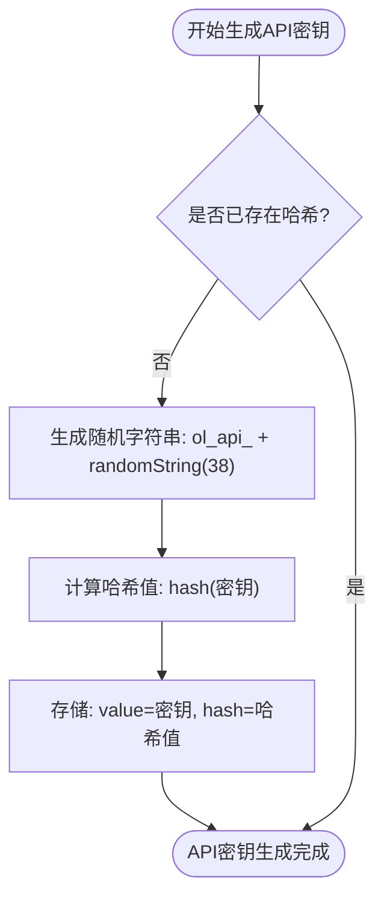
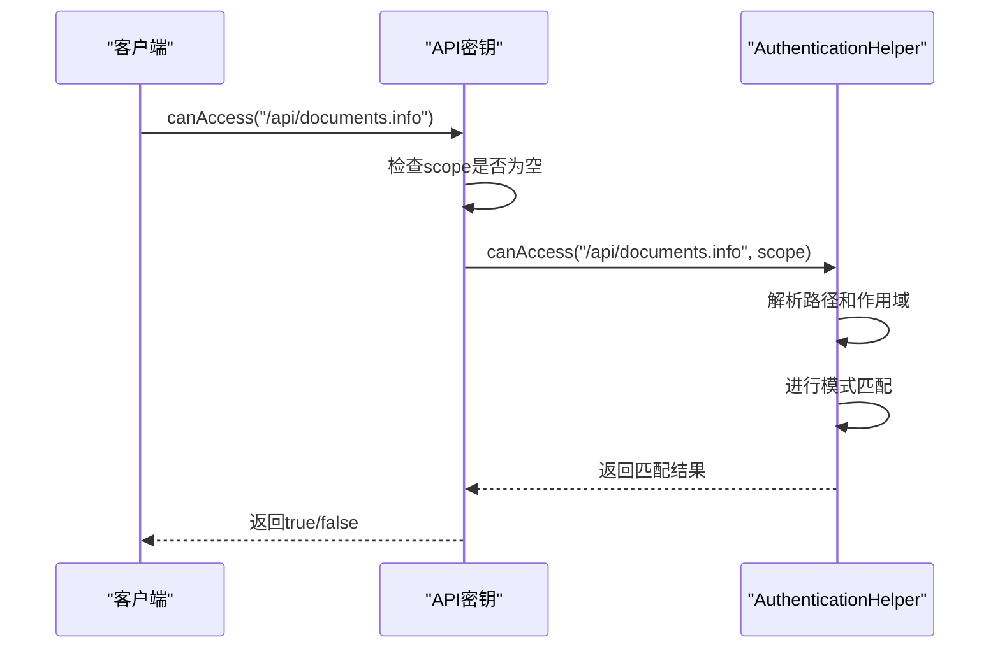
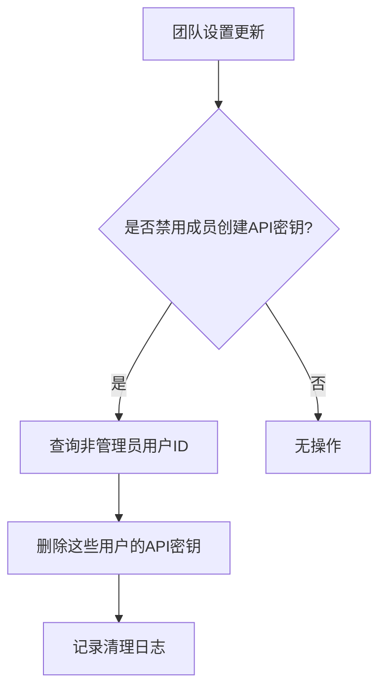

# API密钥模型

<cite>
**本文档中引用的文件**   
- [ApiKey.ts](file://app/models/ApiKey.ts)
- [ApiKey.ts](file://server/models/ApiKey.ts)
- [ApiKeyCleanupProcessor.ts](file://server/queues/processors/ApiKeyCleanupProcessor.ts)
- [ApiKeys.tsx](file://app/scenes/Settings/ApiKeys.tsx)
- [apiKey.ts](file://server/presenters/apiKey.ts)
- [AuthenticationHelper.ts](file://shared/helpers/AuthenticationHelper.ts)
- [index.tsx](file://app/scenes/ApiKeyNew/index.tsx)
- [ApiKeyListItem.tsx](file://app/scenes/Settings/components/ApiKeyListItem.tsx)
- [add-hash-to-api-key.js](file://server/migrations/20240929194201-add-hash-to-api-key.js)
- [add-api-key-scopes.js](file://server/migrations/20250125031823-add-api-key-scopes.js)
- [add-apikey-expiry.js](file://server/migrations/20240617030911-add-apikey-expiry.js)
- [add-lastActiveAt-to-apikey.js](file://server/migrations/20240618201908-add-lastActiveAt-to-apikey.js)
</cite>

## 目录
1. [简介](#简介)
2. [核心字段与安全意义](#核心字段与安全意义)
3. [生成机制与哈希存储](#生成机制与哈希存储)
4. [作用域控制与权限验证](#作用域控制与权限验证)
5. [生命周期管理](#生命周期管理)
6. [用户关联与审计日志](#用户关联与审计日志)
7. [清理机制](#清理机制)
8. [前端表示与用户界面](#前端表示与用户界面)

## 简介
API密钥（ApiKey）是系统中用于身份验证和程序化控制工作区数据的核心安全机制。它允许用户通过API接口安全地访问和操作数据，同时为第三方集成提供了可靠的认证方式。API密钥的设计兼顾了安全性、灵活性和易用性，通过作用域（scope）控制、过期时间、最后活动时间等机制，实现了细粒度的权限管理和安全审计。本模型在系统安全架构中扮演着至关重要的角色，是连接用户、应用和数据的桥梁。

**Section sources**
- [ApiKeys.tsx](file://app/scenes/Settings/ApiKeys.tsx#L16-L65)

## 核心字段与安全意义
API密钥模型包含多个关键字段，每个字段都具有特定的安全意义和功能。

- **name**: API密钥的可读名称，用于标识和区分不同的密钥。该字段经过长度验证，确保名称在合理范围内。
- **scope**: 一个字符串数组，定义了API密钥的访问范围。如果为空，则密钥具有完全访问权限。作用域机制是实现最小权限原则的核心。
- **hash**: API密钥的哈希值，用于安全存储。原始密钥不会以明文形式存储，而是通过哈希算法处理后存储，极大地提高了安全性。
- **last4**: API密钥最后4个字符的预览，用于在不暴露完整密钥的情况下进行识别和验证。
- **expiresAt**: API密钥的过期时间，可选的日期时间字段。用于控制密钥的有效期，防止长期有效的密钥带来的安全风险。
- **lastActiveAt**: API密钥最后使用的时间戳。用于跟踪密钥的活动状态，支持安全审计和异常检测。

**Section sources**
- [ApiKey.ts](file://app/models/ApiKey.ts#L7-L55)
- [ApiKey.ts](file://server/models/ApiKey.ts#L26-L179)

## 生成机制与哈希存储
API密钥的生成和存储机制设计精巧，确保了密钥的安全性和唯一性。

### 生成机制
API密钥的生成遵循特定的格式：以`ol_api_`为前缀，后跟一个38个字符的随机字符串。这种设计确保了密钥的可识别性和随机性。生成过程在`@BeforeValidate`钩子中执行，当模型实例化且尚未生成哈希时，系统会自动生成一个符合格式的密钥。

**Diagram sources **
- [ApiKey.ts](file://server/models/ApiKey.ts#L94-L102)

### 哈希存储策略
为了提升安全性，系统已从存储明文密钥（`secret`字段）迁移到存储哈希值（`hash`字段）。这一迁移通过数据库迁移脚本`20240929194201-add-hash-to-api-key.js`实现，该脚本添加了`hash`和`last4`字段，并将`secret`字段设为可为空。同时，系统提供了`20240930113921-hash-api-keys.ts`脚本，用于将现有密钥的明文值转换为哈希值并清除明文存储。`hash`字段具有唯一性约束，防止重复密钥。

**Section sources**
- [add-hash-to-api-key.js](file://server/migrations/20240929194201-add-hash-to-api-key.js#L0-L54)
- [ApiKey.ts](file://server/models/ApiKey.ts#L94-L102)

## 作用域控制与权限验证
API密钥的作用域（scope）是实现细粒度权限控制的核心机制。

### 作用域机制
作用域字段（`scope`）是一个字符串数组，每个字符串代表一个允许访问的资源路径或权限。例如，`/api/documents.info`表示可以访问文档信息接口。该字段在数据库迁移`20250125031823-add-api-key-scopes.js`中被添加，支持数组类型存储。作用域可以使用通配符`*`，如`/api/documents.*`，表示允许访问文档相关的所有方法。

### 权限验证
权限验证通过`canAccess`方法实现。该方法接收一个路径（path）作为参数，检查当前API密钥的作用域是否允许访问该路径。其逻辑如下：
1. 如果`scope`为空，则返回`true`，表示完全访问权限。
2. 否则，调用`AuthenticationHelper.canAccess`方法进行匹配。
3. 匹配规则支持`/api/namespace.method`、`namespace:scope`和`scope`三种格式，并支持通配符匹配。

**Diagram sources **
- [ApiKey.ts](file://server/models/ApiKey.ts#L128-L131)
- [AuthenticationHelper.ts](file://shared/helpers/AuthenticationHelper.ts#L33-L60)

**Section sources**
- [ApiKey.ts](file://server/models/ApiKey.ts#L128-L131)
- [AuthenticationHelper.ts](file://shared/helpers/AuthenticationHelper.ts#L33-L60)

## 生命周期管理
API密钥的生命周期通过过期时间和最后活动时间两个字段进行管理。

### 过期时间控制
`expiresAt`字段在迁移`20240617030911-add-apikey-expiry.js`中被添加，用于定义密钥的过期时间。系统提供了`isExpired`计算属性，用于判断密钥是否已过期。该属性通过`isPast`函数比较当前时间与`expiresAt`时间，如果`expiresAt`在当前时间之前，则返回`true`。前端组件`ApiKeyListItem`会根据此属性显示不同的状态（如“已过期”）。

### 最后活动时间更新策略
`lastActiveAt`字段在迁移`20240618201908-add-lastActiveAt-to-apikey.js`中被添加，用于记录密钥最后使用的时间。`updateActiveAt`方法负责更新此时间戳。为了减少数据库写入频率，该方法设置了5分钟的冷却期：只有当`lastActiveAt`为空或距离上次更新超过5分钟时，才会更新时间戳并保存到数据库。此更新操作使用`silent: true`选项，避免触发不必要的事件。

**Section sources**
- [add-apikey-expiry.js](file://server/migrations/20240617030911-add-apikey-expiry.js#L0-L14)
- [add-lastActiveAt-to-apikey.js](file://server/migrations/20240618201908-add-lastActiveAt-to-apikey.js#L0-L14)
- [ApiKey.ts](file://app/models/ApiKey.ts#L7-L55)
- [ApiKey.ts](file://server/models/ApiKey.ts#L113-L119)

## 用户关联与审计日志
API密钥与用户之间存在明确的关联关系，支持安全审计。

### 用户关联关系
每个API密钥都通过`userId`外键与一个用户（User）关联。`@BelongsTo`装饰器建立了这种关系，使得可以通过`apiKey.user`访问用户信息。这种设计确保了每个密钥都有明确的所有者，便于权限管理和责任追溯。在API响应中，`presentApiKey`函数会将用户信息包含在返回的数据中。

### 审计日志记录方式
虽然API密钥模型本身不直接包含审计日志字段，但其使用模式支持审计。`lastActiveAt`字段本身就是一种审计日志，记录了密钥的使用时间。前端组件`ApiKeyListItem`会显示“最后使用”时间，让用户可以监控密钥的活动情况。此外，系统事件（如`teams.update`）可能会触发与API密钥相关的操作，这些操作会被记录在系统的事件日志中。

**Section sources**
- [ApiKey.ts](file://server/models/ApiKey.ts#L120-L127)
- [apiKey.ts](file://server/presenters/apiKey.ts#L3-L17)
- [ApiKeyListItem.tsx](file://app/scenes/Settings/components/ApiKeyListItem.tsx#L18-L21)

## 清理机制
`ApiKeyCleanupProcessor`处理器负责响应团队策略变更，清理不再有效的API密钥。

当团队（Team）的设置更新时，如果`MembersCanCreateApiKey`偏好设置被关闭，该处理器会执行清理操作。它首先查询团队中所有非管理员用户（`role !== UserRole.Admin`）的ID，然后删除这些用户创建的所有API密钥。此操作通过`ApiKey.destroy`方法完成，并记录删除的数量到日志中。这种机制确保了当团队策略收紧时，不符合新策略的密钥会被自动清理，维护了系统的整体安全性。

**Diagram sources **
- [ApiKeyCleanupProcessor.ts](file://server/queues/processors/ApiKeyCleanupProcessor.ts#L7-L42)

**Section sources**
- [ApiKeyCleanupProcessor.ts](file://server/queues/processors/ApiKeyCleanupProcessor.ts#L7-L42)

## 前端表示与用户界面
API密钥在前端通过特定的组件和交互模式进行表示。

### 前端表示方式
在前端，API密钥主要通过`ApiKeyListItem`组件进行展示。该组件显示密钥的名称、创建时间、最后使用时间、过期状态和作用域信息。为了安全，完整的密钥值不会直接显示。取而代之的是`obfuscatedValue`计算属性，它根据创建时间返回`...xxxx`或`ol...xxxx`格式的模糊化值，其中`xxxx`是`last4`字段的值。

### 用户界面交互模式
用户通过`ApiKeys`场景页面管理API密钥。该页面列出所有密钥，并提供“新建API密钥”按钮。点击按钮会打开`ApiKeyNew`表单，用户可以输入名称、作用域和选择过期时间（从预设选项或自定义日期选择器）。创建成功后，系统会短暂显示完整的密钥值，用户必须立即复制，因为之后将无法再次查看。`ApiKeyListItem`组件提供“复制”按钮，可以将密钥值复制到剪贴板，并通过`ApiKeyMenu`提供删除等操作。

**Section sources**
- [ApiKeys.tsx](file://app/scenes/Settings/ApiKeys.tsx#L16-L65)
- [index.tsx](file://app/scenes/ApiKeyNew/index.tsx#L0-L164)
- [ApiKeyListItem.tsx](file://app/scenes/Settings/components/ApiKeyListItem.tsx#L0-L108)