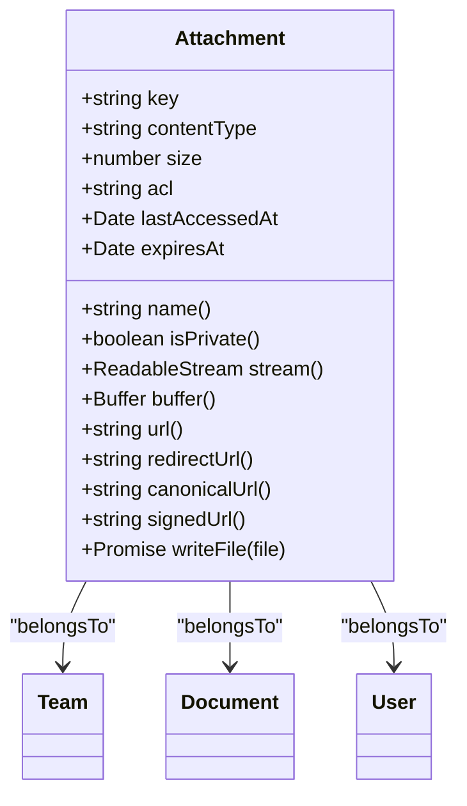
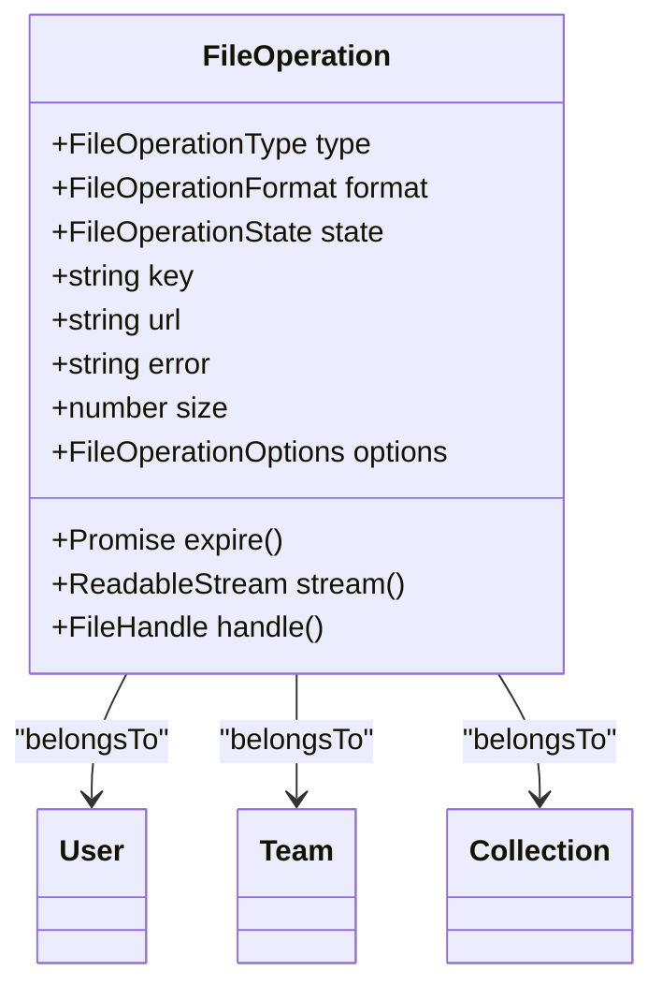
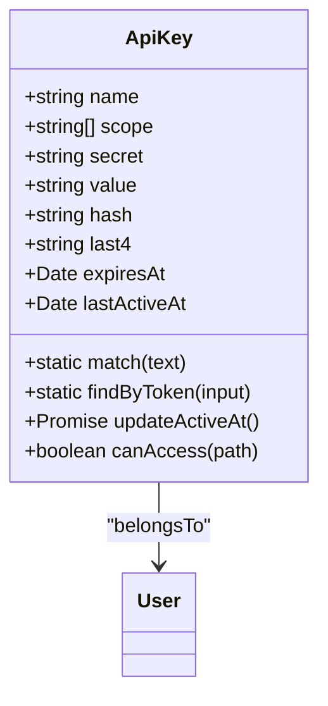
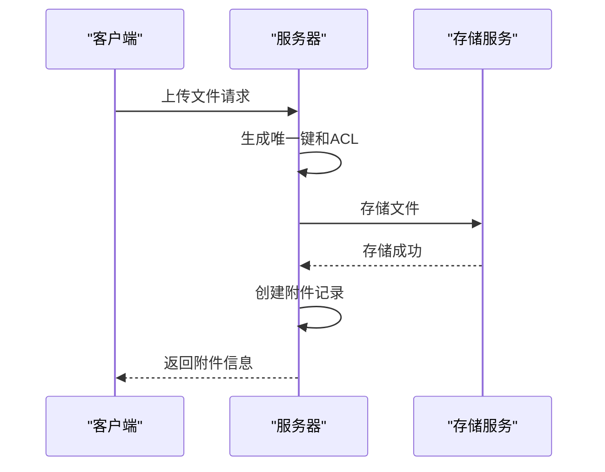
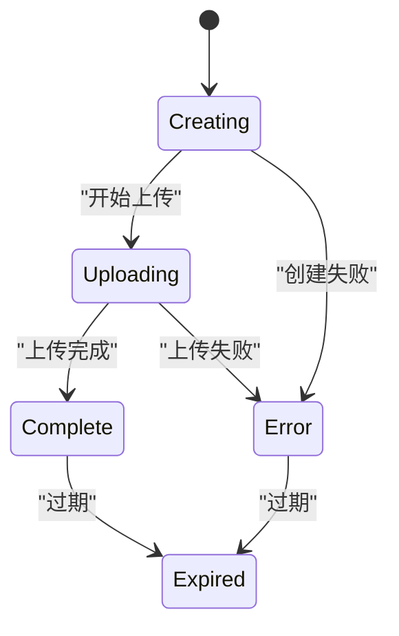
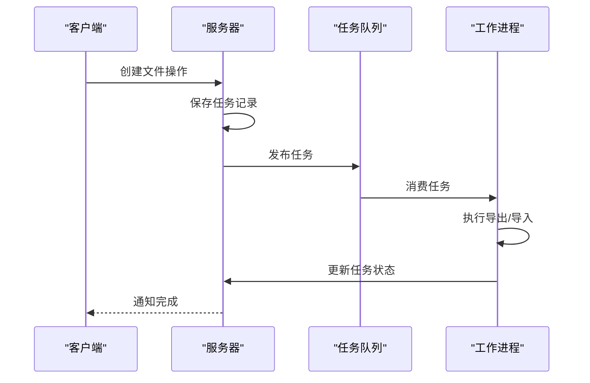
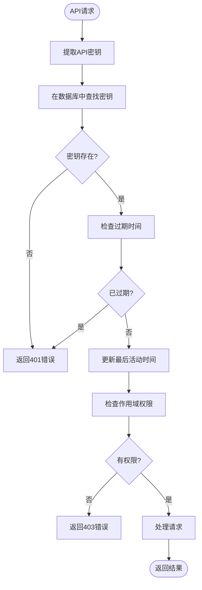
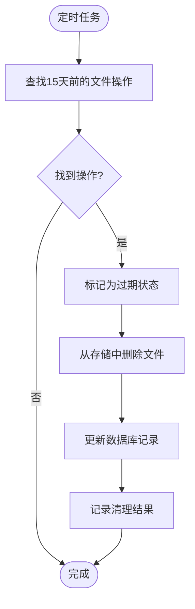
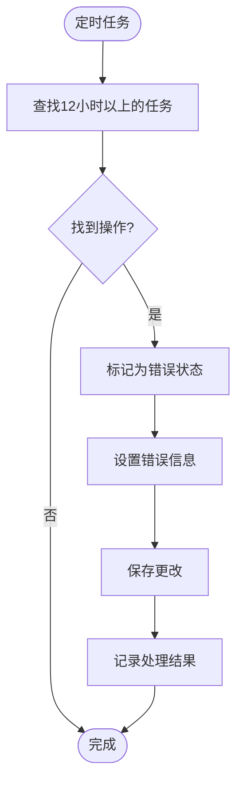
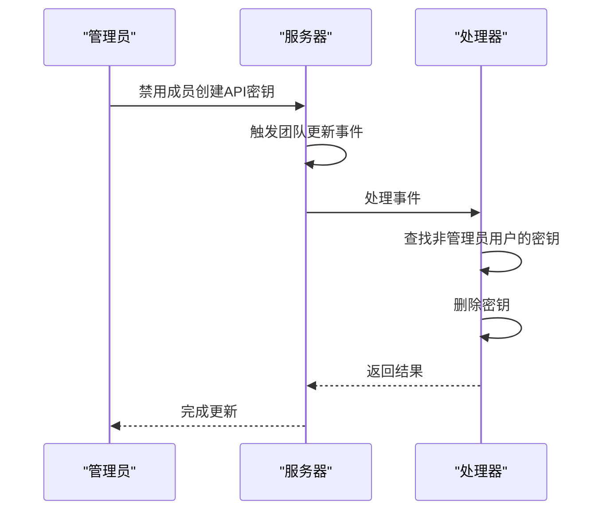

# 存储与文件管理模型

<cite>
**本文档引用的文件**   
- [Attachment.ts](file://server/models/Attachment.ts)
- [FileOperation.ts](file://server/models/FileOperation.ts)
- [ApiKey.ts](file://server/models/ApiKey.ts)
- [attachmentCreator.ts](file://server/commands/attachmentCreator.ts)
- [ErrorTimedOutFileOperationsTask.ts](file://server/queues/tasks/ErrorTimedOutFileOperationsTask.ts)
- [CleanupExpiredFileOperationsTask.ts](file://server/queues/tasks/CleanupExpiredFileOperationsTask.ts)
- [FileOperationCreatedProcessor.ts](file://server/queues/processors/FileOperationCreatedProcessor.ts)
- [FileOperationDeletedProcessor.ts](file://server/queues/processors/FileOperationDeletedProcessor.ts)
- [ApiKeyCleanupProcessor.ts](file://server/queues/processors/ApiKeyCleanupProcessor.ts)
</cite>

## 目录
1. [简介](#简介)
2. [核心数据模型](#核心数据模型)
3. [文件上传与存储机制](#文件上传与存储机制)
4. [文件操作任务状态机](#文件操作任务状态机)
5. [API密钥管理](#api密钥管理)
6. [清理与过期处理](#清理与过期处理)
7. [安全与访问控制](#安全与访问控制)
8. [最佳实践](#最佳实践)

## 简介
本文档详细介绍了存储与文件管理相关的数据模型，重点分析附件（Attachment）、文件操作（FileOperation）和API密钥（ApiKey）的实现。文档涵盖了文件上传、存储、访问控制和清理机制，详细描述了文件操作任务的状态机、错误处理和异步处理流程，以及API密钥的生成、验证、过期和权限控制机制。

**Section sources**
- [Attachment.ts](file://server/models/Attachment.ts#L33-L236)
- [FileOperation.ts](file://server/models/FileOperation.ts#L34-L165)
- [ApiKey.ts](file://server/models/ApiKey.ts#L26-L179)

## 核心数据模型

### 附件模型（Attachment）
附件模型用于管理用户上传的文件，包括文档附件、头像等。模型包含文件的元数据、存储位置和访问控制信息。

**Diagram sources**
- [Attachment.ts](file://server/models/Attachment.ts#L33-L236)

### 文件操作模型（FileOperation）
文件操作模型用于管理导出和导入任务，包括任务状态、格式和进度跟踪。

**Diagram sources**
- [FileOperation.ts](file://server/models/FileOperation.ts#L34-L165)

### API密钥模型（ApiKey）
API密钥模型用于管理API访问凭证，包括密钥的生成、验证和权限控制。

**Diagram sources**
- [ApiKey.ts](file://server/models/ApiKey.ts#L26-L179)

## 文件上传与存储机制

### 文件上传流程
文件上传通过`attachmentCreator`命令实现，支持从URL或缓冲区创建附件。上传过程包括生成唯一键、存储文件和创建数据库记录。

**Diagram sources**
- [attachmentCreator.ts](file://server/commands/attachmentCreator.ts#L8-L95)

### 存储配置
系统支持多种存储后端，通过`FileStorage`接口进行抽象。附件根据预设（preset）分配到不同的存储桶，如公共存储桶和上传存储桶。

**Section sources**
- [AttachmentHelper.ts](file://server/models/helpers/AttachmentHelper.ts#L11-L117)

## 文件操作任务状态机

### 状态转换
文件操作任务具有明确的状态机，包括创建、上传、完成、错误和过期状态。状态转换由异步任务处理器驱动。

**Diagram sources**
- [FileOperation.ts](file://server/models/FileOperation.ts#L34-L165)

### 异步处理流程
文件操作任务通过消息队列进行异步处理，确保系统响应性和可靠性。

**Diagram sources**
- [FileOperationCreatedProcessor.ts](file://server/queues/processors/FileOperationCreatedProcessor.ts#L8-L57)

## API密钥管理

### 密钥生成与验证
API密钥在创建时生成，包含前缀和随机字符串。系统支持通过明文或哈希值查找密钥，确保安全性。

**Section sources**
- [ApiKey.ts](file://server/models/ApiKey.ts#L26-L179)

### 权限控制
API密钥支持基于路径的访问控制，通过作用域（scope）限制访问权限。

**Diagram sources**
- [ApiKey.ts](file://server/models/ApiKey.ts#L26-L179)

## 清理与过期处理

### 过期文件操作清理
系统定期清理过期的文件操作任务，释放存储空间。

**Diagram sources**
- [CleanupExpiredFileOperationsTask.ts](file://server/queues/tasks/CleanupExpiredFileOperationsTask.ts#L7-L39)

### 超时任务处理
系统监控长时间运行的任务，防止资源泄漏。

**Diagram sources**
- [ErrorTimedOutFileOperationsTask.ts](file://server/queues/tasks/ErrorTimedOutFileOperationsTask.ts#L7-L48)

## 安全与访问控制

### 附件访问控制
附件支持公共和私有访问模式，私有附件通过重定向URL进行访问控制。

**Section sources**
- [Attachment.ts](file://server/models/Attachment.ts#L33-L236)

### API密钥清理
当团队设置更改时，系统自动清理无效的API密钥。

**Diagram sources**
- [ApiKeyCleanupProcessor.ts](file://server/queues/processors/ApiKeyCleanupProcessor.ts#L7-L43)

## 最佳实践

### 大文件处理
- 使用分块上传减少内存占用
- 设置合理的超时时间
- 提供进度反馈

### 安全存储
- 敏感文件存储在私有存储桶
- 定期轮换存储密钥
- 启用存储服务的加密功能

### API访问优化
- 使用连接池减少连接开销
- 实现请求缓存
- 监控API使用情况

**Section sources**
- [FileOperation.ts](file://server/models/FileOperation.ts#L34-L165)
- [ApiKey.ts](file://server/models/ApiKey.ts#L26-L179)
- [Attachment.ts](file://server/models/Attachment.ts#L33-L236)