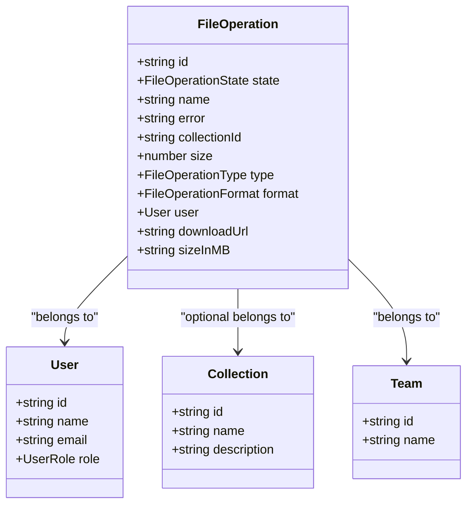
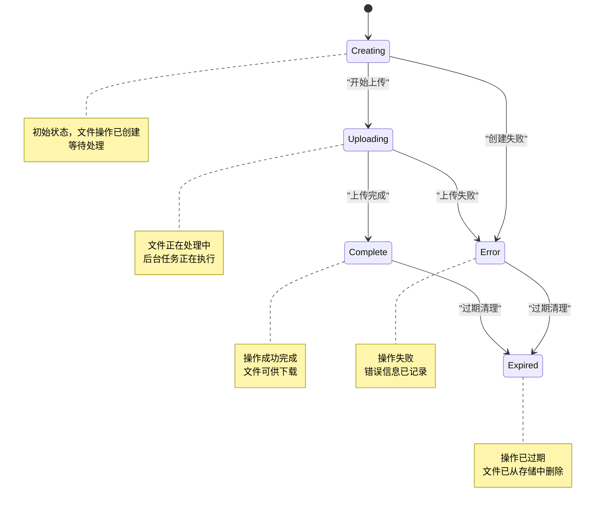
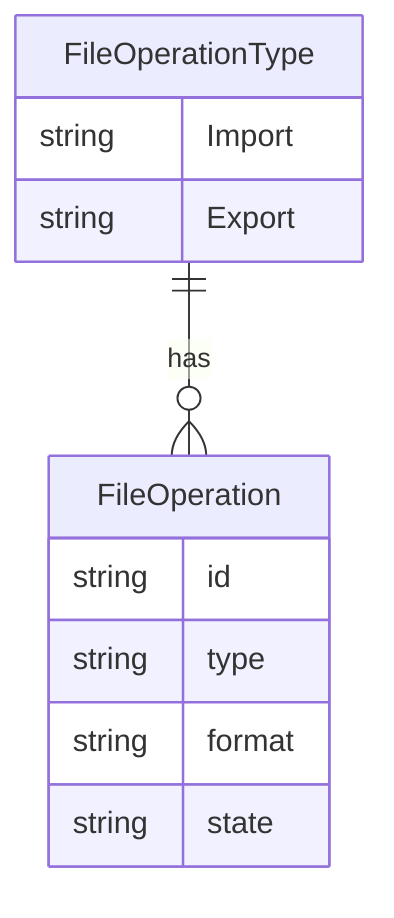
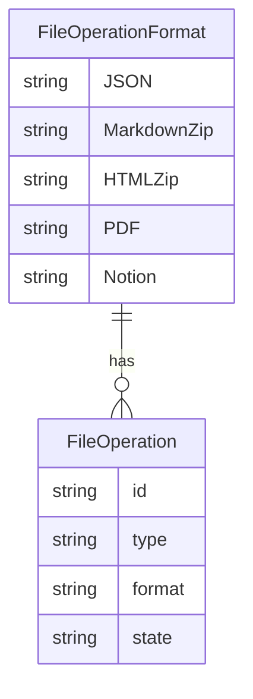
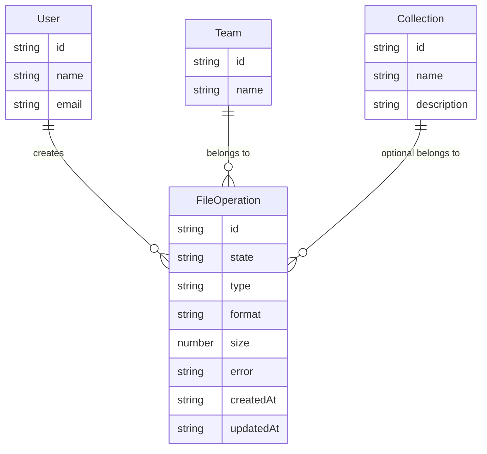
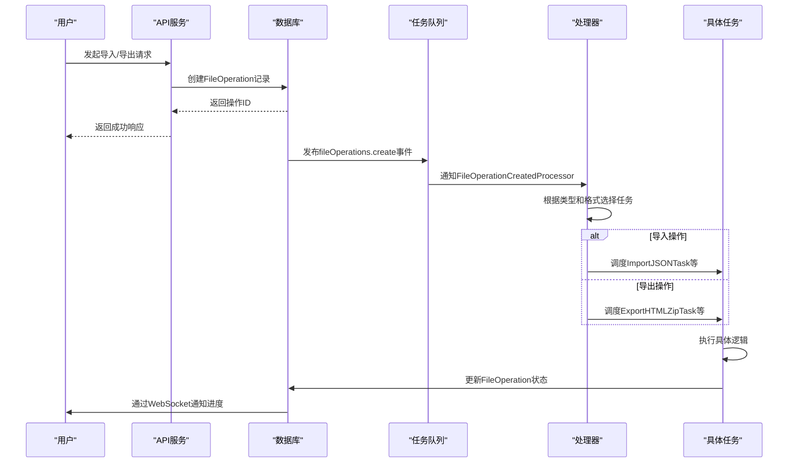
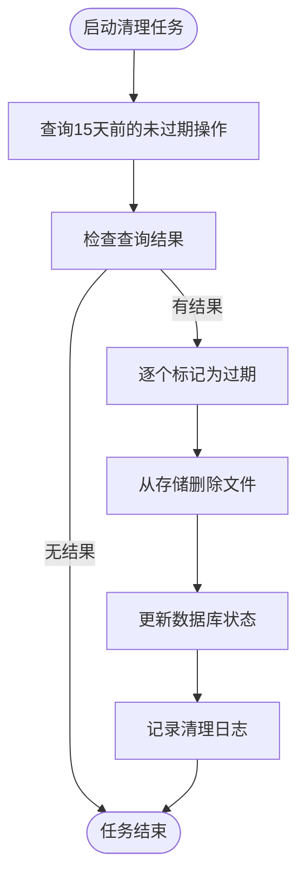
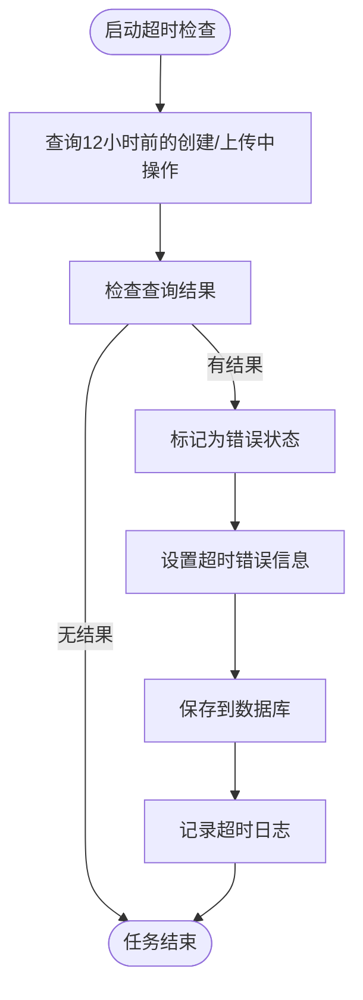

# 文件操作模型

<cite>
**本文档引用的文件**   
- [FileOperation.ts](file://app/models/FileOperation.ts)
- [FileOperation.ts](file://server/models/FileOperation.ts)
- [types.ts](file://shared/types.ts)
- [FileOperationCreatedProcessor.ts](file://server/queues/processors/FileOperationCreatedProcessor.ts)
- [CleanupExpiredFileOperationsTask.ts](file://server/queues/tasks/CleanupExpiredFileOperationsTask.ts)
- [ErrorTimedOutFileOperationsTask.ts](file://server/queues/tasks/ErrorTimedOutFileOperationsTask.ts)
- [FileOperationListItem.tsx](file://app/scenes/Settings/components/FileOperationListItem.tsx)
- [FileOperationMenu.tsx](file://app/menus/FileOperationMenu.tsx)
- [fileOperations.ts](file://server/routes/api/fileOperations/fileOperations.ts)
</cite>

## 目录
1. [简介](#简介)
2. [核心数据模型](#核心数据模型)
3. [状态机与生命周期](#状态机与生命周期)
4. [操作类型与格式](#操作类型与格式)
5. [关联关系](#关联关系)
6. [后台任务处理](#后台任务处理)
7. [清理与超时处理](#清理与超时处理)
8. [管理界面展示](#管理界面展示)
9. [API接口](#api接口)
10. [总结](#总结)

## 简介
文件操作（FileOperation）数据模型是系统中处理异步文件导入导出任务的核心组件。该模型负责管理文件上传、下载、转换等耗时操作的整个生命周期，通过状态机跟踪操作进度，并与用户、团队、集合等实体建立关联。本文档详细阐述了文件操作模型的设计、状态转换、任务调度机制以及在系统中的角色和交互方式。

## 核心数据模型
文件操作模型定义了异步文件处理任务的核心属性和行为。该模型在前端和后端分别实现，保持数据结构的一致性。



**模型属性说明：**
- **state**: 操作当前状态（创建中、上传中、完成、错误、过期）
- **type**: 操作类型（导入、导出）
- **format**: 文件格式（JSON、MarkdownZip、HTMLZip等）
- **size**: 文件大小（字节）
- **collectionId**: 关联的集合ID（可选）
- **user**: 创建操作的用户
- **options**: 配置选项（包含附件、权限等）

**Diagram sources**
- [FileOperation.ts](file://app/models/FileOperation.ts#L11-L42)
- [FileOperation.ts](file://server/models/FileOperation.ts#L34-L165)

**Section sources**
- [FileOperation.ts](file://app/models/FileOperation.ts#L11-L42)
- [FileOperation.ts](file://server/models/FileOperation.ts#L34-L165)

## 状态机与生命周期
文件操作采用状态机模式管理其生命周期，确保操作状态的清晰和可追踪。状态转换遵循严格的规则，保证系统的一致性。



**状态转换逻辑：**
- **Creating**: 操作创建后的初始状态，等待后台处理器调度
- **Uploading**: 后台任务开始处理，文件正在生成或解析
- **Complete**: 操作成功完成，文件已生成并存储
- **Error**: 操作失败，错误信息已记录在error字段
- **Expired**: 操作过期，文件已从存储中清理

**生命周期管理：**
1. **创建**: 用户发起导入/导出请求，创建FileOperation记录
2. **执行**: 后台处理器监听创建事件，调度相应任务
3. **监控**: 系统定期检查长时间运行的操作
4. **清理**: 过期操作被自动清理，释放存储空间

**Diagram sources**
- [FileOperation.ts](file://shared/types.ts#L56-L62)
- [FileOperation.ts](file://server/models/FileOperation.ts#L34-L165)

**Section sources**
- [FileOperation.ts](file://shared/types.ts#L56-L62)
- [FileOperation.ts](file://server/models/FileOperation.ts#L34-L165)

## 操作类型与格式
文件操作支持多种类型和格式，满足不同的数据导入导出需求。类型和格式的组合决定了具体的处理逻辑和任务调度。

### 操作类型


- **导入（Import）**: 将外部数据导入系统，创建新的集合和文档
- **导出（Export）**: 将系统数据导出为文件，供用户下载

### 文件格式


**业务含义：**
- **JSON**: 结构化数据格式，用于系统间数据迁移
- **MarkdownZip**: 包含Markdown文件和附件的压缩包
- **HTMLZip**: 包含HTML文件和资源的压缩包
- **PDF**: 便携式文档格式，适合打印和分享
- **Notion**: Notion导出格式，支持特定数据结构

**配置选项：**
```typescript
type FileOperationOptions = {
  includeAttachments?: boolean;
  includePrivate?: boolean;
  permission?: CollectionPermission | null;
};
```

**Diagram sources**
- [types.ts](file://shared/types.ts#L43-L49)
- [types.ts](file://shared/types.ts#L51-L54)
- [FileOperation.ts](file://server/models/FileOperation.ts#L34-L165)

**Section sources**
- [types.ts](file://shared/types.ts#L43-L54)
- [FileOperation.ts](file://server/models/FileOperation.ts#L34-L165)

## 关联关系
文件操作模型与用户、团队、集合等核心实体建立关联，形成完整的数据关系网络。



**关联关系说明：**
- **用户（User）**: 每个文件操作都关联到创建它的用户，用于权限验证和审计
- **团队（Team）**: 文件操作属于特定团队，确保数据隔离和访问控制
- **集合（Collection）**: 导入操作可指定目标集合，导出操作可关联源集合

**数据流角色：**
- **导入流程**: 用户上传文件 → 创建FileOperation → 解析数据 → 创建集合/文档
- **导出流程**: 用户请求导出 → 创建FileOperation → 生成文件 → 存储文件 → 通知用户

**Diagram sources**
- [FileOperation.ts](file://server/models/FileOperation.ts#L34-L165)
- [FileOperation.ts](file://app/models/FileOperation.ts#L11-L42)

**Section sources**
- [FileOperation.ts](file://server/models/FileOperation.ts#L34-L165)
- [FileOperation.ts](file://app/models/FileOperation.ts#L11-L42)

## 后台任务处理
文件操作的执行依赖于后台任务处理器，采用事件驱动架构实现异步处理。



**处理器逻辑：**
```typescript
async perform(event: FileOperationEvent) {
  const fileOperation = await FileOperation.findByPk(event.modelId);
  
  if (fileOperation.type === FileOperationType.Import) {
    switch (fileOperation.format) {
      case FileOperationFormat.MarkdownZip:
        await new ImportMarkdownZipTask().schedule({ fileOperationId: event.modelId });
        break;
      case FileOperationFormat.JSON:
        await new ImportJSONTask().schedule({ fileOperationId: event.modelId });
        break;
    }
  }
  
  if (fileOperation.type === FileOperationType.Export) {
    switch (fileOperation.format) {
      case FileOperationFormat.HTMLZip:
        await new ExportHTMLZipTask().schedule({ fileOperationId: event.modelId });
        break;
      case FileOperationFormat.MarkdownZip:
        await new ExportMarkdownZipTask().schedule({ fileOperationId: event.modelId });
        break;
      case FileOperationFormat.JSON:
        await new ExportJSONTask().schedule({ fileOperationId: event.modelId });
        break;
    }
  }
}
```

**任务调度机制：**
- 基于Bull队列系统实现可靠的任务调度
- 支持任务优先级和重试策略
- 通过事件总线实现松耦合的组件通信

**Diagram sources**
- [FileOperationCreatedProcessor.ts](file://server/queues/processors/FileOperationCreatedProcessor.ts#L10-L56)
- [FileOperation.ts](file://shared/types.ts#L43-L54)

**Section sources**
- [FileOperationCreatedProcessor.ts](file://server/queues/processors/FileOperationCreatedProcessor.ts#L10-L56)

## 清理与超时处理
系统提供自动化的清理和超时处理机制，确保资源的有效利用和系统的稳定性。

### 过期清理策略


**清理任务逻辑：**
- 每小时执行一次
- 查找创建时间超过15天且未过期的操作
- 调用expire方法标记为过期并删除文件
- 记录清理日志

### 超时处理机制


**超时处理逻辑：**
- 每小时执行一次
- 查找创建时间超过12小时且处于创建中或上传中状态的操作
- 标记为错误状态，设置"Timed out"错误信息
- 防止长时间挂起的任务占用系统资源

**清理任务代码结构：**
```typescript
export default class CleanupExpiredFileOperationsTask extends BaseTask<Props> {
  static cron = TaskSchedule.Hour;
  
  public async perform({ limit }: Props) {
    const fileOperations = await FileOperation.unscoped().findAll({
      where: {
        createdAt: { [Op.lt]: subDays(new Date(), 15) },
        state: { [Op.ne]: FileOperationState.Expired }
      },
      limit
    });
    await Promise.all(fileOperations.map((fileOperation) => fileOperation.expire()));
  }
}

export default class ErrorTimedOutFileOperationsTask extends BaseTask<Props> {
  static cron = TaskSchedule.Hour;
  
  public async perform({ limit }: Props) {
    const fileOperations = await FileOperation.unscoped().findAll({
      where: {
        createdAt: { [Op.lt]: subHours(new Date(), 12) },
        [Op.or]: [
          { state: FileOperationState.Creating },
          { state: FileOperationState.Uploading }
        ]
      },
      limit
    });
    await Promise.all(fileOperations.map(async (fileOperation) => {
      fileOperation.state = FileOperationState.Error;
      fileOperation.error = "Timed out";
      await fileOperation.save({ hooks: false });
    }));
  }
}
```

**Diagram sources**
- [CleanupExpiredFileOperationsTask.ts](file://server/queues/tasks/CleanupExpiredFileOperationsTask.ts#L11-L39)
- [ErrorTimedOutFileOperationsTask.ts](file://server/queues/tasks/ErrorTimedOutFileOperationsTask.ts#L11-L48)

**Section sources**
- [CleanupExpiredFileOperationsTask.ts](file://server/queues/tasks/CleanupExpiredFileOperationsTask.ts#L11-L39)
- [ErrorTimedOutFileOperationsTask.ts](file://server/queues/tasks/ErrorTimedOutFileOperationsTask.ts#L11-L48)

## 管理界面展示
文件操作在管理界面中以列表形式展示，提供状态可视化和用户交互功能。

```mermaid
flowchart TD
subgraph "管理界面"
UI[用户界面]
Store[FileOperationsStore]
Model[FileOperation]
end
UI --> Store: 获取导入/导出列表
Store --> Model: 过滤和排序
Model --> UI: 返回数据
UI --> UI: 渲染列表项
UI --> UI: 显示状态图标
UI --> UI: 提供操作菜单
subgraph "用户交互"
Click[点击下载]
Delete[点击删除]
Confirm[确认删除]
end
Click --> |导出完成| Download["重定向到下载链接"]
Delete --> Confirm
Confirm --> |确认| API["调用删除API"]
API --> DB["删除数据库记录"]
DB --> UI["刷新界面"]
```

**界面组件：**
- **FileOperationListItem**: 列表项组件，显示操作详情
- **FileOperationMenu**: 操作菜单，提供下载和删除功能
- **FileOperationsStore**: 数据存储，管理操作列表

**状态映射：**
```typescript
const stateMapping = {
  [FileOperationState.Creating]: t("Processing"),
  [FileOperationState.Uploading]: t("Processing"),
  [FileOperationState.Expired]: t("Expired"),
  [FileOperationState.Complete]: t("Completed"),
  [FileOperationState.Error]: t("Failed"),
};

const iconMapping: Record<FileOperationState, React.JSX.Element> = {
  [FileOperationState.Creating]: <Spinner />,
  [FileOperationState.Uploading]: <Spinner />,
  [FileOperationState.Expired]: <ArchiveIcon color={theme.textTertiary} />,
  [FileOperationState.Complete]: <DoneIcon color={theme.accent} />,
  [FileOperationState.Error]: <WarningIcon color={theme.danger} />,
};
```

**用户交互流程：**
1. 用户在设置页面查看导入导出历史
2. 系统从FileOperationsStore获取数据并渲染列表
3. 用户可通过菜单下载完成的导出文件
4. 用户可删除导入操作（删除关联的集合和文档）
5. 系统通过WebSocket实时更新操作状态

**Diagram sources**
- [FileOperationListItem.tsx](file://app/scenes/Settings/components/FileOperationListItem.tsx#L26-L144)
- [FileOperationMenu.tsx](file://app/menus/FileOperationMenu.tsx#L20-L63)
- [FileOperationsStore.ts](file://app/stores/FileOperationsStore.ts#L7-L39)

**Section sources**
- [FileOperationListItem.tsx](file://app/scenes/Settings/components/FileOperationListItem.tsx#L26-L144)
- [FileOperationMenu.tsx](file://app/menus/FileOperationMenu.tsx#L20-L63)

## API接口
文件操作提供RESTful API接口，支持对操作的查询、下载和删除。

```mermaid
flowchart TD
subgraph "API路由"
Info["POST /api/fileOperations.info"]
List["POST /api/fileOperations.list"]
Redirect["GET/POST /api/fileOperations.redirect"]
Delete["POST /api/fileOperations.delete"]
end
Client --> Info: 获取操作详情
Client --> List: 列出操作
Client --> Redirect: 下载文件
Client --> Delete: 删除操作
Info --> DB: 查询FileOperation
Info --> Auth: 验证权限
Info --> Response: 返回操作数据
List --> DB: 查询操作列表
List --> Auth: 验证权限
List --> Response: 返回分页数据
Redirect --> DB: 查询操作
Redirect --> Auth: 验证权限
Redirect --> Check: 检查状态
Check --> |完成| S3: 获取预签名URL
S3 --> Response: 重定向到文件
Check --> |未完成| Error: 返回错误
Delete --> DB: 查询操作
Delete --> Auth: 验证权限
Delete --> Lock: 获取行锁
Delete --> Destroy: 删除记录
Delete --> Response: 返回成功
```

**API端点：**
- **fileOperations.info**: 获取单个操作的详细信息
- **fileOperations.list**: 列出用户的操作（分页）
- **fileOperations.redirect**: 重定向到文件下载链接
- **fileOperations.delete**: 删除操作记录

**权限控制：**
- 仅管理员可访问文件操作API
- 操作必须属于用户所在团队
- 删除导出操作需处于完成状态

**安全考虑：**
- 使用预签名URL确保文件访问安全
- 操作状态检查防止下载未完成文件
- 行级锁防止并发删除冲突

**Diagram sources**
- [fileOperations.ts](file://server/routes/api/fileOperations/fileOperations.ts#L25-L130)
- [FileOperation.ts](file://server/models/FileOperation.ts#L34-L165)

**Section sources**
- [fileOperations.ts](file://server/routes/api/fileOperations/fileOperations.ts#L25-L130)

## 总结
文件操作模型是系统中处理异步文件任务的核心组件，通过状态机管理操作生命周期，支持多种导入导出格式，并与用户、团队、集合等实体建立关联。系统采用事件驱动架构，通过后台处理器调度具体任务，并提供自动化的清理和超时处理机制。管理界面提供直观的状态展示和用户交互，API接口确保安全可靠的操作管理。该模型设计充分考虑了可扩展性、可靠性和用户体验，为系统的数据导入导出功能提供了坚实的基础。