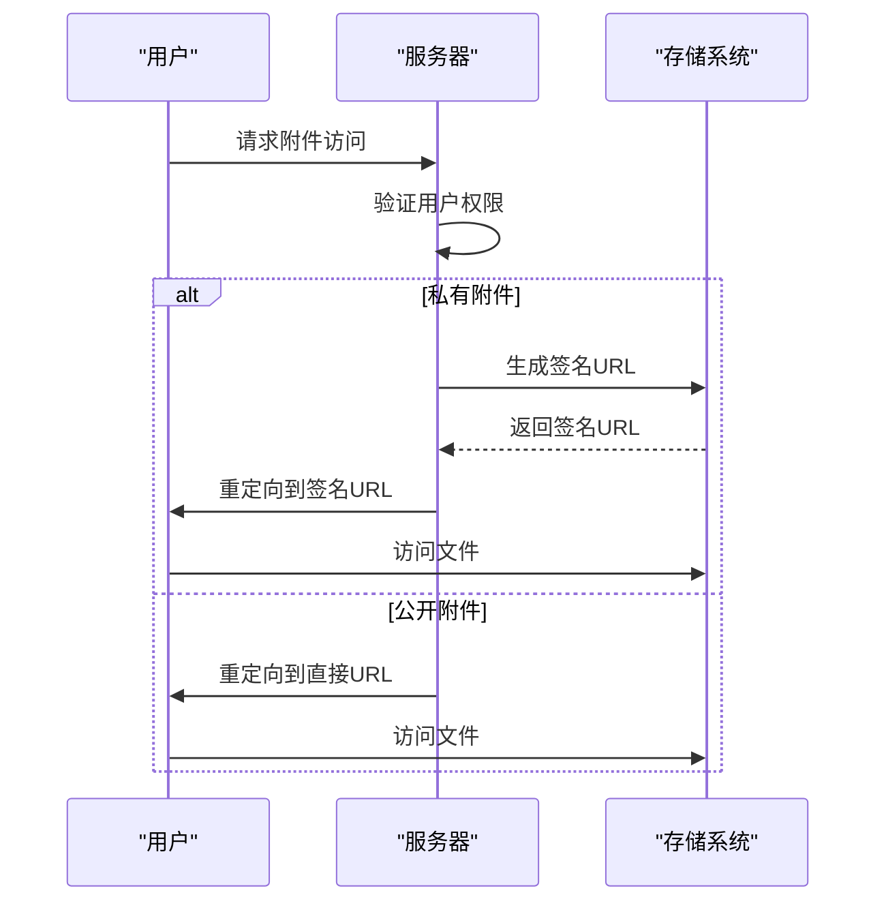
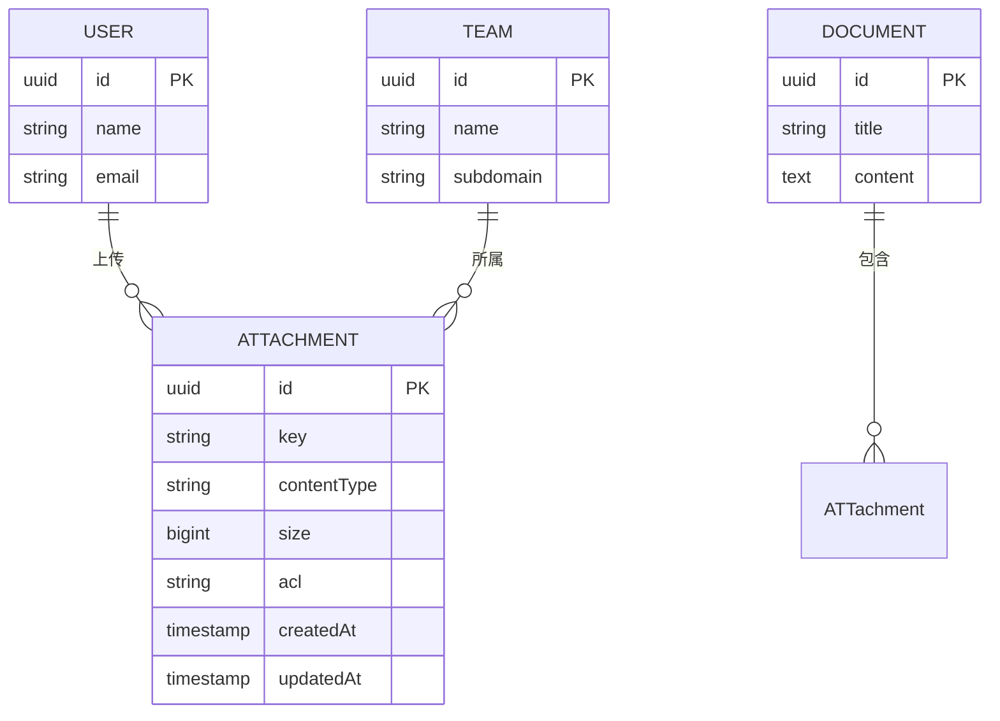
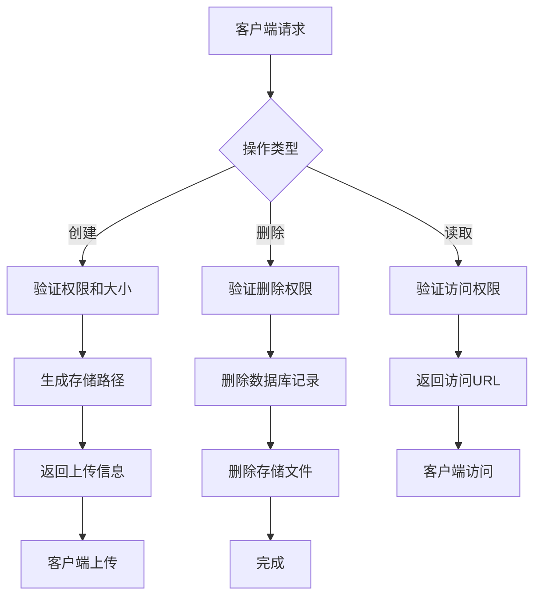
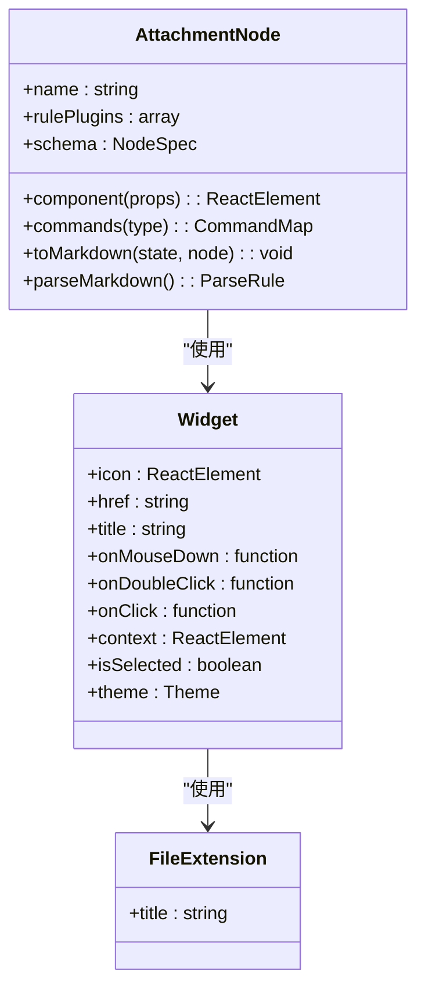

# 附件模型

<cite>
**本文档引用的文件**   
- [Attachment.ts](file://server/models/Attachment.ts)
- [attachmentCreator.ts](file://server/commands/attachmentCreator.ts)
- [attachments.ts](file://server/routes/api/attachments/attachments.ts)
- [AttachmentHelper.ts](file://server/models/helpers/AttachmentHelper.ts)
- [Attachment.tsx](file://shared/editor/nodes/Attachment.tsx)
</cite>

## 目录
1. [简介](#简介)
2. [元数据字段](#元数据字段)
3. [访问控制机制](#访问控制机制)
4. [安全访问模式](#安全访问模式)
5. [关联关系](#关联关系)
6. [生命周期管理](#生命周期管理)
7. [命名规范与路径生成](#命名规范与路径生成)
8. [文件大小限制策略](#文件大小限制策略)
9. [编辑器集成与用户交互](#编辑器集成与用户交互)

## 简介
附件模型是系统中用于管理文件上传、存储和访问的核心数据结构。它不仅负责文件的元数据存储，还实现了复杂的访问控制、安全访问模式和生命周期管理机制。附件可以与用户、文档和团队建立关联，支持多种使用场景，包括文档附件、用户头像和导入文件等。

**Section sources**
- [Attachment.ts](file://server/models/Attachment.ts#L33-L236)

## 元数据字段
附件模型包含多个关键的元数据字段，每个字段都有明确的业务含义和约束条件。

### key
- **描述**: 文件在存储系统中的唯一标识符，包含路径信息
- **约束**: 最大长度4096字符
- **业务含义**: 用于在存储系统中定位文件，由存储桶、用户ID、附件ID和文件名组成

### contentType
- **描述**: 文件的MIME类型
- **约束**: 最大长度255字符
- **业务含义**: 用于浏览器正确解析和显示文件内容

### size
- **描述**: 文件大小（字节）
- **约束**: 数值类型，BIGINT
- **业务含义**: 用于显示文件大小和进行存储配额计算

### acl
- **描述**: 访问控制列表
- **默认值**: "public-read"
- **可选值**: "private", "public-read"
- **业务含义**: 控制文件的访问权限

### lastAccessedAt
- **描述**: 最后访问时间
- **业务含义**: 用于跟踪文件的使用情况和进行存储优化

### expiresAt
- **描述**: 过期时间
- **业务含义**: 用于临时文件的自动清理

**Section sources**
- [Attachment.ts](file://server/models/Attachment.ts#L33-L236)

## 访问控制机制
附件模型实现了基于ACL（访问控制列表）的访问控制机制，支持两种访问模式：

### public-read
- **特点**: 文件可公开访问
- **使用场景**: 文档附件、用户头像等需要公开访问的文件
- **安全特性**: 通过CDN缓存提高访问性能

### private
- **特点**: 文件需要身份验证才能访问
- **使用场景**: 敏感文件、临时上传文件
- **安全特性**: 必须通过重定向或签名URL访问

**Section sources**
- [Attachment.ts](file://server/models/Attachment.ts#L33-L236)

## 安全访问模式
附件模型提供了多种安全访问模式，确保文件访问的安全性和灵活性。

### redirectUrl
- **描述**: 重定向URL，用于私有附件的安全访问
- **实现**: 通过API端点`/api/attachments.redirect`进行身份验证后重定向
- **缓存策略**: 设置`max-age=3600, immutable`，利用浏览器缓存

### canonicalUrl
- **描述**: 存储系统的直接URL
- **使用限制**: 仅适用于public-read附件
- **缓存策略**: 设置`max-age=604800, immutable`，长期缓存

### signedUrl
- **描述**: 带签名的临时访问URL
- **有效期**: 默认1小时
- **使用场景**: 临时分享、API访问



**Diagram sources **
- [Attachment.ts](file://server/models/Attachment.ts#L33-L236)
- [attachments.ts](file://server/routes/api/attachments/attachments.ts#L247-L278)

**Section sources**
- [Attachment.ts](file://server/models/Attachment.ts#L33-L236)
- [attachments.ts](file://server/routes/api/attachments/attachments.ts#L247-L278)

## 关联关系
附件模型与多个核心实体建立了关联关系，形成了完整的数据网络。

### 与用户的关联
- **关系类型**: 多对一 (BelongsTo)
- **外键**: userId
- **业务含义**: 记录附件的上传者

### 与文档的关联
- **关系类型**: 多对一 (BelongsTo)
- **外键**: documentId
- **业务含义**: 将附件与特定文档关联，支持文档附件功能

### 与团队的关联
- **关系类型**: 多对一 (BelongsTo)
- **外键**: teamId
- **业务含义**: 实现团队级别的存储配额管理和访问控制



**Diagram sources **
- [Attachment.ts](file://server/models/Attachment.ts#L33-L236)

**Section sources**
- [Attachment.ts](file://server/models/Attachment.ts#L33-L236)

## 生命周期管理
附件模型实现了完整的生命周期管理，包括创建、读取、更新和删除操作。

### 创建流程
1. 客户端请求创建附件
2. 服务器验证权限和文件大小
3. 生成唯一的附件ID和存储路径
4. 返回预签名的上传信息
5. 客户端直接上传到存储系统

### 读取流程
1. 客户端请求附件信息
2. 服务器验证访问权限
3. 根据ACL类型返回相应的访问URL
4. 更新最后访问时间

### 删除流程
1. 客户端请求删除附件
2. 服务器验证删除权限
3. 从数据库删除附件记录
4. 从存储系统删除文件



**Diagram sources **
- [attachmentCreator.ts](file://server/commands/attachmentCreator.ts#L36-L94)
- [attachments.ts](file://server/routes/api/attachments/attachments.ts#L87-L163)

**Section sources**
- [attachmentCreator.ts](file://server/commands/attachmentCreator.ts#L36-L94)
- [attachments.ts](file://server/routes/api/attachments/attachments.ts#L87-L163)

## 命名规范与路径生成
附件模型采用标准化的路径生成规则，确保文件存储的组织性和可管理性。

### 路径生成规则
```
<存储桶>/<用户ID>/<附件ID>/<文件名>
```

### 存储桶分配
- **public**: 公开文件（文档附件、头像）
- **uploads**: 私有上传文件
- **avatars**: 用户头像

### 文件名处理
- 最大长度限制：255字符
- 特殊字符过滤：使用ValidateKey.sanitize进行清理
- 扩展名保留：保持原始文件扩展名

**Section sources**
- [AttachmentHelper.ts](file://server/models/helpers/AttachmentHelper.ts#L11-L117)

## 文件大小限制策略
附件模型实现了灵活的文件大小限制策略，支持不同使用场景的需求。

### 限制类型
- **常规上传**: 由`FILE_STORAGE_UPLOAD_MAX_SIZE`环境变量控制
- **文档导入**: 由`FILE_STORAGE_IMPORT_MAX_SIZE`环境变量控制
- **工作区导入**: 由`FILE_STORAGE_WORKSPACE_IMPORT_MAX_SIZE`环境变量控制

### 预设策略
- **Avatar**: 头像文件，使用公开ACL
- **DocumentAttachment**: 文档附件，使用团队默认ACL
- **Import**: 导入文件，设置24小时过期时间

**Section sources**
- [AttachmentHelper.ts](file://server/models/helpers/AttachmentHelper.ts#L11-L117)
- [env.ts](file://server/env.ts#L659-L665)

## 编辑器集成与用户交互
附件模型与编辑器深度集成，提供了流畅的用户体验。

### 编辑器节点
- **组件**: Widget包装器，显示文件图标和信息
- **交互**: 支持双击下载、右键替换等操作
- **状态**: 显示上传进度和文件大小

### 用户操作
- **插入**: 拖拽或选择文件插入
- **替换**: 右键菜单替换现有附件
- **下载**: 双击或点击下载图标
- **删除**: Backspace键或右键菜单删除



**Diagram sources **
- [Attachment.tsx](file://shared/editor/nodes/Attachment.tsx#L18-L193)

**Section sources**
- [Attachment.tsx](file://shared/editor/nodes/Attachment.tsx#L18-L193)