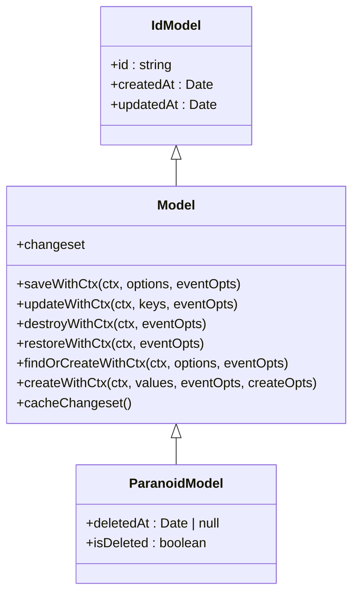
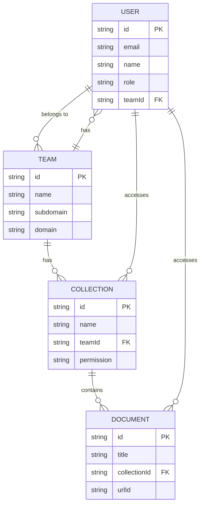

# 数据模型

<cite>
**本文档中引用的文件**  
- [User.ts](file://server/models/User.ts)
- [Document.ts](file://server/models/Document.ts)
- [Collection.ts](file://server/models/Collection.ts)
- [Team.ts](file://server/models/Team.ts)
- [Model.ts](file://server/models/base/Model.ts)
- [ParanoidModel.ts](file://server/models/base/ParanoidModel.ts)
- [Fix.ts](file://server/models/decorators/Fix.ts)
- [Length.ts](file://server/models/validators/Length.ts)
- [IsFQDN.ts](file://server/models/validators/IsFQDN.ts)
- [IsHexColor.ts](file://server/models/validators/IsHexColor.ts)
- [NotContainsUrl.ts](file://server/models/validators/NotContainsUrl.ts)
- [Encrypted.ts](file://server/models/decorators/Encrypted.ts)
- [Changeset.ts](file://server/models/decorators/Changeset.ts)
</cite>

## 目录
1. [简介](#简介)
2. [基础模型设计](#基础模型设计)
3. [装饰器与验证器](#装饰器与验证器)
4. [模型关联关系](#模型关联关系)
5. [数据完整性与约束](#数据完整性与约束)
6. [核心模型实现](#核心模型实现)
7. [钩子函数与自定义方法](#钩子函数与自定义方法)
8. [数据库优化与查询](#数据库优化与查询)
9. [总结](#总结)

## 简介

baozi项目采用Sequelize作为ORM框架，构建了一套完整的数据模型体系。该体系以TypeScript为基础，通过装饰器模式实现了类型安全的数据库操作。数据模型设计遵循面向对象原则，将业务逻辑与数据访问分离，同时通过基础模型继承实现了通用功能的复用。本项目的数据模型涵盖了用户、团队、文档、集合等核心实体，通过外键关联和多对多关系建立了完整的数据网络。ORM设计不仅关注数据持久化，还通过钩子函数、验证器和自定义方法实现了丰富的业务逻辑。

**Section sources**
- [User.ts](file://server/models/User.ts#L1-L860)
- [Document.ts](file://server/models/Document.ts#L1-L1318)
- [Collection.ts](file://server/models/Collection.ts#L1-L1011)

## 基础模型设计

baozi项目的基础模型设计采用了分层继承架构，通过`Model`和`ParanoidModel`两个核心基类构建了数据模型的骨架。`Model`类作为最基础的抽象，继承自Sequelize的`SequelizeModel`，提供了通用的CRUD操作和事件处理机制。它定义了`saveWithCtx`、`updateWithCtx`、`destroyWithCtx`等上下文感知的方法，确保所有数据库操作都能携带API上下文信息。`ParanoidModel`继承自`Model`，引入了软删除功能，通过`deletedAt`字段实现数据的逻辑删除而非物理删除。这种设计既保证了数据的可追溯性，又避免了误删数据的风险。`IdModel`作为另一个基础类，统一管理了主键ID、创建时间和更新时间等通用字段，确保了所有模型的一致性。



**Diagram sources**
- [Model.ts](file://server/models/base/Model.ts#L1-L448)
- [IdModel.ts](file://server/models/base/IdModel.ts#L1-L28)
- [ParanoidModel.ts](file://server/models/base/ParanoidModel.ts#L1-L21)

**Section sources**
- [Model.ts](file://server/models/base/Model.ts#L1-L448)
- [IdModel.ts](file://server/models/base/IdModel.ts#L1-L28)
- [ParanoidModel.ts](file://server/models/base/ParanoidModel.ts#L1-L21)

## 装饰器与验证器

baozi项目通过装饰器模式实现了类型安全的模型定义和数据验证。`Fix`装饰器是解决Babel与TypeScript兼容性问题的关键，它通过重写构造函数，确保了属性访问器的正确性。验证器装饰器如`Length`、`IsFQDN`、`IsHexColor`和`NotContainsUrl`提供了丰富的数据验证功能。`Length`装饰器利用lodash的`size`函数计算字符串长度，特别适用于包含Unicode字符的文本。`IsFQDN`和`IsHexColor`装饰器基于`class-validator`库，确保了域名和颜色代码的格式正确性。`NotContainsUrl`装饰器通过正则表达式检测文本中是否包含URL，防止了潜在的安全风险。这些装饰器通过`addAttributeOptions`函数与Sequelize的验证系统集成，实现了声明式的验证逻辑。

```mermaid
classDiagram
class Fix {
+Fix(target : any) : void
}
class Length {
+Length({msg, min, max}) : (target, propertyName) => void
}
class IsFQDN {
+IsFQDN(target : any, propertyName : string)
}
class IsHexColor {
+IsHexColor(target : any, propertyName : string)
}
class NotContainsUrl {
+NotContainsUrl(target : any, propertyName : string)
}
class Encrypted {
+Encrypted(target : any, propertyName : string)
}
class Changeset {
+SkipChangeset(target : any, propertyName : string)
}
```

**Diagram sources**
- [Fix.ts](file://server/models/decorators/Fix.ts#L1-L67)
- [Length.ts](file://server/models/validators/Length.ts#L1-L27)
- [IsFQDN.ts](file://server/models/validators/IsFQDN.ts#L1-L17)
- [IsHexColor.ts](file://server/models/validators/IsHexColor.ts#L1-L17)
- [NotContainsUrl.ts](file://server/models/validators/NotContainsUrl.ts#L1-L16)
- [Encrypted.ts](file://server/models/decorators/Encrypted.ts#L1-L20)
- [Changeset.ts](file://server/models/decorators/Changeset.ts#L1-L15)

**Section sources**
- [Fix.ts](file://server/models/decorators/Fix.ts#L1-L67)
- [Length.ts](file://server/models/validators/Length.ts#L1-L27)
- [IsFQDN.ts](file://server/models/validators/IsFQDN.ts#L1-L17)
- [IsHexColor.ts](file://server/models/validators/IsHexColor.ts#L1-L17)
- [NotContainsUrl.ts](file://server/models/validators/NotContainsUrl.ts#L1-L16)

## 模型关联关系

baozi项目的数据模型通过外键和多对多关系建立了复杂的关联网络。用户与团队之间是一对多关系，一个团队可以有多个用户，而每个用户只能属于一个团队。文档与集合之间也是一对多关系，一个集合可以包含多个文档，而每个文档只能属于一个集合。用户与文档之间通过`UserMembership`模型建立了多对多关系，允许用户对多个文档拥有不同的权限。类似的，用户与集合之间也通过`UserMembership`模型建立了多对多关系。这种设计既保证了数据的规范化，又提供了灵活的权限管理机制。`BelongsTo`、`HasMany`和`BelongsToMany`等Sequelize装饰器清晰地定义了这些关系，使得数据查询和操作更加直观。



**Diagram sources**
- [User.ts](file://server/models/User.ts#L1-L860)
- [Team.ts](file://server/models/Team.ts#L1-L477)
- [Collection.ts](file://server/models/Collection.ts#L1-L1011)
- [Document.ts](file://server/models/Document.ts#L1-L1318)

**Section sources**
- [User.ts](file://server/models/User.ts#L1-L860)
- [Team.ts](file://server/models/Team.ts#L1-L477)
- [Collection.ts](file://server/models/Collection.ts#L1-L1011)
- [Document.ts](file://server/models/Document.ts#L1-L1318)

## 数据完整性与约束

baozi项目通过多种机制确保数据的完整性和一致性。首先，通过`@Unique`装饰器在数据库层面实现了字段的唯一性约束，如用户的邮箱和集合的URL ID。其次，通过`@IsIn`装饰器限制了枚举字段的取值范围，如用户角色和集合权限。软删除机制通过`deletedAt`字段实现了数据的逻辑删除，避免了级联删除带来的数据丢失风险。外键约束确保了关联数据的一致性，如文档的`collectionId`必须引用存在的集合ID。`BeforeDestroy`钩子函数实现了业务层面的删除约束，如禁止删除团队中的最后一个用户或最后一个集合。这些约束机制共同作用，确保了数据模型的健壮性和可靠性。

**Section sources**
- [User.ts](file://server/models/User.ts#L1-L860)
- [Team.ts](file://server/models/Team.ts#L1-L477)
- [Collection.ts](file://server/models/Collection.ts#L1-L1011)
- [Document.ts](file://server/models/Document.ts#L1-L1318)

## 核心模型实现

baozi项目的核心模型包括用户、文档、集合和团队。`User`模型定义了用户的基本信息、角色、偏好设置和通知设置。它通过`jwtSecret`字段实现了安全的会话管理，通过`flags`字段存储了用户的状态标志。`Document`模型是内容管理的核心，包含了标题、内容、版本、协作者等信息。它通过`content`字段存储了Prosemirror格式的JSON数据，通过`state`字段存储了YJS协作状态。`Collection`模型代表了文档的组织单元，通过`documentStructure`字段维护了文档的树形结构。`Team`模型定义了团队的基本信息、域名、子域名和偏好设置。这些模型通过继承和组合，实现了丰富的业务功能。

```mermaid
classDiagram
class User {
+email : string | null
+name : string
+role : UserRole
+jwtSecret : string
+lastActiveAt : Date | null
+flags : { [key in UserFlag]? : number } | null
+preferences : UserPreferences | null
+notificationSettings : NotificationSettings
+language : keyof typeof locales | null
+timezone : string | null
+avatarUrl : string | null
+isSuspended() : boolean
+isInvited() : boolean
+isAdmin() : boolean
+isMember() : boolean
+isViewer() : boolean
+isGuest() : boolean
+color : string
+defaultCollectionPermission : CollectionPermission
+defaultDocumentPermission : DocumentPermission
+deleteConfirmationCode : string
+setNotificationEventType(type, value)
+subscribedToEventType(type)
+setFlag(flag, value)
+getFlag(flag)
+incrementFlag(flag, value)
+setPreference(preference, value)
+getPreference(preference)
+groups(options)
+groupIds(options)
+collectionIds(options)
+updateActiveAt(ctx, force)
+updateSignedIn(ctx)
+rotateJwtSecret(options)
+getJwtToken(expiresAt)
+getCollaborationToken()
+getTransferToken()
+getEmailSigninToken(ctx)
+getEmailVerificationCode()
+getEmailUpdateToken(email)
+availableTeams()
}
class Document {
+urlId : string
+title : string
+summary : string
+previousTitles : string[]
+version : number | null
+template : boolean
+fullWidth : boolean
+insightsEnabled : boolean
+editorVersion : string | null
+icon : string | null
+color : string | null
+text : string
+content : ProsemirrorData | null
+state : Uint8Array | null
+isWelcome : boolean
+revisionCount : number
+publishedAt : Date | null
+collaboratorIds : string[]
+url : string
+path : string
+tasks : TaskSummary[]
+getCollaboratorKey(documentId)
+getPath({title, urlId})
}
class Collection {
+urlId : string
+name : string
+description : string | null
+content : ProsemirrorData | null
+icon : string | null
+color : string | null
+index : string | null
+permission : CollectionPermission | null
+maintainerApprovalRequired : boolean
+documentStructure : NavigationNode[] | null
+sharing : boolean
+sort : CollectionSort
+archivedAt : Date | null
+commenting : boolean | null
+sourceMetadata : SourceMetadata | null
+url : string
+path : string
+isActive : boolean
+isPrivate : boolean
+getDocumentTree(documentId)
+deleteDocument(document, options)
+removeDocumentInStructure(document, options)
}
class Team {
+name : string
+description : string | null
+subdomain : string | null
+domain : string | null
+defaultCollectionId : string | null
+avatarUrl : string | null
+sharing : boolean
+inviteRequired : boolean
+signupQueryParams : { [key : string] : string } | null
+guestSignin : boolean
+documentEmbeds : boolean
+memberCollectionCreate : boolean
+memberTeamCreate : boolean
+defaultUserRole : UserRole
+approximateTotalAttachmentsSize : number
+preferences : TeamPreferences | null
+suspendedAt : Date | null
+lastActiveAt : Date | null
+previousSubdomains : string[] | null
+isSuspended : boolean
+emailSigninEnabled : boolean
+url : string
+getDeleteConfirmationCode(user)
+setPreference(preference, value)
+getPreference(preference)
+updateActiveAt(force)
+collectionIds(paranoid)
+isDomainAllowed(domainOrEmail)
}
User --> Team : "belongs to"
Document --> Collection : "belongs to"
Document --> User : "created by"
Document --> User : "updated by"
Collection --> Team : "belongs to"
Collection --> User : "created by"
```

**Diagram sources**
- [User.ts](file://server/models/User.ts#L1-L860)
- [Document.ts](file://server/models/Document.ts#L1-L1318)
- [Collection.ts](file://server/models/Collection.ts#L1-L1011)
- [Team.ts](file://server/models/Team.ts#L1-L477)

**Section sources**
- [User.ts](file://server/models/User.ts#L1-L860)
- [Document.ts](file://server/models/Document.ts#L1-L1318)
- [Collection.ts](file://server/models/Collection.ts#L1-L1011)
- [Team.ts](file://server/models/Team.ts#L1-L477)

## 钩子函数与自定义方法

baozi项目通过Sequelize的钩子函数和自定义方法实现了丰富的业务逻辑。`BeforeValidate`和`BeforeCreate`钩子用于数据的预处理，如生成URL ID和设置默认值。`BeforeSave`和`BeforeUpdate`钩子用于数据的验证和更新，如检查父文档的循环引用和更新集合结构。`AfterCreate`和`AfterUpdate`钩子用于触发后续操作，如创建用户成员资格和发布事件。`BeforeDestroy`钩子用于执行删除前的检查，如确保团队中至少有一个用户。自定义方法如`updateActiveAt`、`updateSignedIn`和`rotateJwtSecret`封装了复杂的业务逻辑，提高了代码的可重用性和可维护性。这些钩子函数和自定义方法共同构成了数据模型的行为层，使得数据操作更加智能和安全。

**Section sources**
- [User.ts](file://server/models/User.ts#L1-L860)
- [Document.ts](file://server/models/Document.ts#L1-L1318)
- [Collection.ts](file://server/models/Collection.ts#L1-L1011)
- [Team.ts](file://server/models/Team.ts#L1-L477)

## 数据库优化与查询

baozi项目通过多种技术优化了数据库性能。首先，通过`findAllInBatches`方法实现了大数据集的分批查询，避免了内存溢出。其次，通过`scope`方法实现了查询的复用和组合，提高了查询的灵活性和可读性。`findByPk`方法被重写以支持通过URL ID查询，提高了前端路由的效率。`membershipUserIds`静态方法通过一次查询获取了所有成员的用户ID，减少了数据库的访问次数。缓存机制通过`CacheHelper`类实现了数据的缓存和清除，减少了对数据库的直接访问。索引优化通过`@Unique`和`@IsIn`装饰器确保了查询的高效性。这些优化技术共同作用，确保了系统在高并发场景下的稳定性和响应速度。

**Section sources**
- [Model.ts](file://server/models/base/Model.ts#L1-L448)
- [User.ts](file://server/models/User.ts#L1-L860)
- [Document.ts](file://server/models/Document.ts#L1-L1318)
- [Collection.ts](file://server/models/Collection.ts#L1-L1011)

## 总结

baozi项目的数据模型设计体现了现代Web应用的最佳实践。通过Sequelize ORM框架，项目实现了类型安全的数据访问和丰富的业务逻辑。基础模型的分层设计确保了代码的可重用性和可维护性。装饰器模式提供了声明式的模型定义和数据验证。复杂的关联关系和数据完整性约束保证了数据的一致性和可靠性。钩子函数和自定义方法封装了复杂的业务逻辑，提高了代码的可读性和可测试性。数据库优化技术确保了系统的高性能和可扩展性。这套数据模型不仅满足了当前的业务需求，还为未来的功能扩展提供了坚实的基础。