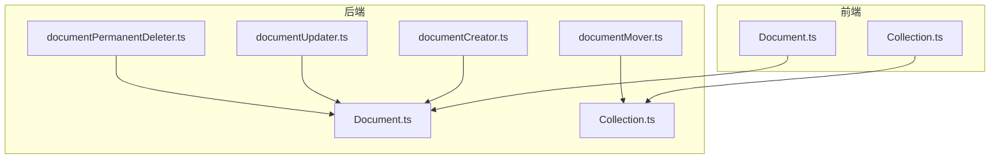
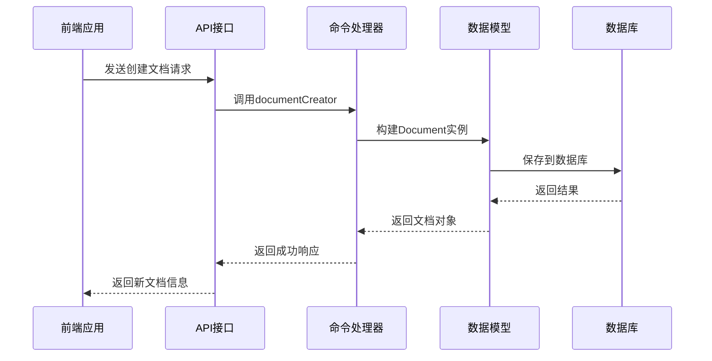
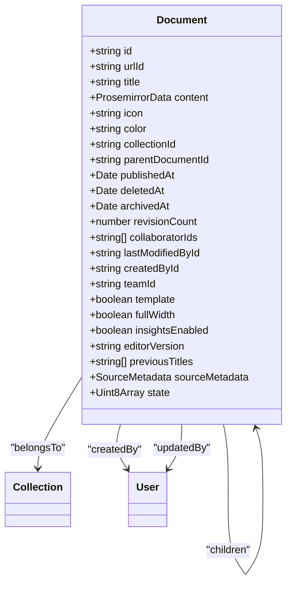
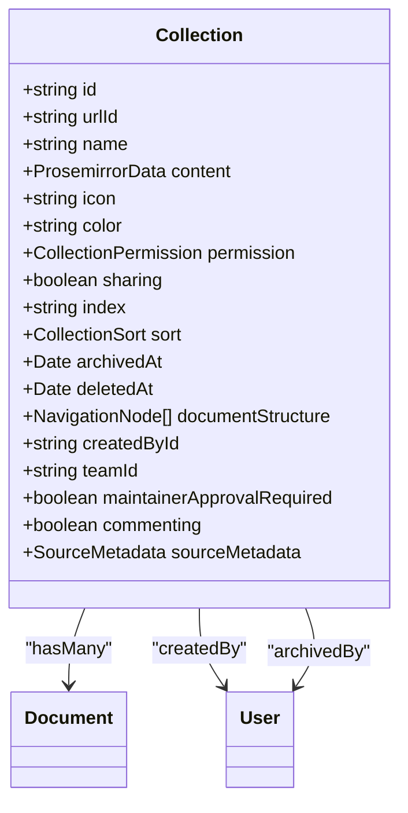
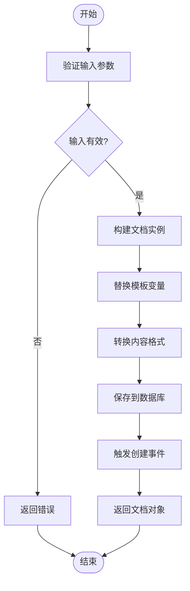
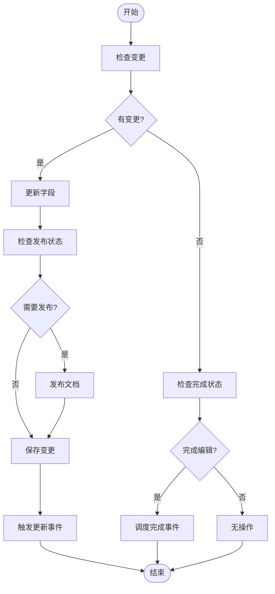
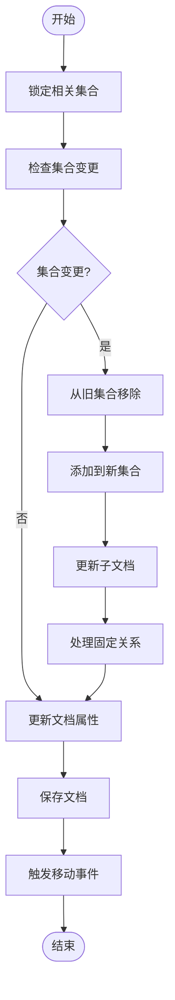
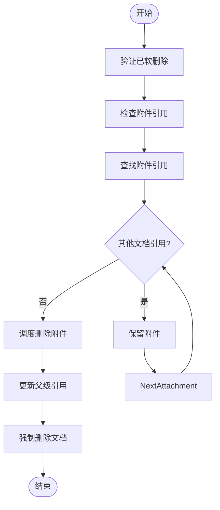
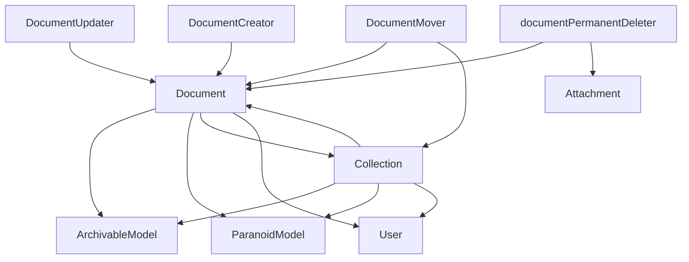

# 文档与集合模型

<cite>
**本文档中引用的文件**  
- [Document.ts](file://app/models/Document.ts)
- [Collection.ts](file://app/models/Collection.ts)
- [Document.ts](file://server/models/Document.ts)
- [Collection.ts](file://server/models/Collection.ts)
- [documentCreator.ts](file://server/commands/documentCreator.ts)
- [documentUpdater.ts](file://server/commands/documentUpdater.ts)
- [documentMover.ts](file://server/commands/documentMover.ts)
- [documentPermanentDeleter.ts](file://server/commands/documentPermanentDeleter.ts)
</cite>

## 目录
1. [简介](#简介)
2. [项目结构](#项目结构)
3. [核心组件](#核心组件)
4. [架构概述](#架构概述)
5. [详细组件分析](#详细组件分析)
6. [依赖分析](#依赖分析)
7. [性能考虑](#性能考虑)
8. [故障排除指南](#故障排除指南)
9. [结论](#结论)

## 简介
本文档深入解析文档（Document）和集合（Collection）的实体定义、层级关系和数据完整性约束。重点说明文档版本控制、内容存储结构以及集合的权限和排序机制。结合实际代码示例，展示文档创建、更新、归档和删除的操作流程。涵盖文档与集合之间的父子关系、软删除实现以及数据查询模式，为开发者提供高效操作数据库的最佳实践。

## 项目结构
项目采用分层架构，前端模型位于`app/models`目录，后端模型位于`server/models`目录。文档和集合的核心逻辑分别在`Document.ts`和`Collection.ts`文件中实现。业务操作命令如创建、更新、移动和删除文档则位于`server/commands`目录下。这种分离确保了前端展示逻辑与后端业务逻辑的清晰界限。

**图示来源**
- [Document.ts](file://app/models/Document.ts)
- [Collection.ts](file://app/models/Collection.ts)
- [Document.ts](file://server/models/Document.ts)
- [Collection.ts](file://server/models/Collection.ts)
- [documentCreator.ts](file://server/commands/documentCreator.ts)
- [documentUpdater.ts](file://server/commands/documentUpdater.ts)
- [documentMover.ts](file://server/commands/documentMover.ts)
- [documentPermanentDeleter.ts](file://server/commands/documentPermanentDeleter.ts)

**章节来源**
- [Document.ts](file://app/models/Document.ts)
- [Collection.ts](file://app/models/Collection.ts)
- [Document.ts](file://server/models/Document.ts)
- [Collection.ts](file://server/models/Collection.ts)

## 核心组件
文档和集合是系统的核心数据模型。文档代表内容单元，包含标题、内容、图标等属性，并通过`collectionId`与集合关联。集合是文档的容器，管理文档的组织结构、访问权限和排序方式。两者都实现了软删除（通过`deletedAt`字段）和归档功能，确保数据可恢复。

**章节来源**
- [Document.ts](file://app/models/Document.ts)
- [Collection.ts](file://app/models/Collection.ts)
- [Document.ts](file://server/models/Document.ts)
- [Collection.ts](file://server/models/Collection.ts)

## 架构概述
系统采用前后端分离架构。前端通过MobX状态管理库与后端API交互。后端使用Sequelize ORM与数据库通信。文档和集合的创建、更新、移动和删除操作由专门的命令（Command）处理，这些命令封装了业务逻辑和事件触发。

**图示来源**
- [documentCreator.ts](file://server/commands/documentCreator.ts)
- [Document.ts](file://server/models/Document.ts)

## 详细组件分析
### 文档实体分析
文档实体是内容管理的基本单元。它包含标题、内容、图标、颜色等属性，并通过父子关系形成树状结构。文档的版本控制通过`revisionCount`字段实现，每次更新都会递增该计数。内容以Prosemirror JSON格式存储在`content`字段中，同时保留了旧的Markdown格式在`text`字段中用于兼容。

**图示来源**
- [Document.ts](file://server/models/Document.ts)

**章节来源**
- [Document.ts](file://app/models/Document.ts)
- [Document.ts](file://server/models/Document.ts)

### 集合实体分析
集合实体是文档的组织容器。它包含名称、描述、图标、颜色等属性，并通过`documentStructure`字段维护文档的树状结构。集合的权限控制通过`permission`字段实现，可以设置为公开或私有。文档在集合中的排序由`sort`字段定义，支持按标题或自定义索引排序。

**图示来源**
- [Collection.ts](file://server/models/Collection.ts)

**章节来源**
- [Collection.ts](file://app/models/Collection.ts)
- [Collection.ts](file://server/models/Collection.ts)

### 文档创建流程
文档创建由`documentCreator`命令处理。该命令接收用户输入，构建文档实例，并将其保存到数据库。创建过程中会处理模板变量替换、内容格式转换等逻辑。成功创建后，会触发`documents.create`事件，用于审计和通知。

**图示来源**
- [documentCreator.ts](file://server/commands/documentCreator.ts)

**章节来源**
- [documentCreator.ts](file://server/commands/documentCreator.ts)

### 文档更新流程
文档更新由`documentUpdater`命令处理。该命令可以更新文档的元数据（如标题、图标）或内容。更新时会检查是否有重要变更（如标题更改），并相应地触发不同的事件。对于发布状态的变更，会调用文档的`publish`方法。

**图示来源**
- [documentUpdater.ts](file://server/commands/documentUpdater.ts)

**章节来源**
- [documentUpdater.ts](file://server/commands/documentUpdater.ts)

### 文档移动流程
文档移动由`documentMover`命令处理。该命令可以改变文档的父级或所属集合。移动时会锁定相关集合，确保数据一致性。如果集合发生变化，还会更新所有子文档的`collectionId`，并处理相关的固定（Pin）关系。

**图示来源**
- [documentMover.ts](file://server/commands/documentMover.ts)

**章节来源**
- [documentMover.ts](file://server/commands/documentMover.ts)

### 文档永久删除流程
文档永久删除由`documentPermanentDeleter`命令处理。该命令首先验证文档是否已被软删除，然后检查并清理相关的附件。最后，强制从数据库中删除文档记录。

**图示来源**
- [documentPermanentDeleter.ts](file://server/commands/documentPermanentDeleter.ts)

**章节来源**
- [documentPermanentDeleter.ts](file://server/commands/documentPermanentDeleter.ts)

## 依赖分析
文档和集合模型依赖于多个核心模块。`Document`和`Collection`类继承自`ArchivableModel`和`ParanoidModel`，提供归档和软删除功能。它们通过Sequelize的关联装饰器（如`@BelongsTo`, `@HasMany`）建立与其他模型的关系。业务逻辑依赖于`ApiClient`进行HTTP通信，以及`Stores`进行状态管理。

**图示来源**
- [Document.ts](file://server/models/Document.ts)
- [Collection.ts](file://server/models/Collection.ts)

**章节来源**
- [Document.ts](file://server/models/Document.ts)
- [Collection.ts](file://server/models/Collection.ts)

## 性能考虑
为优化性能，系统采用了多种策略。集合的文档结构缓存在Redis中，通过`CacheHelper`进行管理，减少数据库查询。文档的全文搜索使用PostgreSQL的`tsvector`功能。对于大型操作（如移动整个文档树），使用数据库事务和批量更新来提高效率。

## 故障排除指南
常见问题包括文档无法创建、移动失败或附件未清理。检查数据库事务是否正确提交，验证用户权限，以及确认缓存是否及时更新。对于附件清理问题，确保`DeleteAttachmentTask`队列正常运行。

**章节来源**
- [documentPermanentDeleter.ts](file://server/commands/documentPermanentDeleter.ts)
- [Document.ts](file://server/models/Document.ts)

## 结论
文档与集合模型构成了系统的核心数据架构。通过清晰的实体定义、完善的业务命令和高效的查询模式，实现了灵活的内容管理和组织。理解这些组件的交互方式对于开发和维护系统至关重要。