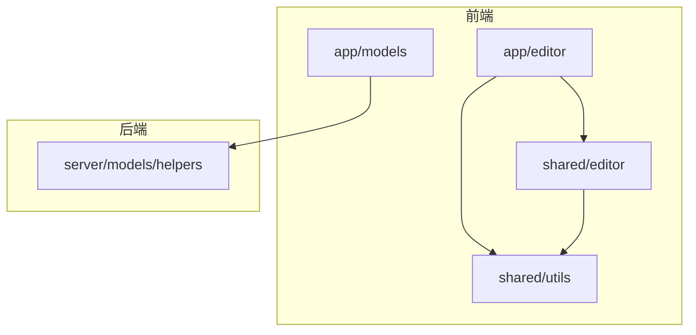
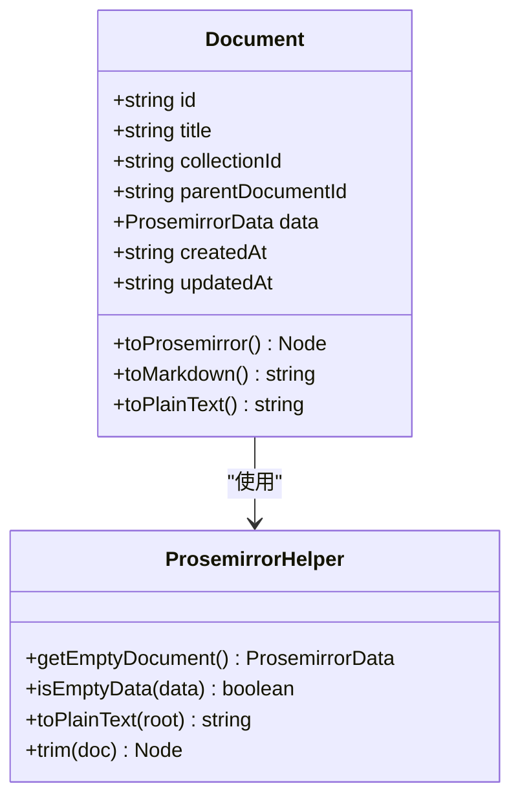
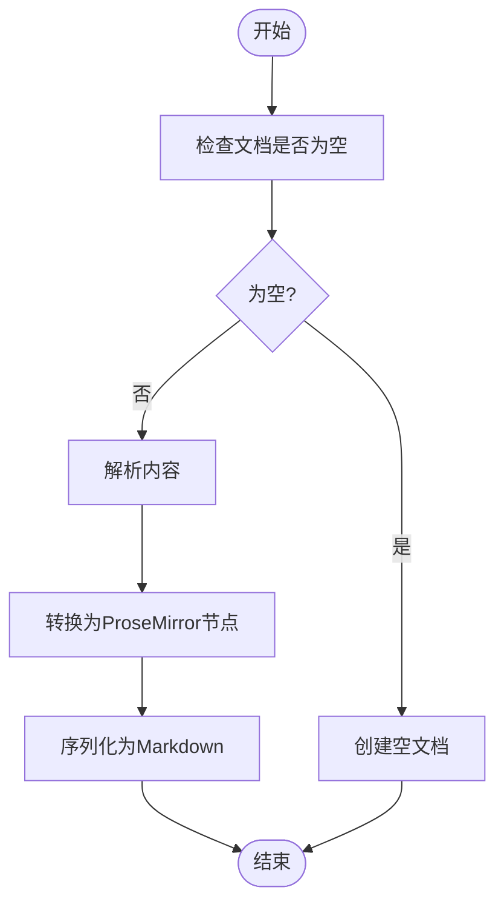
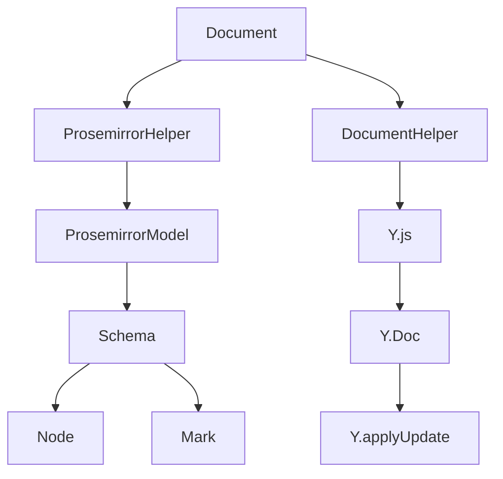

# 文档内容结构

<cite>
**本文档中引用的文件**   
- [Document.ts](file://app/models/Document.ts)
- [ProsemirrorHelper.ts](file://shared/utils/ProsemirrorHelper.ts)
- [Doc.ts](file://shared/editor/nodes/Doc.ts)
- [Paragraph.ts](file://shared/editor/nodes/Paragraph.ts)
- [Heading.ts](file://shared/editor/nodes/Heading.ts)
- [BulletList.ts](file://shared/editor/nodes/BulletList.ts)
- [ListItem.ts](file://shared/editor/nodes/ListItem.ts)
- [Blockquote.ts](file://shared/editor/nodes/Blockquote.ts)
- [CodeBlock.ts](file://shared/editor/nodes/CodeBlock.ts)
- [DocumentHelper.tsx](file://server/models/helpers/DocumentHelper.tsx)
- [index.tsx](file://app/editor/index.tsx)
</cite>

## 目录
1. [简介](#简介)
2. [项目结构](#项目结构)
3. [核心组件](#核心组件)
4. [架构概述](#架构概述)
5. [详细组件分析](#详细组件分析)
6. [依赖分析](#依赖分析)
7. [性能考虑](#性能考虑)
8. [故障排除指南](#故障排除指南)
9. [结论](#结论)
10. [附录](#附录)（如有必要）

## 简介
本文档详细说明了文档内容的存储格式、数据结构和解析机制。重点介绍如何使用ProseMirror模型表示富文本内容，包括段落、标题、列表、链接等元素的实现方式。通过代码示例展示内容序列化、反序列化和渲染的过程，并涵盖内容校验、嵌入式元素处理以及与其他编辑器组件的集成，为开发者提供操作文档内容的完整指南。

## 项目结构
项目结构清晰地组织了文档编辑器相关的组件和工具。核心编辑器功能位于`app/editor`目录下，包含组件、扩展和菜单。共享的编辑器节点和工具位于`shared/editor`和`shared/utils`目录中。文档模型和辅助工具分别位于`app/models`和`server/models/helpers`目录中。

**图表来源**
- [Document.ts](file://app/models/Document.ts)
- [ProsemirrorHelper.ts](file://shared/utils/ProsemirrorHelper.ts)
- [index.tsx](file://app/editor/index.tsx)

**章节来源**
- [Document.ts](file://app/models/Document.ts)
- [ProsemirrorHelper.ts](file://shared/utils/ProsemirrorHelper.ts)
- [index.tsx](file://app/editor/index.tsx)

## 核心组件
文档内容结构的核心是基于ProseMirror的富文本模型。`Document`类作为主要的数据容器，存储文档的元数据和内容。`ProsemirrorHelper`类提供了一系列静态方法，用于处理ProseMirror节点的转换、序列化和反序列化。`Doc`节点作为文档的根节点，定义了文档的基本结构。

**章节来源**
- [Document.ts](file://app/models/Document.ts)
- [ProsemirrorHelper.ts](file://shared/utils/ProsemirrorHelper.ts)
- [Doc.ts](file://shared/editor/nodes/Doc.ts)

## 架构概述
系统架构围绕ProseMirror构建，前端编辑器通过扩展和插件机制实现丰富的编辑功能。后端通过`DocumentHelper`类处理文档的持久化和转换。数据流从用户输入开始，经过ProseMirror的状态管理，最终存储为JSON格式的文档内容。

**图表来源**
- [index.tsx](file://app/editor/index.tsx)
- [DocumentHelper.tsx](file://server/models/helpers/DocumentHelper.tsx)

## 详细组件分析

### 文档模型分析
`Document`类是文档内容的核心数据模型，包含文档的元数据（如标题、创建者、更新时间）和内容数据（`data`字段）。`data`字段存储ProseMirror的JSON表示，通过`@observable.shallow`装饰器实现浅层观察，提高性能。

#### 文档模型类图

**图表来源**
- [Document.ts](file://app/models/Document.ts)
- [ProsemirrorHelper.ts](file://shared/utils/ProsemirrorHelper.ts)

**章节来源**
- [Document.ts](file://app/models/Document.ts)

### ProseMirror节点分析
ProseMirror节点是富文本内容的基本构建块。每个节点类型（如段落、标题、列表）都有对应的类实现，定义了节点的结构、行为和序列化方式。

#### 段落节点
`Paragraph`节点是最基本的块级节点，允许包含内联内容。其`schema`定义了内容为`inline*`，表示可以包含零个或多个内联节点。

#### 标题节点
`Heading`节点支持多个级别（1-4），并提供折叠功能。通过`attrs`定义了`level`和`collapsed`属性，分别表示标题级别和折叠状态。

#### 列表节点
`BulletList`和`ListItem`节点共同实现无序列表功能。`BulletList`的内容为`list_item+`，表示至少包含一个列表项。

#### 引用块节点
`Blockquote`节点用于创建引用块，其内容为`block+`，表示可以包含一个或多个块级节点。

#### 代码块节点
`CodeBlock`节点继承自`CodeFence`，用于创建代码块。支持通过`Backspace`键转换为段落。

**章节来源**
- [Paragraph.ts](file://shared/editor/nodes/Paragraph.ts)
- [Heading.ts](file://shared/editor/nodes/Heading.ts)
- [BulletList.ts](file://shared/editor/nodes/BulletList.ts)
- [ListItem.ts](file://shared/editor/nodes/ListItem.ts)
- [Blockquote.ts](file://shared/editor/nodes/Blockquote.ts)
- [CodeBlock.ts](file://shared/editor/nodes/CodeBlock.ts)

### 内容序列化与反序列化
内容的序列化和反序列化是文档编辑器的核心功能。`ProsemirrorHelper`类提供了`getEmptyDocument`方法创建空文档，`isEmptyData`方法检查文档是否为空，`toPlainText`方法将节点转换为纯文本，`trim`方法去除文档首尾的空段落。

#### 内容处理流程图

**图表来源**
- [ProsemirrorHelper.ts](file://shared/utils/ProsemirrorHelper.ts)

**章节来源**
- [ProsemirrorHelper.ts](file://shared/utils/ProsemirrorHelper.ts)

## 依赖分析
文档内容结构依赖于多个核心库和模块。前端依赖ProseMirror及其相关插件（如`prosemirror-commands`、`prosemirror-inputrules`），后端依赖Y.js用于协同编辑状态管理。`ExtensionManager`类负责管理所有编辑器扩展，确保功能的模块化和可扩展性。

**图表来源**
- [Document.ts](file://app/models/Document.ts)
- [ProsemirrorHelper.ts](file://shared/utils/ProsemirrorHelper.ts)
- [DocumentHelper.tsx](file://server/models/helpers/DocumentHelper.tsx)

**章节来源**
- [Document.ts](file://app/models/Document.ts)
- [ProsemirrorHelper.ts](file://shared/utils/ProsemirrorHelper.ts)
- [DocumentHelper.tsx](file://server/models/helpers/DocumentHelper.tsx)

## 性能考虑
在处理大型文档时，性能优化至关重要。`Document`类使用`@observable.shallow`装饰器对`data`字段进行浅层观察，避免深度观察带来的性能开销。`ProsemirrorHelper`的`isEmpty`方法通过短路求值优化空文档检查。编辑器初始化时，通过`createState`方法高效地创建初始状态。

## 故障排除指南
常见问题包括文档内容无法正确序列化、ProseMirror节点解析失败等。检查`DocumentHelper.safeNodeFromJSON`方法的日志输出，确保JSON数据格式正确。对于协同编辑问题，验证Y.js状态更新是否正确应用。确保所有ProseMirror扩展正确注册，避免节点类型缺失。

**章节来源**
- [DocumentHelper.tsx](file://server/models/helpers/DocumentHelper.tsx)
- [index.tsx](file://app/editor/index.tsx)

## 结论
本文档详细介绍了基于ProseMirror的文档内容结构，涵盖了存储格式、数据结构、解析机制和核心组件。通过合理的架构设计和性能优化，实现了高效、可扩展的富文本编辑功能。开发者可以基于此文档深入理解系统内部机制，进行二次开发和定制。