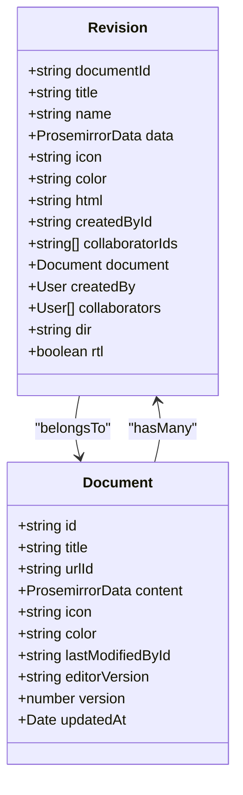
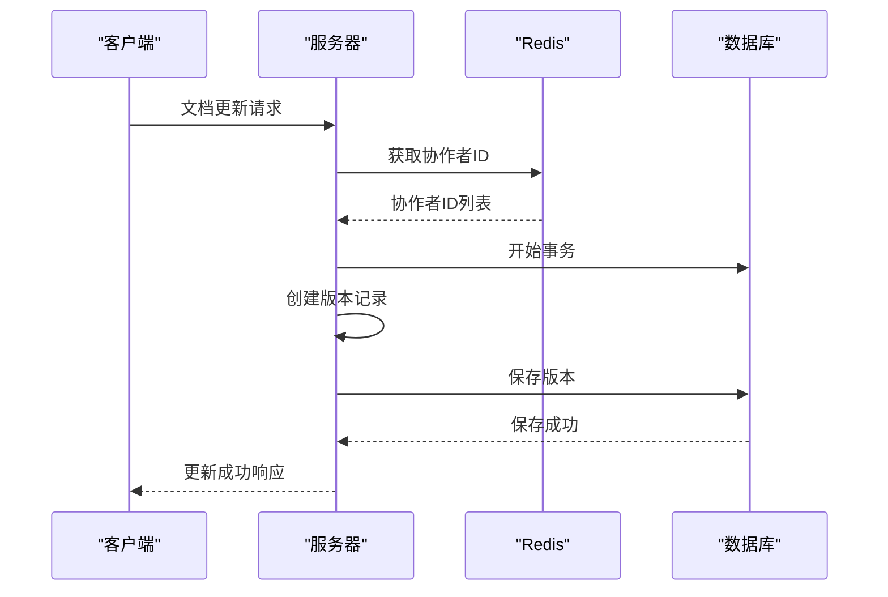
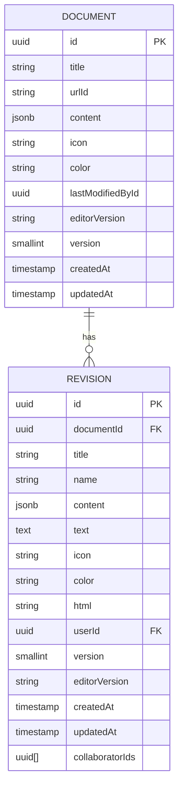
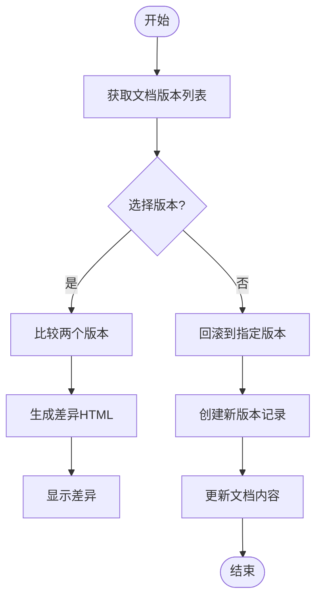

# 文档版本控制

<cite>
**本文档中引用的文件**
- [Revision.ts](file://app/models/Revision.ts)
- [Revision.ts](file://server/models/Revision.ts)
- [revisionCreator.ts](file://server/commands/revisionCreator.ts)
- [RevisionsStore.ts](file://app/stores/RevisionsStore.ts)
- [Document.ts](file://app/models/Document.ts)
- [Document.ts](file://server/models/Document.ts)
- [DocumentsStore.ts](file://app/stores/DocumentsStore.ts)
</cite>

## 目录
1. [简介](#简介)
2. [版本模型实现](#版本模型实现)
3. [版本创建机制](#版本创建机制)
4. [数据结构设计](#数据结构设计)
5. [版本操作实现](#版本操作实现)
6. [权限与完整性](#权限与完整性)
7. [性能优化策略](#性能优化策略)
8. [结论](#结论)

## 简介
文档版本控制系统是文档管理平台的核心功能之一，它允许用户追踪文档的历史变更、恢复到先前版本以及比较不同版本之间的差异。本系统通过创建文档的快照来实现版本控制，每个快照都包含了文档在特定时间点的完整状态。版本的创建由文档更新事件触发，系统会自动保存文档的当前状态作为新版本。版本数据存储在独立的数据库表中，与主文档表通过外键关联。系统提供了丰富的API接口来支持版本的创建、检索、比较和回滚操作，同时实现了细粒度的权限控制和数据完整性约束。

**Section sources**
- [Revision.ts](file://app/models/Revision.ts)
- [Revision.ts](file://server/models/Revision.ts)

## 版本模型实现

文档版本控制系统的核心是`Revision`模型，它负责存储文档的历史版本信息。该模型在客户端和服务器端都有实现，确保了数据的一致性和完整性。`Revision`模型与`Document`模型通过外键关联，每个版本都指向其所属的文档。版本数据包括文档标题、内容、图标、颜色等属性，这些属性在版本创建时从文档中复制而来。系统还支持版本名称的自定义，允许用户为重要版本添加有意义的标签。版本的创建时间、修改者信息以及协作者列表也被记录下来，为版本审计提供了必要的元数据。

**Diagram sources**
- [Revision.ts](file://app/models/Revision.ts)
- [Document.ts](file://app/models/Document.ts)

**Section sources**
- [Revision.ts](file://app/models/Revision.ts)
- [Revision.ts](file://server/models/Revision.ts)

## 版本创建机制

版本的创建由`revisionCreator`命令触发，该命令在文档更新事件发生时被调用。创建过程在一个数据库事务中执行，确保了数据的一致性。系统首先从Redis中获取自上次版本创建以来的协作者ID列表，然后使用`Revision.createFromDocument`静态方法创建新的版本记录。版本的创建时间被设置为文档的最后更新时间，这确保了版本的时间戳与文档的修改时间保持一致。如果文档在短时间内被多次修改，系统会通过防抖机制避免创建过多的版本，从而优化存储空间和性能。

**Diagram sources**
- [revisionCreator.ts](file://server/commands/revisionCreator.ts)
- [Revision.ts](file://server/models/Revision.ts)

**Section sources**
- [revisionCreator.ts](file://server/commands/revisionCreator.ts)
- [Revision.ts](file://server/models/Revision.ts)

## 数据结构设计

版本控制系统采用了分层的数据结构设计，将版本数据与文档数据分离存储。`Revision`模型在数据库中对应`revisions`表，该表包含了版本的所有属性。`content`字段使用JSONB类型存储Prosemirror格式的文档内容，支持高效的查询和索引。`title`、`icon`、`color`等字段存储了文档的元数据，这些数据在版本创建时从文档中复制而来。系统还维护了`collaboratorIds`数组，记录了参与该版本修改的用户ID。通过`documentId`外键，版本记录与文档建立了关联，支持高效的版本查询和遍历。

**Diagram sources**
- [Revision.ts](file://server/models/Revision.ts)
- [Document.ts](file://server/models/Document.ts)

**Section sources**
- [Revision.ts](file://server/models/Revision.ts)
- [Document.ts](file://server/models/Document.ts)

## 版本操作实现

系统提供了完整的版本操作API，包括版本的创建、检索、比较和回滚。`RevisionsStore`类负责管理客户端的版本数据，它提供了`getByDocumentId`方法来获取指定文档的所有版本，以及`fetchLatest`方法来获取最新的版本。版本比较功能通过计算两个版本之间的差异来实现，生成的HTML字符串可以直观地展示内容的变化。版本回滚操作通过`DocumentsStore`的`restore`方法实现，该方法接受版本ID作为参数，将文档恢复到指定版本的状态。回滚操作会创建一个新的版本记录，确保了版本历史的完整性和可追溯性。

**Diagram sources**
- [RevisionsStore.ts](file://app/stores/RevisionsStore.ts)
- [DocumentsStore.ts](file://app/stores/DocumentsStore.ts)

**Section sources**
- [RevisionsStore.ts](file://app/stores/RevisionsStore.ts)
- [DocumentsStore.ts](file://app/stores/DocumentsStore.ts)

## 权限与完整性

版本控制系统实现了严格的权限控制和数据完整性约束。只有文档的协作者或具有相应权限的用户才能创建、查看或恢复版本。系统通过`PoliciesStore`和`AuthStore`来验证用户的权限，确保了版本操作的安全性。数据完整性通过数据库约束和应用层验证双重保障。`Revision`模型的`documentId`字段具有外键约束，确保了版本必须关联到有效的文档。`title`和`name`字段有长度限制，防止了过长的数据输入。系统还实现了软删除机制，删除的版本不会立即从数据库中移除，而是标记为已删除状态，支持数据恢复和审计。

**Section sources**
- [Revision.ts](file://server/models/Revision.ts)
- [RevisionsStore.ts](file://app/stores/RevisionsStore.ts)
- [AuthStore.ts](file://app/stores/AuthStore.ts)

## 性能优化策略

为了提高版本控制系统的性能，系统采用了多种优化策略。首先，版本数据的存储和查询都经过了优化，`content`字段使用JSONB类型存储，支持高效的索引和查询。其次，系统使用Redis缓存协作者ID列表，减少了数据库查询的次数。版本的创建采用了防抖机制，避免了在短时间内频繁修改文档时创建过多的版本。对于大型文档，系统支持增量版本创建，只保存修改的部分，减少了存储空间的占用。此外，版本列表的加载采用了分页机制，避免了一次性加载过多数据导致的性能问题。

**Section sources**
- [revisionCreator.ts](file://server/commands/revisionCreator.ts)
- [Revision.ts](file://server/models/Revision.ts)
- [RevisionsStore.ts](file://app/stores/RevisionsStore.ts)

## 结论
文档版本控制系统通过精心设计的数据结构和高效的实现机制，为用户提供了一个强大而可靠的版本管理功能。系统不仅支持基本的版本创建和回滚操作，还提供了版本比较、权限控制和数据完整性保障等高级功能。通过合理的性能优化策略，系统能够在处理大量文档和版本时保持良好的响应速度。未来可以考虑引入更智能的版本合并算法和更直观的版本可视化界面，进一步提升用户体验。