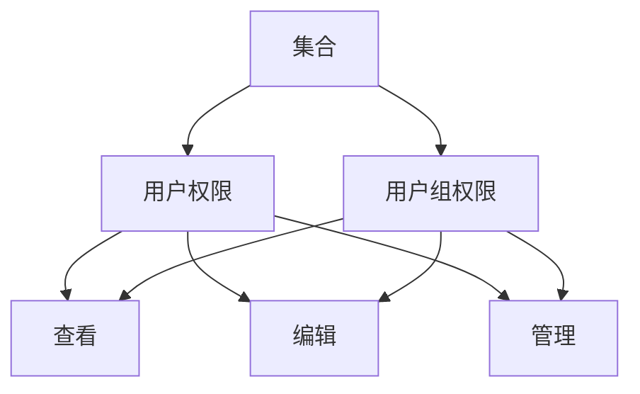
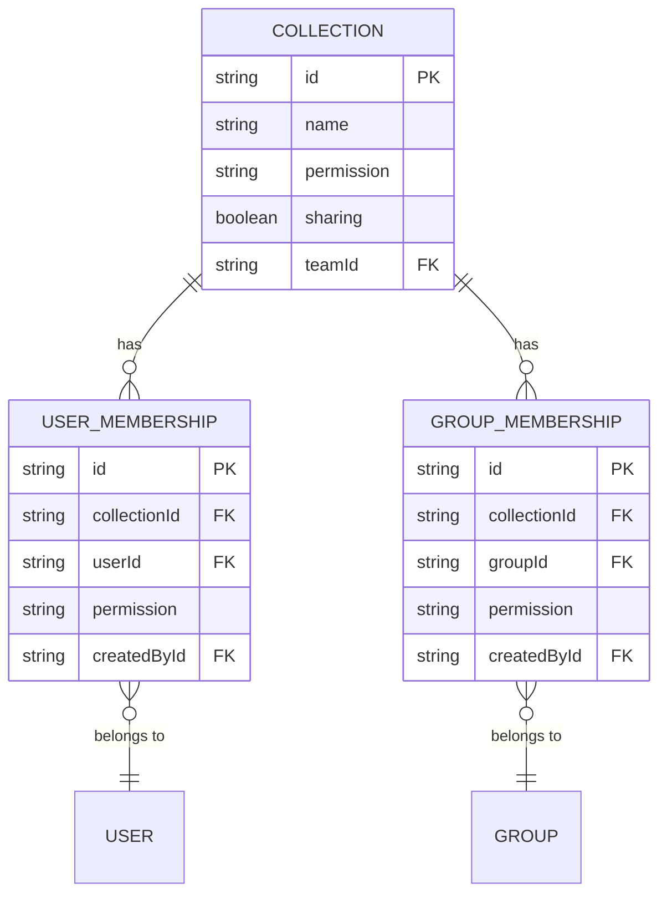
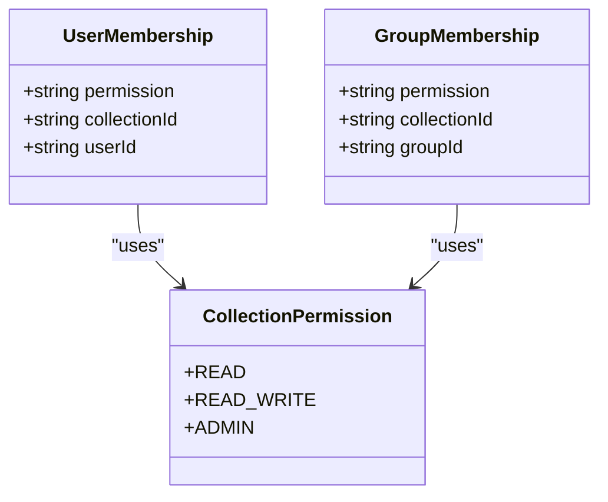
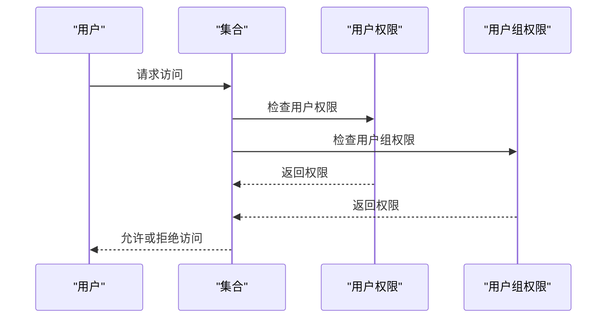
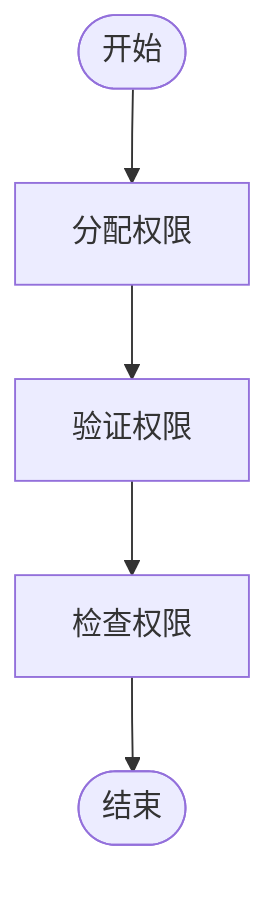
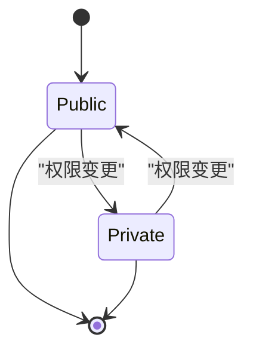
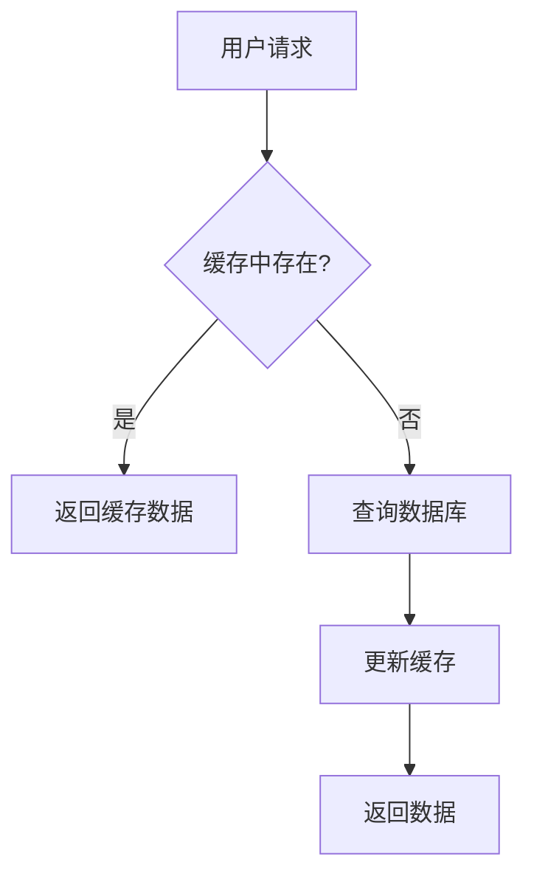
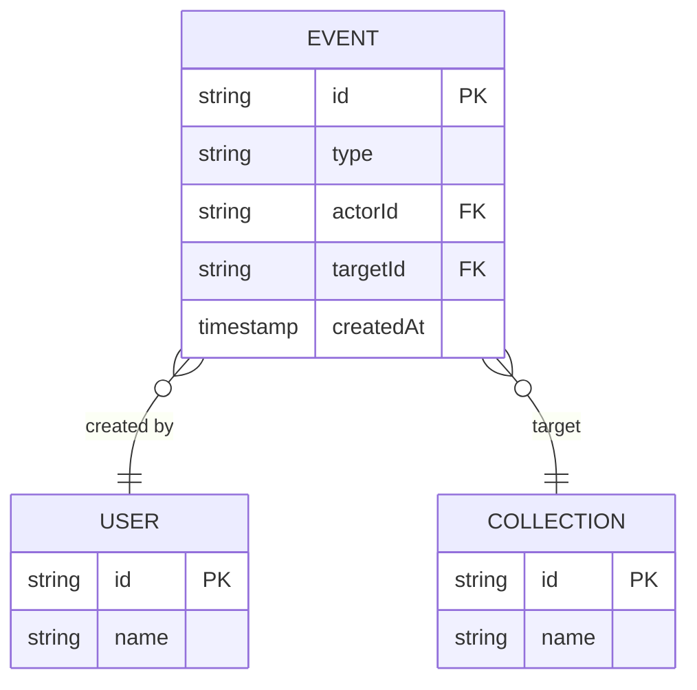

# 集合权限管理

<cite>
**本文档引用的文件**   
- [Collection.ts](file://app/models/Collection.ts)
- [Collection.ts](file://server/models/Collection.ts)
- [UserMembership.ts](file://server/models/UserMembership.ts)
- [GroupMembership.ts](file://server/models/GroupMembership.ts)
- [collection.ts](file://server/policies/collection.ts)
- [collections.ts](file://server/routes/api/collections/collections.ts)
</cite>

## 目录
1. [简介](#简介)
2. [权限体系概述](#权限体系概述)
3. [数据模型设计](#数据模型设计)
4. [权限级别实现](#权限级别实现)
5. [权限继承规则](#权限继承规则)
6. [权限分配与验证流程](#权限分配与验证流程)
7. [权限变更影响](#权限变更影响)
8. [权限缓存策略](#权限缓存策略)
9. [安全审计实践](#安全审计实践)

## 简介
集合权限管理是系统中控制用户访问集合及其文档的核心机制。该系统通过基于用户和用户组的访问控制，实现了细粒度的权限管理。权限体系不仅支持查看、编辑和管理等不同级别的访问权限，还通过数据模型设计和权限继承规则确保了权限的一致性和安全性。本文档将深入解析集合权限体系的各个方面，包括权限级别的实现方式、数据模型设计、权限继承规则、权限分配与验证流程、权限变更对文档访问的影响、权限缓存策略以及安全审计的最佳实践。

**Section sources**
- [Collection.ts](file://app/models/Collection.ts#L19-L455)
- [Collection.ts](file://server/models/Collection.ts#L87-L1007)

## 权限体系概述
集合权限管理通过用户和用户组的访问控制机制，实现了对集合及其文档的细粒度权限管理。系统支持多种权限级别，包括查看、编辑和管理，确保不同用户根据其角色和需求获得适当的访问权限。权限体系的设计考虑了灵活性和安全性，允许管理员根据需要调整权限设置，同时通过权限继承规则确保权限的一致性。

**Diagram sources**
- [Collection.ts](file://app/models/Collection.ts#L19-L455)
- [UserMembership.ts](file://server/models/UserMembership.ts#L0-L413)
- [GroupMembership.ts](file://server/models/GroupMembership.ts#L0-L433)

## 数据模型设计
集合权限管理的数据模型设计包括集合、用户权限和用户组权限三个主要部分。集合模型包含集合的基本信息和权限设置，用户权限模型记录了用户对集合的访问权限，用户组权限模型记录了用户组对集合的访问权限。这些模型通过外键关联，确保了权限数据的一致性和完整性。

**Diagram sources**
- [Collection.ts](file://server/models/Collection.ts#L87-L1007)
- [UserMembership.ts](file://server/models/UserMembership.ts#L0-L413)
- [GroupMembership.ts](file://server/models/GroupMembership.ts#L0-L433)

## 权限级别实现
集合权限管理支持三种权限级别：查看、编辑和管理。查看权限允许用户浏览集合内容，编辑权限允许用户修改集合内容，管理权限允许用户管理集合的权限设置。这些权限级别通过`CollectionPermission`枚举定义，并在用户权限和用户组权限模型中使用。

**Diagram sources**
- [Collection.ts](file://app/models/Collection.ts#L19-L455)
- [UserMembership.ts](file://server/models/UserMembership.ts#L0-L413)
- [GroupMembership.ts](file://server/models/GroupMembership.ts#L0-L433)

## 权限继承规则
集合权限管理通过权限继承规则确保权限的一致性。当集合的权限设置发生变化时，系统会自动更新相关用户和用户组的权限。例如，当集合从公开变为私有时，系统会确保只有具有相应权限的用户和用户组可以访问集合。权限继承规则通过`UserMembership`和`GroupMembership`模型的钩子函数实现。

**Diagram sources**
- [collection.ts](file://server/policies/collection.ts#L0-L211)
- [UserMembership.ts](file://server/models/UserMembership.ts#L0-L413)
- [GroupMembership.ts](file://server/models/GroupMembership.ts#L0-L433)

## 权限分配与验证流程
集合权限管理的权限分配与验证流程包括权限分配、权限验证和权限检查三个步骤。权限分配通过API接口实现，管理员可以为用户和用户组分配权限。权限验证在用户请求访问集合时进行，系统会检查用户的权限设置。权限检查在执行敏感操作时进行，确保用户具有相应的权限。

**Diagram sources**
- [collections.ts](file://server/routes/api/collections/collections.ts#L0-L949)
- [collection.ts](file://server/policies/collection.ts#L0-L211)

## 权限变更影响
集合权限变更会影响文档的访问权限。当集合的权限设置发生变化时，系统会自动更新相关文档的访问权限。例如，当集合从公开变为私有时，所有相关文档的访问权限也会相应调整。权限变更的影响通过`UserMembership`和`GroupMembership`模型的钩子函数实现。

**Diagram sources**
- [Collection.ts](file://server/models/Collection.ts#L87-L1007)
- [UserMembership.ts](file://server/models/UserMembership.ts#L0-L413)
- [GroupMembership.ts](file://server/models/GroupMembership.ts#L0-L433)

## 权限缓存策略
集合权限管理采用缓存策略提高性能。系统会缓存用户的权限设置，减少数据库查询次数。当用户的权限设置发生变化时，系统会自动更新缓存。权限缓存策略通过`CacheHelper`类实现，确保缓存数据的一致性和及时性。

**Diagram sources**
- [Collection.ts](file://server/models/Collection.ts#L87-L1007)
- [CacheHelper.ts](file://server/utils/CacheHelper.ts#L0-L100)

## 安全审计实践
集合权限管理的安全审计实践包括权限变更日志、访问日志和安全事件日志。系统会记录所有权限变更操作，包括分配、修改和删除权限。访问日志记录用户的访问行为，帮助管理员监控系统使用情况。安全事件日志记录所有安全相关事件，如权限验证失败和非法访问尝试。安全审计实践通过`Event`模型和`insertEvent`方法实现。

**Diagram sources**
- [Event.ts](file://server/models/Event.ts#L0-L100)
- [Collection.ts](file://server/models/Collection.ts#L87-L1007)