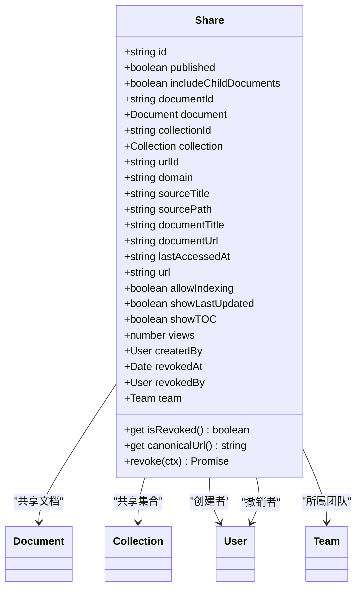
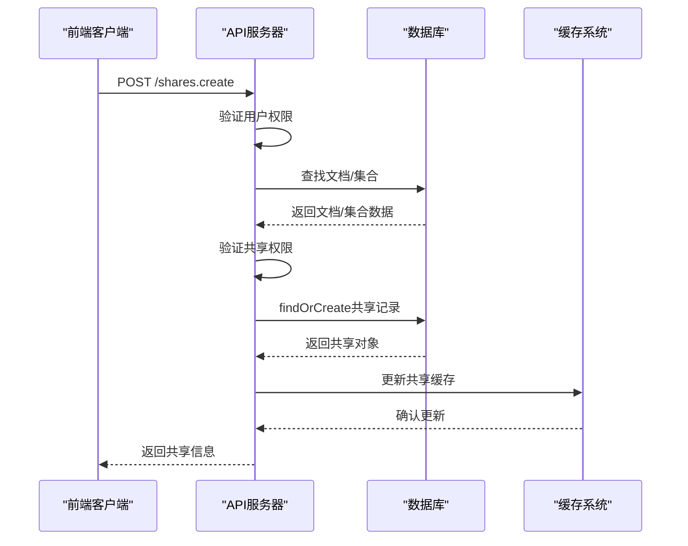
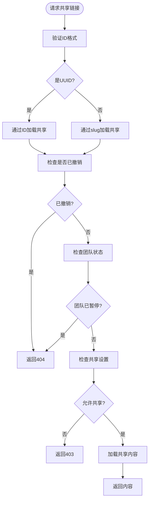
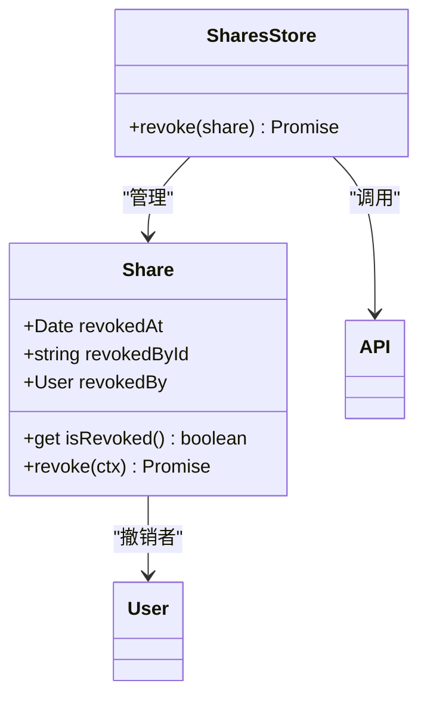
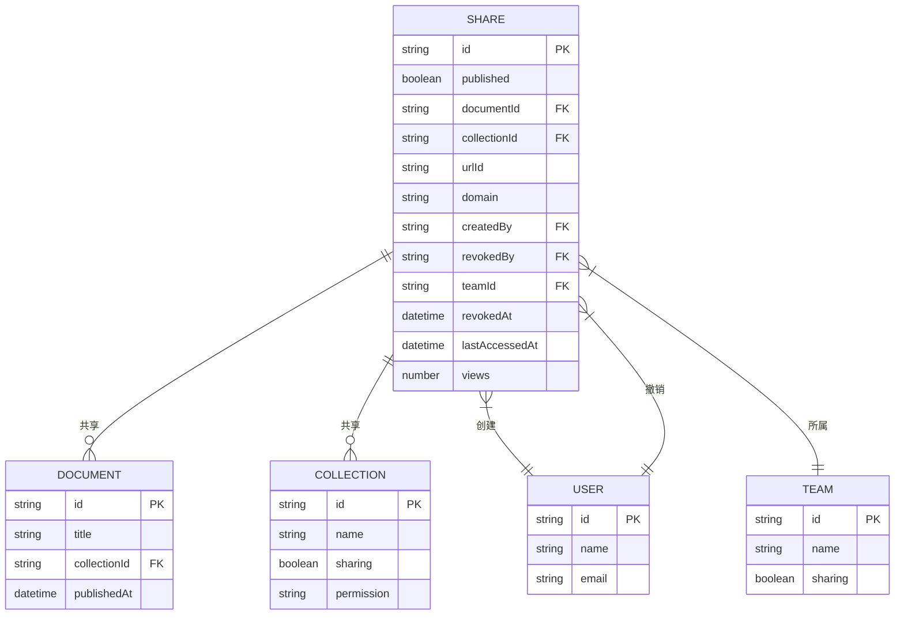
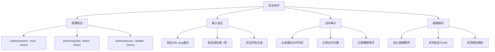
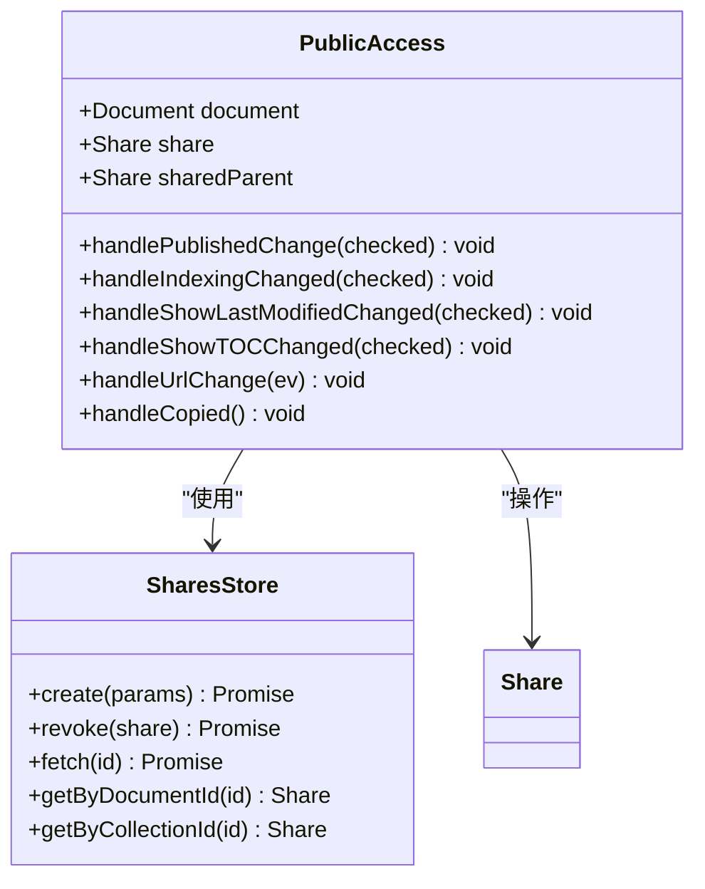

# 共享链接模型

<cite>
**本文档引用的文件**  
- [Share.ts](file://app/models/Share.ts)
- [Share.ts](file://server/models/Share.ts)
- [SharesStore.ts](file://app/stores/SharesStore.ts)
- [shareLoader.ts](file://server/commands/shareLoader.ts)
- [shares.ts](file://server/routes/api/shares/shares.ts)
- [PublicAccess.tsx](file://app/components/Sharing/Document/PublicAccess.tsx)
- [PublicAccess.tsx](file://app/components/Sharing/Collection/PublicAccess.tsx)
</cite>

## 目录
1. [简介](#简介)
2. [共享链接数据模型](#共享链接数据模型)
3. [创建与管理机制](#创建与管理机制)
4. [访问控制与权限系统](#访问控制与权限系统)
5. [有效期与撤销机制](#有效期与撤销机制)
6. [文档与集合关系](#文档与集合关系)
7. [安全考虑](#安全考虑)
8. [实际应用示例](#实际应用示例)
9. [结论](#结论)

## 简介
共享链接模型是系统权限体系中的核心组件，它实现了对外部访问的细粒度控制。该模型允许用户通过生成唯一的共享链接，将文档或集合安全地分享给外部用户，同时保持对访问权限的完全控制。共享链接不仅支持基本的查看权限，还提供了丰富的配置选项，包括搜索引擎索引控制、最后更新时间显示、目录显示等。本文档将深入分析共享链接的数据模型、创建流程、访问控制机制以及安全防护措施。

**Section sources**
- [Share.ts](file://app/models/Share.ts#L12-L129)
- [Share.ts](file://server/models/Share.ts#L32-L240)

## 共享链接数据模型
共享链接模型定义了共享资源的核心属性和关系。该模型包含多个关键字段，用于标识共享的文档或集合、控制访问权限和跟踪访问状态。

**Diagram sources**
- [Share.ts](file://app/models/Share.ts#L12-L129)
- [Share.ts](file://server/models/Share.ts#L32-L240)

**Section sources**
- [Share.ts](file://app/models/Share.ts#L12-L129)
- [Share.ts](file://server/models/Share.ts#L32-L240)

## 创建与管理机制
共享链接的创建和管理通过API端点和前端组件协同完成。创建过程涉及权限验证、数据持久化和缓存更新等多个步骤。

**Diagram sources**
- [shares.ts](file://server/routes/api/shares/shares.ts#L137-L167)
- [shareLoader.ts](file://server/commands/shareLoader.ts#L33-L38)

**Section sources**
- [shares.ts](file://server/routes/api/shares/shares.ts#L137-L167)
- [shareLoader.ts](file://server/commands/shareLoader.ts#L33-L38)

## 访问控制与权限系统
共享链接的访问控制机制确保只有授权用户才能访问共享资源。系统通过多层验证来保护共享内容的安全性。

**Diagram sources**
- [shareLoader.ts](file://server/commands/shareLoader.ts#L26-L27)
- [shares.ts](file://server/routes/api/shares/shares.ts#L111-L111)

**Section sources**
- [shareLoader.ts](file://server/commands/shareLoader.ts#L26-L27)
- [shares.ts](file://server/routes/api/shares/shares.ts#L111-L111)

## 有效期与撤销机制
共享链接的有效期管理通过撤销机制实现。系统记录撤销时间和操作者，确保访问控制的可追溯性。

**Diagram sources**
- [Share.ts](file://server/models/Share.ts#L130-L136)
- [SharesStore.ts](file://app/stores/SharesStore.ts#L50-L66)

**Section sources**
- [Share.ts](file://server/models/Share.ts#L130-L136)
- [SharesStore.ts](file://app/stores/SharesStore.ts#L50-L66)

## 文档与集合关系
共享链接与文档和集合之间存在明确的关系。一个共享链接可以指向单个文档或整个集合，实现不同粒度的资源共享。

**Diagram sources**
- [Share.ts](file://app/models/Share.ts#L17-L19)
- [Share.ts](file://app/models/Share.ts#L47-L49)

**Section sources**
- [Share.ts](file://app/models/Share.ts#L17-L19)
- [Share.ts](file://app/models/Share.ts#L47-L49)

## 安全考虑
共享链接系统实施了多层次的安全防护措施，包括权限验证、输入验证和访问审计，确保共享资源的安全性。

**Diagram sources**
- [shares.ts](file://server/routes/api/shares/shares.ts#L143-L146)
- [Share.ts](file://server/models/Share.ts#L158-L178)

**Section sources**
- [shares.ts](file://server/routes/api/shares/shares.ts#L143-L146)
- [Share.ts](file://server/models/Share.ts#L158-L178)

## 实际应用示例
共享链接在实际应用中通过前端组件和API调用实现。以下示例展示了文档和集合的共享界面。

**Diagram sources**
- [PublicAccess.tsx](file://app/components/Sharing/Document/PublicAccess.tsx#L27-L37)
- [PublicAccess.tsx](file://app/components/Sharing/Collection/PublicAccess.tsx#L26-L31)

**Section sources**
- [PublicAccess.tsx](file://app/components/Sharing/Document/PublicAccess.tsx#L27-L37)
- [PublicAccess.tsx](file://app/components/Sharing/Collection/PublicAccess.tsx#L26-L31)

## 结论
共享链接模型为系统提供了强大而灵活的外部访问控制机制。通过精细的权限管理、完善的安全防护和直观的用户界面，该模型实现了文档和集合的安全共享。系统支持多种配置选项，包括搜索引擎索引控制、最后更新时间显示和目录显示，满足不同场景下的共享需求。未来可以进一步增强链接的时效性控制和访问分析功能，提升用户体验和安全性。