# 权限与访问控制模型

<cite>
**本文档引用的文件**  
- [Policy.ts](file://app/models/Policy.ts)
- [Share.ts](file://app/models/Share.ts)
- [Pin.ts](file://app/models/Pin.ts)
- [Star.ts](file://app/models/Star.ts)
- [View.ts](file://app/models/View.ts)
- [collection.ts](file://server/policies/collection.ts)
- [document.ts](file://server/policies/document.ts)
- [cancan.ts](file://server/policies/cancan.ts)
- [SharesStore.ts](file://app/stores/SharesStore.ts)
- [PinsStore.ts](file://app/stores/PinsStore.ts)
- [StarsStore.ts](file://app/stores/StarsStore.ts)
- [ViewsStore.ts](file://app/stores/ViewsStore.ts)
- [AccessControlList.tsx](file://app/components/Sharing/Document/AccessControlList.tsx)
</cite>

## 目录
1. [简介](#简介)
2. [核心数据模型](#核心数据模型)
3. [基于角色的访问控制（RBAC）机制](#基于角色的访问控制rbac机制)
4. [权限继承与共享策略](#权限继承与共享策略)
5. [访问审计与行为追踪](#访问审计与行为追踪)
6. [实际应用案例](#实际应用案例)
7. [安全最佳实践](#安全最佳实践)
8. [结论](#结论)

## 简介
本文档详细阐述了系统中权限与访问控制的核心数据模型，涵盖策略（Policy）、共享链接（Share）、置顶（Pin）、收藏（Star）和访问记录（View）等关键组件。通过分析基于角色的访问控制（RBAC）实现机制，描述权限继承、共享策略和访问审计功能，为开发者提供完整的权限管理视角。文档还包含实际配置案例和安全防护建议，帮助团队构建安全、可扩展的协作环境。

## 核心数据模型

### 策略模型（Policy）
策略模型是权限系统的核心，用于存储用户对特定资源（如文档或集合）的访问能力。该模型采用扁平化的权限结构，将复杂的权限关系简化为布尔值或成员ID数组，便于快速判断访问权限。

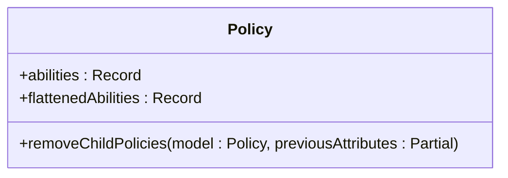

**图示来源**  
- [Policy.ts](file://app/models/Policy.ts#L1-L65)

**本节来源**  
- [Policy.ts](file://app/models/Policy.ts#L1-L65)

### 共享模型（Share）
共享模型管理文档和集合的公开访问链接，支持细粒度的访问控制选项。每个共享链接可独立配置索引权限、最后更新时间显示和目录显示等属性，满足不同场景下的内容发布需求。

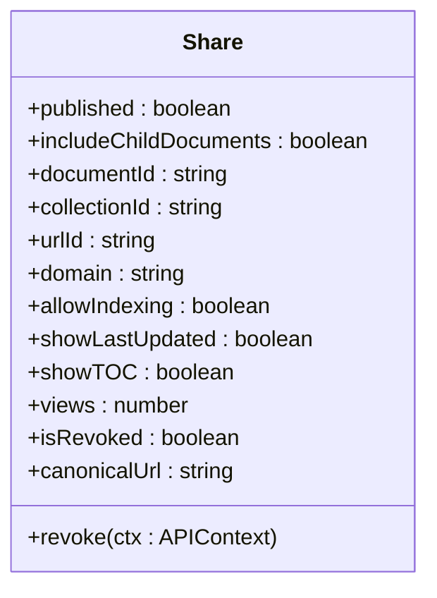

**图示来源**  
- [Share.ts](file://server/models/Share.ts#L1-L244)
- [Share.ts](file://app/models/Share.ts#L1-L133)

**本节来源**  
- [Share.ts](file://app/models/Share.ts#L1-L133)
- [server/models/Share.ts](file://server/models/Share.ts#L1-L244)

### 置顶模型（Pin）
置顶模型用于管理用户对重要文档的快速访问。支持将文档置顶到个人主页或特定集合中，并通过索引字段维护显示顺序。系统会自动更新缓存以反映置顶状态的变化。

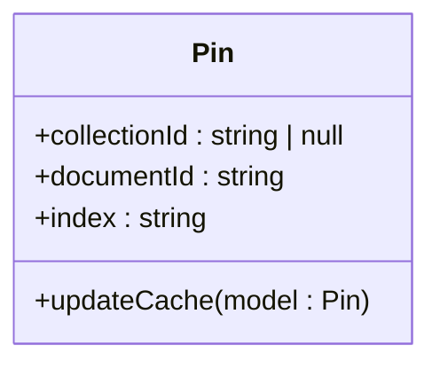

**图示来源**  
- [Pin.ts](file://app/models/Pin.ts#L1-L62)
- [Pin.ts](file://server/models/Pin.ts#L1-L61)

**本节来源**  
- [Pin.ts](file://app/models/Pin.ts#L1-L62)
- [Pin.ts](file://server/models/Pin.ts#L1-L61)

### 收藏模型（Star）
收藏模型允许用户标记重要文档或集合，便于后续快速查找。通过有序数据结构维护收藏顺序，并提供前后项导航功能，提升用户体验。

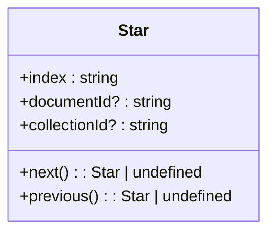

**图示来源**  
- [Star.ts](file://app/models/Star.ts#L1-L51)
- [Star.ts](file://server/models/Star.ts#L1-L54)

**本节来源**  
- [Star.ts](file://app/models/Star.ts#L1-L51)
- [Star.ts](file://server/models/Star.ts#L1-L54)

### 访问记录模型（View）
访问记录模型追踪用户对文档的访问行为，包括首次访问时间、最后访问时间和访问次数。支持增量更新和批量查询，为访问审计和用户行为分析提供数据支持。

```mermaid
classDiagram
class View {
+lastEditingAt : Date | null
+count : number
+incrementOrCreate(ctx : APIContext, where : {userId : string, documentId : string})
+findByDocument(documentId : string, {includeSuspended} : {includeSuspended? : boolean})
+touch(documentId : string, userId : string, isEditing : boolean)
}
```

**图示来源**  
- [View.ts](file://app/models/View.ts#L1-L35)
- [View.ts](file://server/models/View.ts#L1-L128)

**本节来源**  
- [View.ts](file://app/models/View.ts#L1-L35)
- [View.ts](file://server/models/View.ts#L1-L128)

## 基于角色的访问控制（RBAC）机制

### 权限定义与检查
系统采用基于角色的访问控制（RBAC）机制，通过`cancan`库实现灵活的权限管理。权限检查函数定义了用户对资源的操作能力，支持复杂的条件组合和嵌套逻辑。

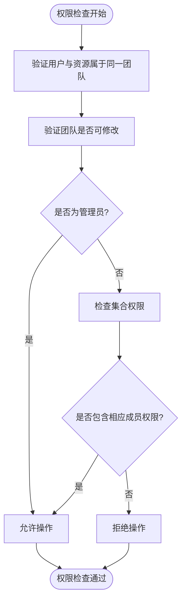

**图示来源**  
- [cancan.ts](file://server/policies/cancan.ts#L1-L249)
- [collection.ts](file://server/policies/collection.ts#L1-L212)
- [document.ts](file://server/policies/document.ts#L1-L332)

**本节来源**  
- [cancan.ts](file://server/policies/cancan.ts#L1-L249)
- [collection.ts](file://server/policies/collection.ts#L1-L212)
- [document.ts](file://server/policies/document.ts#L1-L332)

### 角色与权限映射
系统定义了多种用户角色，包括管理员、编辑、查看者和访客，每种角色对应不同的权限集合。权限映射通过策略模型动态生成，确保权限检查的高效性和准确性。

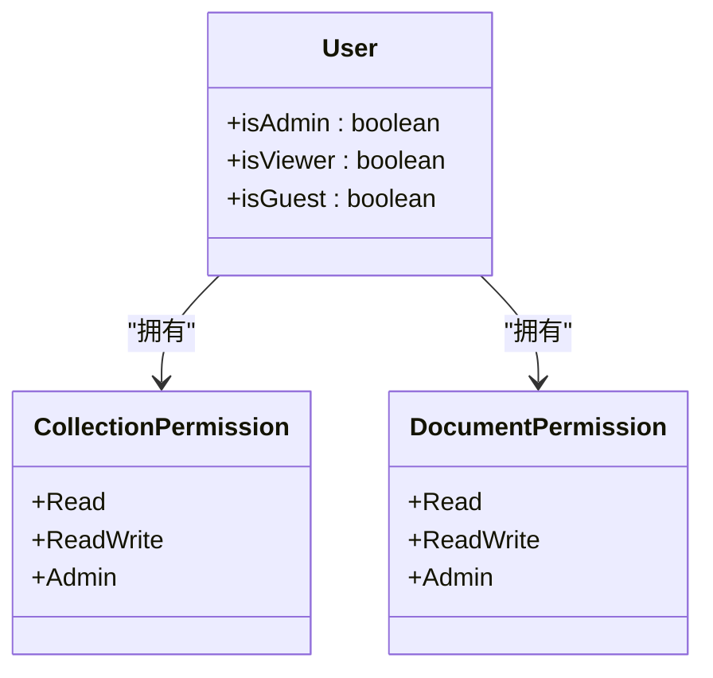

**图示来源**  
- [collection.ts](file://server/policies/collection.ts#L1-L212)
- [document.ts](file://server/policies/document.ts#L1-L332)

**本节来源**  
- [collection.ts](file://server/policies/collection.ts#L1-L212)
- [document.ts](file://server/policies/document.ts#L1-L332)

## 权限继承与共享策略

### 权限继承机制
系统实现了多层次的权限继承机制，确保子资源自动继承父资源的访问权限。当父资源的权限发生变化时，系统会自动触发子资源权限的更新。

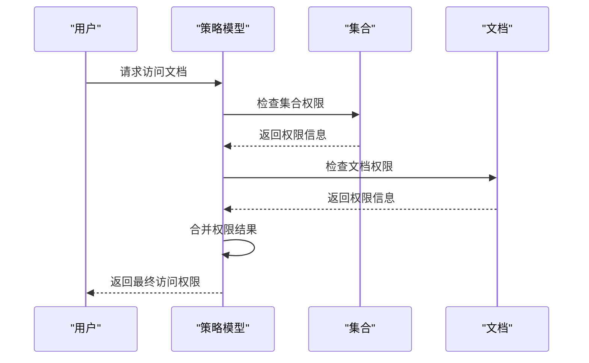

**图示来源**  
- [Policy.ts](file://app/models/Policy.ts#L1-L65)
- [collection.ts](file://server/policies/collection.ts#L1-L212)

**本节来源**  
- [Policy.ts](file://app/models/Policy.ts#L1-L65)
- [collection.ts](file://server/policies/collection.ts#L1-L212)

### 共享策略配置
共享策略支持多种配置选项，包括是否包含子文档、是否允许搜索引擎索引、是否显示最后更新时间和目录等。这些配置通过共享模型的字段进行管理。

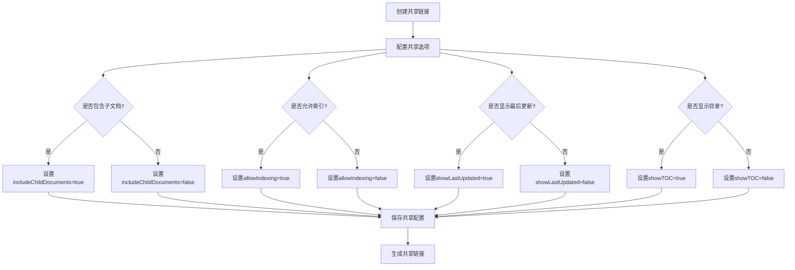

**图示来源**  
- [Share.ts](file://app/models/Share.ts#L1-L133)
- [server/models/Share.ts](file://server/models/Share.ts#L1-L244)

**本节来源**  
- [Share.ts](file://app/models/Share.ts#L1-L133)
- [server/models/Share.ts](file://server/models/Share.ts#L1-L244)

## 访问审计与行为追踪

### 访问记录管理
系统通过访问记录模型全面追踪用户对文档的访问行为。每次访问都会更新最后访问时间，并增加访问计数，为访问审计提供详细的数据支持。

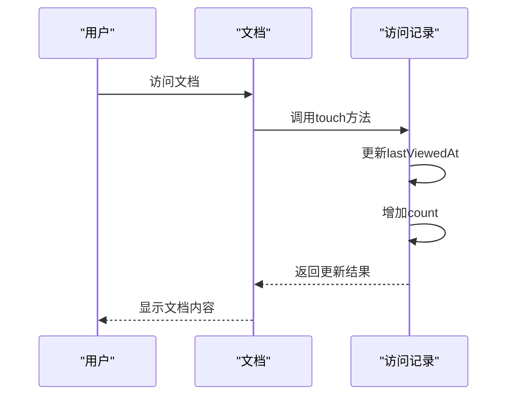

**图示来源**  
- [View.ts](file://server/models/View.ts#L1-L128)
- [View.ts](file://app/models/View.ts#L1-L35)

**本节来源**  
- [View.ts](file://server/models/View.ts#L1-L128)
- [View.ts](file://app/models/View.ts#L1-L35)

### 行为分析与统计
系统支持基于访问记录的行为分析，可以查询特定文档的访问历史、统计访问频率和识别活跃用户。这些功能为团队协作优化和内容管理提供数据支持。

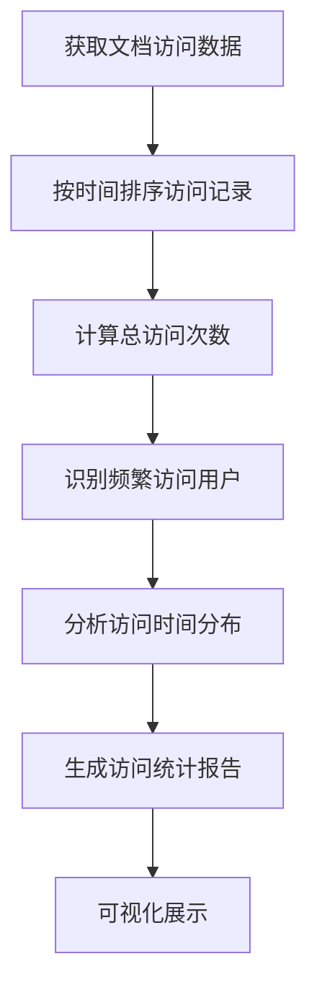

**图示来源**  
- [View.ts](file://server/models/View.ts#L1-L128)
- [ViewsStore.ts](file://app/stores/ViewsStore.ts)

**本节来源**  
- [View.ts](file://server/models/View.ts#L1-L128)
- [ViewsStore.ts](file://app/stores/ViewsStore.ts)

## 实际应用案例

### 配置文档共享权限
通过共享组件和策略模型的协同工作，系统提供了直观的文档共享权限配置界面。用户可以轻松设置公开访问权限和管理共享链接。

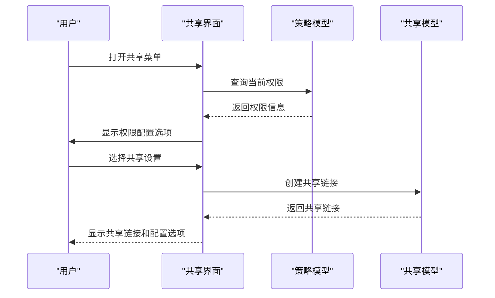

**图示来源**  
- [AccessControlList.tsx](file://app/components/Sharing/Document/AccessControlList.tsx)
- [Share.ts](file://app/models/Share.ts#L1-L133)
- [Policy.ts](file://app/models/Policy.ts#L1-L65)

**本节来源**  
- [AccessControlList.tsx](file://app/components/Sharing/Document/AccessControlList.tsx)
- [Share.ts](file://app/models/Share.ts#L1-L133)
- [Policy.ts](file://app/models/Policy.ts#L1-L65)

### 管理团队访问策略
系统支持团队级别的访问策略管理，管理员可以为整个团队设置默认的权限规则和共享策略，确保团队协作的安全性和一致性。

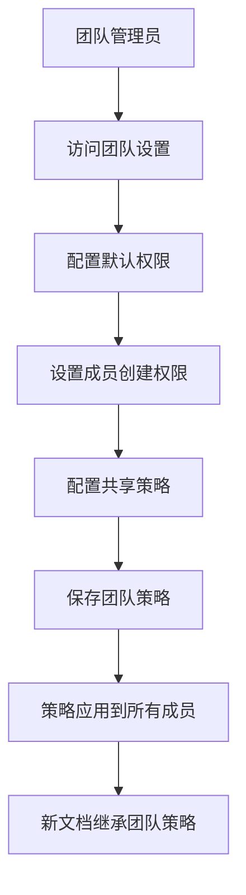

**图示来源**  
- [collection.ts](file://server/policies/collection.ts#L1-L212)
- [document.ts](file://server/policies/document.ts#L1-L332)

**本节来源**  
- [collection.ts](file://server/policies/collection.ts#L1-L212)
- [document.ts](file://server/policies/document.ts#L1-L332)

## 安全最佳实践

### 防止权限提升攻击
系统通过严格的权限检查和角色验证机制，有效防止权限提升攻击。所有敏感操作都必须通过权限验证，确保用户只能执行其角色允许的操作。

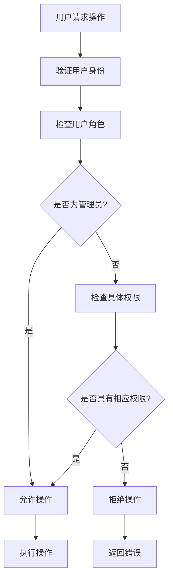

**图示来源**  
- [cancan.ts](file://server/policies/cancan.ts#L1-L249)
- [collection.ts](file://server/policies/collection.ts#L1-L212)
- [document.ts](file://server/policies/document.ts#L1-L332)

**本节来源**  
- [cancan.ts](file://server/policies/cancan.ts#L1-L249)
- [collection.ts](file://server/policies/collection.ts#L1-L212)
- [document.ts](file://server/policies/document.ts#L1-L332)

### 权限最小化原则
系统遵循权限最小化原则，为用户分配完成其工作所需的最小权限。通过细粒度的权限控制和角色分离，降低安全风险。

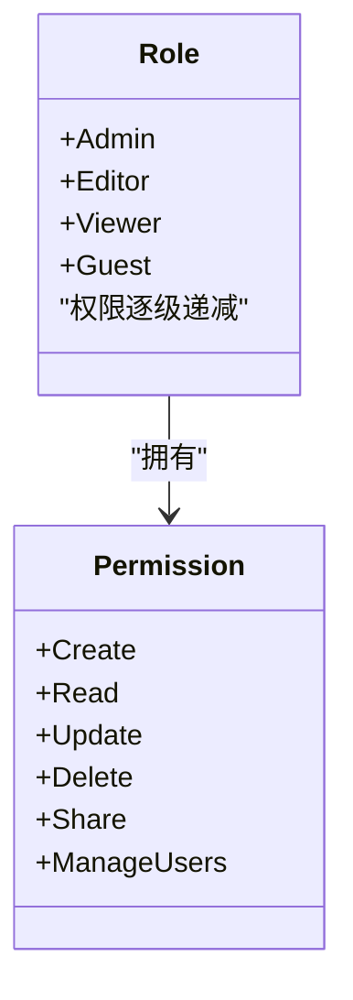

**图示来源**  
- [collection.ts](file://server/policies/collection.ts#L1-L212)
- [document.ts](file://server/policies/document.ts#L1-L332)

**本节来源**  
- [collection.ts](file://server/policies/collection.ts#L1-L212)
- [document.ts](file://server/policies/document.ts#L1-L332)

## 结论
本文档全面介绍了系统的权限与访问控制模型，涵盖了从核心数据结构到实际应用的各个方面。通过基于角色的访问控制机制、灵活的权限继承策略和全面的访问审计功能，系统为团队协作提供了安全、可靠的权限管理解决方案。开发者应遵循安全最佳实践，合理配置权限策略，确保系统的安全性和可用性。