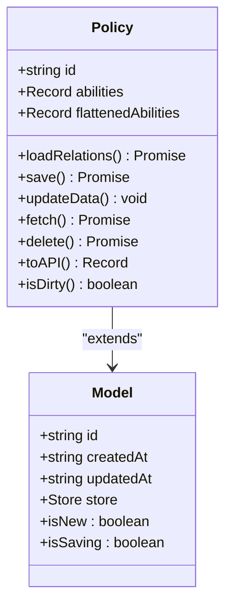
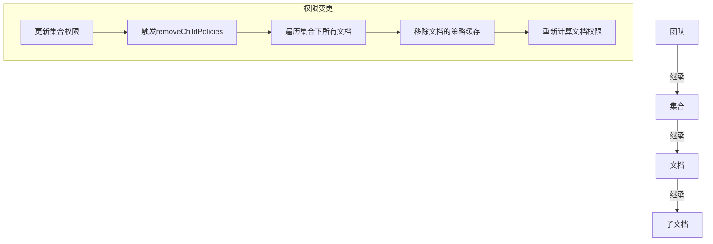
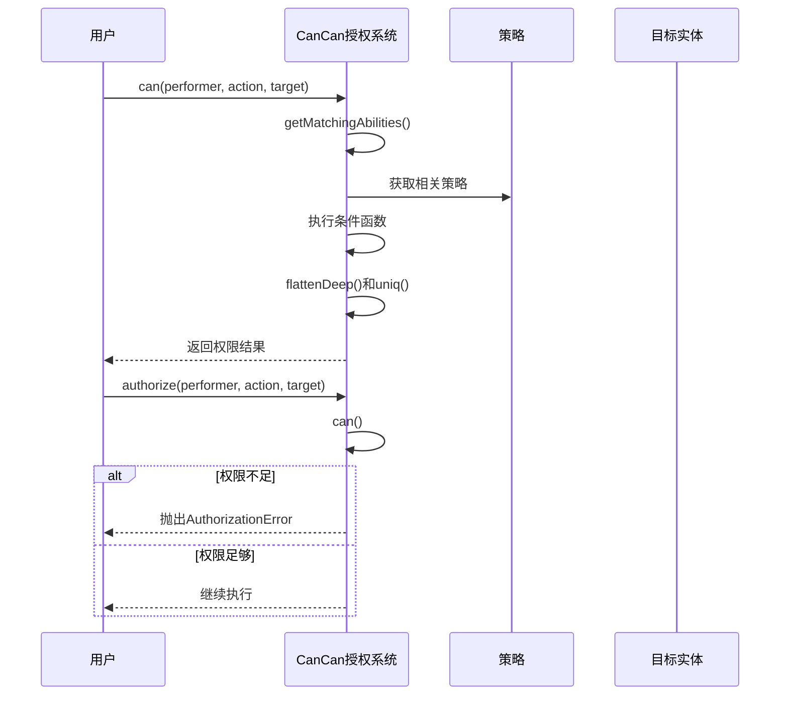
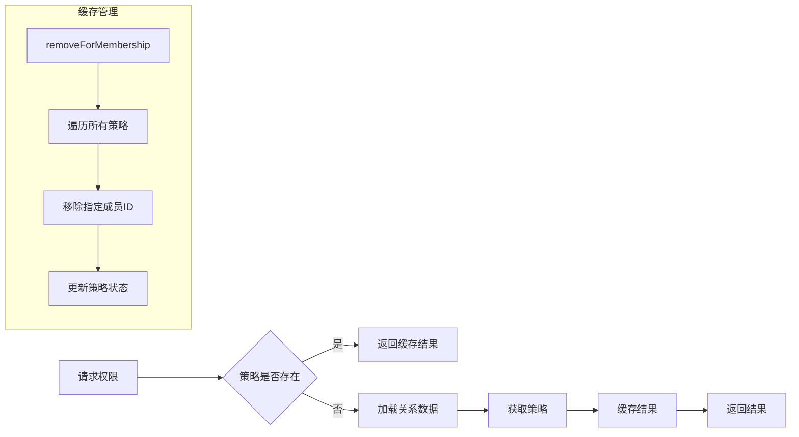
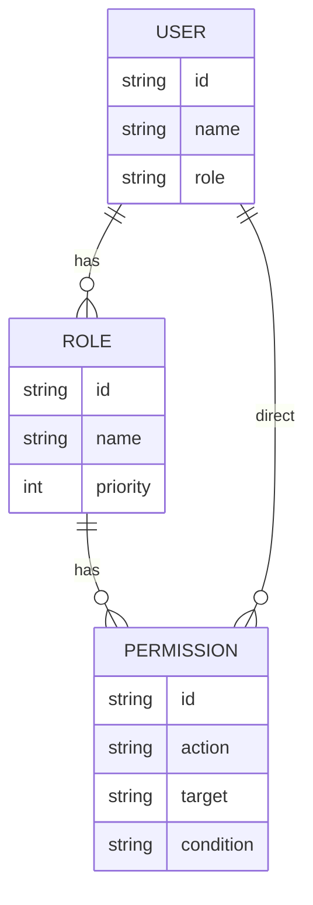
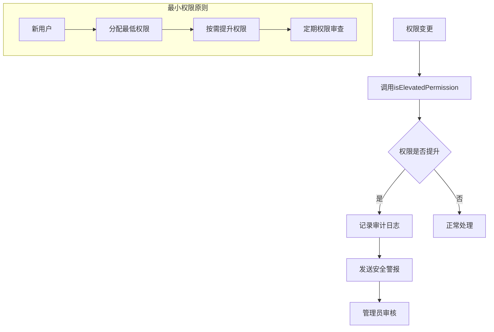

# 权限策略模型

<cite>
**本文档中引用的文件**  
- [Policy.ts](file://app/models/Policy.ts)
- [PoliciesStore.ts](file://app/stores/PoliciesStore.ts)
- [cancan.ts](file://server/policies/cancan.ts)
- [usePolicy.ts](file://app/hooks/usePolicy.ts)
</cite>

## 目录
1. [介绍](#介绍)
2. [权限策略数据模型](#权限策略数据模型)
3. [权限继承机制](#权限继承机制)
4. [权限检查流程](#权限检查流程)
5. [性能优化策略](#性能优化策略)
6. [角色权限案例](#角色权限案例)
7. [安全最佳实践](#安全最佳实践)
8. [结论](#结论)

## 介绍
本文档深入解析基于角色的访问控制（RBAC）系统的权限策略模型实现。重点阐述策略模型的结构设计、权限继承规则、权限检查流程和性能优化策略。通过具体案例展示不同角色的权限差异，以及如何实现复杂的权限组合。同时提供防止权限提升、最小权限原则和审计日志集成的安全最佳实践。

## 权限策略数据模型

权限策略模型的核心是`Policy`类，它继承自`Model`基类，用于表示系统中各个实体（如团队、集合、文档）的访问控制策略。每个策略包含一个`abilities`对象，该对象的键代表能力（如读取、写入、删除），值可以是布尔值或成员ID数组。

**图源**  
- [Policy.ts](file://app/models/Policy.ts#L6-L61)
- [base/Model.ts](file://app/models/base/Model.ts#L10-L253)

**节源**  
- [Policy.ts](file://app/models/Policy.ts#L6-L61)

## 权限继承机制

权限继承遵循团队→集合→文档的层级传递规则。当父级实体的权限发生变化时，会自动触发子级实体权限的更新。`Policy`类中的`removeChildPolicies`静态方法负责处理这种级联更新，确保权限变更的一致性。

**图源**  
- [Policy.ts](file://app/models/Policy.ts#L34-L60)

**节源**  
- [Policy.ts](file://app/models/Policy.ts#L34-L60)

## 权限检查流程

权限检查流程由`CanCan`类实现，它提供了一套完整的授权能力定义和检查机制。`can`方法用于检查执行者是否具有执行特定操作的能力，`authorize`方法则在权限不足时抛出异常。

**图源**  
- [cancan.ts](file://server/policies/cancan.ts#L113-L132)

**节源**  
- [cancan.ts](file://server/policies/cancan.ts#L113-L132)

## 性能优化策略

系统采用多种策略优化权限检查的性能。`PoliciesStore`类中的`abilities`方法通过缓存机制避免重复计算，`usePolicy` Hook在组件中智能地管理策略的加载和更新。

**图源**  
- [PoliciesStore.ts](file://app/stores/PoliciesStore.ts#L6-L61)
- [usePolicy.ts](file://app/hooks/usePolicy.ts#L12-L38)

**节源**  
- [PoliciesStore.ts](file://app/stores/PoliciesStore.ts#L6-L61)
- [usePolicy.ts](file://app/hooks/usePolicy.ts#L12-L38)

## 角色权限案例

系统定义了多种角色，包括管理员、编辑、查看者等，每种角色具有不同的权限组合。通过`UserRoleHelper`类可以方便地进行角色比较和权限判断。

**图源**  
- [UserRoleHelper.ts](file://shared/utils/UserRoleHelper.ts#L0-L48)

**节源**  
- [UserRoleHelper.ts](file://shared/utils/UserRoleHelper.ts#L0-L48)

## 安全最佳实践

系统实施了多项安全最佳实践，包括防止权限提升、最小权限原则和审计日志集成。`isElevatedPermission`函数用于检测权限提升，确保用户不会意外获得更高权限。

**图源**  
- [permissions.ts](file://server/utils/permissions.ts#L46-L81)

**节源**  
- [permissions.ts](file://server/utils/permissions.ts#L46-L81)

## 结论
本文档详细解析了权限策略模型的实现，涵盖了数据模型、权限继承、检查流程、性能优化和安全实践等关键方面。通过这套完善的RBAC系统，系统能够有效地管理复杂的权限关系，确保数据安全和访问控制的灵活性。