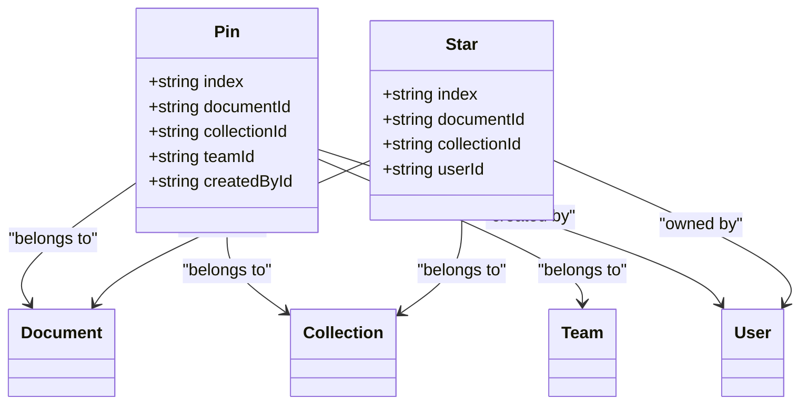
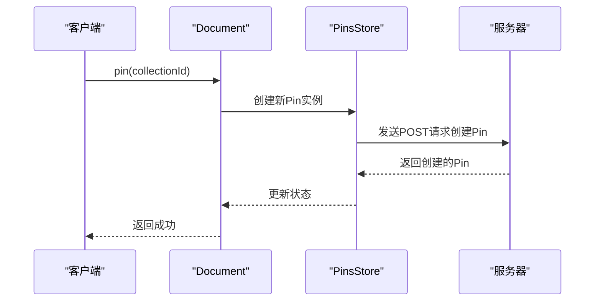
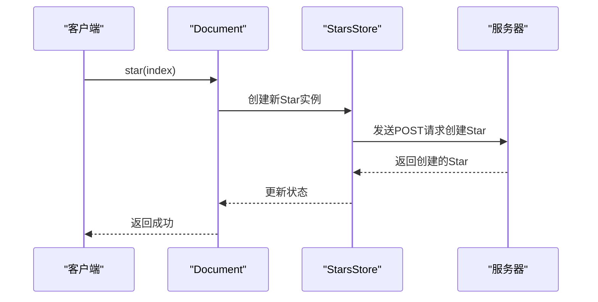

# 置顶与收藏模型

<cite>
**本文档引用的文件**  
- [Pin.ts](file://app/models/Pin.ts)
- [Star.ts](file://app/models/Star.ts)
- [PinsStore.ts](file://app/stores/PinsStore.ts)
- [StarsStore.ts](file://app/stores/StarsStore.ts)
- [Document.ts](file://app/models/Document.ts)
- [pinCreator.ts](file://server/commands/pinCreator.ts)
- [starCreator.ts](file://server/commands/starCreator.ts)
- [Pin.ts](file://server/models/Pin.ts)
- [Star.ts](file://server/models/Star.ts)
</cite>

## 目录
1. [引言](#引言)
2. [核心功能概述](#核心功能概述)
3. [数据模型结构](#数据模型结构)
4. [关联关系与权限验证](#关联关系与权限验证)
5. [置顶功能实现](#置顶功能实现)
6. [收藏功能实现](#收藏功能实现)
7. [高并发处理与数据一致性](#高并发处理与数据一致性)
8. [实际应用案例](#实际应用案例)
9. [总结](#总结)

## 引言

置顶（Pin）和收藏（Star）是内容管理系统中用于提升用户组织效率和访问速度的核心功能。置顶功能允许用户将重要文档固定在首页或特定集合中，确保快速访问；收藏功能则帮助用户建立个性化的知识库，便于后续查阅。本文档详细阐述这两个功能的数据模型设计、关联关系、权限验证逻辑以及后端对高并发操作的处理机制。

**Section sources**
- [Pin.ts](file://app/models/Pin.ts)
- [Star.ts](file://app/models/Star.ts)

## 核心功能概述

置顶和收藏功能在用户内容组织中扮演着关键角色。通过置顶，用户可以将关键文档固定在显眼位置，避免在大量文档中查找；通过收藏，用户可以标记感兴趣的内容，形成个人知识体系。这两个功能不仅提升了用户体验，还增强了系统的可用性和灵活性。

## 数据模型结构

### 置顶模型（Pin）

置顶模型 `Pin` 包含以下字段：
- **index**: 排序索引，用于确定置顶文档的显示顺序。
- **documentId**: 被置顶的文档ID。
- **collectionId**: 文档被置顶到的集合ID，若为空则表示置顶到首页。
- **teamId**: 所属团队ID。
- **createdById**: 创建者ID。

### 收藏模型（Star）

收藏模型 `Star` 包含以下字段：
- **index**: 排序索引，用于确定收藏项的显示顺序。
- **documentId**: 被收藏的文档ID。
- **collectionId**: 被收藏的集合ID。
- **userId**: 收藏者ID。

**Diagram sources**
- [Pin.ts](file://server/models/Pin.ts)
- [Star.ts](file://server/models/Star.ts)

**Section sources**
- [Pin.ts](file://server/models/Pin.ts)
- [Star.ts](file://server/models/Star.ts)

## 关联关系与权限验证

### 关联关系

- **Pin** 模型与 `Document`、`Collection`、`Team` 和 `User` 存在多对一关系。
- **Star** 模型与 `Document`、`Collection` 和 `User` 存在多对一关系。

### 权限验证

- **置顶权限**: 用户必须是文档所在团队的成员，并且有权限访问该文档。
- **收藏权限**: 收藏操作仅限于当前用户，无需额外权限验证。

**Section sources**
- [Pin.ts](file://app/models/Pin.ts)
- [Star.ts](file://app/models/Star.ts)

## 置顶功能实现

### 前端实现

在前端，`Document` 类提供了 `pin` 和 `unpin` 方法，用于创建和删除置顶记录。`PinsStore` 类负责管理所有置顶记录，并提供 `fetchPage` 方法来获取分页的置顶列表。

**Diagram sources**
- [Document.ts](file://app/models/Document.ts)
- [PinsStore.ts](file://app/stores/PinsStore.ts)

**Section sources**
- [Document.ts](file://app/models/Document.ts)
- [PinsStore.ts](file://app/stores/PinsStore.ts)

### 后端实现

后端通过 `pinCreator` 命令处理置顶请求。该命令首先检查用户是否有权限创建置顶记录，然后根据提供的 `index` 或自动生成的索引创建新的 `Pin` 记录。

**Section sources**
- [pinCreator.ts](file://server/commands/pinCreator.ts)

## 收藏功能实现

### 前端实现

在前端，`Document` 类提供了 `star` 和 `unstar` 方法，用于创建和删除收藏记录。`StarsStore` 类负责管理所有收藏记录，并提供 `fetchPage` 方法来获取分页的收藏列表。

**Diagram sources**
- [Document.ts](file://app/models/Document.ts)
- [StarsStore.ts](file://app/stores/StarsStore.ts)

**Section sources**
- [Document.ts](file://app/models/Document.ts)
- [StarsStore.ts](file://app/stores/StarsStore.ts)

### 后端实现

后端通过 `starCreator` 命令处理收藏请求。该命令首先检查用户是否有权限创建收藏记录，然后根据提供的 `index` 或自动生成的索引创建新的 `Star` 记录。

**Section sources**
- [starCreator.ts](file://server/commands/starCreator.ts)

## 高并发处理与数据一致性

为了应对高并发的收藏/取消收藏操作，系统采用了以下策略：
- **事务处理**: 所有数据库操作都在事务中进行，确保数据的一致性。
- **唯一约束**: 在数据库层面设置唯一约束，防止重复的收藏或置顶记录。
- **缓存机制**: 使用缓存减少数据库查询次数，提高响应速度。

**Section sources**
- [pinCreator.ts](file://server/commands/pinCreator.ts)
- [starCreator.ts](file://server/commands/starCreator.ts)

## 实际应用案例

### 管理重要文档

用户可以通过置顶功能将关键项目文档固定在首页，确保团队成员能够快速访问。例如，项目经理可以将项目计划书置顶，方便团队随时查看进度。

### 建立个人知识库

用户可以通过收藏功能标记感兴趣的技术文章或参考资料，形成个人知识库。例如，开发人员可以收藏常用的API文档，便于日常开发时查阅。

**Section sources**
- [Document.ts](file://app/models/Document.ts)

## 总结

置顶和收藏功能通过简洁的数据模型和高效的实现机制，显著提升了用户的内容组织和访问效率。通过对高并发操作的妥善处理，系统保证了数据的一致性和可靠性。这些功能不仅增强了用户体验，也为团队协作和个人学习提供了有力支持。

**Section sources**
- [Pin.ts](file://app/models/Pin.ts)
- [Star.ts](file://app/models/Star.ts)
- [PinsStore.ts](file://app/stores/PinsStore.ts)
- [StarsStore.ts](file://app/stores/StarsStore.ts)