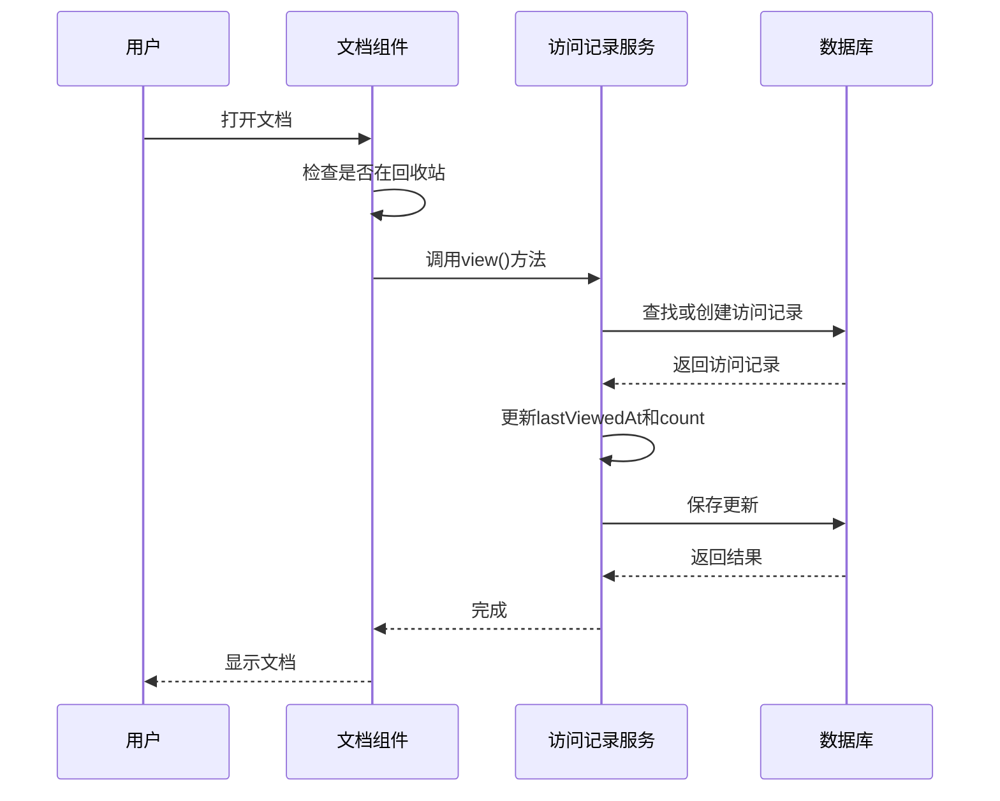
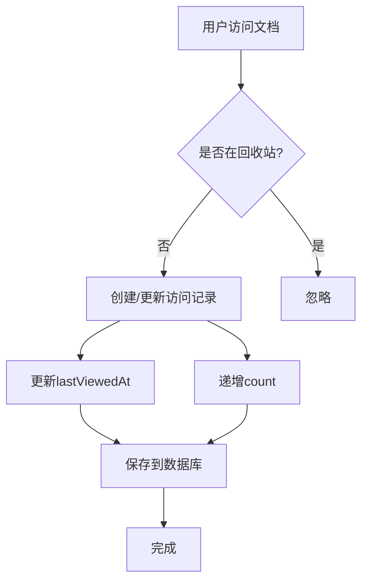

# 访问记录模型

<cite>
**本文档中引用的文件**  
- [View.ts](file://app/models/View.ts)
- [View.ts](file://server/models/View.ts)
- [Document.ts](file://app/models/Document.ts)
- [Document.ts](file://server/models/Document.ts)
- [ViewsStore.ts](file://app/stores/ViewsStore.ts)
</cite>

## 目录
1. [简介](#简介)
2. [数据模型结构](#数据模型结构)
3. [创建时机与去重机制](#创建时机与去重机制)
4. [数据存储与过期处理](#数据存储与过期处理)
5. [核心功能实现](#核心功能实现)
6. [性能优化建议](#性能优化建议)
7. [总结](#总结)

## 简介
访问记录（View）数据模型是系统中用于追踪用户行为和分析内容热度的核心组件。该模型记录了用户对文档的访问行为，支持“最近查看”功能、文档热度排序以及用户行为分析等关键业务场景。通过高效的存储策略和去重机制，确保数据的准确性和系统的高性能。

## 数据模型结构
访问记录模型包含以下核心字段：
- **documentId**: 关联的文档ID
- **userId**: 访问用户的ID
- **firstViewedAt**: 首次访问时间
- **lastViewedAt**: 最后一次访问时间
- **count**: 访问次数计数器

该模型在客户端和服务器端分别定义，保持结构一致性。服务器端使用Sequelize ORM进行数据库映射，客户端使用MobX进行状态管理。

**Section sources**
- [View.ts](file://app/models/View.ts#L6-L31)
- [View.ts](file://server/models/View.ts#L22-L124)

## 创建时机与去重机制
访问记录在用户查看文档时创建。具体流程如下：
1. 当用户打开文档时，调用`Document`模型的`view()`方法。
2. 该方法检查文档是否在回收站中，若不在则继续处理。
3. 更新文档的`lastViewedAt`时间戳。
4. 调用`ViewsStore`的`create`方法创建或更新访问记录。

去重机制通过数据库的唯一索引实现。在`views`表上创建了`(documentId, userId)`的唯一索引，确保同一用户对同一文档的访问记录不会重复。当用户再次访问时，系统会更新现有记录的`lastViewedAt`和`count`字段，而不是创建新记录。

**Diagram sources**
- [Document.ts](file://app/models/Document.ts#L535-L561)
- [View.ts](file://server/models/View.ts#L63-L84)

**Section sources**
- [Document.ts](file://app/models/Document.ts#L535-L561)
- [View.ts](file://server/models/View.ts#L63-L84)

## 数据存储与过期处理
访问记录存储在PostgreSQL数据库的`views`表中。表结构设计考虑了查询性能和数据完整性：
- 主键：`id`（UUID）
- 外键：`documentId`、`userId`
- 索引：`(documentId, userId)`唯一索引，`documentId`普通索引

数据过期处理目前未实现自动过期机制。系统通过定期清理任务来管理历史数据，具体策略由运维团队根据存储容量和业务需求制定。建议未来实现基于时间的自动过期策略，例如保留最近90天的访问记录。

**Section sources**
- [View.ts](file://server/models/View.ts#L22-L124)
- [migrations/20170604052346-add-views.js](file://server/migrations/20170604052346-add-views.js)

## 核心功能实现
### 最近查看功能
"最近查看"功能通过查询用户的访问记录实现。`ViewsStore`提供了`inDocument`方法，按`lastViewedAt`降序排列访问记录，返回用户最近查看的文档列表。

### 文档热度排序
文档热度通过访问次数`count`字段计算。`ViewsStore`的`countForDocument`方法统计指定文档的总访问次数，用于排序和推荐。

### 用户行为分析
系统通过分析访问记录数据，实现用户行为分析功能：
- 识别活跃用户和热门内容
- 分析用户访问模式
- 支持个性化推荐

**Diagram sources**
- [ViewsStore.ts](file://app/stores/ViewsStore.ts#L8-L39)
- [View.ts](file://server/models/View.ts#L86-L105)

**Section sources**
- [ViewsStore.ts](file://app/stores/ViewsStore.ts#L8-L39)
- [View.ts](file://server/models/View.ts#L86-L105)

## 性能优化建议
### Redis缓存高频访问数据
建议使用Redis缓存高频访问的文档热度数据。通过`CacheHelper`类实现缓存读写，减少数据库查询压力。缓存键设计为`hotness:<documentId>`，过期时间设置为1小时。

### 批量写入数据库
对于大量访问记录的写入操作，建议实现批量写入机制。可以使用消息队列收集访问事件，定时批量写入数据库，减少I/O开销。

### 数据库查询优化
- 为`views`表的`documentId`和`userId`字段添加复合索引
- 使用连接查询（JOIN）替代多次单表查询
- 实现分页查询，避免一次性加载过多数据

### 前端性能优化
- 在客户端使用MobX的响应式特性，避免不必要的重新渲染
- 实现访问记录的本地缓存，减少API调用
- 使用防抖（debounce）技术，避免频繁更新访问时间

## 总结
访问记录模型是系统用户行为追踪和内容分析的基础。通过合理的数据结构设计和去重机制，确保了数据的准确性和一致性。建议进一步优化性能，特别是通过Redis缓存和批量写入策略，提升系统整体性能。未来可以考虑实现更精细的用户行为分析功能，为产品决策提供数据支持。