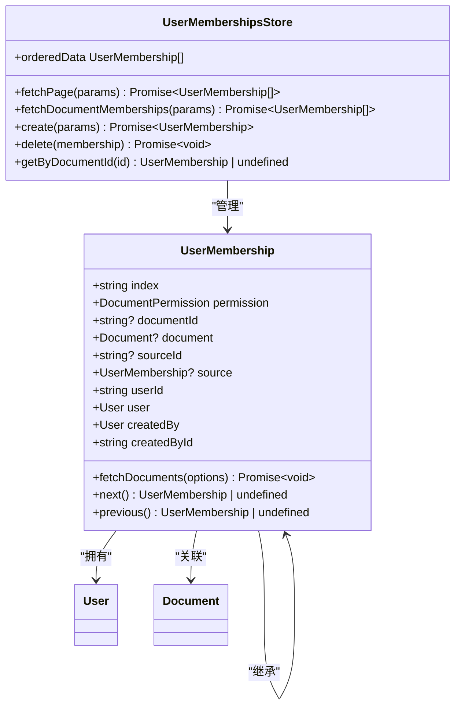
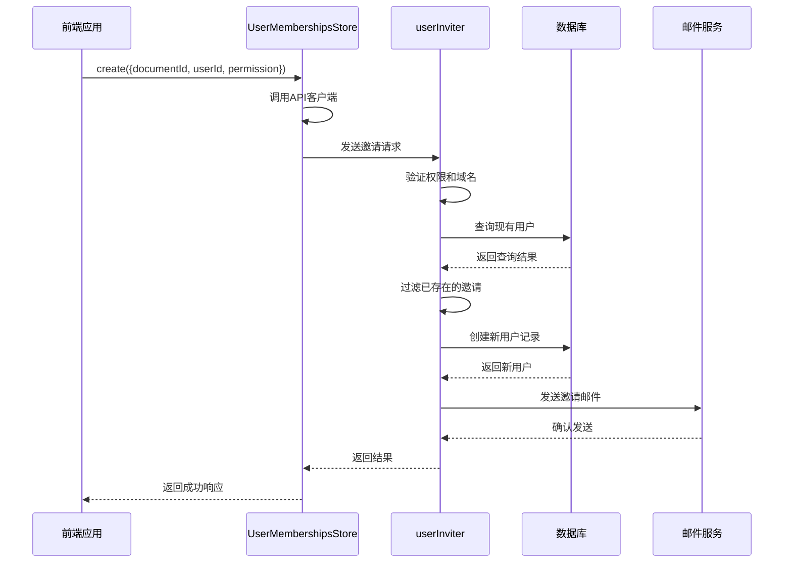
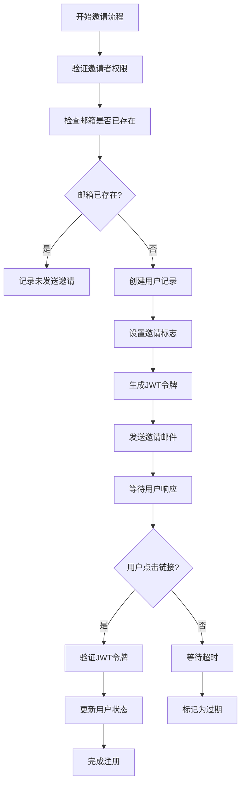
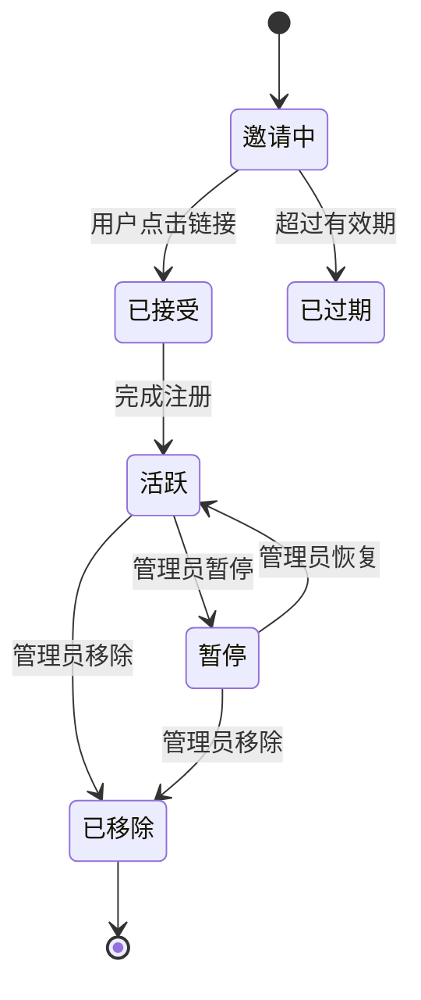
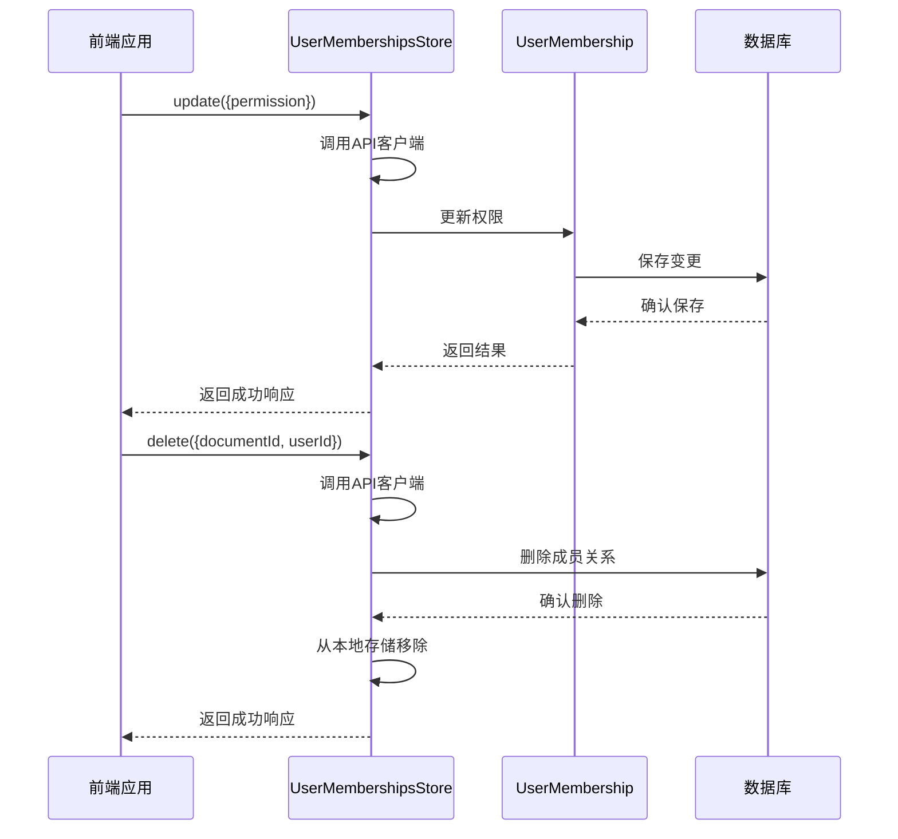
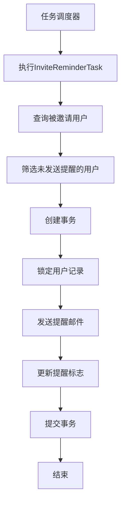
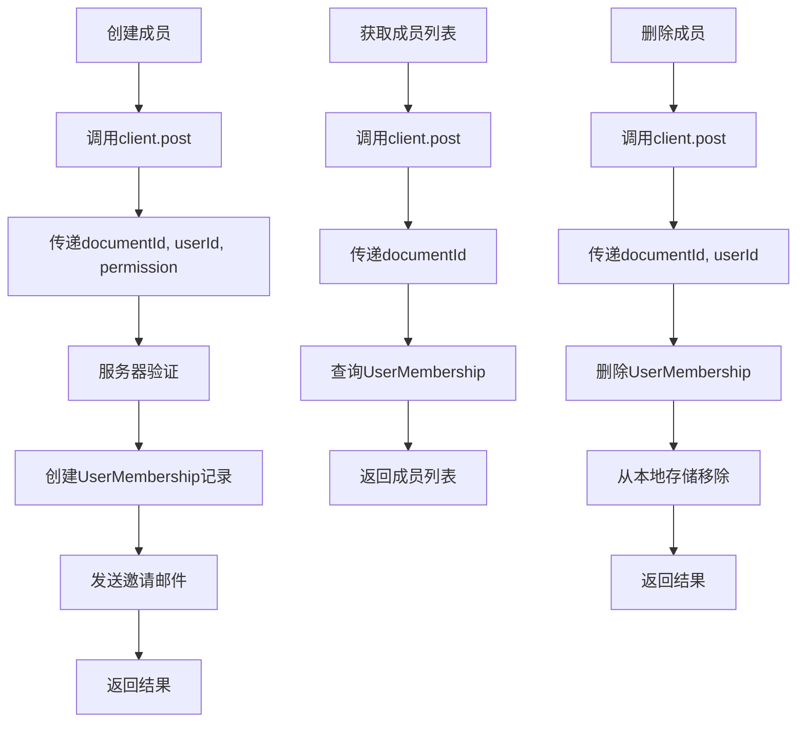
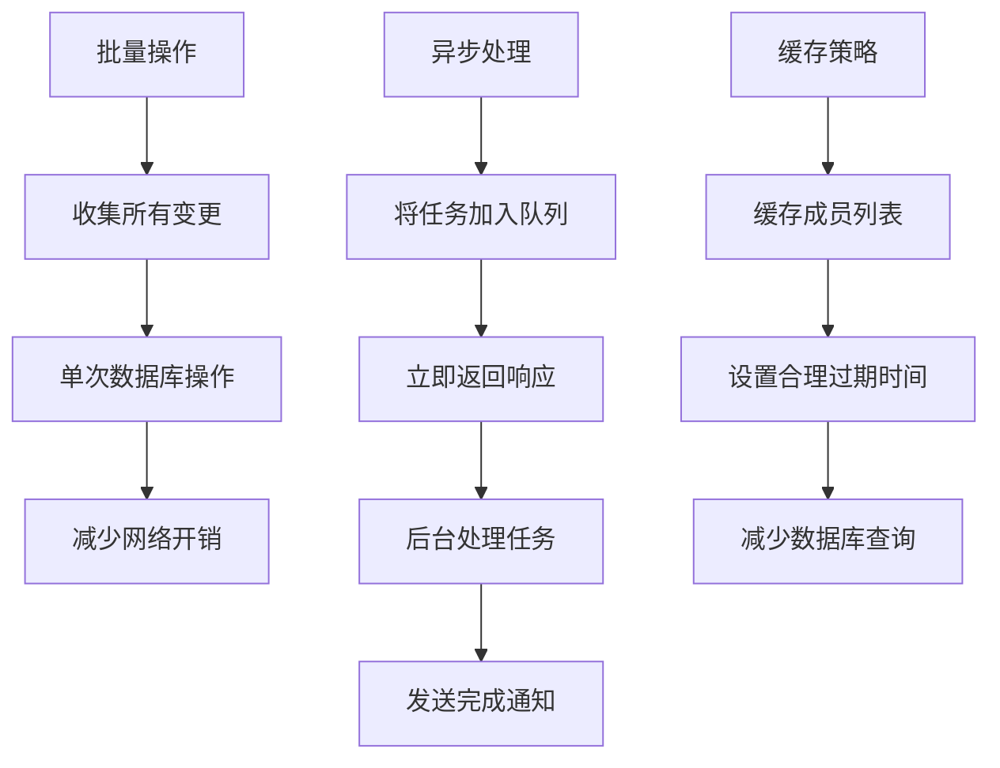
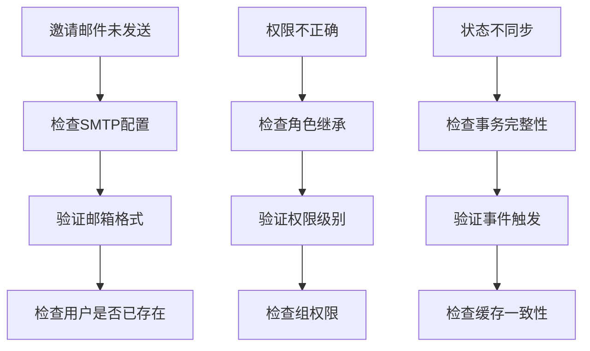

# 成员管理功能

<cite>
**本文档引用的文件**   
- [UserMembership.ts](file://app/models/UserMembership.ts)
- [UserMembershipsStore.ts](file://app/stores/UserMembershipsStore.ts)
- [userInviter.ts](file://server/commands/userInviter.ts)
- [InviteReminderTask.ts](file://server/queues/tasks/InviteReminderTask.ts)
- [User.ts](file://server/models/User.ts)
- [Team.ts](file://server/models/Team.ts)
</cite>

## 目录
1. [简介](#简介)
2. [核心模型分析](#核心模型分析)
3. [成员邀请流程](#成员邀请流程)
4. [邀请链接与状态管理](#邀请链接与状态管理)
5. [成员生命周期状态图](#成员生命周期状态图)
6. [角色变更与移除成员](#角色变更与移除成员)
7. [后台处理机制](#后台处理机制)
8. [API调用示例](#api调用示例)
9. [性能优化建议](#性能优化建议)
10. [故障排除](#故障排除)

## 简介
成员管理功能是团队协作系统的核心组成部分，负责管理用户与团队之间的多对多关系。该功能通过UserMembership模型实现，支持成员邀请、接受邀请、角色变更和移除成员等完整流程。系统采用分层架构，前端通过MobX状态管理，后端通过Sequelize ORM与数据库交互，确保数据一致性和操作的原子性。

## 核心模型分析
UserMembership模型是成员管理的核心，它继承自NavigableModel，实现了用户与文档的权限关联。该模型包含权限级别、文档ID、用户ID等关键字段，并通过Relation装饰器建立与其他模型的关联关系。

**Diagram sources**
- [UserMembership.ts](file://app/models/UserMembership.ts#L10-L97)
- [UserMembershipsStore.ts](file://app/stores/UserMembershipsStore.ts#L8-L119)

**Section sources**
- [UserMembership.ts](file://app/models/UserMembership.ts#L10-L97)
- [UserMembershipsStore.ts](file://app/stores/UserMembershipsStore.ts#L8-L119)

## 成员邀请流程
成员邀请流程由userInviter命令驱动，该命令处理邀请的创建、去重和发送。流程首先验证邀请者的权限，然后检查目标邮箱是否已被使用，最后创建用户记录并发送邀请邮件。

**Diagram sources**
- [userInviter.ts](file://server/commands/userInviter.ts#L22-L120)
- [UserMembershipsStore.ts](file://app/stores/UserMembershipsStore.ts#L82-L89)

**Section sources**
- [userInviter.ts](file://server/commands/userInviter.ts#L22-L120)
- [UserMembershipsStore.ts](file://app/stores/UserMembershipsStore.ts#L82-L89)

## 邀请链接与状态管理
邀请链接的生成和状态管理通过用户模型的JWT令牌机制实现。当用户被邀请时，系统会生成一个包含用户ID和创建时间的临时令牌，该令牌用于验证邀请的有效性。

**Diagram sources**
- [User.ts](file://server/models/User.ts#L590-L599)
- [userInviter.ts](file://server/commands/userInviter.ts#L22-L120)

**Section sources**
- [User.ts](file://server/models/User.ts#L590-L599)
- [userInviter.ts](file://server/commands/userInviter.ts#L22-L120)

## 成员生命周期状态图
成员的生命周期从邀请开始，经过接受邀请、活跃使用，直到被移除或账户被暂停。每个状态都有相应的触发事件和处理逻辑。

**Diagram sources**
- [User.ts](file://server/models/User.ts#L265-L267)
- [Team.ts](file://server/models/Team.ts#L216-L230)

**Section sources**
- [User.ts](file://server/models/User.ts#L265-L267)
- [Team.ts](file://server/models/Team.ts#L216-L230)

## 角色变更与移除成员
角色变更和成员移除通过UserMembershipsStore的update和delete方法实现。当成员角色变更时，系统会触发相应的事件钩子，更新相关权限。

**Diagram sources**
- [UserMembershipsStore.ts](file://app/stores/UserMembershipsStore.ts#L82-L89)
- [UserMembership.ts](file://app/models/UserMembership.ts#L93-L96)

**Section sources**
- [UserMembershipsStore.ts](file://app/stores/UserMembershipsStore.ts#L82-L89)
- [UserMembership.ts](file://app/models/UserMembership.ts#L93-L96)

## 后台处理机制
后台处理机制通过任务队列实现，特别是InviteReminderTask负责发送邀请提醒邮件。该任务每天执行一次，检查过去两天内被邀请但未激活的用户。

**Diagram sources**
- [InviteReminderTask.ts](file://server/queues/tasks/InviteReminderTask.ts#L1-L67)
- [User.ts](file://server/models/User.ts#L279-L281)

**Section sources**
- [InviteReminderTask.ts](file://server/queues/tasks/InviteReminderTask.ts#L1-L67)
- [User.ts](file://server/models/User.ts#L279-L281)

## API调用示例
以下是成员管理功能的API调用示例，展示了如何通过客户端API进行成员操作。

**Diagram sources**
- [UserMembershipsStore.ts](file://app/stores/UserMembershipsStore.ts#L82-L89)
- [ApiClient.ts](file://app/utils/ApiClient.ts#L275-L279)

**Section sources**
- [UserMembershipsStore.ts](file://app/stores/UserMembershipsStore.ts#L82-L89)
- [ApiClient.ts](file://app/utils/ApiClient.ts#L275-L279)

## 性能优化建议
对于大规模团队成员管理，建议采用批量操作和异步处理来提高性能。批量操作可以减少数据库往返次数，异步处理可以避免阻塞主线程。

**Diagram sources**
- [UserMembershipsStore.ts](file://app/stores/UserMembershipsStore.ts#L41-L63)
- [InviteReminderTask.ts](file://server/queues/tasks/InviteReminderTask.ts#L1-L67)

**Section sources**
- [UserMembershipsStore.ts](file://app/stores/UserMembershipsStore.ts#L41-L63)
- [InviteReminderTask.ts](file://server/queues/tasks/InviteReminderTask.ts#L1-L67)

## 故障排除
常见问题包括邀请邮件未发送、成员权限不正确和状态同步问题。这些问题通常与权限验证、事务处理和事件触发有关。

**Diagram sources**
- [userInviter.ts](file://server/commands/userInviter.ts#L22-L120)
- [UserMembership.ts](file://server/models/UserMembership.ts#L134-L136)

**Section sources**
- [userInviter.ts](file://server/commands/userInviter.ts#L22-L120)
- [UserMembership.ts](file://server/models/UserMembership.ts#L134-L136)