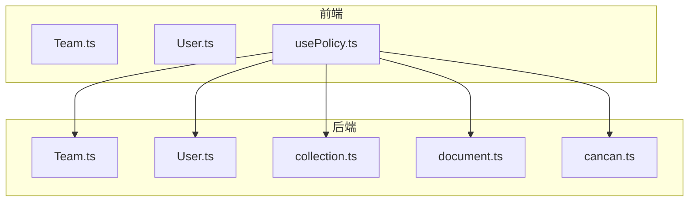
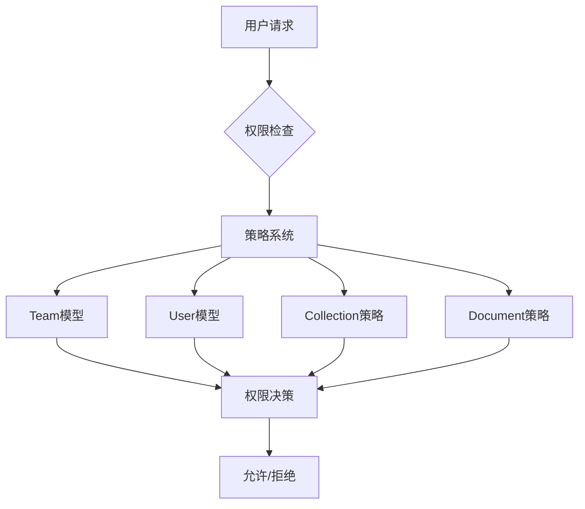
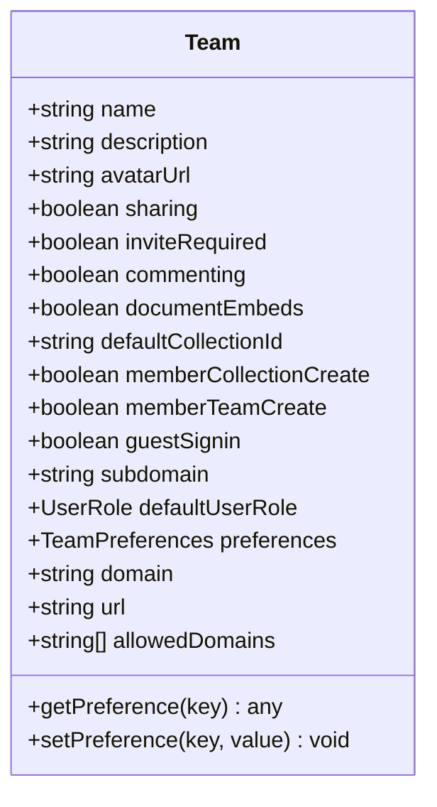
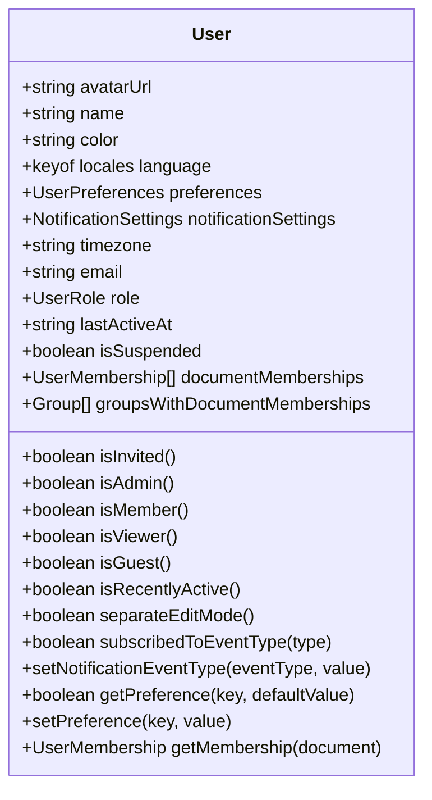
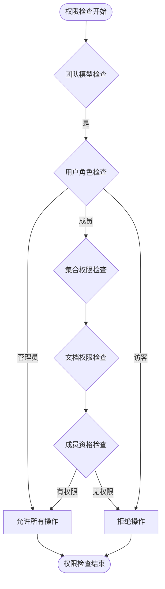
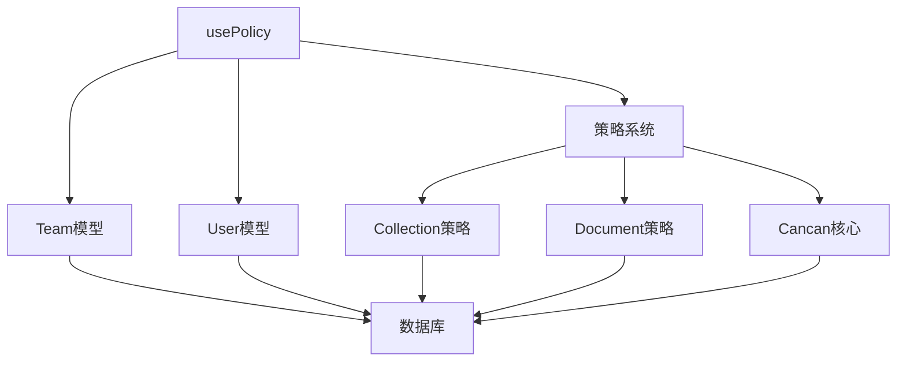

# 权限控制模型

<cite>
**本文档中引用的文件**  
- [Team.ts](file://app/models/Team.ts)
- [User.ts](file://app/models/User.ts)
- [Team.ts](file://server/models/Team.ts)
- [User.ts](file://server/models/User.ts)
- [collection.ts](file://server/policies/collection.ts)
- [document.ts](file://server/policies/document.ts)
- [cancan.ts](file://server/policies/cancan.ts)
- [usePolicy.ts](file://app/hooks/usePolicy.ts)
</cite>

## 目录
1. [简介](#简介)
2. [项目结构](#项目结构)
3. [核心组件](#核心组件)
4. [架构概述](#架构概述)
5. [详细组件分析](#详细组件分析)
6. [依赖分析](#依赖分析)
7. [性能考虑](#性能考虑)
8. [故障排除指南](#故障排除指南)
9. [结论](#结论)

## 简介
本文档深入探讨了团队和用户权限控制系统的实现机制。重点分析了Team和User模型中的角色字段（如admin、member）、权限继承机制以及基于策略的访问控制（Pundit模式）。文档详细说明了用户权限验证流程、团队默认角色设置和权限升级/降级逻辑，并提供了初学者友好的权限矩阵图表和针对高级开发者的性能优化建议。

## 项目结构
项目中的权限控制功能分布在多个目录中，主要集中在`app/models`和`server/models`中定义数据模型，`server/policies`中定义访问策略，以及`app/hooks`中提供前端权限检查钩子。

**图表来源**
- [Team.ts](file://app/models/Team.ts)
- [User.ts](file://app/models/User.ts)
- [usePolicy.ts](file://app/hooks/usePolicy.ts)

**章节来源**
- [app/models/Team.ts](file://app/models/Team.ts)
- [app/models/User.ts](file://app/models/User.ts)
- [server/models/Team.ts](file://server/models/Team.ts)
- [server/models/User.ts](file://server/models/User.ts)

## 核心组件
系统权限控制的核心组件包括Team和User模型、基于Cancan库的策略系统以及前端权限钩子。这些组件共同实现了细粒度的访问控制和权限管理功能。

**章节来源**
- [Team.ts](file://app/models/Team.ts#L1-L124)
- [User.ts](file://app/models/User.ts#L1-L248)

## 架构概述
系统采用基于角色的访问控制（RBAC）与基于策略的访问控制（PBAC）相结合的架构。权限决策通过Cancan策略系统集中管理，前端通过usePolicy钩子获取权限信息。

**图表来源**
- [cancan.ts](file://server/policies/cancan.ts#L1-L248)
- [collection.ts](file://server/policies/collection.ts#L1-L211)
- [document.ts](file://server/policies/document.ts#L1-L331)

## 详细组件分析

### Team模型分析
Team模型定义了团队的基本属性和权限相关字段，包括团队名称、描述、默认用户角色等。

**图表来源**
- [Team.ts](file://app/models/Team.ts#L1-L124)
- [Team.ts](file://server/models/Team.ts#L1-L476)

### User模型分析
User模型定义了用户的基本属性和角色相关字段，包括用户名称、邮箱、角色、权限等。

**图表来源**
- [User.ts](file://app/models/User.ts#L1-L248)
- [User.ts](file://server/models/User.ts#L1-L799)

### 权限策略分析
权限策略系统基于Cancan库实现，定义了用户对各种资源的操作权限。

**图表来源**
- [cancan.ts](file://server/policies/cancan.ts#L1-L248)
- [collection.ts](file://server/policies/collection.ts#L1-L211)
- [document.ts](file://server/policies/document.ts#L1-L331)

## 依赖分析
权限控制系统依赖于多个核心组件，这些组件之间存在复杂的依赖关系。

**图表来源**
- [usePolicy.ts](file://app/hooks/usePolicy.ts#L1-L39)
- [cancan.ts](file://server/policies/cancan.ts#L1-L248)

## 性能考虑
对于大型团队和大量文档的场景，权限检查可能成为性能瓶颈。建议实现权限缓存策略和批量权限查询优化来提升性能。

## 故障排除指南
当遇到权限相关问题时，可以检查以下方面：
- 用户角色是否正确设置
- 团队默认角色配置是否符合预期
- 策略条件是否正确评估
- 前端权限钩子是否正确获取权限信息

**章节来源**
- [usePolicy.ts](file://app/hooks/usePolicy.ts#L1-L39)
- [cancan.ts](file://server/policies/cancan.ts#L1-L248)

## 结论
本文档详细介绍了团队和用户权限控制系统的实现细节。系统采用灵活的基于策略的访问控制模型，结合角色管理和权限继承机制，提供了细粒度的权限控制能力。通过前端钩子和后端策略的协同工作，实现了安全可靠的权限管理。