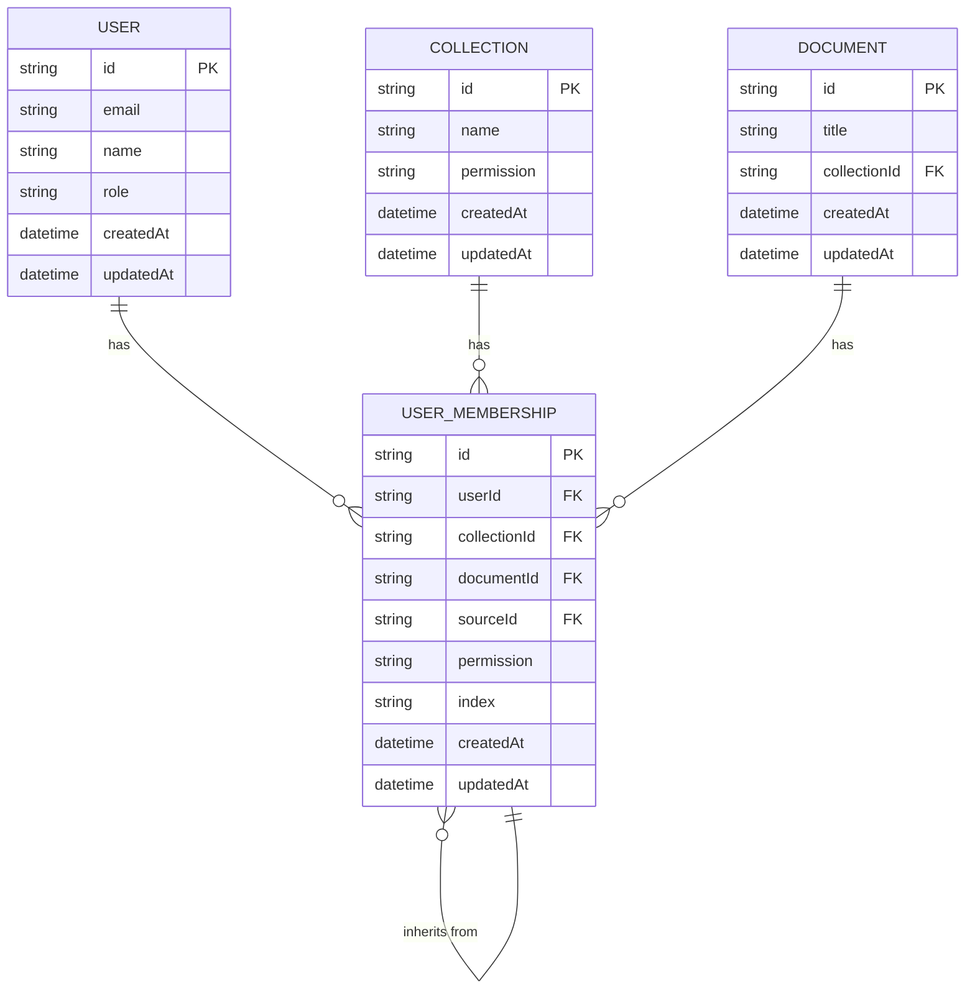
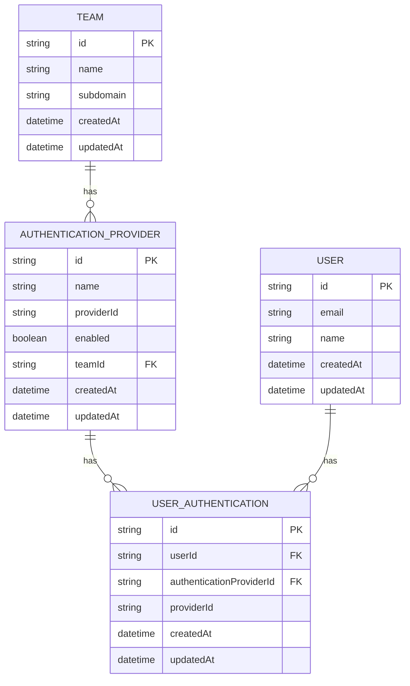
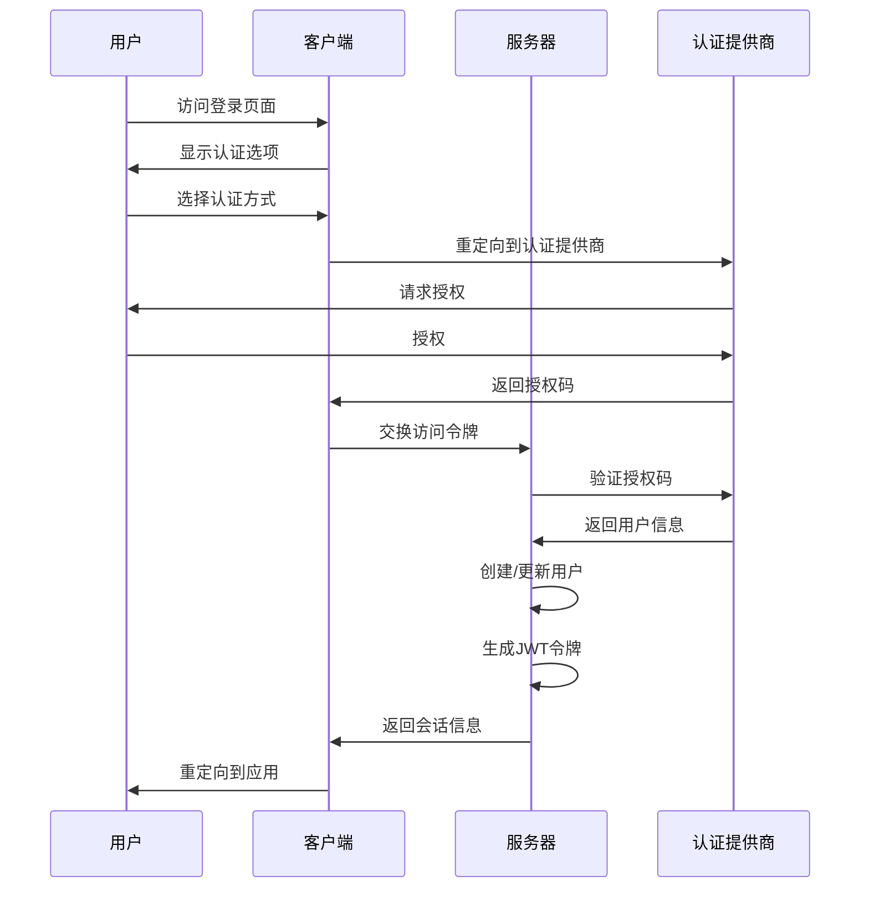
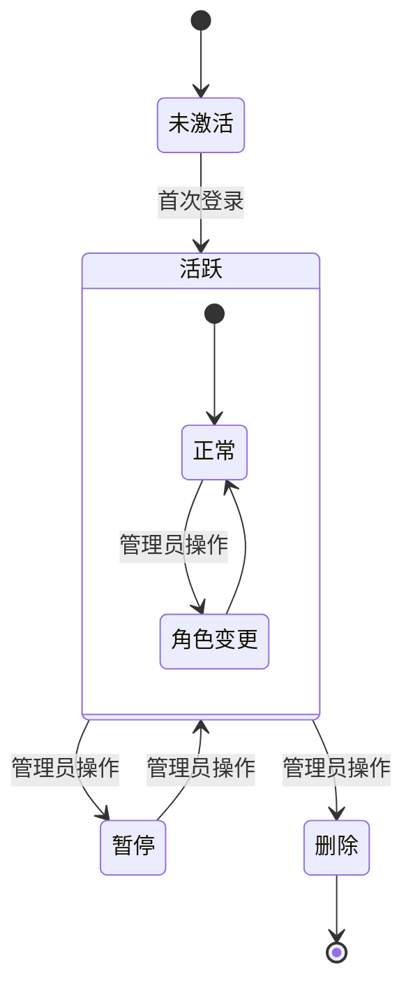

# 用户与团队模型

<cite>
**本文档引用的文件**   
- [User.ts](file://app/models/User.ts)
- [User.ts](file://server/models/User.ts)
- [Team.ts](file://app/models/Team.ts)
- [Team.ts](file://server/models/Team.ts)
- [UserMembership.ts](file://app/models/UserMembership.ts)
- [UserMembership.ts](file://server/models/UserMembership.ts)
- [AuthenticationProvider.ts](file://app/models/AuthenticationProvider.ts)
- [AuthenticationProvider.ts](file://server/models/AuthenticationProvider.ts)
</cite>

## 目录
1. [简介](#简介)
2. [用户模型](#用户模型)
3. [团队模型](#团队模型)
4. [用户成员关系模型](#用户成员关系模型)
5. [认证提供商模型](#认证提供商模型)
6. [身份验证机制](#身份验证机制)
7. [用户生命周期管理](#用户生命周期管理)
8. [性能优化建议](#性能优化建议)

## 简介
本文档详细介绍了用户（User）和团队（Team）数据模型，包括用户身份验证机制、团队成员关系（UserMembership）以及认证提供商（AuthenticationProvider）的集成方式。文档涵盖了模型字段、关联关系、数据约束和业务规则，并为初学者提供用户生命周期管理的概述，同时为高级开发者提供性能优化建议。

## 用户模型

用户模型是系统的核心实体，代表系统中的个人用户。它包含用户的基本信息、权限设置和行为状态。

### 模型字段
- **id**: 用户唯一标识符
- **email**: 用户邮箱，用于登录和通信
- **name**: 用户显示名称
- **role**: 用户角色（Admin, Member, Viewer, Guest）
- **avatarUrl**: 用户头像URL
- **language**: 用户界面语言偏好
- **timezone**: 用户时区设置
- **lastActiveAt**: 最后活跃时间
- **isSuspended**: 是否被暂停

### 业务规则
- 用户角色决定了其在系统中的权限级别
- 管理员（Admin）拥有最高权限，可以管理团队设置和成员
- 成员（Member）可以创建和编辑内容
- 查看者（Viewer）只能查看内容
- 访客（Guest）权限最低，通常用于临时访问

### 关联关系
- 一对多：一个用户属于一个团队
- 一对多：一个用户可以有多个认证方式
- 多对多：通过用户成员关系与文档和集合关联

**Section sources**
- [User.ts](file://app/models/User.ts#L22-L245)
- [User.ts](file://server/models/User.ts#L81-L856)

## 团队模型

团队模型代表组织或工作空间，是用户协作的基础单元。

### 模型字段
- **id**: 团队唯一标识符
- **name**: 团队名称
- **description**: 团队描述
- **avatarUrl**: 团队头像URL
- **subdomain**: 团队子域名
- **domain**: 自定义域名
- **defaultUserRole**: 新成员默认角色
- **memberCollectionCreate**: 成员是否可以创建集合
- **memberTeamCreate**: 成员是否可以创建团队
- **guestSignin**: 是否允许访客登录

### 业务规则
- 每个团队必须至少有一个管理员
- 团队可以配置不同的访问策略和权限设置
- 团队可以有自己的子域名和自定义域名
- 团队可以设置默认的新成员角色

### 关联关系
- 一对多：一个团队包含多个用户
- 一对多：一个团队包含多个集合
- 一对多：一个团队包含多个文档
- 一对多：一个团队可以有多个认证提供商

**Section sources**
- [Team.ts](file://app/models/Team.ts#L7-L121)
- [Team.ts](file://server/models/Team.ts#L54-L473)

## 用户成员关系模型

用户成员关系模型（UserMembership）管理用户对特定资源的访问权限。

### 模型字段
- **id**: 成员关系唯一标识符
- **userId**: 关联的用户ID
- **collectionId**: 关联的集合ID（可选）
- **documentId**: 关联的文档ID（可选）
- **sourceId**: 源成员关系ID（用于继承权限）
- **permission**: 权限级别
- **index**: 排序索引

### 业务规则
- 权限可以继承：子文档继承父文档的权限
- 当用户角色变更时，自动更新相关权限
- 删除最后一个管理员权限时会进行验证
- 权限变更会触发相应的事件

### 关联关系
- 多对一：多个成员关系属于一个用户
- 多对一：成员关系可以关联到一个集合
- 多对一：成员关系可以关联到一个文档
- 多对一：成员关系可以有一个源成员关系（用于权限继承）

**Diagram sources**
- [UserMembership.ts](file://app/models/UserMembership.ts#L10-L97)
- [UserMembership.ts](file://server/models/UserMembership.ts#L38-L410)

**Section sources**
- [UserMembership.ts](file://app/models/UserMembership.ts#L10-L97)
- [UserMembership.ts](file://server/models/UserMembership.ts#L38-L410)

## 认证提供商模型

认证提供商模型管理团队支持的第三方认证方式。

### 模型字段
- **id**: 认证提供商唯一标识符
- **name**: 认证提供商名称（如google, azure, oidc）
- **providerId**: 第三方提供商的ID
- **enabled**: 是否启用
- **teamId**: 关联的团队ID

### 业务规则
- 每个团队必须至少有一个启用的认证提供商
- 可以配置多个认证提供商
- 认证提供商可以启用或禁用
- 支持OAuth2.0协议的第三方认证

### 关联关系
- 多对一：多个认证提供商属于一个团队
- 一对多：一个认证提供商可以有多个用户认证记录

**Diagram sources**
- [AuthenticationProvider.ts](file://app/models/AuthenticationProvider.ts#L4-L22)
- [AuthenticationProvider.ts](file://server/models/AuthenticationProvider.ts#L27-L140)

**Section sources**
- [AuthenticationProvider.ts](file://app/models/AuthenticationProvider.ts#L4-L22)
- [AuthenticationProvider.ts](file://server/models/AuthenticationProvider.ts#L27-L140)

## 身份验证机制

系统实现了多层身份验证机制，确保用户安全访问。

### 认证流程
1. 用户通过支持的认证提供商登录
2. 系统验证用户身份并创建会话
3. 生成JWT令牌用于后续请求验证
4. 维护用户活跃状态

### 令牌类型
- **会话令牌**：用于API请求，存储在浏览器cookie中
- **协作令牌**：用于实时协作，存储在客户端内存中
- **转移令牌**：用于跨子域名会话转移
- **邮件登录令牌**：用于通过邮件链接登录

### 安全特性
- JWT令牌包含用户ID和过期时间
- 用户JWT密钥定期轮换以提高安全性
- 支持多因素认证
- 记录用户登录IP和时间

**Diagram sources**
- [User.ts](file://server/models/User.ts#L81-L856)
- [AuthenticationProvider.ts](file://server/models/AuthenticationProvider.ts#L27-L140)

**Section sources**
- [User.ts](file://server/models/User.ts#L81-L856)
- [AuthenticationProvider.ts](file://server/models/AuthenticationProvider.ts#L27-L140)

## 用户生命周期管理

用户生命周期管理涵盖了用户从创建到删除的全过程。

### 用户注册
- 通过邀请链接或直接注册
- 验证邮箱地址
- 设置初始角色和权限
- 创建用户配置文件

### 用户激活
- 首次登录完成激活
- 设置个性化偏好
- 加入默认集合
- 接收欢迎信息

### 用户角色变更
- 管理员可以更改用户角色
- 角色变更触发权限更新
- 通知相关用户
- 记录变更日志

### 用户暂停与删除
- 暂停用户：保留数据但禁止访问
- 删除用户：移除个人标识信息
- 确保团队至少有一个管理员
- 处理关联的附件和数据

**Diagram sources**
- [User.ts](file://app/models/User.ts#L22-L245)
- [User.ts](file://server/models/User.ts#L81-L856)

**Section sources**
- [User.ts](file://app/models/User.ts#L22-L245)
- [User.ts](file://server/models/User.ts#L81-L856)

## 性能优化建议

### 索引策略
- 在常用查询字段上创建索引：
  - 用户表：email, teamId, lastActiveAt
  - 团队表：subdomain, domain
  - 成员关系表：userId, collectionId, documentId
- 使用复合索引优化多条件查询
- 定期分析查询性能并调整索引

### 查询优化
- 使用作用域（Scopes）预定义常用查询
- 批量操作时使用事务
- 避免N+1查询问题
- 合理使用缓存机制

### 数据库优化
- 定期清理软删除的数据
- 优化大表的分区策略
- 监控慢查询并进行优化
- 使用连接池管理数据库连接

**Section sources**
- [User.ts](file://server/models/User.ts#L81-L856)
- [Team.ts](file://server/models/Team.ts#L54-L473)
- [UserMembership.ts](file://server/models/UserMembership.ts#L38-L410)