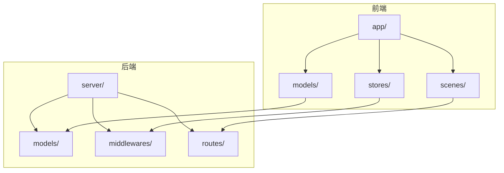
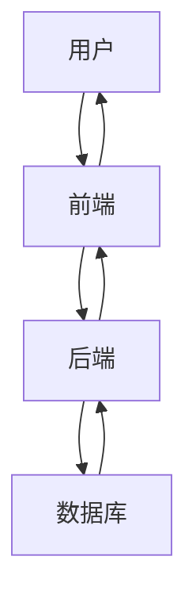
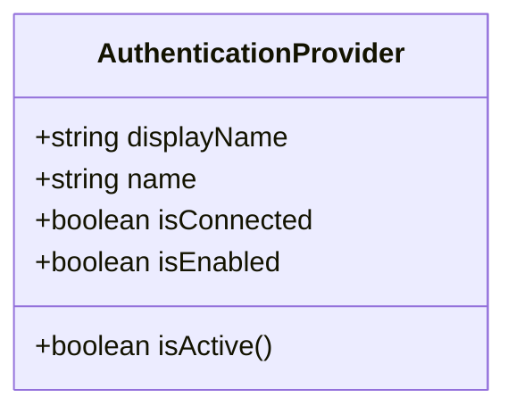
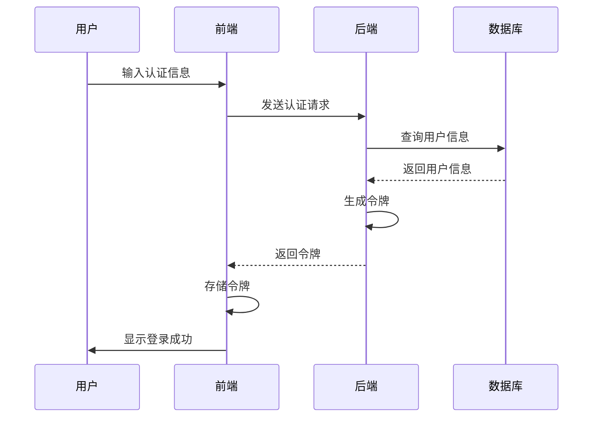
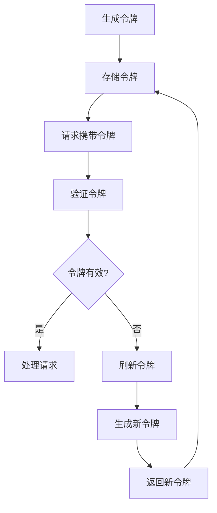
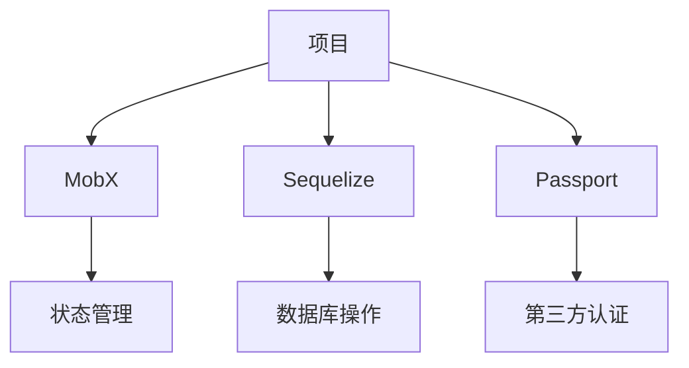

# 身份验证机制

<cite>
**本文档中引用的文件**   
- [AuthenticationProvider.ts](file://app/models/AuthenticationProvider.ts)
- [AuthenticationProvider.ts](file://server/models/AuthenticationProvider.ts)
- [UserAuthentication.ts](file://server/models/UserAuthentication.ts)
- [authentication.ts](file://server/utils/authentication.ts)
- [passport.ts](file://server/middlewares/passport.ts)
- [passport.ts](file://server/utils/passport.ts)
- [authenticationProviders.ts](file://server/routes/api/authenticationProviders/authenticationProviders.ts)
- [Login.tsx](file://app/scenes/Login/Login.tsx)
- [ApiKey.ts](file://server/models/ApiKey.ts)
</cite>

## 目录
1. [简介](#简介)
2. [项目结构](#项目结构)
3. [核心组件](#核心组件)
4. [架构概述](#架构概述)
5. [详细组件分析](#详细组件分析)
6. [依赖分析](#依赖分析)
7. [性能考虑](#性能考虑)
8. [故障排除指南](#故障排除指南)
9. [结论](#结论)

## 简介
本文档详细介绍了基于OAuth、API密钥和第三方认证提供商（如Google、Slack、Azure）的身份验证机制实现。文档涵盖了AuthenticationProvider模型的结构、用户认证流程、令牌管理机制和会话持久化策略。通过代码示例展示了用户登录、令牌刷新和认证状态验证的实现逻辑。为初学者提供了认证流程的序列图，同时为高级开发者提供了安全最佳实践，如防止CSRF攻击、令牌过期策略和多因素认证扩展点。

## 项目结构
项目结构清晰地分为前端和后端两个主要部分。前端代码位于`app/`目录下，包含组件、模型、存储和场景等。后端代码位于`server/`目录下，包含模型、中间件、路由和命令等。身份验证相关的代码分布在多个目录中，包括`app/models/`、`server/models/`、`server/middlewares/`和`server/routes/api/`。

**图表来源**
- [app/models/AuthenticationProvider.ts](file://app/models/AuthenticationProvider.ts#L1-L25)
- [server/models/AuthenticationProvider.ts](file://server/models/AuthenticationProvider.ts#L1-L143)

**章节来源**
- [app/models/AuthenticationProvider.ts](file://app/models/AuthenticationProvider.ts#L1-L25)
- [server/models/AuthenticationProvider.ts](file://server/models/AuthenticationProvider.ts#L1-L143)

## 核心组件
核心组件包括AuthenticationProvider模型、UserAuthentication模型、身份验证中间件和API路由。AuthenticationProvider模型定义了身份验证提供商的基本属性和方法，UserAuthentication模型管理用户的认证信息，身份验证中间件处理认证逻辑，API路由提供身份验证相关的API接口。

**章节来源**
- [app/models/AuthenticationProvider.ts](file://app/models/AuthenticationProvider.ts#L1-L25)
- [server/models/AuthenticationProvider.ts](file://server/models/AuthenticationProvider.ts#L1-L143)
- [server/models/UserAuthentication.ts](file://server/models/UserAuthentication.ts#L1-L206)

## 架构概述
系统架构采用前后端分离的设计，前端通过API与后端进行通信。身份验证流程包括用户登录、令牌生成、会话管理等步骤。后端通过中间件和路由处理身份验证请求，前端通过组件和场景展示登录界面和处理用户交互。

**图表来源**
- [authentication.ts](file://server/utils/authentication.ts#L1-L181)
- [passport.ts](file://server/middlewares/passport.ts#L1-L100)

## 详细组件分析

### AuthenticationProvider模型分析
AuthenticationProvider模型定义了身份验证提供商的基本属性和方法。模型包含displayName、name、isConnected和isEnabled等属性，以及isActive计算属性。模型通过@observable和@Field装饰器管理状态，通过@computed装饰器计算派生状态。

**图表来源**
- [app/models/AuthenticationProvider.ts](file://app/models/AuthenticationProvider.ts#L4-L22)

**章节来源**
- [app/models/AuthenticationProvider.ts](file://app/models/AuthenticationProvider.ts#L1-L25)

### 用户认证流程分析
用户认证流程包括用户登录、令牌生成、会话管理等步骤。用户通过前端界面输入认证信息，前端将信息发送到后端，后端通过中间件和路由处理认证请求，生成令牌并返回给前端，前端将令牌存储在cookie中，后续请求携带令牌进行认证。

**图表来源**
- [authentication.ts](file://server/utils/authentication.ts#L1-L181)
- [passport.ts](file://server/middlewares/passport.ts#L1-L100)

**章节来源**
- [authentication.ts](file://server/utils/authentication.ts#L1-L181)
- [passport.ts](file://server/middlewares/passport.ts#L1-L100)

### 令牌管理机制分析
令牌管理机制包括令牌生成、验证和刷新。后端通过JWT生成令牌，前端在请求中携带令牌，后端通过中间件验证令牌的有效性。当令牌即将过期时，前端通过API请求刷新令牌，后端生成新的令牌并返回给前端。

**图表来源**
- [authentication.ts](file://server/utils/authentication.ts#L1-L181)
- [UserAuthentication.ts](file://server/models/UserAuthentication.ts#L1-L206)

**章节来源**
- [authentication.ts](file://server/utils/authentication.ts#L1-L181)
- [UserAuthentication.ts](file://server/models/UserAuthentication.ts#L1-L206)

## 依赖分析
系统依赖包括MobX、Sequelize、Passport等。MobX用于前端状态管理，Sequelize用于后端数据库操作，Passport用于第三方认证。这些依赖通过npm包管理器进行管理，版本信息在package.json文件中定义。

**图表来源**
- [package.json](file://package.json#L1-L100)

**章节来源**
- [package.json](file://package.json#L1-L100)

## 性能考虑
性能考虑包括令牌验证的缓存、数据库查询的优化和API请求的限流。令牌验证通过缓存减少数据库查询次数，数据库查询通过索引优化查询性能，API请求通过限流防止滥用。

## 故障排除指南
故障排除指南包括常见问题的解决方案，如认证失败、令牌过期和会话失效。认证失败可能是由于认证信息错误或认证提供商配置错误，令牌过期需要刷新令牌，会话失效需要重新登录。

**章节来源**
- [errors.ts](file://server/errors.ts#L1-L100)
- [authentication.ts](file://server/utils/authentication.ts#L1-L181)

## 结论
本文档详细介绍了基于OAuth、API密钥和第三方认证提供商的身份验证机制实现。通过分析核心组件、架构概述、详细组件分析、依赖分析、性能考虑和故障排除指南，为开发者提供了全面的身份验证机制参考。文档还为初学者提供了认证流程的序列图，为高级开发者提供了安全最佳实践。