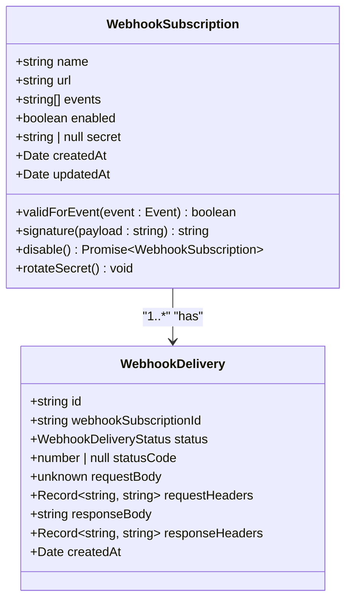
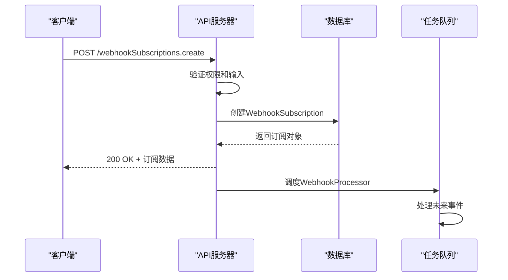
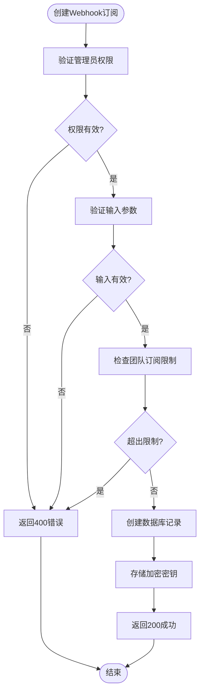
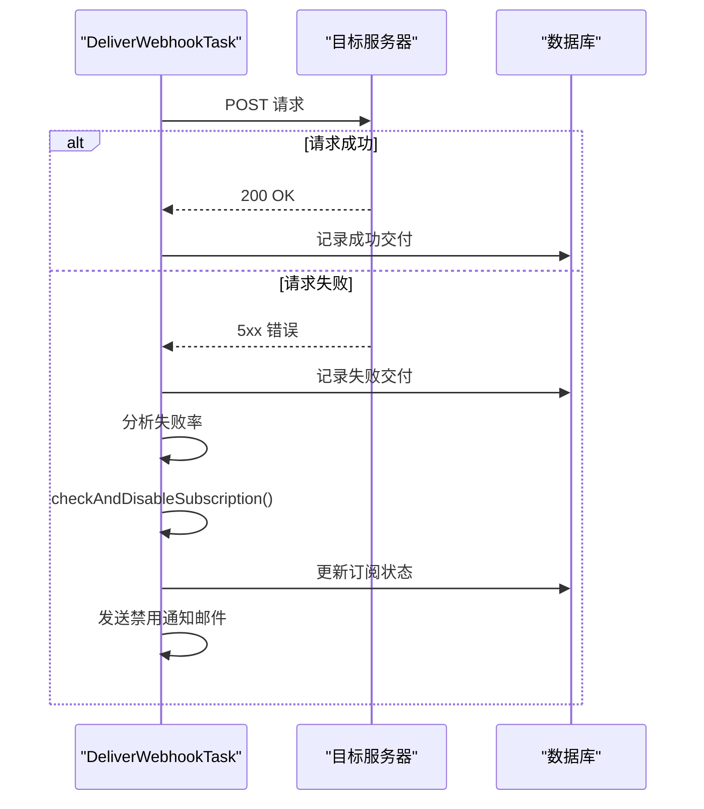
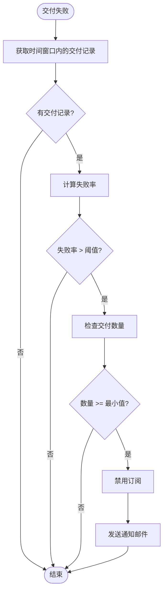
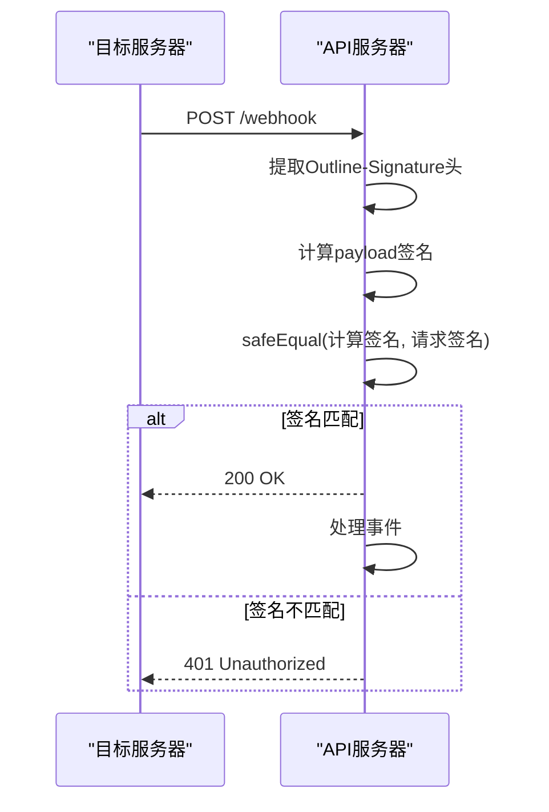
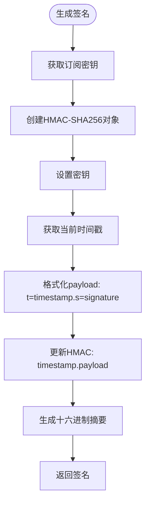
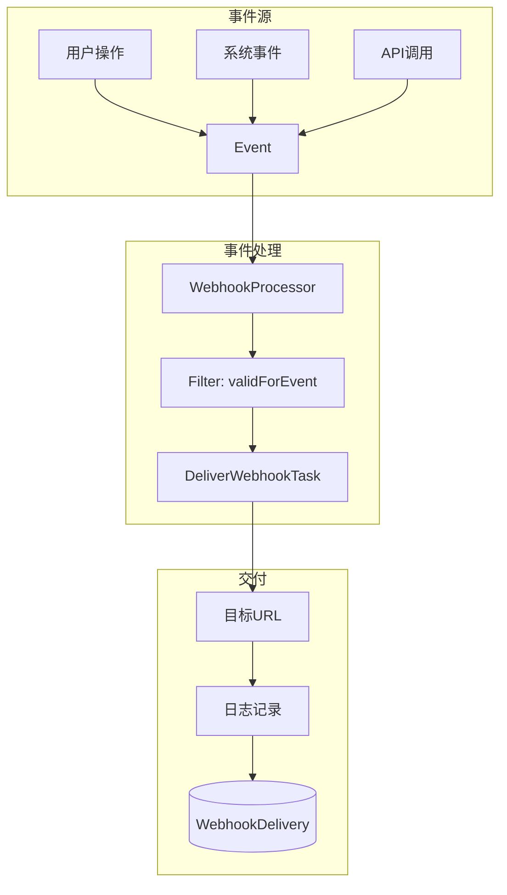
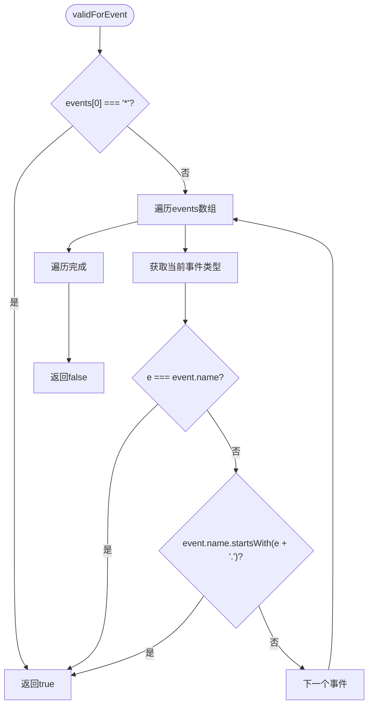

# Webhook订阅模型

<cite>
**本文档引用的文件**
- [WebhookSubscription.ts](file://app/models/WebhookSubscription.ts)
- [WebhookSubscription.ts](file://server/models/WebhookSubscription.ts)
- [WebhookDelivery.ts](file://server/models/WebhookDelivery.ts)
- [Event.ts](file://app/models/Event.ts)
- [Event.ts](file://server/models/Event.ts)
- [DeliverWebhookTask.ts](file://plugins/webhooks/server/tasks/DeliverWebhookTask.ts)
- [WebhookProcessor.ts](file://plugins/webhooks/server/processors/WebhookProcessor.ts)
- [webhookSubscriptions.ts](file://plugins/webhooks/server/api/webhookSubscriptions.ts)
- [validateWebhook.ts](file://server/middlewares/validateWebhook.ts)
</cite>

## 目录
1. [简介](#简介)
2. [数据模型](#数据模型)
3. [生命周期管理](#生命周期管理)
4. [重试策略与错误处理](#重试策略与错误处理)
5. [安全性考虑](#安全性考虑)
6. [事件系统集成](#事件系统集成)
7. [API示例](#api示例)
8. [总结](#总结)

## 简介
Webhook订阅（WebhookSubscription）模型是事件驱动架构中的核心组件，用于管理外部系统对平台事件的订阅。该模型允许管理员配置目标URL、事件类型、签名密钥和启用状态，实现近实时的事件通知。本文档详细描述了Webhook订阅的数据模型、生命周期管理、重试策略、错误处理和安全性机制，并提供与事件系统的集成方式。

## 数据模型

Webhook订阅模型定义了事件订阅的核心属性，包括名称、目标URL、事件类型、启用状态和签名密钥。



**Diagram sources**
- [WebhookSubscription.ts](file://server/models/WebhookSubscription.ts#L30-L164)
- [WebhookDelivery.ts](file://server/models/WebhookDelivery.ts#L30-L57)

**Section sources**
- [WebhookSubscription.ts](file://app/models/WebhookSubscription.ts#L4-L26)
- [WebhookSubscription.ts](file://server/models/WebhookSubscription.ts#L30-L164)

### 核心字段

| 字段 | 类型 | 描述 | 验证规则 |
|------|------|------|----------|
| **name** | string | 订阅的名称 | 必填，最大255字符 |
| **url** | string | 事件推送的目标URL | 必填，有效URL，最大255字符 |
| **events** | string[] | 订阅的事件类型列表 | 支持通配符`*`和前缀匹配 |
| **enabled** | boolean | 订阅是否启用 | 默认true |
| **secret** | string \| null | 用于payload签名的密钥 | 可选，加密存储 |

**Section sources**
- [WebhookSubscription.ts](file://server/models/WebhookSubscription.ts#L60-L88)

## 生命周期管理

Webhook订阅的生命周期包括创建、更新、禁用和删除操作，通过API端点进行管理。



**Diagram sources**
- [webhookSubscriptions.ts](file://plugins/webhooks/server/api/webhookSubscriptions.ts#L49-L68)
- [WebhookProcessor.ts](file://plugins/webhooks/server/processors/WebhookProcessor.ts#L8-L32)

**Section sources**
- [webhookSubscriptions.ts](file://plugins/webhooks/server/api/webhookSubscriptions.ts#L49-L135)

### 创建订阅
创建Webhook订阅需要管理员权限，系统会验证团队的订阅数量限制。



**Diagram sources**
- [WebhookSubscription.ts](file://server/models/WebhookSubscription.ts#L100-L115)
- [webhookSubscriptions.ts](file://plugins/webhooks/server/api/webhookSubscriptions.ts#L49-L68)

## 重试策略与错误处理

系统实现了健壮的错误处理机制，包括失败分析和自动禁用策略。



**Diagram sources**
- [DeliverWebhookTask.ts](file://plugins/webhooks/server/tasks/DeliverWebhookTask.ts#L717-L761)
- [DeliverWebhookTask.ts](file://plugins/webhooks/server/tasks/DeliverWebhookTask.ts#L763-L841)

**Section sources**
- [DeliverWebhookTask.ts](file://plugins/webhooks/server/tasks/DeliverWebhookTask.ts#L72-L101)

### 失败分析算法
当Webhook交付失败时，系统会分析最近时间窗口内的失败率，如果超过阈值则自动禁用订阅。



**Diagram sources**
- [DeliverWebhookTask.ts](file://plugins/webhooks/server/tasks/DeliverWebhookTask.ts#L763-L841)

## 安全性考虑

安全性是Webhook系统的关键方面，包括payload签名验证和密钥管理。



**Diagram sources**
- [validateWebhook.ts](file://server/middlewares/validateWebhook.ts#L1-L35)

**Section sources**
- [validateWebhook.ts](file://server/middlewares/validateWebhook.ts#L1-L35)

### 签名机制
Webhook payload使用HMAC-SHA256签名，包含时间戳以防止重放攻击。



**Diagram sources**
- [WebhookSubscription.ts](file://server/models/WebhookSubscription.ts#L143-L164)

## 事件系统集成

Webhook系统与平台的事件驱动架构深度集成，通过事件处理器和任务队列实现。



**Diagram sources**
- [WebhookProcessor.ts](file://plugins/webhooks/server/processors/WebhookProcessor.ts#L8-L32)
- [DeliverWebhookTask.ts](file://plugins/webhooks/server/tasks/DeliverWebhookTask.ts#L72-L101)

**Section sources**
- [WebhookProcessor.ts](file://plugins/webhooks/server/processors/WebhookProcessor.ts#L8-L32)
- [Event.ts](file://server/models/Event.ts#L143-L191)

### 事件过滤
`validForEvent`方法决定了特定事件是否应触发Webhook交付。



**Diagram sources**
- [WebhookSubscription.ts](file://server/models/WebhookSubscription.ts#L116-L120)

## API示例

### 创建Webhook订阅
```typescript
// 客户端代码示例
const handleSubmit = async (data: FormData) => {
  try {
    const toSend = {
      ...data,
      events: Array.isArray(data.events) ? data.events : [data.events],
    };
    
    await webhookSubscriptions.create(toSend);
    toast.success("Webhook创建成功");
    onSubmit();
  } catch (err) {
    toast.error(err.message);
  }
};
```

**Section sources**
- [WebhookSubscriptionNew.tsx](file://plugins/webhooks/client/components/WebhookSubscriptionNew.tsx#L16-L41)

### 验证Webhook端点
```typescript
// 服务器端验证中间件
export default function validateWebhook({
  secretKey,
  getSignatureFromHeader,
}: {
  secretKey: string;
  getSignatureFromHeader: (ctx: APIContext) => string | undefined;
}) {
  return async function validateWebhookMiddleware(ctx: APIContext, next: Next) {
    const signatureFromHeader = getSignatureFromHeader(ctx);
    
    if (!signatureFromHeader) {
      ctx.status = 401;
      ctx.body = "缺少签名头";
      return;
    }
    
    const computedSignature = crypto
      .createHmac("sha256", secretKey)
      .update(JSON.stringify(ctx.request.body))
      .digest("hex");
    
    if (!safeEqual(computedSignature, signatureFromHeader)) {
      ctx.status = 401;
      ctx.body = "无效签名";
      return;
    }
    
    return next();
  };
}
```

**Section sources**
- [validateWebhook.ts](file://server/middlewares/validateWebhook.ts#L1-L35)

## 总结
Webhook订阅模型提供了一个安全、可靠和可扩展的事件通知系统。通过清晰的数据模型、完整的生命周期管理、智能的错误处理和强大的安全性机制，系统能够有效支持外部集成。事件驱动的架构确保了高响应性和低耦合性，而详细的交付记录和分析功能则提供了良好的可观察性。